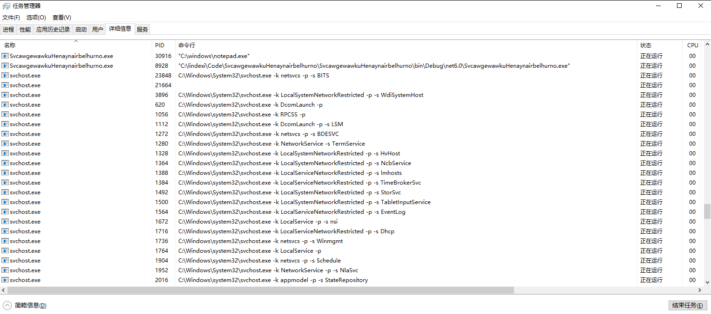

# Win32 使用 CreateProcess 方法让任务管理器里的命令行不显示应用文件路径

本文记录一个 Win32 的有趣行为，调用 CreateProcess 方法传入特别的参数，可以让任务管理器里的命令行不显示应用文件路径

<!--more-->


<!-- CreateTime:2023/2/16 16:08:08 -->

<!-- 发布 -->
<!-- 博客 -->

开始之前，先看看下面这张有趣的图片

<!--  -->


可以看到我编写的 SvcawgewawkuHenaynairbelhurno.exe 应用在任务管理器的命令行里面显示的参数居然是 `C:\Windows\notepad.exe` 而不是具体的 SvcawgewawkuHenaynairbelhurno 应用 `C:\lindexi\Code\SvcawgewawkuHenaynairbelhurno\SvcawgewawkuHenaynairbelhurno\bin\Debug\net6.0\SvcawgewawkuHenaynairbelhurno.dll` 路径

这是如何实现的呢？这是使用了 [CreateProcess](https://learn.microsoft.com/zh-cn/windows/win32/api/processthreadsapi/nf-processthreadsapi-createprocessw) 方法的一个过时用法，那就是在此方法的 `lpApplicationName` 参数里面传入将要启动的进程路径，在第二个参数 `lpCommandLine` 里面传入的是 `C:\Windows\notepad.exe` 命令行参数

以下是 [CreateProcess](https://learn.microsoft.com/zh-cn/windows/win32/api/processthreadsapi/nf-processthreadsapi-createprocessw) 方法签名

```csharp
BOOL CreateProcessW
(
  [in, optional]      LPCWSTR               lpApplicationName,
  [in, out, optional] LPWSTR                lpCommandLine,
  [in, optional]      LPSECURITY_ATTRIBUTES lpProcessAttributes,
  [in, optional]      LPSECURITY_ATTRIBUTES lpThreadAttributes,
  [in]                BOOL                  bInheritHandles,
  [in]                DWORD                 dwCreationFlags,
  [in, optional]      LPVOID                lpEnvironment,
  [in, optional]      LPCWSTR               lpCurrentDirectory,
  [in]                LPSTARTUPINFOW        lpStartupInfo,
  [out]               LPPROCESS_INFORMATION lpProcessInformation
);
```

在开始之前，需要聊聊 [CreateProcess](https://learn.microsoft.com/zh-cn/windows/win32/api/processthreadsapi/nf-processthreadsapi-createprocessw) 方法的参数。根据 Windows 核心编程 第 5 版的 4.2.1 章的内容，可以知道几乎所有的应用代码都应该传入 null 给到 `lpApplicationName` 参数。这个 `lpApplicationName` 参数是为了支持 Windows 的 POSIX 子系统。换句话说就是正常咱是不应该使用到这个参数的。以下是书中的原文：

> 之所以让我们能为 CreateProcess 添加 pszApplicationName 参数，实际是为了支持 Windows 的 POSIX 子系统

注：书中的 `pszApplicationName` 参数，就是以上代码的 `lpApplicationName` 参数，只是参数命名有所不同而已

如果咱偏偏就要用这个 `lpApplicationName` 参数呢，就可以玩出一些无文档的锅，例如让任务管理器里面的命令行行为奇怪起来

接下来咱将创建一个控制台项目来测试此行为

先新建一个 dotnet 6 控制台程序，为了方便 PInvoke 调用 Win32 的 CreateProcess 函数，根据 [dotnet 使用 CsWin32 库简化 Win32 函数调用逻辑](https://blog.lindexi.com/post/dotnet-%E4%BD%BF%E7%94%A8-CsWin32-%E5%BA%93%E7%AE%80%E5%8C%96-Win32-%E5%87%BD%E6%95%B0%E8%B0%83%E7%94%A8%E9%80%BB%E8%BE%91.html ) 博客，添加 Microsoft.Windows.CsWin32 库，编辑 csproj 项目文件，替换为如下代码

```xml
<Project Sdk="Microsoft.NET.Sdk">

  <PropertyGroup>
    <OutputType>Exe</OutputType>
    <TargetFramework>net6.0</TargetFramework>
    <ImplicitUsings>enable</ImplicitUsings>
    <Nullable>enable</Nullable>
  </PropertyGroup>
  <ItemGroup>
    <PackageReference Include="Microsoft.Windows.CsWin32" PrivateAssets="all" Version="0.2.63-beta" />
  </ItemGroup>
</Project>
```

接着再新建一个 NativeMethods.txt 文件，在此文件添加 CreateProcess 内容，用于让 CsWin32 生成调用相关的代码。但是 CsWin32 生成的代码比较难以使用，这里由自己定义了简单使用的方法

```csharp
[DllImport("kernel32.dll", CharSet = CharSet.Unicode, EntryPoint = "CreateProcessW", ExactSpelling = true, SetLastError = true)]
static extern bool CreateProcess([In] string lpApplicationName, [In] string lpCommandLine, [In] IntPtr lpProcessAttributes,
    [In] IntPtr lpThreadAttributes, [In] bool bInheritHandles, [In] uint dwCreationFlags, [In] IntPtr lpEnvironment,
    [In] IntPtr lpCurrentDirectory, [In] in STARTUPINFOW lpStartupInfo, [Out] out PROCESS_INFORMATION lpProcessInformation);
```

为了方便代码使用，这里启动的进程也是自身应用路径。先使用以下代码获取自身的应用程序路径。当然，你也可以换成其他你喜欢的应用程序路径

```csharp
var mainModuleFileName = Process.GetCurrentProcess().MainModule!.FileName!;
```

接下来创建一个有趣的命令行参数，例如就是记事本的路径

```csharp
var arguments = "\"C:\\windows\\notepad.exe\"";
```

接着调用 CreateProcess 函数，如以下代码

```csharp
var mainModuleFileName = Process.GetCurrentProcess().MainModule!.FileName!;

var startupInfo = new STARTUPINFOW();
startupInfo.cb = (uint) Marshal.SizeOf<STARTUPINFOW>();

var arguments = "\"C:\\windows\\notepad.exe\"";

CreateProcess(mainModuleFileName, arguments, IntPtr.Zero, IntPtr.Zero, false, (uint) PROCESS_CREATION_FLAGS.CREATE_NEW_CONSOLE,
    IntPtr.Zero, IntPtr.Zero, startupInfo, out var information);
```

由于是应用程序启动自身应用程序路径，还需要加上一点代码，防止不断启动

```csharp
var processList = Process.GetProcessesByName(Assembly.GetExecutingAssembly().GetName().Name);
if (processList.Length > 1)
{
    Console.WriteLine($"被启动的进程");
    Console.Read();
}
```

开始启动项目，即可看到在任务管理器里面显示的命令行奇怪起来

如果以上的 `arguments` 是一个空字符串，那任务管理器将依然显示的是应用程序的文件路径

本文的代码放在[github](https://github.com/lindexi/lindexi_gd/tree/5bdc7de90b19094ecde1fc78a404f3d753c159cf/SvcawgewawkuHenaynairbelhurno) 和 [gitee](https://gitee.com/lindexi/lindexi_gd/tree/5bdc7de90b19094ecde1fc78a404f3d753c159cf/SvcawgewawkuHenaynairbelhurno) 欢迎访问

可以通过如下方式获取本文的源代码，先创建一个空文件夹，接着使用命令行 cd 命令进入此空文件夹，在命令行里面输入以下代码，即可获取到本文的代码

```
git init
git remote add origin https://gitee.com/lindexi/lindexi_gd.git
git pull origin 5bdc7de90b19094ecde1fc78a404f3d753c159cf
```

以上使用的是 gitee 的源，如果 gitee 不能访问，请替换为 github 的源。请在命令行继续输入以下代码

```
git remote remove origin
git remote add origin https://github.com/lindexi/lindexi_gd.git
git pull origin 5bdc7de90b19094ecde1fc78a404f3d753c159cf
```

获取代码之后，进入 SvcawgewawkuHenaynairbelhurno 文件夹


<a rel="license" href="http://creativecommons.org/licenses/by-nc-sa/4.0/"></a><br />本作品采用<a rel="license" href="http://creativecommons.org/licenses/by-nc-sa/4.0/">知识共享署名-非商业性使用-相同方式共享 4.0 国际许可协议</a>进行许可。欢迎转载、使用、重新发布，但务必保留文章署名[林德熙](http://blog.csdn.net/lindexi_gd)(包含链接:http://blog.csdn.net/lindexi_gd )，不得用于商业目的，基于本文修改后的作品务必以相同的许可发布。如有任何疑问，请与我[联系](mailto:lindexi_gd@163.com)。