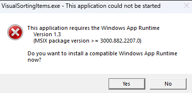

# WinUI 3 修复非打包应用运行提示缺少 Windows App Runtime 环境

本文将告诉大家如何修复 WinUI 3 非打包的应用，在分发给到客户时，在客户的机器上运行提示缺少 Windows App Runtime 环境

<!--more-->


<!-- CreateTime:2023/6/15 19:31:03 -->


<!-- 发布 -->
<!-- 博客 -->

在用户的机器上提示的 Windows App Runtime 环境缺失的提示内容大概如下

> This application requires the Windows App Runtime
>
> Version 1.3
>
> (MSIX package version >= 3000.882.2207.0)
>
> Do you want to install a compatible Windows App Runtime now?

<!--  -->


点击确定时，默认跳转到 [https://learn.microsoft.com/en-us/windows/apps/windows-app-sdk/downloads](https://learn.microsoft.com/en-us/windows/apps/windows-app-sdk/downloads) 下载页

这时可选下载安装 Windows App Runtime 安装包 WindowsAppRuntimeInstall.exe 文件修复此问题

当然了，这样的应用要是真就需要用户去额外安装 WindowsAppRuntimeInstall.exe 文件，肯定是不成的。本文告诉大家如何做到让 WinUI 3 应用和传统的 Win32 应用一样，拷贝过去到用户的机器上就能运行

第一步，保持让 Microsoft.WindowsAppSDK 这个 NuGet 包在 1.2 以上的版本。当前是 2023.6.15 最新版本是 1.3.230602002 版本。因为根据 [官方文档](https://learn.microsoft.com/en-us/windows/apps/package-and-deploy/self-contained-deploy/deploy-self-contained-apps) 可以了解到，在 1.2 版本才加上了 `WindowsAppSdkUndockedRegFreeWinRTInitialize` 功能。想要不弹出以上的提示框，最好是需要有 `WindowsAppSdkUndockedRegFreeWinRTInitialize` 功能

第二步，配置 csproj 项目文件，设置 WindowsAppSDKSelfContained 为 true 和设置 WindowsPackageType 为 None 值。默认情况下，将会在 WindowsAppSDKSelfContained 为 true 和 WindowsPackageType 属性为 None 值时，自动在 SDK 里面配置 WindowsAppSdkUndockedRegFreeWinRTInitialize 为 true 值

修改之后的 csproj 项目文件大概如下

```xml
<Project Sdk="Microsoft.NET.Sdk">

  <PropertyGroup>
    <OutputType>WinExe</OutputType>
    <TargetFramework>net6.0-windows10.0.19041</TargetFramework>
    <Nullable>enable</Nullable>
    <UseWinUI>true</UseWinUI>
    <Platforms>x86;x64;x86</Platforms>
    <RuntimeIdentifiers>win10-x86;win10-x64</RuntimeIdentifiers>

    <!-- 下面两句代码是核心 -->
    <WindowsAppSDKSelfContained>true</WindowsAppSDKSelfContained>
    <WindowsPackageType>None</WindowsPackageType>
  </PropertyGroup>
  <ItemGroup>
    <PackageReference Include="Microsoft.WindowsAppSDK" Version="1.3.230602002" />
    <PackageReference Include="Microsoft.Windows.SDK.BuildTools" Version="10.0.22621.756" />
  </ItemGroup>
</Project>
```

通过以上方式修改之后，即可进行独立发布后，应用无需安装 Windows App Runtime 环境，双击即可运行

由于目前关于 WindowsAppSdkUndockedRegFreeWinRTInitialize 和 UndockedRegFreeWinRT 的官方文档较为缺乏，我对这部分知识的细节并不了解，如果您对此感兴趣，请自行了解


<a rel="license" href="http://creativecommons.org/licenses/by-nc-sa/4.0/"></a><br />本作品采用<a rel="license" href="http://creativecommons.org/licenses/by-nc-sa/4.0/">知识共享署名-非商业性使用-相同方式共享 4.0 国际许可协议</a>进行许可。欢迎转载、使用、重新发布，但务必保留文章署名[林德熙](http://blog.csdn.net/lindexi_gd)(包含链接:http://blog.csdn.net/lindexi_gd )，不得用于商业目的，基于本文修改后的作品务必以相同的许可发布。如有任何疑问，请与我[联系](mailto:lindexi_gd@163.com)。