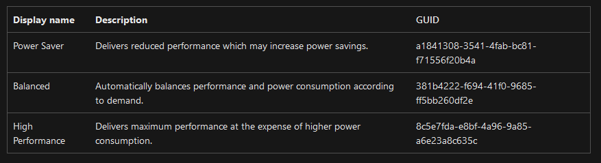

# Window 计划任务设置夜间低性能节能模式


<!-- 不发布 -->
节能模式 powercfg -setactive a1841308-3541-4fab-bc81-f71556f20b4a
高性能模式 powercfg -setactive 8c5e7fda-e8bf-4a96-9a85-a6e23a8c635c
powercfg -query
```
电源方案 GUID: 8c5e7fda-e8bf-4a96-9a85-a6e23a8c635c  (高性能)
  GUID 别名: SCHEME_MIN
  子组 GUID: 0012ee47-9041-4b5d-9b77-535fba8b1442  (硬盘)
    GUID 别名: SUB_DISK
    电源设置 GUID: 6738e2c4-e8a5-4a42-b16a-e040e769756e  (在此时间后关闭硬盘)
      GUID 别名: DISKIDLE
      最小可能的设置: 0x00000000
      最大可能的设置: 0xffffffff
      可能的设置增量: 0x00000001
      可能的设置单位: 秒
    当前交流电源设置索引: 0x000004b0
    当前直流电源设置索引: 0x000004b0
  子组 GUID: 02f815b5-a5cf-4c84-bf20-649d1f75d3d8  (Internet Explorer)
    电源设置 GUID: 4c793e7d-a264-42e1-87d3-7a0d2f523ccd  (JavaScript 计时器频率)
      可能的设置索引: 000
      可能的设置友好名称: 最大电源节省量
      可能的设置索引: 001
      可能的设置友好名称: 最高性能
    当前交流电源设置索引: 0x00000001
    当前直流电源设置索引: 0x00000001
  子组 GUID: 0d7dbae2-4294-402a-ba8e-26777e8488cd  (桌面背景设置)
    电源设置 GUID: 309dce9b-bef4-4119-9921-a851fb12f0f4  (幻灯片放映)
      可能的设置索引: 000
      可能的设置友好名称: 可用
      可能的设置索引: 001
      可能的设置友好名称: 已暂停
    当前交流电源设置索引: 0x00000000
    当前直流电源设置索引: 0x00000000
  子组 GUID: 19cbb8fa-5279-450e-9fac-8a3d5fedd0c1  (无线适配器设置)
    电源设置 GUID: 12bbebe6-58d6-4636-95bb-3217ef867c1a  (节能模式)
      可能的设置索引: 000
      可能的设置友好名称: 最高性能
      可能的设置索引: 001
      可能的设置友好名称: 低节能
      可能的设置索引: 002
      可能的设置友好名称: 中等节能
      可能的设置索引: 003
      可能的设置友好名称: 最高节能
    当前交流电源设置索引: 0x00000000
    当前直流电源设置索引: 0x00000000
  子组 GUID: 238c9fa8-0aad-41ed-83f4-97be242c8f20  (睡眠)
    GUID 别名: SUB_SLEEP
    电源设置 GUID: 29f6c1db-86da-48c5-9fdb-f2b67b1f44da  (在此时间后睡眠)
      GUID 别名: STANDBYIDLE
      最小可能的设置: 0x00000000
      最大可能的设置: 0xffffffff
      可能的设置增量: 0x00000001
      可能的设置单位: 秒
    当前交流电源设置索引: 0x00000000
    当前直流电源设置索引: 0x00000000
    电源设置 GUID: 94ac6d29-73ce-41a6-809f-6363ba21b47e  (允许混合睡眠)
      GUID 别名: HYBRIDSLEEP
      可能的设置索引: 000
      可能的设置友好名称: 关闭
      可能的设置索引: 001
      可能的设置友好名称: 启用
    当前交流电源设置索引: 0x00000001
    当前直流电源设置索引: 0x00000001
    电源设置 GUID: 9d7815a6-7ee4-497e-8888-515a05f02364  (在此时间后休眠)
      GUID 别名: HIBERNATEIDLE
      最小可能的设置: 0x00000000
      最大可能的设置: 0xffffffff
      可能的设置增量: 0x00000001
      可能的设置单位: 秒
    当前交流电源设置索引: 0x00000000
    当前直流电源设置索引: 0x00000000
    电源设置 GUID: bd3b718a-0680-4d9d-8ab2-e1d2b4ac806d  (允许使用唤醒定时器)
      GUID 别名: RTCWAKE
      可能的设置索引: 000
      可能的设置友好名称: 禁用
      可能的设置索引: 001
      可能的设置友好名称: 启用
      可能的设置索引: 002
      可能的设置友好名称: 仅限重要的唤醒计算器
    当前交流电源设置索引: 0x00000001
    当前直流电源设置索引: 0x00000000
  子组 GUID: 2a737441-1930-4402-8d77-b2bebba308a3  (USB 设置)
    电源设置 GUID: 48e6b7a6-50f5-4782-a5d4-53bb8f07e226  (USB 选择性暂停设置)
      可能的设置索引: 000
      可能的设置友好名称: 已禁用
      可能的设置索引: 001
      可能的设置友好名称: 已启用
    当前交流电源设置索引: 0x00000001
    当前直流电源设置索引: 0x00000001
  子组 GUID: 44f3beca-a7c0-460e-9df2-bb8b99e0cba6  (Intel(R) Graphics Settings)
    电源设置 GUID: 3619c3f2-afb2-4afc-b0e9-e7fef372de36  (Intel(R) Graphics Power Plan)
      可能的设置索引: 000
      可能的设置友好名称: Maximum Battery Life
      可能的设置索引: 001
      可能的设置友好名称: Balanced
      可能的设置索引: 002
      可能的设置友好名称: Maximum Performance
    当前交流电源设置索引: 0x00000002
    当前直流电源设置索引: 0x00000002
  子组 GUID: 4f971e89-eebd-4455-a8de-9e59040e7347  (电源按钮和盖子)
    GUID 别名: SUB_BUTTONS
    电源设置 GUID: a7066653-8d6c-40a8-910e-a1f54b84c7e5  (「开始」菜单电源按钮)
      GUID 别名: UIBUTTON_ACTION
      可能的设置索引: 000
      可能的设置友好名称: 睡眠
      可能的设置索引: 001
      可能的设置友好名称: 休眠
      可能的设置索引: 002
      可能的设置友好名称: 关机
    当前交流电源设置索引: 0x00000000
    当前直流电源设置索引: 0x00000000
  子组 GUID: 501a4d13-42af-4429-9fd1-a8218c268e20  (PCI Express)
    GUID 别名: SUB_PCIEXPRESS
    电源设置 GUID: ee12f906-d277-404b-b6da-e5fa1a576df5  (链接状态电源管理)
      GUID 别名: ASPM
      可能的设置索引: 000
      可能的设置友好名称: 关闭
      可能的设置索引: 001
      可能的设置友好名称: 中等电源节省量
      可能的设置索引: 002
      可能的设置友好名称: 最大电源节省量
    当前交流电源设置索引: 0x00000000
    当前直流电源设置索引: 0x00000000
  子组 GUID: 54533251-82be-4824-96c1-47b60b740d00  (处理器电源管理)
    GUID 别名: SUB_PROCESSOR
    电源设置 GUID: 893dee8e-2bef-41e0-89c6-b55d0929964c  (最小处理器状态)
      GUID 别名: PROCTHROTTLEMIN
      最小可能的设置: 0x00000000
      最大可能的设置: 0x00000064
      可能的设置增量: 0x00000001
      可能的设置单位: %
    当前交流电源设置索引: 0x00000064
    当前直流电源设置索引: 0x00000005
    电源设置 GUID: bc5038f7-23e0-4960-96da-33abaf5935ec  (最大处理器状态)
      GUID 别名: PROCTHROTTLEMAX
      最小可能的设置: 0x00000000
      最大可能的设置: 0x00000064
      可能的设置增量: 0x00000001
      可能的设置单位: %
    当前交流电源设置索引: 0x00000064
    当前直流电源设置索引: 0x00000064
  子组 GUID: 7516b95f-f776-4464-8c53-06167f40cc99  (显示)
    GUID 别名: SUB_VIDEO
    电源设置 GUID: 3c0bc021-c8a8-4e07-a973-6b14cbcb2b7e  (在此时间后关闭显示)
      GUID 别名: VIDEOIDLE
      最小可能的设置: 0x00000000
      最大可能的设置: 0xffffffff
      可能的设置增量: 0x00000001
      可能的设置单位: 秒
    当前交流电源设置索引: 0x00000384
    当前直流电源设置索引: 0x00000258
    电源设置 GUID: aded5e82-b909-4619-9949-f5d71dac0bcb  (显示器亮度)
      GUID 别名: VIDEONORMALLEVEL
      最小可能的设置: 0x00000000
      最大可能的设置: 0x00000064
      可能的设置增量: 0x00000001
      可能的设置单位: %
    当前交流电源设置索引: 0x00000064
    当前直流电源设置索引: 0x00000064
    电源设置 GUID: f1fbfde2-a960-4165-9f88-50667911ce96  (显示器亮度变暗)
      最小可能的设置: 0x00000000
      最大可能的设置: 0x00000064
      可能的设置增量: 0x00000001
      可能的设置单位: %
    当前交流电源设置索引: 0x00000032
    当前直流电源设置索引: 0x00000032
    电源设置 GUID: fbd9aa66-9553-4097-ba44-ed6e9d65eab8  (启用自适应亮度)
      GUID 别名: ADAPTBRIGHT
      可能的设置索引: 000
      可能的设置友好名称: 关闭
      可能的设置索引: 001
      可能的设置友好名称: 启用
    当前交流电源设置索引: 0x00000000
    当前直流电源设置索引: 0x00000000
  子组 GUID: 9596fb26-9850-41fd-ac3e-f7c3c00afd4b  (“多媒体”设置)
    电源设置 GUID: 03680956-93bc-4294-bba6-4e0f09bb717f  (共享媒体时)
      可能的设置索引: 000
      可能的设置友好名称: 允许计算机睡眠
      可能的设置索引: 001
      可能的设置友好名称: 阻止计算机在一段时间不活动后进入睡眠状态
      可能的设置索引: 002
      可能的设置友好名称: 允许计算机进入离开模式
    当前交流电源设置索引: 0x00000001
    当前直流电源设置索引: 0x00000001
    电源设置 GUID: 10778347-1370-4ee0-8bbd-33bdacaade49  (视频播放质量补偿)
      可能的设置索引: 000
      可能的设置友好名称: 视频播放节能偏向
      可能的设置索引: 001
      可能的设置友好名称: 视频播放性能补偿
    当前交流电源设置索引: 0x00000001
    当前直流电源设置索引: 0x00000000
    电源设置 GUID: 34c7b99f-9a6d-4b3c-8dc7-b6693b78cef4  (播放视频时)
      可能的设置索引: 000
      可能的设置友好名称: 优化视频质量
      可能的设置索引: 001
      可能的设置友好名称: 平衡
      可能的设置索引: 002
      可能的设置友好名称: 优化节能
    当前交流电源设置索引: 0x00000000
    当前直流电源设置索引: 0x00000000
  子组 GUID: e73a048d-bf27-4f12-9731-8b2076e8891f  (电池)
    GUID 别名: SUB_BATTERY
    电源设置 GUID: 5dbb7c9f-38e9-40d2-9749-4f8a0e9f640f  (低电池电量通知)
      GUID 别名: BATFLAGSCRIT
      可能的设置索引: 000
      可能的设置友好名称: 关闭
      可能的设置索引: 001
      可能的设置友好名称: 启用
    当前交流电源设置索引: 0x00000001
    当前直流电源设置索引: 0x00000001
    电源设置 GUID: 637ea02f-bbcb-4015-8e2c-a1c7b9c0b546  (关键级别电池操作)
      GUID 别名: BATACTIONCRIT
      可能的设置索引: 000
      可能的设置友好名称: 不采取任何操作
      可能的设置索引: 001
      可能的设置友好名称: 睡眠
      可能的设置索引: 002
      可能的设置友好名称: 休眠
      可能的设置索引: 003
      可能的设置友好名称: 关机
    当前交流电源设置索引: 0x00000002
    当前直流电源设置索引: 0x00000002
    电源设置 GUID: 8183ba9a-e910-48da-8769-14ae6dc1170a  (电池电量水平低)
      GUID 别名: BATLEVELLOW
      最小可能的设置: 0x00000000
      最大可能的设置: 0x00000064
      可能的设置增量: 0x00000001
      可能的设置单位: %
    当前交流电源设置索引: 0x0000000a
    当前直流电源设置索引: 0x0000000a
    电源设置 GUID: 9a66d8d7-4ff7-4ef9-b5a2-5a326ca2a469  (关键电池电量水平)
      GUID 别名: BATLEVELCRIT
      最小可能的设置: 0x00000000
      最大可能的设置: 0x00000064
      可能的设置增量: 0x00000001
      可能的设置单位: %
    当前交流电源设置索引: 0x00000005
    当前直流电源设置索引: 0x00000005
    电源设置 GUID: bcded951-187b-4d05-bccc-f7e51960c258  (低电量通知)
      GUID 别名: BATFLAGSLOW
      可能的设置索引: 000
      可能的设置友好名称: 关闭
      可能的设置索引: 001
      可能的设置友好名称: 启用
    当前交流电源设置索引: 0x00000001
    当前直流电源设置索引: 0x00000001
    电源设置 GUID: d8742dcb-3e6a-4b3c-b3fe-374623cdcf06  (低电量操作)
      GUID 别名: BATACTIONLOW
      可能的设置索引: 000
      可能的设置友好名称: 不采取任何操作
      可能的设置索引: 001
      可能的设置友好名称: 睡眠
      可能的设置索引: 002
      可能的设置友好名称: 休眠
      可能的设置索引: 003
      可能的设置友好名称: 关机
    当前交流电源设置索引: 0x00000000
    当前直流电源设置索引: 0x00000000
    电源设置 GUID: f3c5027d-cd16-4930-aa6b-90db844a8f00  (保留电池电量)
      最小可能的设置: 0x00000000
      最大可能的设置: 0x00000064
      可能的设置增量: 0x00000001
      可能的设置单位: %
    当前交流电源设置索引: 0x00000007
    当前直流电源设置索引: 0x00000007
```
[Power Policy Settings - Win32 apps - Microsoft Learn](https://learn.microsoft.com/en-us/windows/win32/power/power-policy-settings )
<!--  -->

- Power Saver : a1841308-3541-4fab-bc81-f71556f20b4a
- Balanced : 381b4222-f694-41f0-9685-ff5bb260df2e
- High Performance : 8c5e7fda-e8bf-4a96-9a85-a6e23a8c635c
高性能.xml 拷贝可导入
```xml
<?xml version="1.0" encoding="UTF-16"?>
<Task version="1.2" xmlns="http://schemas.microsoft.com/windows/2004/02/mit/task">
  <RegistrationInfo>
    <Date>2024-03-29T09:10:47.368376</Date>
    <Author>DESKTOP-3993246\lindexi</Author>
    <URI>\高性能模式</URI>
  </RegistrationInfo>
  <Triggers>
    <CalendarTrigger>
      <StartBoundary>2024-03-29T07:00:29</StartBoundary>
      <Enabled>true</Enabled>
      <ScheduleByDay>
        <DaysInterval>1</DaysInterval>
      </ScheduleByDay>
    </CalendarTrigger>
  </Triggers>
  <Principals>
    <Principal id="Author">
      <UserId>S-1-5-21-3499295459-3993246702-3155042027-1001</UserId>
      <LogonType>InteractiveToken</LogonType>
      <RunLevel>LeastPrivilege</RunLevel>
    </Principal>
  </Principals>
  <Settings>
    <MultipleInstancesPolicy>IgnoreNew</MultipleInstancesPolicy>
    <DisallowStartIfOnBatteries>true</DisallowStartIfOnBatteries>
    <StopIfGoingOnBatteries>true</StopIfGoingOnBatteries>
    <AllowHardTerminate>true</AllowHardTerminate>
    <StartWhenAvailable>false</StartWhenAvailable>
    <RunOnlyIfNetworkAvailable>false</RunOnlyIfNetworkAvailable>
    <IdleSettings>
      <Duration>PT10M</Duration>
      <WaitTimeout>PT1H</WaitTimeout>
      <StopOnIdleEnd>true</StopOnIdleEnd>
      <RestartOnIdle>false</RestartOnIdle>
    </IdleSettings>
    <AllowStartOnDemand>true</AllowStartOnDemand>
    <Enabled>true</Enabled>
    <Hidden>false</Hidden>
    <RunOnlyIfIdle>false</RunOnlyIfIdle>
    <WakeToRun>false</WakeToRun>
    <ExecutionTimeLimit>PT72H</ExecutionTimeLimit>
    <Priority>7</Priority>
  </Settings>
  <Actions Context="Author">
    <Exec>
      <Command>powercfg</Command>
      <Arguments>-setactive 8c5e7fda-e8bf-4a96-9a85-a6e23a8c635c</Arguments>
    </Exec>
  </Actions>
</Task>
```
节能模式.xml
```xml
<?xml version="1.0" encoding="UTF-16"?>
<Task version="1.2" xmlns="http://schemas.microsoft.com/windows/2004/02/mit/task">
  <RegistrationInfo>
    <Date>2024-03-29T09:19:15.7731160</Date>
    <Author>DESKTOP-3993246\lindexi</Author>
    <URI>\节能模式</URI>
  </RegistrationInfo>
  <Triggers>
    <CalendarTrigger>
      <StartBoundary>2024-03-29T00:00:00</StartBoundary>
      <Enabled>true</Enabled>
      <ScheduleByDay>
        <DaysInterval>1</DaysInterval>
      </ScheduleByDay>
    </CalendarTrigger>
  </Triggers>
  <Principals>
    <Principal id="Author">
      <UserId>S-1-5-21-3499295459-3993246702-3155042027-1001</UserId>
      <LogonType>InteractiveToken</LogonType>
      <RunLevel>LeastPrivilege</RunLevel>
    </Principal>
  </Principals>
  <Settings>
    <MultipleInstancesPolicy>IgnoreNew</MultipleInstancesPolicy>
    <DisallowStartIfOnBatteries>true</DisallowStartIfOnBatteries>
    <StopIfGoingOnBatteries>true</StopIfGoingOnBatteries>
    <AllowHardTerminate>true</AllowHardTerminate>
    <StartWhenAvailable>false</StartWhenAvailable>
    <RunOnlyIfNetworkAvailable>false</RunOnlyIfNetworkAvailable>
    <IdleSettings>
      <Duration>PT10M</Duration>
      <WaitTimeout>PT1H</WaitTimeout>
      <StopOnIdleEnd>true</StopOnIdleEnd>
      <RestartOnIdle>false</RestartOnIdle>
    </IdleSettings>
    <AllowStartOnDemand>true</AllowStartOnDemand>
    <Enabled>true</Enabled>
    <Hidden>false</Hidden>
    <RunOnlyIfIdle>false</RunOnlyIfIdle>
    <WakeToRun>false</WakeToRun>
    <ExecutionTimeLimit>PT72H</ExecutionTimeLimit>
    <Priority>7</Priority>
  </Settings>
  <Actions Context="Author">
    <Exec>
      <Command>powercfg</Command>
      <Arguments>-setactive a1841308-3541-4fab-bc81-f71556f20b4a</Arguments>
    </Exec>
  </Actions>
</Task>
```
导入方法就是打开任务计划程序，点击右侧的导入任务即可


<a rel="license" href="http://creativecommons.org/licenses/by-nc-sa/4.0/"></a><br />本作品采用<a rel="license" href="http://creativecommons.org/licenses/by-nc-sa/4.0/">知识共享署名-非商业性使用-相同方式共享 4.0 国际许可协议</a>进行许可。欢迎转载、使用、重新发布，但务必保留文章署名[林德熙](http://blog.csdn.net/lindexi_gd)(包含链接:http://blog.csdn.net/lindexi_gd )，不得用于商业目的，基于本文修改后的作品务必以相同的许可发布。如有任何疑问，请与我[联系](mailto:lindexi_gd@163.com)。