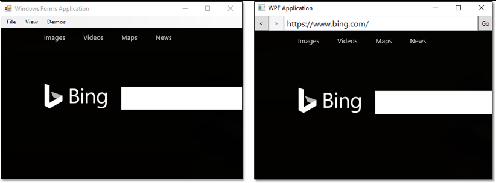
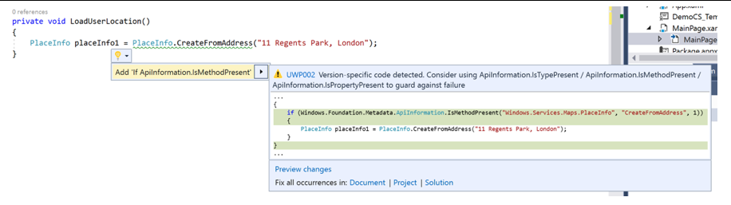
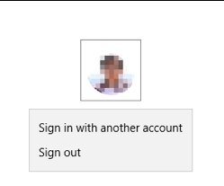
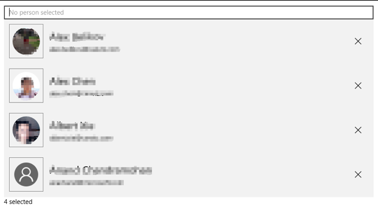
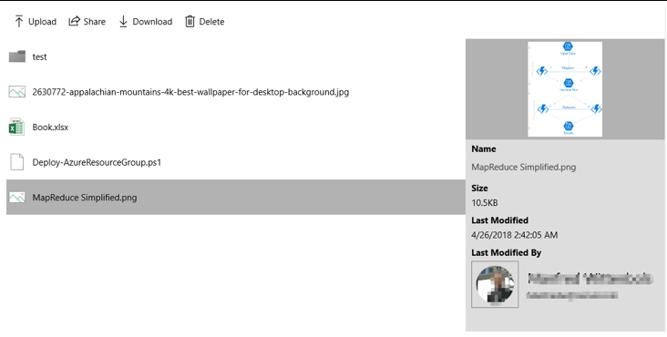
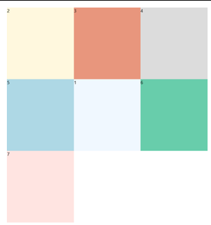
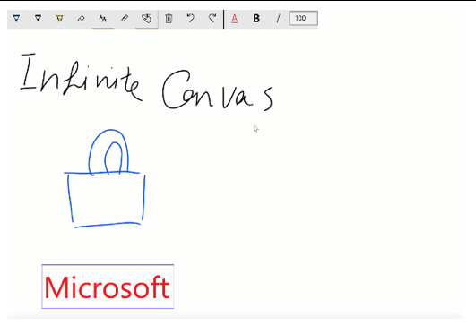

# Windows Community Toolkit 3.0 新功能

本文告诉大家一个令人震惊的消息，Windows Community Toolkit 有一个大更新，现在的版本是 3.0 。最大的提升就是 WinForm 和 WPF 程序可以使用部分 UWP 控件。

而且可以在 WPF 和 WinForms 使用微软最新 Edge 浏览器

<!--more-->
<!-- CreateTime:2018/11/1 9:02:55 -->

<!-- 标签：WPF，UWP，dotnet -->

本文翻译[Announcing Windows Community Toolkit v3.0](https://blogs.windows.com/buildingapps/2018/05/30/announcing-windows-community-toolkit-v3-0/#kkTu1mUiPIFADOzj.97 )，因为水平比较渣，请大家不要喷太多。

在几周前，微软改名部拿到很多经费，成功把 UWP Community Toolkit 改名 为 Windows Community Toolkit ，因为微软觉得这个名字能更好表示微软和很多开发者一起开发。修改命名就是最大的更新，本文完（不要打我）

新的版本的不重要的更新是

 - 支持在 WPF 和 WinForms 使用新的控件，包括 Edge 浏览器

 - 所有的 UWP 可以在 Xaml 开启 eye gaze Api

 - 提供新的包用来写 runtime API 的检查

 - 提供 Microsoft Graph 控件

 - 现有的大量控件

 - 对所有控件支持亮主题和暗主题

 - 性能提升和修改bug

## 新的支持 WPF 的 WebView

微软开发了新的 Microsoft Edge 渲染引擎，可以在 WinForms 和 WPF 使用。如果使用一个全新的控件，大量的现有的程序员会感到陌生，所以微软封装了控件，尽可能让开发者感觉到熟悉。这个控件就是[WebViewControl](https://docs.microsoft.com/en-us/uwp/api/windows.web.ui.interop.webviewcontrol )，这个控件有大量的 API 和原有的 WinForms 和 WPF 的web控件相同。

下面就是分别运行在 WinForms 和 WPF 的 WebViewControl 。使用新的 WebViewControl 可以支持 EdgeHTML 和流畅触摸，而且去掉很多 Internet Explorer 存在的坑。

<!--  -->


现在通过 Nuget 安装 [Microsoft.Toolkit.Win32.UI.Controls](https://www.nuget.org/packages/Microsoft.Toolkit.Win32.UI.Controls/ ) 就可以在 WinForms 和 WPF 使用 Edge 浏览器。

如果需要看详细的文档，请点这个[链接](https://docs.microsoft.com/windows/uwpcommunitytoolkit/controls/webview )

## 所有的Xaml控件支持视线输入

可以想一下，如果我不需要用手，就用眼神就可以控制程序。不要以为这个科技很远，微软提供了对所有 Xaml 控件添加 eye gaze API 支持。

只需要安装[Microsoft.Toolkit.Uwp.Input.GazeInteraction](https://www.nuget.org/packages/Microsoft.Toolkit.Uwp.Input.GazeInteraction/) 就可以在 Xaml 使用下面代码，让控件支持视线输入。

```csharp
xmlns:gaze="using:Microsoft.Toolkit.Uwp.Input.GazeInteraction"
        gaze:GazeInput.Interaction="Enabled"
```

这个API支持让你控制视线输入在界面如何处理，如果对这个有兴趣，请点击[链接](https://aka.ms/eyetrackingforwindows )来学习更多内容。官方的文档请点击[链接](https://docs.microsoft.com/en-us/windows/uwpcommunitytoolkit/gaze/gazeinteractionlibrary )

更多视线输入请看[Gaze Your Way Through Eye Tracking Technology](https://www.iqsdirectory.com/resources/gaze-your-way-through-eye-tracking-technology/ )

## 平台检查

因为现在有支持[多平台](https://walterlv.github.io/post/configure-projects-to-target-multiple-platforms.html )的 csproj ，所以在写代码时经常需要判断当前是在哪个平台。

因为 UWP 开发需要指定最低平台，而且对不同的平台可以不同的 API ，以前只能通过看文档才知道现在有哪些API是可以使用的，现在可以安装[Microsoft.Toolkit.Uwp.PlatformSpecificAnalyzer ](https://www.nuget.org/packages/Microsoft.Toolkit.Uwp.PlatformSpecificAnalyzer )来检查。这个库是一个 Roslyn 分析库，在编译时可以帮助检查是否使用了一些特殊平台才可以使用的接口。可以自动提示这个接口的平台，自动生成代码。

<!--  -->


## Microsoft Graph 控件

支持 Microsoft Graph 控件，可以快速在 Xaml 使用 Microsoft Graph 控件。下面就是提供的一些控件

### ProfileCard 和 AadLogin

在 ProfileCard 可以简单显示一个用户的多个不同格式信息，包括用户的名字、头像和邮件。同时 AadLogin 支持通过 Microsoft Graph 服务器使用Azure Active Directory (AAD) 登陆。

<!--  -->


### PeoplePicker

从 一个组织的 AD 里面选择一个或多个用户的控件

<!--  -->


### SharePointFileList

让用户可以在点击文件夹或文件时快速预览 SharePoint 文件

<!--  -->


## 新控件和辅助方法

下面是一些值得一提的控件和辅助方法

### CameraHelper 和 CameraPreview

通过 CameraHelper 可以简单拿到相机的一帧保存到 preview video 、capture video frames 或  software bitmaps。通过一行代码，开发者就可以获得实时相机拍到的图片。

如果需要预览相机，只需要在 xaml 添加下面代码

```csharp
<controls:CameraPreview x:Name="CameraPreviewControl">  
</controls:CameraPreview>   

```

在后台代码相机刷新更改界面

```csharp
await CameraPreviewControl.StartAsync();
CameraPreviewControl.CameraHelper.FrameArrived += CameraPreviewControl_FrameArrived;
```

如果感兴趣，请点击[链接](https://docs.microsoft.com/en-us/windows/uwpcommunitytoolkit/controls/camerapreview )看更多文档

### UniformGrid

这是一个在 WPF 很常用，很好用的控件。如果是从 WPF 迁移代码，只需要修改代码的空间就可以，其他都不需要修改。如果是 WPF 开发者，那么相信很熟悉 UniformGrid ，但是我还是需要做很小的描述，这个控件不需要定义行列，有很多个单元格，每个单元格的大小相同，而且一个单元格只能放一个控件。和 WPF 不同的是，新的 UniformGrid 支持设置某个元素所在的行列，详细的文档请看本章后面的参见。

如下面的代码

```csharp
<controls:UniformGrid>
      <Border Background="AliceBlue" Grid.Row="1" Grid.Column="1"><TextBlock Text="1"/></Border>
      <Border Background="Cornsilk"><TextBlock Text="2"/></Border>
      <Border Background="DarkSalmon"><TextBlock Text="3"/></Border>
      <Border Background="Gainsboro"><TextBlock Text="4"/></Border>
      <Border Background="LightBlue"><TextBlock Text="5"/></Border>
      <Border Background="MediumAquamarine"><TextBlock Text="6"/></Border>
      <Border Background="MistyRose"><TextBlock Text="7"/></Border>
    </controls:UniformGrid>
```

运行界面

<!--  -->


详细的文档：[UniformGrid XAML Control](https://docs.microsoft.com/en-us/windows/uwpcommunitytoolkit/controls/uniformgrid )

## InfiniteCanvas

这个控件提供无限长度的滚动，支持在里面放笔迹、文本，支持缩放和撤销重做。可以简单把数据导出或加载。

<!--  -->


如果想做一个简单的 ppt 软件，直接使用这个控件就可以做到。

详细文档：[InfiniteCanvas XAML Control](https://docs.microsoft.com/en-us/windows/uwpcommunitytoolkit/controls/infinitecanvas )

## 文章最后

还有很多控件没有在本文写出来，如果想知道这个更新的修改，请看[release notes](https://github.com/Microsoft/WindowsCommunityToolkit/releases )。这个项目会是微软和所有开发者一起开发，如果没有这么多的开发者无私贡献，那么也不会写出如此好用的库。

如果想入门学一下如何使用这个库，欢迎在应用商店下载[演示软件](https://www.microsoft.com/store/apps/9NBLGGH4TLCQ?cid=blogpost) 来使用。如果觉得希望添加代码，请进入[github](https://github.com/Microsoft/WindowsCommunityToolkit )提交贡献

因为我的英文有限，可能翻译不出原文表达的意思，欢迎大家进入下面的原文。


参见：[Announcing Windows Community Toolkit v3.0 - Windows Developer BlogWindows Developer Blog](https://blogs.windows.com/buildingapps/2018/05/30/announcing-windows-community-toolkit-v3-0/#kkTu1mUiPIFADOzj.97 )

[Gaze interactions - UWP app developer](https://docs.microsoft.com/en-us/windows/uwp/design/input/gaze-interactions )

[How to create accessible apps and immersive game experiences with new eye tracking APIs - Windows Developer BlogWindows Developer Blog](https://blogs.windows.com/buildingapps/2018/05/08/how-to-create-accessible-apps-and-immersive-game-experiences-with-new-eye-tracking-apis/ )

[Gaze Interaction Library ](https://docs.microsoft.com/en-us/windows/uwpcommunitytoolkit/gaze/gazeinteractionlibrary )

[CameraPreview ](https://docs.microsoft.com/en-us/windows/uwpcommunitytoolkit/controls/camerapreview )

[让一个 csproj 项目指定多个开发框架 - walterlv](https://walterlv.github.io/post/configure-projects-to-target-multiple-platforms.html )

<a rel="license" href="http://creativecommons.org/licenses/by-nc-sa/4.0/"></a><br />本作品采用<a rel="license" href="http://creativecommons.org/licenses/by-nc-sa/4.0/">知识共享署名-非商业性使用-相同方式共享 4.0 国际许可协议</a>进行许可。欢迎转载、使用、重新发布，但务必保留文章署名[林德熙](http://blog.csdn.net/lindexi_gd)(包含链接:http://blog.csdn.net/lindexi_gd )，不得用于商业目的，基于本文修改后的作品务必以相同的许可发布。如有任何疑问，请与我[联系](mailto:lindexi_gd@163.com)。
