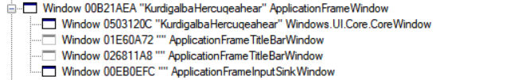
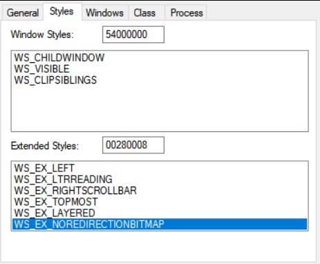

# Windows 窗口样式 什么是 WS_EX_NOREDIRECTIONBITMAP 样式

我觉得我可以加入历史博物馆了，加入微软历史博物馆，本文也是和大家吹历史的博客

<!--more-->
<!-- CreateTime:5/1/2020 11:30:00 AM -->

简单说这个 WS_EX_NOREDIRECTIONBITMAP 样式是 Win8 提供的，用来做画面图层混合的功能。什么是画面图层混合功能？详细请看[为何使用 DirectComposition](https://blog.lindexi.com/post/%E4%B8%BA%E4%BD%95%E4%BD%BF%E7%94%A8-DirectComposition.html)

玩法就是系统给你一个绘制表面，你在这个绘制表面上进行绘制，然后 DWM （桌面管理器 DWM Desktop Window Manager） 会拿出你绘制的表面来和其他的应用进行混合

用这个方法和传统的区别是啥？普通的应用是给每个窗口的客户区创建一个重定向表面，这个应用的窗口的所有绘制内容都绘制到这个表面。而通过 DirectComposition 可以让应用自己管理和创建这个重定向表面，而让桌面管理器从应用自己创建的表面进行获取 Bitmap 和其他表面进行混合

这个方式有什么作用？主要作用就是提升性能，将 DX 配合上 DirectComposition 是最无敌的性能

那么什么的软件会用到这个功能？用到这个功能最多的是 UWP 应用，但是经过考古在 Win8 的全屏应用也用到这个技术，在 win32 函数里面的 CreateWindowEx 方法创建窗口的时候，可以通过传入 WS_EX_NOREDIRECTIONBITMAP 参数，这个参数需要传入到扩展样式里面，根据文档说的，添加这个样式之后的应用窗口不呈现到重定向表面。这适用于没有可见内容的窗口，或者使用表面以外的机制来提供其视觉效果的窗口。详细文档请看 [Extended Window Styles (Winuser.h) - Win32 apps](https://docs.microsoft.com/zh-cn/windows/win32/winmsg/extended-window-styles?redirectedfrom=MSDN )

如何才能说德熙不是在骗你？创建一个 UWP 应用，然后运行这个应用。打开 spyxx 工具，找到这个窗口，如我创建的 KurdigalbaHercuqeahear 窗口，右击属性就可以看到窗口样式

<!--  -->

对于 UWP 应用的实际窗口应该是 Windows.UI.Core.CoreWindow 窗口，右击属性切换到样式就可以看到 UWP 的窗口设置的样式就是 WS_EX_NOREDIRECTIONBITMAP 样式 

<!--  -->

所有的 UWP 应用都用上了 DirectComposition 技术，此时的 UWP 能够通过 dx 创建多个不同的表面，将内容绘制到表面里面，然后经过 DWM 混合在屏幕显示

这就是 UWP 应用渲染快的一个原因，现在的应用通过 DX 几乎压榨到底了，但是 DX 的渲染不等于屏幕显示，而渲染的延迟就是用户交互到屏幕显示之间。而 DX 到屏幕显示之间就差一个 DWM 桌面窗口管理器的处理，通过 DirectComposition 或者说 Composition API 技术就能做到压榨 DWM 的渲染延迟，降低从 DX 到屏幕显示的时间。当然处理 UWP 之外，使用 WPF 也是可以做到的，请看 [WPF 使用 Composition API 做高性能渲染](https://blog.lindexi.com/post/WPF-%E4%BD%BF%E7%94%A8-Composition-API-%E5%81%9A%E9%AB%98%E6%80%A7%E8%83%BD%E6%B8%B2%E6%9F%93.html)

当然这需要来聊下 DWM 是怎么工作的，从大佬的 [Windows with C++ - High-Performance Window Layering Using the Windows Composition Engine](https://docs.microsoft.com/en-us/archive/msdn-magazine/2014/june/windows-with-c-high-performance-window-layering-using-the-windows-composition-engine ) 可以了解到，在 Vista 引入的桌面窗口管理器是这样做的，将每个窗口渲染到屏幕外的表面或缓冲区，也就是上文说的普通应用的重定向表面。系统为每个顶级窗口分配一个这样的表面，并且所有GDI，Direct3D以及Direct2D图形都呈现到这些表面。那为什么这个表面叫重定向表面原因是GDI绘图命令甚至Direct3D交换链表示请求都被重定向或通过复制（在GPU内做的）重定向表面

而通过 DirectComposition 则是由软件自己实现管理和创建表面，通过 DWM 调度的是图层合并。对应用来说有更可控和更多的优化空间，可以压榨 DWM 部分的性能。对 DWM 来说，可以通过合成图层的方法方便进行窗口特效处理，如亚克力效果。对其他应用来说，可以通过重定向表面技术，获取其他应用的截图，这对于视频直播软件来说能提升很多性能。关于应用截图请看 [win10 uwp 录制任意应用屏幕](https://blog.lindexi.com/post/win10-uwp-%E5%BD%95%E5%88%B6%E4%BB%BB%E6%84%8F%E5%BA%94%E7%94%A8%E5%B1%8F%E5%B9%95.html)

本文只是和小伙伴吹这个技术，不会告诉大家实际上应该如何做。每个微软添加的 API 大部分都是有历史原因的，为什么添加这个 API 解决什么问题，大概都是遇到某个问题，但是正经解决方案解决不了，因为有历史原因，所以换了一个咱看起来很诡异的方法解决

[Extended Window Styles (Winuser.h) - Win32 apps](https://docs.microsoft.com/zh-cn/windows/win32/winmsg/extended-window-styles?redirectedfrom=MSDN )

[Windows with C++ - High-Performance Window Layering Using the Windows Composition Engine](https://docs.microsoft.com/en-us/archive/msdn-magazine/2014/june/windows-with-c-high-performance-window-layering-using-the-windows-composition-engine )

 本作品采用<a rel="license" href="http://creativecommons.org/licenses/by-nc-sa/4.0/">知识共享署名-非商业性使用-相同方式共享 4.0 国际许可协议</a>进行许可。欢迎转载、使用、重新发布，但务必保留文章署名[林德熙](http://blog.csdn.net/lindexi_gd)(包含链接:http://blog.csdn.net/lindexi_gd )，不得用于商业目的，基于本文修改后的作品务必以相同的许可发布。如有任何疑问，请与我[联系](mailto:lindexi_gd@163.com)。
