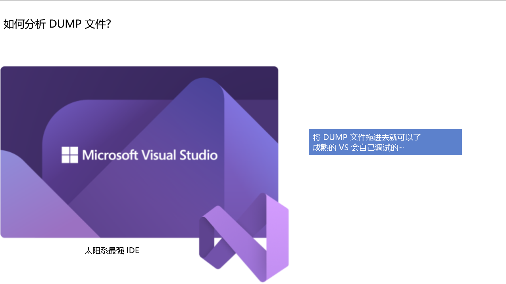
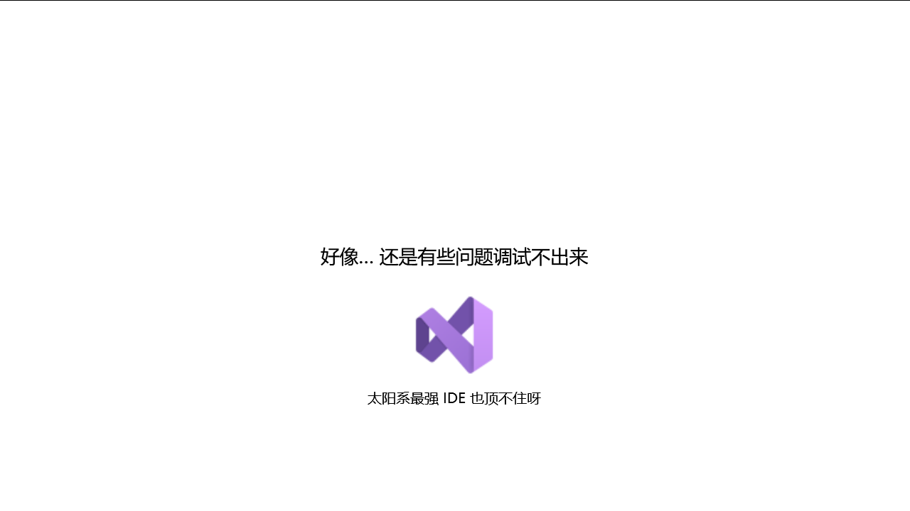
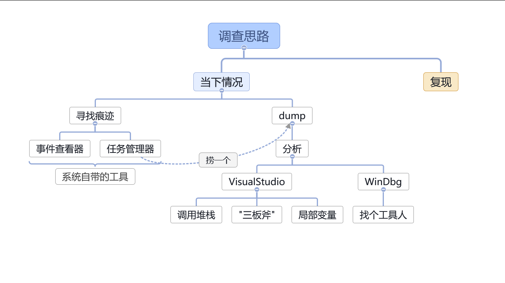
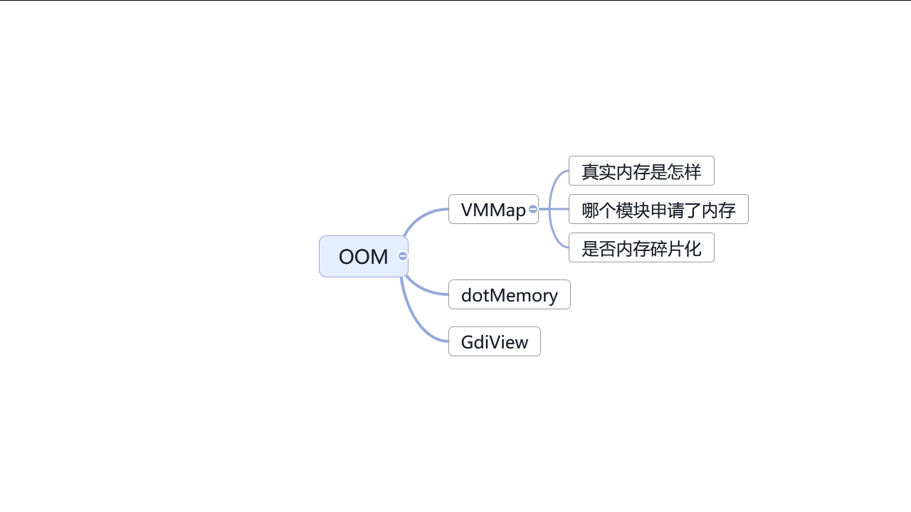

# Windows 调试工具课程

Windows 调试工具课程——在软件万种死法中调试出原因

<!--more-->
<!-- CreateTime:2024/09/19 21:08:10 -->

<!-- 发布 -->
<!-- 博客 -->
<!-- 置顶1 -->

本文是我在集团内部上的课程记录而成的博客内容。在本次课程里面将和大家介绍一些在 Windows 上常用的调试工具，以及调查问题的常见套路。适合于伙伴们入门 Windows 调试

本文以下内容是采用原本课程课件里面的一页页的内容组装而来，过程中补充一些讲课时的内容

<!--  -->


本次课程里面核心的内容是调试工具，调试工具是我们在调试软件的时候的利器，通过调试工具我们可以找到软件的问题，解决软件的问题

<!-- 今天来讲一个调试故事，故事是从用户反馈软件用不了的问题开始 -->
<!--  -->


本次的课程的开始我来和大家讲一个调试故事，这个故事是从用户反馈软件用不了的问题开始的

<!-- 需求分析 -->
<!--  -->


用户说软件用不了，那可能会是什么问题呢？用户不是专业的开发人员，他们不知道如何准确的表述问题

<!-- 调查思路 -->
<!--  -->


学过软件工程的同学应该有不少，软件工程里面应该会有提到，开发的第一步也是非常关键的一步就是需求分析。当收到用户反馈说软件用不了时，用户在说什么呢？是不是可能是软件崩溃了？还是软件无法启动？还是其他的问题

<!--  -->


遇到用户说软件用不了的时候，咱可以有哪些入手点呢？我的调查思路是分为两个大的方向。第一个方向是从当下的情况入手。如果当下已经没有了现场了，则可以考虑第二个方向，复现（重现）问题

<!--  -->


从第一个方向入手时，可以先考虑从用户的设备上寻找痕迹。接下来我将和大家聊聊如何开始从用户的设备上寻找痕迹。当然了，如果这个用户是咱的测试人员或者是咱的同事，那寻找痕迹这一步就更有价值了

<!-- Windows 是咱的好朋友 -->
<!--  -->


在用户设备上寻找痕迹时，别忘了 Windows 是咱的好朋友。Windows 提供了很多工具，可以帮助我们找到问题的原因。接下来我将和大家介绍一些 Windows 上自带的常用的调试工具

<!-- 寻找痕迹-事件查看器 -->
<!--  -->


第一站就是事件查看器。可以先假设咱可能遇到的是软件启动即崩溃的问题。在不远程用户的情况下，可以先请用户发送系统事件日志或截图过来看看。事件查看器作为第一站的原因是可不发起远程，直接请用户截图或发送日志过来。相对来说对开发者的工作成本较低

通过事件查看器可以进行快速的分析，如看到软件崩的日志，那就可以证明确实是软件崩溃了。后续咱的调查方向就可以向着软件崩掉的方向进行

也有可能通过事件查看器直接看到非常有效的信息，直接就结束战斗，定位到了问题

举个栗子

有一次我在调试一个软件的时候，用户反馈说软件无法启动。我让用户发送了事件查看器的日志过来，通过日志可以看到如下内容

```
错误应用程序名称: lindexi.exe，版本: 5.1.12.63002，时间戳: 0xedd2d687
错误模块名称: MSVCR100.dll，版本: 10.0.40219.325，时间戳: 0x4df2be1e
异常代码: 0x40000015
错误偏移量: 0x0008d6fd
错误进程 ID: 0x994
错误应用程序启动时间: 0x01d50ac3bd970061
错误应用程序路径: C:\Program Files\lindexi\lindexi.exe
错误模块路径: C:\Program Files\PowerShadow\App\MSVCR100.dll
报告 ID: a0c5c0b1-76b7-11e9-9d20-94c69123de40
```

<!-- 举个栗子 -->
<!--  -->


细心的伙伴也许一眼就看出来问题了，出现问题的是 MSVCR100.dll 模块，然而这个模块路径居然是在一个不认识的，名为 PowerShadow 的软件的目录下。这时候就可以大概确定问题了，这是被投毒了

试试用谷歌好帮手，搜搜这个软件是什么软件。刚好搜到了这篇博客： [影子系统让 C++ 程序无法运行](https://blog.lindexi.com/post/%E5%BD%B1%E5%AD%90%E7%B3%BB%E7%BB%9F%E8%AE%A9-C++-%E7%A8%8B%E5%BA%8F%E6%97%A0%E6%B3%95%E8%BF%90%E8%A1%8C.html )

于是这就结束战斗了，调查到了问题的原因，软件无法启动是因为被投毒了，被影子系统投毒了。解决方法就是请用户卸载影子系统，因为影子系统也不维护了，咱软件层没啥好挣扎的

<!-- 事件查看器 - 日常不工作 -->
<!--  -->


可惜的是在很多用户的设备上，事件查看器日常不工作。没关系，能从事件查看器找到额外信息，就是赚到了

如果事件查看器找不到或不能用？咱还有其他很多工具可以用

<!--  -->


寻找痕迹的时候，另一个常用的好工具就是任务管理器。任务管理器是 Windows 自带的一个工具，可以帮助我们了解到非常多的信息

通过任务管理器寻找痕迹时，可以按照如上图所示的决策树了解一下情况。如果不能在任务管理器里面看到进程，那很可能就是进程已经崩掉了。如果能够看到进程，那可能就是进程卡了。此时关注点可以是 CPU 使用率。如果 CPU 使用率不动，那可以猜猜可能是死锁问题，如果 CPU 使用率爆高，那可能是死循环等问题。同步也看一下内存使用率，虽然在任务管理器里面看内存使用率不能真实反映内存使用情况，但是可以作为一个参考。详细关于如何正确查看程序的内存使用情况，后面会有专门的内容介绍

无论是何种情况，都可以试试捞一个 DUMP 回来调试看看。当然了，对于软件崩掉的情况，先尝试一下是不是能启动起来，拼手的速度快速捞一个 DUMP 回来，如果不能，那后文还会和大家介绍其他工具来辅助捞 DUMP 文件

<!--  -->


先回顾一下，咱的调查思路一开始就是尝试寻找痕迹。寻找痕迹的时候借助 Windows 里面提供的好用的工具，这里重点介绍的是事件查看器和任务管理器。通过事件查看器可以快速的了解到软件崩溃的原因，通过任务管理器可以了解到软件的运行情况

<!--  -->


在通过自带的工具没有明确收获的情况下，则尝试捞一个 DUMP 回来开发机器上进行进一步分析

本课程这里提到的 DUMP 文件是指 Windows 下的内存转储文件，是一个二进制文件，简单用人话说就是将进程的内存内容保存到文件里面。通过 DUMP 文件可以有效还原出此时的进程的内存状态和内存里面的内容，可以用于进一步的分析。当用户环境里面没有带开发工具时，捞一个 DUMP 文件回来，可以帮助我们在开发机器上进行进一步的分析。捞 DUMP 分析的过程，相当于给进程做了一个快照，然后将其放在开发机器上进行进一步的分析

<!--  -->


假设进程还在的话，那最简单的捞 DUMP 方式就是通过任务管理器右键选择创建内存转储文件了。对应的英文系统是 Create memory dump file 菜单项

这里需要额外说明的是，如果当前系统是 x64 系统，但是自己的进程是 x86 进程，那此时不建议使用默认打开的任务管理器捞 DUMP 文件。因为默认打开的任务管理器是 x64 的，打出来的是 x64 转储文件，包含 WoW64 子系统的信息。详细请看 [你生成的转储文件有问题吗？ - 知乎](https://zhuanlan.zhihu.com/p/103381060 )

正确的做法应该是使用 `C:\Windows\SysWOW64\Taskmgr.exe` 的任务管理器去捞 DUMP 文件

<!--  -->


现在假定捞到了 DUMP 文件了，那接下来的步骤就是如何分析 DUMP 文件了。当然了，前置步骤就是如何将 DUMP 文件传回到自己的开发机器上，这里有一个小妙招就是将这个 DUMP 压缩一下。由于 DUMP 文件是内存转储文件，大部分都是全零的内容，压缩率非常高。如果需要通过网络等方式传输，那压缩一下再传输会快很多

<!-- 如何分析 DUMP 文件 -->
<!--  -->


分析 DUMP 的工具有很多，我着重要和大家介绍的是太阳系最强 IDE —— VisualStudio。VisualStudio 已经是一个成熟的 IDE 了，只需将 DUMP 拖进去就可以了，聪明的 VisualStudio 可以自动帮咱进行分析

<!-- 将 DUMP 拖入到 VisualStudio 的界面 -->
<!--  -->


一般而言，将 DUMP 拖入到 Visual Studio 里面，接着点击混合调试按钮即可。混合调试是使用 托管 调试和 本机 调试的组合。托管调试是指调试 .NET 程序，本机调试是指调试其他非 .NET 系的程序。混合调试是指同时调试托管和本机代码，因为一般而言 .NET 系的应用要在托管层崩溃是有点难度的，除非开发者自己比较缺乏处理。然而本机代码，如某些使用 C 、汇编、C++ 编写的程序，那就容易崩溃了。混合调试可以同时调试这两种代码。即使进程完全不是 .NET 程序，也可以使用混合调试来调试

<!--  -->


进入混合调试之后，需要等待 Visual Studio 自动分析。如果是第一次调试 DUMP 文件的，可能会在下载符号这一步卡住一会。大家可以出去喝个茶，等待一下，再回来看看。实在等不急了，那就点击取消符号加载再继续吧

<!--  -->


好的，现在咱的进度就是在用户侧发现了问题，且不能通过事件查看器等结束战斗。将用户的 DUMP 文件捞回来，通过 Visual Studio 进行分析。分析的方法就是将 DUMP 文件拖入 Visual Studio 里面，然后点击混合调试按钮。等待 Visual Studio 自动分析，即可看到分析结果

<!--  -->


那聪明的 Visual Studio 会帮咱分析出什么内容呢？如何看 Visual Studio 的分析结果呢？常见的套路就是关注 Visual Studio 以下三个方面内容

- 调用堆栈
- 后文会介绍的 "三板斧" 内容
- 局部变量

<!--  -->


先来和大家介绍一下调用堆栈。调用堆栈是个好东西，调用堆栈是一个非常重要的内容，可以帮助我们了解到程序是如何运行的。通过调用堆栈可以看到程序是如何运行的，是从哪个函数开始的，是如何调用的，是如何返回的。默认的 Visual Studio 调试布局里面，可以快速看到调用堆栈窗格

<!--  -->


调用堆栈可以如何看？调用堆栈可以和着之前在用户端任务管理器所见内容进行一起分析。如在任务管理器看不见进程，即对应进程崩了的问题，可以通过调用堆栈尝试看到是谁带崩的，崩之前调用的是哪个函数。如果是在任务管理器能看到进程，但是 CPU 使用率不动，那可能是死锁问题，可以通过调用堆栈看到是哪个函数卡住了主线程或进入锁。如果是 CPU 使用率爆高，那可能是死循环问题，可以通过调用堆栈看到是哪个函数跑满了线程

<!-- 堆栈是个好东西 谁带崩的 - 任务管理器已看不到进程 -->
<!--  -->


举个真实的例子，以下就是我从用户端捞回来的一个 DUMP 文件。通过 Visual Studio 分析，崩溃之前的调用堆栈如下

```
>	00000000()	Unknown
 	[Frames below may be incorrect and/or missing]	Unknown
 	nvumdshim.dll!710d0745()	Unknown
 	nvd3dum.dll!5989f2e1()	Unknown
 	nvd3dum.dll!595f1716()	Unknown
 	nvd3dum.dll!596b7827()	Unknown
 	nvd3dum.dll!598a6233()	Unknown
 	nvd3dum.dll!5989b95c()	Unknown
 	nvd3dum.dll!5989c33b()	Unknown
 	nvd3dum.dll!598816bc()	Unknown
 	nvumdshim.dll!710ca40e()	Unknown
 	nvumdshim.dll!710cbb78()	Unknown
 	nvumdshim.dll!710ca17f()	Unknown
 	nvumdshim.dll!710ca0d3()	Unknown
 	d3d9.dll!5ab86f81()	Unknown
 	ntdll.dll!_NtWaitForMultipleObjects@20 ()	Unknown
 	KERNELBASE.dll!76f69723()	Unknown
```

通过调用堆栈可以看到是 nvumdshim.dll 模块带崩的。这个模块是 NVIDIA 显卡驱动的模块。通过这个调用堆栈可以看到是 NVIDIA 显卡驱动带崩的。这个问题的解决方法就是更新 NVIDIA 显卡驱动。此问题详细请看 [记因为 NVIDIA 显驱错误而让 WPF 应用启动闪退问题](https://blog.lindexi.com/post/%E8%AE%B0%E5%9B%A0%E4%B8%BA-NVIDIA-%E6%98%BE%E9%A9%B1%E9%94%99%E8%AF%AF%E8%80%8C%E8%AE%A9-WPF-%E5%BA%94%E7%94%A8%E5%90%AF%E5%8A%A8%E9%97%AA%E9%80%80%E9%97%AE%E9%A2%98.html )

驱动问题是客户端崩的常见问题，表现就是在很多用户电脑工作好好的，在某些用户就起不来

修复 DirectX 时，我常用的就是 DirectX 修复工具，此工具下载地址是： <https://blog.csdn.net/VBcom/article/details/6962388>

讲完了谁带崩的问题，接下来再看另一个案例。对应 CPU 不动的问题，如下图所示的调用堆栈

<!--  -->


大家猜猜上面堆栈告诉咱什么问题

<!-- 堆栈是个好东西 谁卡住了我的主线程 - CPU 不动 -->
<!--  -->


通过以上的堆栈可以知道进入了锁。此时的常见套路就是从上到下找找，找第一个咱自己程序集的调用函数，如这里就找到了是在 lindexi.dll 里面的方法。可以知道的是这个方法有逻辑在等待锁，且这个锁就不返回。此时配合代码食用更佳。咱这里能够知道进程卡住的原因是因为等待锁，且这个锁不返回，而至于这个锁在业务上是什么作用就需要咱进一步配合代码进行分析了

<!-- 堆栈是个好东西 谁跑满了线程 - CPU 爆高 -->
<!--  -->


再来看看对应 CPU 爆高的一个案例，此时堆栈里面的信息可以告诉咱，现在正在跑的方法是哪些。有可能就是当前的调用堆栈的顶部的几个方法有逻辑跑满了线程了。同样，此时配合代码食用更佳

但有可能此时面对的情况是没有代码。如使用的是第三方库等，此时靠堆栈信息是不够的。先让大家思考这个问题，如果此时没有代码还可以如何进一步分析？我将在后文和大家介绍如何通过三板斧来进一步分析

<!--  -->


回顾一下，这就是咱拖入 DUMP 文件之后，依靠 Visual Studio 里面的调用堆栈进行问题分析的常见三个案例。对应软件崩溃的问题，可以通过调用堆栈看到是谁带崩的。对应 CPU 不动的问题，可以通过调用堆栈看到是谁卡住了主线程。对应 CPU 爆高的问题，可以通过调用堆栈看到是谁跑满了线程

<!--  -->


但是仅靠调用堆栈可能还是不够的，有时候需要更多的信息。接下来我将和大家介绍如何通过“三板斧”来进一步分析

这里介绍的“三板斧”分别是寄存器、反汇编、内存这三个方面的工具。通过这三个方面的工具可以帮助我们进一步的分析问题

<!--  -->


需要说明的是用到这三个工具时仅仅只是在咱有需要了解更多状态信息的时候。而且通过这三个工具也不一定能够准确了解到问题的原因。这三个工具的使用本身不难，但是其难点确是这几个工具所见内容的背后大家关于程序本身的理解以及软件运行机制的了解。如果对于软件运行机制不了解，那这三个工具所见内容可能会让人难以理解，或者是调查方向跑偏

<!-- 这个方法有逻辑跑满了，跑了什么？ -->
<!--  -->


依然使用刚才的例子，当看到 CPU 爆高的时候，通过调用堆栈可以看到是哪个方法跑满了线程。但是这个方法逻辑跑满了，其原因是什么呢？调用堆栈可无法回答此问题

<!--  -->


试试先在 Visual Studio 里面打开内存、寄存器、反汇编窗格。这三个工具可以帮助我们进一步分析问题

<!--  -->


打开之后的 Visual Studio 的界面布局大概如上图所示

<!--  -->


拿本课程的 CPU 爆高的例子，先通过反汇编发现了可能存在的问题，如想看看 rcx 寄存器里面存放了什么。通过寄存器窗格可以看到 rcx 寄存器里面存放了什么内容。通过内存窗格可以看到这个地址里面存放了什么内容。刚好就看到了对应的内存里面存放了一段逗比代码

<!--  -->


使用 “三板斧” 本身的难度不大，但是其难点在于其背后的知识。如汇编知识，寄存器的机制，以及软件本身的运行机制。这部分知识远远超过了本课程能介绍的范围，需要大家自行学习，但由于这部分知识的学习成本较高，所以在实际工作中，这部分知识可能并不是必须的。我只敢推荐大家在有余力的情况下进行学习，如果平时工作已经很忙了学不过来了，那这部分知识还可以先放着。但是如果能够掌握这部分知识，那在调试问题时会有所帮助

<!--  -->


继续和大家介绍 Visual Studio 的另一个调试工具——局部变量。局部变量也是个好东西，可以帮助我们了解到程序运行时的状态。通过局部变量可以看到程序运行时的变量的值，可以帮助我们了解到程序运行时的状态

<!-- 局部变量也是好东西 - 错误码含义哪里找 -->
<!--  -->


如看到了错误之前的局部变量有一个名为 `lastErrorCode` 的变量，也许可以通过这个变量的值来了解到错误的原因。但是这个错误码是什么意思呢？这个错误码的含义在哪里找呢？咱可以试试 error 这个工具，这个工具可以自动帮助咱找到可能的错误码的含义。这是工具是微软整理的，绝大部分调用系统层的组件所见的错误码都可以在这里找到

工具下载地址： <https://learn.microsoft.com/en-us/windows/win32/debug/system-error-code-lookup-tool>

如在这里咱可以看到的错误信息是文件或文件夹名错误，根据咱的业务逻辑，可能是文件名错误导致的问题。那接下来的调查方向就是看看为什么出现错误的文件名了，这时候也许一看代码就理解了

<!--  -->


再举另一个真实的例子，如看到的是如上图的异常导致的崩溃。根据咱通过搜索引擎了解到的知识，这个 WindowsCodecs.dll 是 Windows 系统的 WIC 多媒体解码层。可能此时遇到的问题和图片等多媒体的编解码有关

<!--  -->


刚好在本例子里面，通过局部变量看到了出问题的图片的文件地址，此时的调查就更加有方向了。除了可能存在的 WIC 层的问题外，还可以是图片文件本身的问题。如图片文件投毒等问题

<!-- 图片/音视频投了什么毒？延伸一下 -->
<!--  -->


延伸一下，如何了解图片、音视频等文件是否被投毒了？这里推荐一个工具，通过 MediaInfo 工具可以帮助咱看到文件的许多信息

如这个文件就是一个假装是 png 的 WebP 文件，然后投毒将 WIC 层搞崩了

MediaInfo 工具下载地址： <https://mediaarea.net/en/MediaInfo/Download>

<!-- 好像… 还是有些问题调试不出来 -->
<!--  -->


好像… 还是有些问题调试不出来

太阳系最强 IDE 也顶不住呀

<!--  -->


那就试试上接近能调试一切的 WinDbg 吧

这个工具非常强大，只是有一个问题。那就是有亿点点上手门槛

在这里我告诉大家一个非常简单的方法，让大家瞬间就能学会上手使用 WinDbg 工具调试问题。方法就是请一个熟悉 WinDbg 的伙伴，让他帮你调试，找到一个工具人帮你使用 WinDbg 调试问题是最快能学会使用 WinDbg 的方法

<!--  -->


回顾一下，以上咱就聊了在用户端发现问题，先尝试使用 Windows 自带工具快速进行定位问题。以及捞到 DUMP 文件之后，如何在开发机器上通过 Visual Studio 进行进一步分析。分析的方法就是将 DUMP 文件拖入 Visual Studio 里面，然后点击混合调试按钮。等待 Visual Studio 自动分析，即可看到分析结果。分析的重点是调用堆栈、三板斧、局部变量。通过这三个方面的工具可以帮助我们进一步的分析问题

如果 Visual Studio 还不能解决问题，那就找个工具人来帮忙使用 WinDbg 继续调查问题

这就是第一个大方向的内容

<!--  -->


第二个大方向就是事后现场的复现问题。什么时候需要复现问题？比如最简单来说就是软件启动即崩溃，完全来不及打开任务管理器捞 DUMP 文件。这时候就需要复现问题了，通过复现问题可以帮助我们更好的定位问题

复现问题时也不是只是简单重复跑程序，而是可以通过更多的工具辅助来在复现问题时更好的定位问题

<!--  -->


首要介绍的就是 ProcDump 工具

<!--  -->


当使用任务管理器捞不到 DUMP 或不好捞 DUMP 时，使用 ProcDump 工具能够更好的帮助我们捞 DUMP 文件。ProcDump 工具是 Sysinternals 的工具，下载地址是： <https://learn.microsoft.com/zh-cn/sysinternals/downloads/procdump>

<!--  -->


为什么说有时候不好使用任务管理器捞 DUMP 呢？因为现实往往很复杂。除了闪崩，软件启动即崩溃导致的手速不够快，捞不到 DUMP 文件之外，还有其他很多问题。比如软件就是处于似崩未崩的状态，期望抓到某个时机的状态，如软件一定会在某次 CPU 爆高之后不能符合预期工作，然而 CPU 爆高的时间非常短，靠人类去看去抓是有些废程序猿的。比如软件半夜崩溃，只有在午夜12点才会崩溃，这时候人类可能已经睡着了，即使没睡着，可能错过了这个时间点就要等明天的午夜12点了。再比如是非必现的问题，需要压测才能复现，期望自动化收集，否则可能要跑几千次才能复现一次，靠人类的工作量有些大

<!-- 如何在程序万种死法中有效的生成 Dump 文件 -->
<!--  -->


通过 ProcDump 可以在程序万种死法中有效的生成 Dump 文件，只需使用好 ProcDump 的参数。具体参数作用可以参考 [微软官方文档](https://learn.microsoft.com/zh-cn/sysinternals/downloads/procdump) 和 [如何在 NET 程序万种死法中有效的生成 Dump (上) - 一线码农 - 博客园](https://www.cnblogs.com/huangxincheng/p/14661031.html )

<!--  -->


这是一个小游戏，让大家连连线，看看在什么情况下应该使用什么方法

<!--  -->


在调查思路这里，复现问题时经常伴随使用 ProcDump 工具，因为 ProcDump 工具可以在非常多的情况下帮助我们捞 DUMP 文件

<!--  -->


复现问题时，不仅只有 ProcDump 工具。还有可能面对的是事后现场的情况，此时需要使用更多的工具来辅助定位问题。以及当没有调查思路时，可以试试常见的问题的探索帮助寻找思路

<!--  -->


来和大家讲讲事后现场的调查

<!--  -->


什么是事后现场？事后现场问题在这里一般说的是当前的现场或能复现所抓取到的现场已经不是问题发生的现场，而是发生问题之后的现场了

比如找到问题了，但问题非本质问题。常见的就是通过 DUMP 分析是如 空 异常的情况，导致崩溃的原因是因为空指针异常。但是空指针异常是如何产生的呢？这时候就需要通过事后现场分析思路调查来进一步分析问题

比如发生问题的地方不是产生问题的地方。如本课程的例子里面，崩溃原因是一张假装 png 的 WebP 图片，那这张图片是哪里来的，为什么会使用这张图片。如果此时代码逻辑没有帮助的话，那就需要进一步通过复现问题调查事前现场来进一步分析问题

比如系统性的问题。常见的就是团伙作案，不是单个应用导致的问题。这类问题的难度在于其复杂度，可能难以抓到正确的现场。此时也需要通过多次复现问题，抓取更多的信息，通过事前和事后现场的分析来进一步分析问题

<!-- 事后现场？团伙作案？ -->
<!--  -->


面对事后现场和团伙作案等问题，采用微软极品工具箱的 Process Monitor 工具，配合 DebugView 工具通常都能有不错的收获

Process Monitor 工具下载地址： <https://learn.microsoft.com/zh-cn/sysinternals/downloads/portmon>

Debugview++ 工具开源地址： <https://github.com/CobaltFusion/DebugViewPP>

DebugView 工具下载地址： <https://learn.microsoft.com/en-us/sysinternals/downloads/debugview>

从界面和交互上，DebugView++ 比 DebugView 更好用一些

<!-- 举个真实栗子 -->
<!--  -->


举个真实栗子来和大家演示多个工具之间的配合使用来调用一个有趣且复杂的问题

这个问题的开始是测试同学和我报告了触摸失效问题，后来经过进一步调查发现其实是 explorer 未响应问题，表现就是 explorer 迷之闪黑

这个问题复杂之处在于 explorer 不是咱的，咱也不熟悉，也不知道是什么导致的。而且 explorer 太庞大了，捞到 DUMP 分析压力过大，耗时耗力。需要使用更多的工具辅助进一步分析问题

<!--  -->


此时通过 Process Monitor 工具抓取 explorer 进程信息，发现了如上图的有趣的内容。里面很受我关注的就是存在了进程退出

通过网上四处搜发现 explorer 是一个多进程软件，进程的退出和迷之闪黑可能有所影响。既然进程退出了，那就试试上 ProcDump 工具在进程之前之后抓一个 DUMP 文件回来分析

<!--  -->


由于 explorer 十分庞大，且咱也不熟悉 explorer 的代码，来回抓了几次 DUMP 分析都没有什么收获。直到某次抓取到了一个有趣的 DUMP 文件，通过这个 DUMP 文件发现了在进程退出之前的调用堆栈里面包含了 Shell32 的一些调用

<!--  -->


再根据前面的 Process Monitor 工具抓到的在进程退出之前碰的是 Realtek Bluetooth 蓝牙模块，于是重心就在 Shell32 和蓝牙一起组合上面

<!--  -->


既然大概定位到这里，那就继续上 ShellView 工具。通过 ShellView 工具进行大量的 Shell32 组件的禁用，我的做法大概就是看哪个不开森就禁用哪个，进行二分法的禁用，最终发现了是 Realtek Bluetooth 蓝牙模块导致的问题

二分法的禁用就是先一口气禁用一半的组件，看看问题是否解决。如果解决了，那就说明问题在这一半里面。如果没有解决，那就说明问题在另一半里面。然后再在这一半里面继续二分禁用，直到找到问题所在

<!--  -->


经过以上的调查工具可以了解到是蓝牙相关模块的问题，集中火力找到明确的调试方向，很快就找到是蓝牙驱动的问题

详细的调试内容可比这里介绍的有趣的很，请看 [记一次调试资源管理器未响应经验](https://blog.lindexi.com/post/%E8%AE%B0%E4%B8%80%E6%AC%A1%E8%B0%83%E8%AF%95%E8%B5%84%E6%BA%90%E7%AE%A1%E7%90%86%E5%99%A8%E6%9C%AA%E5%93%8D%E5%BA%94%E7%BB%8F%E9%AA%8C.html )


<!-- 事后现场 -->
<!--  -->


<!--  -->


<!--  -->


<!--  -->


<!--  -->


<!--  -->


<!--  -->


<!-- 找不到，找错 DLL -->
<!--  -->


<!--  -->


<!--  -->


<!--  -->


<!--  -->


<!--  -->


<!--  -->


<!-- 任务管理器 -->
<!--  -->


<!--  -->


<!-- dotMemory -->
<!--  -->


<!--  -->


<!--  -->


<!--  -->


<!--  -->


<!--  -->


<!-- 注册表问题 -->
<!--  -->


<!--  -->


<!--  -->


<!--  -->


<!--  -->


<!--  -->


<!--  -->


<!--  -->


<!--  -->


<!--  -->


<!--  -->


<!--  -->


<!--  -->


<!--  -->


<!--  -->


<!--  -->


<!--  -->
