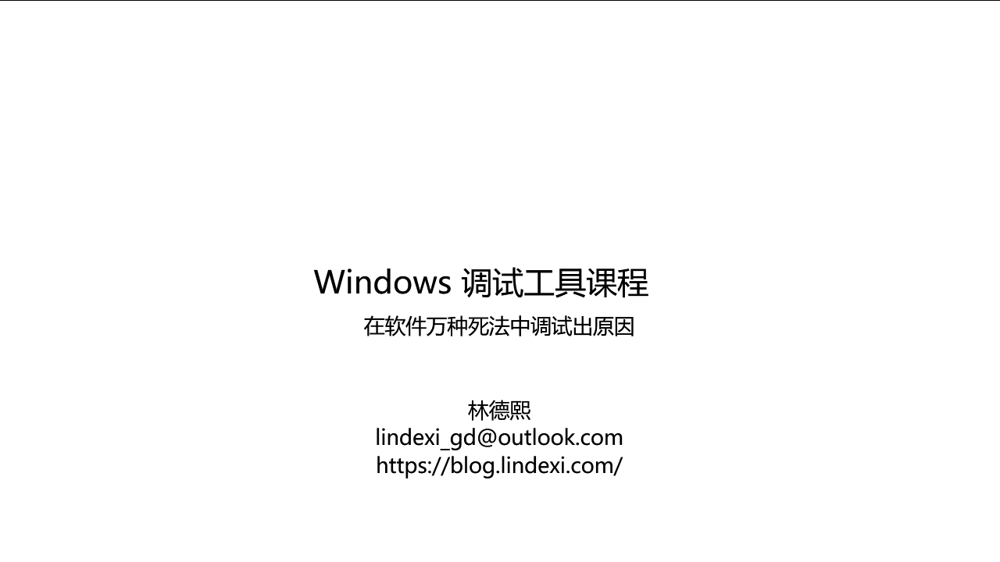
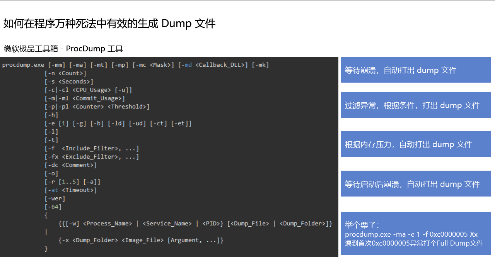
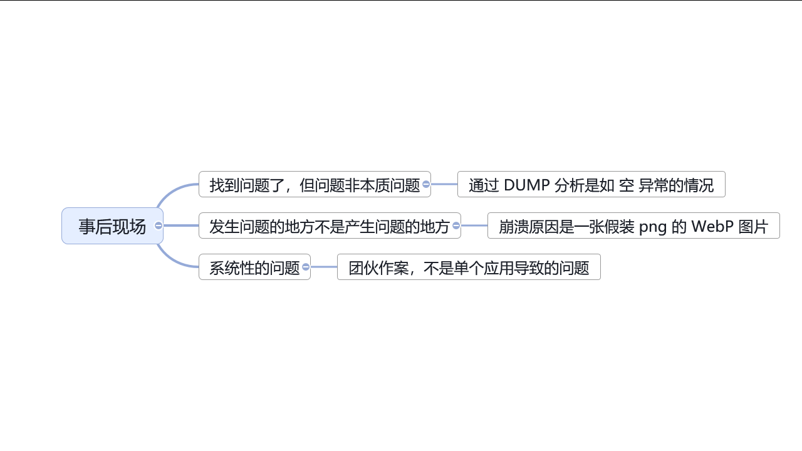
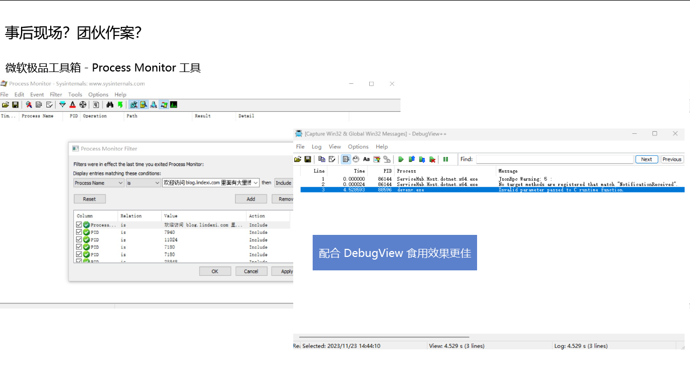

# Windows 调试工具课程

Windows 调试工具课程——在软件万种死法中调试出原因

<!--more-->
<!-- CreateTime:2024/09/19 21:08:10 -->

<!-- 发布 -->
<!-- 博客 -->
<!-- 置顶1 -->

本文是我在集团内部上的课程记录而成的博客内容。在本次课程里面将和大家介绍一些在 Windows 上常用的调试工具，以及调查问题的常见套路。适合于伙伴们入门 Windows 调试

本文内容的组织方式是按照原本课程课件里面的一页页的内容组装而来的方式组织的，在过程中补充一些讲课时的内容

<!--  -->


本次课程里面核心的内容是调试工具，调试工具是我们在调试软件的时候的利器，通过调试工具我们可以找到软件的问题，解决软件的问题

<!-- 今天来讲一个调试故事，故事是从用户反馈软件用不了的问题开始 -->
<!--  -->


本次的课程的开始我来和大家讲一个调试故事，这个故事是从用户反馈软件用不了的问题开始的

<!-- 需求分析 -->
<!--  -->


用户说软件用不了，那可能会是什么问题呢？用户不是专业的开发人员，他们不知道如何准确的表述问题

<!-- 调查思路 -->
<!--  -->


学过软件工程的同学应该有不少，软件工程里面应该会有提到，开发的第一步也是非常关键的一步就是需求分析。当收到用户反馈说软件用不了时，用户在说什么呢？是不是可能是软件崩溃了？还是软件无法启动？还是其他的问题

<!--  -->


遇到用户说软件用不了的时候，咱可以有哪些入手点呢？我的调查思路是分为两个大的方向。第一个方向是从当下的情况入手。如果当下已经没有了现场了，则可以考虑第二个方向，复现（重现）问题

<!--  -->


从第一个方向入手时，可以先考虑从用户的设备上寻找痕迹。接下来我将和大家聊聊如何开始从用户的设备上寻找痕迹。当然了，如果这个用户是咱的测试人员或者是咱的同事，那寻找痕迹这一步就更有价值了

<!-- Windows 是咱的好朋友 -->
<!--  -->


在用户设备上寻找痕迹时，别忘了 Windows 是咱的好朋友。Windows 提供了很多工具，可以帮助我们找到问题的原因。接下来我将和大家介绍一些 Windows 上自带的常用的调试工具

<!-- 寻找痕迹-事件查看器 -->
<!--  -->


第一站就是事件查看器。可以先假设咱可能遇到的是软件启动即崩溃的问题。在不远程用户的情况下，可以先请用户发送系统事件日志或截图过来看看。事件查看器作为第一站的原因是可不发起远程，直接请用户截图或发送日志过来。相对来说对开发者的工作成本较低

通过事件查看器可以进行快速的分析，如看到软件崩的日志，那就可以证明确实是软件崩溃了。后续咱的调查方向就可以向着软件崩掉的方向进行

也有可能通过事件查看器直接看到非常有效的信息，直接就结束战斗，定位到了问题

举个栗子

有一次我在调试一个软件的时候，用户反馈说软件无法启动。我让用户发送了事件查看器的日志过来，通过日志可以看到如下内容

```
错误应用程序名称: lindexi.exe，版本: 5.1.12.63002，时间戳: 0xedd2d687
错误模块名称: MSVCR100.dll，版本: 10.0.40219.325，时间戳: 0x4df2be1e
异常代码: 0x40000015
错误偏移量: 0x0008d6fd
错误进程 ID: 0x994
错误应用程序启动时间: 0x01d50ac3bd970061
错误应用程序路径: C:\Program Files\lindexi\lindexi.exe
错误模块路径: C:\Program Files\PowerShadow\App\MSVCR100.dll
报告 ID: a0c5c0b1-76b7-11e9-9d20-94c69123de40
```

<!-- 举个栗子 -->
<!--  -->


细心的伙伴也许一眼就看出来问题了，出现问题的是 MSVCR100.dll 模块，然而这个模块路径居然是在一个不认识的，名为 PowerShadow 的软件的目录下。这时候就可以大概确定问题了，这是被投毒了

试试用谷歌好帮手，搜搜这个软件是什么软件。刚好搜到了这篇博客： [影子系统让 C++ 程序无法运行](https://blog.lindexi.com/post/%E5%BD%B1%E5%AD%90%E7%B3%BB%E7%BB%9F%E8%AE%A9-C++-%E7%A8%8B%E5%BA%8F%E6%97%A0%E6%B3%95%E8%BF%90%E8%A1%8C.html )

于是这就结束战斗了，调查到了问题的原因，软件无法启动是因为被投毒了，被影子系统投毒了。解决方法就是请用户卸载影子系统，因为影子系统也不维护了，咱软件层没啥好挣扎的

<!-- 事件查看器 - 日常不工作 -->
<!--  -->


可惜的是在很多用户的设备上，事件查看器日常不工作。没关系，能从事件查看器找到额外信息，就是赚到了

如果事件查看器找不到或不能用？咱还有其他很多工具可以用

<!--  -->


寻找痕迹的时候，另一个常用的好工具就是任务管理器。任务管理器是 Windows 自带的一个工具，可以帮助我们了解到非常多的信息

通过任务管理器寻找痕迹时，可以按照如上图所示的决策树了解一下情况。如果不能在任务管理器里面看到进程，那很可能就是进程已经崩掉了。如果能够看到进程，那可能就是进程卡了。此时关注点可以是 CPU 使用率。如果 CPU 使用率不动，那可以猜猜可能是死锁问题，如果 CPU 使用率爆高，那可能是死循环等问题。同步也看一下内存使用率，虽然在任务管理器里面看内存使用率不能真实反映内存使用情况，但是可以作为一个参考。详细关于如何正确查看程序的内存使用情况，后面会有专门的内容介绍

无论是何种情况，都可以试试捞一个 DUMP 回来调试看看。当然了，对于软件崩掉的情况，先尝试一下是不是能启动起来，拼手的速度快速捞一个 DUMP 回来，如果不能，那后文还会和大家介绍其他工具来辅助捞 DUMP 文件

<!--  -->


先回顾一下，咱的调查思路一开始就是尝试寻找痕迹。寻找痕迹的时候借助 Windows 里面提供的好用的工具，这里重点介绍的是事件查看器和任务管理器。通过事件查看器可以快速的了解到软件崩溃的原因，通过任务管理器可以了解到软件的运行情况

<!--  -->


在通过自带的工具没有明确收获的情况下，则尝试捞一个 DUMP 回来开发机器上进行进一步分析

本课程这里提到的 DUMP 文件是指 Windows 下的内存转储文件，是一个二进制文件，简单用人话说就是将进程的内存内容保存到文件里面。通过 DUMP 文件可以有效还原出此时的进程的内存状态和内存里面的内容，可以用于进一步的分析。当用户环境里面没有带开发工具时，捞一个 DUMP 文件回来，可以帮助我们在开发机器上进行进一步的分析。捞 DUMP 分析的过程，相当于给进程做了一个快照，然后将其放在开发机器上进行进一步的分析

<!--  -->


假设进程还在的话，那最简单的捞 DUMP 方式就是通过任务管理器右键选择创建内存转储文件了。对应的英文系统是 Create memory dump file 菜单项

这里需要额外说明的是，如果当前系统是 x64 系统，但是自己的进程是 32 位进程，那此时不建议使用默认打开的任务管理器捞 DUMP 文件。因为默认打开的任务管理器是 x64 的，打出来的是 x64 转储文件，包含 WoW64 子系统的信息。详细请看 [你生成的转储文件有问题吗？ - 知乎](https://zhuanlan.zhihu.com/p/103381060 )

正确的做法应该是使用 `C:\Windows\SysWOW64\Taskmgr.exe` 的任务管理器去捞 DUMP 文件

<!--  -->


现在假定捞到了 DUMP 文件了，那接下来的步骤就是如何分析 DUMP 文件了。当然了，前置步骤就是如何将 DUMP 文件传回到自己的开发机器上，这里有一个小妙招就是将这个 DUMP 压缩一下。由于 DUMP 文件是内存转储文件，大部分都是全零的内容，压缩率非常高。如果需要通过网络等方式传输，那压缩一下再传输会快很多

<!-- 如何分析 DUMP 文件 -->
<!--  -->


分析 DUMP 的工具有很多，我着重要和大家介绍的是太阳系最强 IDE —— VisualStudio。VisualStudio 已经是一个成熟的 IDE 了，只需将 DUMP 拖进去就可以了，聪明的 VisualStudio 可以自动帮咱进行分析

<!-- 将 DUMP 拖入到 VisualStudio 的界面 -->
<!--  -->


一般而言，将 DUMP 拖入到 Visual Studio 里面，接着点击混合调试按钮即可。混合调试是使用 托管 调试和 本机 调试的组合。托管调试是指调试 .NET 程序，本机调试是指调试其他非 .NET 系的程序。混合调试是指同时调试托管和本机代码，因为一般而言 .NET 系的应用要在托管层崩溃是有点难度的，除非开发者自己比较缺乏处理。然而本机代码，如某些使用 C 、汇编、C++ 编写的程序，那就容易崩溃了。混合调试可以同时调试这两种代码。即使进程完全不是 .NET 程序，也可以使用混合调试来调试

<!--  -->


进入混合调试之后，需要等待 Visual Studio 自动分析。如果是第一次调试 DUMP 文件的，可能会在下载符号这一步卡住一会。大家可以出去喝个茶，等待一下，再回来看看。实在等不急了，那就点击取消符号加载再继续吧

<!--  -->


好的，现在咱的进度就是在用户侧发现了问题，且不能通过事件查看器等结束战斗。将用户的 DUMP 文件捞回来，通过 Visual Studio 进行分析。分析的方法就是将 DUMP 文件拖入 Visual Studio 里面，然后点击混合调试按钮。等待 Visual Studio 自动分析，即可看到分析结果

<!--  -->


那聪明的 Visual Studio 会帮咱分析出什么内容呢？如何看 Visual Studio 的分析结果呢？常见的套路就是关注 Visual Studio 以下三个方面内容

- 调用堆栈
- 后文会介绍的 "三板斧" 内容
- 局部变量

<!--  -->


先来和大家介绍一下调用堆栈。调用堆栈是个好东西，调用堆栈是一个非常重要的内容，可以帮助我们了解到程序是如何运行的。通过调用堆栈可以看到程序是如何运行的，是从哪个函数开始的，是如何调用的，是如何返回的。默认的 Visual Studio 调试布局里面，可以快速看到调用堆栈窗格

<!--  -->


调用堆栈可以如何看？调用堆栈可以和着之前在用户端任务管理器所见内容进行一起分析。如在任务管理器看不见进程，即对应进程崩了的问题，可以通过调用堆栈尝试看到是谁带崩的，崩之前调用的是哪个函数。如果是在任务管理器能看到进程，但是 CPU 使用率不动，那可能是死锁问题，可以通过调用堆栈看到是哪个函数卡住了主线程或进入锁。如果是 CPU 使用率爆高，那可能是死循环问题，可以通过调用堆栈看到是哪个函数跑满了线程

<!-- 堆栈是个好东西 谁带崩的 - 任务管理器已看不到进程 -->
<!--  -->


举个真实的例子，以下就是我从用户端捞回来的一个 DUMP 文件。通过 Visual Studio 分析，崩溃之前的调用堆栈如下

```
>	00000000()	Unknown
 	[Frames below may be incorrect and/or missing]	Unknown
 	nvumdshim.dll!710d0745()	Unknown
 	nvd3dum.dll!5989f2e1()	Unknown
 	nvd3dum.dll!595f1716()	Unknown
 	nvd3dum.dll!596b7827()	Unknown
 	nvd3dum.dll!598a6233()	Unknown
 	nvd3dum.dll!5989b95c()	Unknown
 	nvd3dum.dll!5989c33b()	Unknown
 	nvd3dum.dll!598816bc()	Unknown
 	nvumdshim.dll!710ca40e()	Unknown
 	nvumdshim.dll!710cbb78()	Unknown
 	nvumdshim.dll!710ca17f()	Unknown
 	nvumdshim.dll!710ca0d3()	Unknown
 	d3d9.dll!5ab86f81()	Unknown
 	ntdll.dll!_NtWaitForMultipleObjects@20 ()	Unknown
 	KERNELBASE.dll!76f69723()	Unknown
```

通过调用堆栈可以看到是 nvumdshim.dll 模块带崩的。这个模块是 NVIDIA 显卡驱动的模块。通过这个调用堆栈可以看到是 NVIDIA 显卡驱动带崩的。这个问题的解决方法就是更新 NVIDIA 显卡驱动。此问题详细请看 [记因为 NVIDIA 显驱错误而让 WPF 应用启动闪退问题](https://blog.lindexi.com/post/%E8%AE%B0%E5%9B%A0%E4%B8%BA-NVIDIA-%E6%98%BE%E9%A9%B1%E9%94%99%E8%AF%AF%E8%80%8C%E8%AE%A9-WPF-%E5%BA%94%E7%94%A8%E5%90%AF%E5%8A%A8%E9%97%AA%E9%80%80%E9%97%AE%E9%A2%98.html )

驱动问题是客户端崩的常见问题，表现就是在很多用户电脑工作好好的，在某些用户就起不来

修复 DirectX 时，我常用的就是 DirectX 修复工具，此工具下载地址是： <https://blog.csdn.net/VBcom/article/details/6962388>

讲完了谁带崩的问题，接下来再看另一个案例。对应 CPU 不动的问题，如下图所示的调用堆栈

<!--  -->


大家猜猜上面堆栈告诉咱什么问题

<!-- 堆栈是个好东西 谁卡住了我的主线程 - CPU 不动 -->
<!--  -->


通过以上的堆栈可以知道进入了锁。此时的常见套路就是从上到下找找，找第一个咱自己程序集的调用函数，如这里就找到了是在 lindexi.dll 里面的方法。可以知道的是这个方法有逻辑在等待锁，且这个锁就不返回。此时配合代码食用更佳。咱这里能够知道进程卡住的原因是因为等待锁，且这个锁不返回，而至于这个锁在业务上是什么作用就需要咱进一步配合代码进行分析了

<!-- 堆栈是个好东西 谁跑满了线程 - CPU 爆高 -->
<!--  -->


再来看看对应 CPU 爆高的一个案例，此时堆栈里面的信息可以告诉咱，现在正在跑的方法是哪些。有可能就是当前的调用堆栈的顶部的几个方法有逻辑跑满了线程了。同样，此时配合代码食用更佳

但有可能此时面对的情况是没有代码。如使用的是第三方库等，此时靠堆栈信息是不够的。先让大家思考这个问题，如果此时没有代码还可以如何进一步分析？我将在后文和大家介绍如何通过三板斧来进一步分析

<!--  -->


回顾一下，这就是咱拖入 DUMP 文件之后，依靠 Visual Studio 里面的调用堆栈进行问题分析的常见三个案例。对应软件崩溃的问题，可以通过调用堆栈看到是谁带崩的。对应 CPU 不动的问题，可以通过调用堆栈看到是谁卡住了主线程。对应 CPU 爆高的问题，可以通过调用堆栈看到是谁跑满了线程

<!--  -->


但是仅靠调用堆栈可能还是不够的，有时候需要更多的信息。接下来我将和大家介绍如何通过“三板斧”来进一步分析

这里介绍的“三板斧”分别是寄存器、反汇编、内存这三个方面的工具。通过这三个方面的工具可以帮助我们进一步的分析问题

<!--  -->


需要说明的是用到这三个工具时仅仅只是在咱有需要了解更多状态信息的时候。而且通过这三个工具也不一定能够准确了解到问题的原因。这三个工具的使用本身不难，但是其难点确是这几个工具所见内容的背后大家关于程序本身的理解以及软件运行机制的了解。如果对于软件运行机制不了解，那这三个工具所见内容可能会让人难以理解，或者是调查方向跑偏

<!-- 这个方法有逻辑跑满了，跑了什么？ -->
<!--  -->


依然使用刚才的例子，当看到 CPU 爆高的时候，通过调用堆栈可以看到是哪个方法跑满了线程。但是这个方法逻辑跑满了，其原因是什么呢？调用堆栈可无法回答此问题

<!--  -->


试试先在 Visual Studio 里面打开内存、寄存器、反汇编窗格。这三个工具可以帮助我们进一步分析问题

<!--  -->


打开之后的 Visual Studio 的界面布局大概如上图所示

<!--  -->


拿本课程的 CPU 爆高的例子，先通过反汇编发现了可能存在的问题，如想看看 rcx 寄存器里面存放了什么。通过寄存器窗格可以看到 rcx 寄存器里面存放了什么内容。通过内存窗格可以看到这个地址里面存放了什么内容。刚好就看到了对应的内存里面存放了一段逗比代码

<!--  -->


使用 “三板斧” 本身的难度不大，但是其难点在于其背后的知识。如汇编知识，寄存器的机制，以及软件本身的运行机制。这部分知识远远超过了本课程能介绍的范围，需要大家自行学习，但由于这部分知识的学习成本较高，所以在实际工作中，这部分知识可能并不是必须的。我只敢推荐大家在有余力的情况下进行学习，如果平时工作已经很忙了学不过来了，那这部分知识还可以先放着。但是如果能够掌握这部分知识，那在调试问题时会有所帮助

<!--  -->


继续和大家介绍 Visual Studio 的另一个调试工具——局部变量。局部变量也是个好东西，可以帮助我们了解到程序运行时的状态。通过局部变量可以看到程序运行时的变量的值，可以帮助我们了解到程序运行时的状态

<!-- 局部变量也是好东西 - 错误码含义哪里找 -->
<!--  -->


如看到了错误之前的局部变量有一个名为 `lastErrorCode` 的变量，也许可以通过这个变量的值来了解到错误的原因。但是这个错误码是什么意思呢？这个错误码的含义在哪里找呢？咱可以试试 error 这个工具，这个工具可以自动帮助咱找到可能的错误码的含义。这是工具是微软整理的，绝大部分调用系统层的组件所见的错误码都可以在这里找到

工具下载地址： <https://learn.microsoft.com/en-us/windows/win32/debug/system-error-code-lookup-tool>

如在这里咱可以看到的错误信息是文件或文件夹名错误，根据咱的业务逻辑，可能是文件名错误导致的问题。那接下来的调查方向就是看看为什么出现错误的文件名了，这时候也许一看代码就理解了

<!--  -->


再举另一个真实的例子，如看到的是如上图的异常导致的崩溃。根据咱通过搜索引擎了解到的知识，这个 WindowsCodecs.dll 是 Windows 系统的 WIC 多媒体解码层。可能此时遇到的问题和图片等多媒体的编解码有关

<!--  -->


刚好在本例子里面，通过局部变量看到了出问题的图片的文件地址，此时的调查就更加有方向了。除了可能存在的 WIC 层的问题外，还可以是图片文件本身的问题。如图片文件投毒等问题

<!-- 图片/音视频投了什么毒？延伸一下 -->
<!--  -->


延伸一下，如何了解图片、音视频等文件是否被投毒了？这里推荐一个工具，通过 MediaInfo 工具可以帮助咱看到文件的许多信息

如这个文件就是一个假装是 png 的 WebP 文件，然后投毒将 WIC 层搞崩了

MediaInfo 工具下载地址： <https://mediaarea.net/en/MediaInfo/Download>

<!-- 好像… 还是有些问题调试不出来 -->
<!--  -->


好像… 还是有些问题调试不出来

太阳系最强 IDE 也顶不住呀

<!--  -->


那就试试上接近能调试一切的 WinDbg 吧

这个工具非常强大，只是有一个问题。那就是有亿点点上手门槛

在这里我告诉大家一个非常简单的方法，让大家瞬间就能学会上手使用 WinDbg 工具调试问题。方法就是请一个熟悉 WinDbg 的伙伴，让他帮你调试，找到一个工具人帮你使用 WinDbg 调试问题是最快能学会使用 WinDbg 的方法

<!--  -->


回顾一下，以上咱就聊了在用户端发现问题，先尝试使用 Windows 自带工具快速进行定位问题。以及捞到 DUMP 文件之后，如何在开发机器上通过 Visual Studio 进行进一步分析。分析的方法就是将 DUMP 文件拖入 Visual Studio 里面，然后点击混合调试按钮。等待 Visual Studio 自动分析，即可看到分析结果。分析的重点是调用堆栈、三板斧、局部变量。通过这三个方面的工具可以帮助我们进一步的分析问题

如果 Visual Studio 还不能解决问题，那就找个工具人来帮忙使用 WinDbg 继续调查问题

这就是第一个大方向的内容

<!--  -->


第二个大方向就是事后现场的复现问题。什么时候需要复现问题？比如最简单来说就是软件启动即崩溃，完全来不及打开任务管理器捞 DUMP 文件。这时候就需要复现问题了，通过复现问题可以帮助我们更好的定位问题

复现问题时也不是只是简单重复跑程序，而是可以通过更多的工具辅助来在复现问题时更好的定位问题

<!--  -->


首要介绍的就是 ProcDump 工具

<!--  -->


当使用任务管理器捞不到 DUMP 或不好捞 DUMP 时，使用 ProcDump 工具能够更好的帮助我们捞 DUMP 文件。ProcDump 工具是 Sysinternals 的工具，下载地址是： <https://learn.microsoft.com/zh-cn/sysinternals/downloads/procdump>

<!--  -->


为什么说有时候不好使用任务管理器捞 DUMP 呢？因为现实往往很复杂。除了闪崩，软件启动即崩溃导致的手速不够快，捞不到 DUMP 文件之外，还有其他很多问题。比如软件就是处于似崩未崩的状态，期望抓到某个时机的状态，如软件一定会在某次 CPU 爆高之后不能符合预期工作，然而 CPU 爆高的时间非常短，靠人类去看去抓是有些废程序猿的。比如软件半夜崩溃，只有在午夜12点才会崩溃，这时候人类可能已经睡着了，即使没睡着，可能错过了这个时间点就要等明天的午夜12点了。再比如是非必现的问题，需要压测才能复现，期望自动化收集，否则可能要跑几千次才能复现一次，靠人类手工一次次一个个去捞的工作量有些大

<!-- 如何在程序万种死法中有效的生成 Dump 文件 -->
<!--  -->


通过 ProcDump 可以在程序万种死法中有效的生成 Dump 文件，只需使用好 ProcDump 的参数。具体参数作用可以参考 [微软官方文档](https://learn.microsoft.com/zh-cn/sysinternals/downloads/procdump) 和 [如何在 NET 程序万种死法中有效的生成 Dump (上) - 一线码农 - 博客园](https://www.cnblogs.com/huangxincheng/p/14661031.html )

<!--  -->


这是一个小游戏，让大家连连线，看看在什么情况下应该使用什么方法

<!--  -->


在调查思路这里，复现问题时经常伴随使用 ProcDump 工具，因为 ProcDump 工具可以在非常多的情况下帮助我们捞 DUMP 文件

<!--  -->


复现问题时，不仅只有 ProcDump 工具。还有可能面对的是事后现场的情况，此时需要使用更多的工具来辅助定位问题。以及当没有调查思路时，可以试试常见的问题的探索帮助寻找思路

<!--  -->


来和大家讲讲事后现场的调查

<!--  -->


什么是事后现场？事后现场问题在这里一般说的是当前的现场或能复现所抓取到的现场已经不是问题发生的现场，而是发生问题之后的现场了

比如找到问题了，但问题非本质问题。常见的就是通过 DUMP 分析是如 空 异常的情况，导致崩溃的原因是因为空指针异常。但是空指针异常是如何产生的呢？这时候就需要通过事后现场分析思路调查来进一步分析问题

比如发生问题的地方不是产生问题的地方。如本课程的例子里面，崩溃原因是一张假装 png 的 WebP 图片，那这张图片是哪里来的，为什么会使用这张图片。如果此时代码逻辑没有帮助的话，那就需要进一步通过复现问题调查事前现场来进一步分析问题

比如系统性的问题。常见的就是团伙作案，不是单个应用导致的问题。这类问题的难度在于其复杂度，可能难以抓到正确的现场。此时也需要通过多次复现问题，抓取更多的信息，通过事前和事后现场的分析来进一步分析问题

<!-- 事后现场？团伙作案？ -->
<!--  -->


面对事后现场和团伙作案等问题，采用微软极品工具箱的 Process Monitor 工具，配合 DebugView 工具通常都能有不错的收获

Process Monitor 工具下载地址： <https://learn.microsoft.com/zh-cn/sysinternals/downloads/portmon>

Debugview++ 工具开源地址： <https://github.com/CobaltFusion/DebugViewPP>

DebugView 工具下载地址： <https://learn.microsoft.com/en-us/sysinternals/downloads/debugview>

从界面和交互上，DebugView++ 比 DebugView 更好用一些

<!-- 举个真实栗子 -->
<!--  -->


举个真实栗子来和大家演示多个工具之间的配合使用来调用一个有趣且复杂的问题

这个问题的开始是测试同学和我报告了触摸失效问题，后来经过进一步调查发现其实是 explorer 未响应问题，表现就是 explorer 迷之闪黑

这个问题复杂之处在于 explorer 不是咱的，咱也不熟悉，也不知道是什么导致的。而且 explorer 太庞大了，捞到 DUMP 分析压力过大，耗时耗力。需要使用更多的工具辅助进一步分析问题

<!--  -->


此时通过 Process Monitor 工具抓取 explorer 进程信息，发现了如上图的有趣的内容。里面很受我关注的就是存在了进程退出

通过网上四处搜发现 explorer 是一个多进程软件，进程的退出和迷之闪黑可能有所影响。既然进程退出了，那就试试上 ProcDump 工具在进程之前之后抓一个 DUMP 文件回来分析

<!--  -->


由于 explorer 十分庞大，且咱也不熟悉 explorer 的代码，来回抓了几次 DUMP 分析都没有什么收获。直到某次抓取到了一个有趣的 DUMP 文件，通过这个 DUMP 文件发现了在进程退出之前的调用堆栈里面包含了 Shell32 的一些调用

<!--  -->


再根据前面的 Process Monitor 工具抓到的在进程退出之前碰的是 Realtek Bluetooth 蓝牙模块，于是重心就在 Shell32 和蓝牙一起组合上面

<!--  -->


既然大概定位到这里，那就继续上 ShellView 工具。通过 ShellView 工具进行大量的 Shell32 组件的禁用，我的做法大概就是看哪个不开森就禁用哪个，进行二分法的禁用，最终发现了是 Realtek Bluetooth 蓝牙模块导致的问题

二分法的禁用就是先一口气禁用一半的组件，看看问题是否解决。如果解决了，那就说明问题在这一半里面。如果没有解决，那就说明问题在另一半里面。然后再在这一半里面继续二分禁用，直到找到问题所在

<!--  -->


经过以上的调查工具可以了解到是蓝牙相关模块的问题，集中火力找到明确的调试方向，很快就找到是蓝牙驱动的问题

详细的调试内容可比这里介绍的有趣的很，请看 [记一次调试资源管理器未响应经验](https://blog.lindexi.com/post/%E8%AE%B0%E4%B8%80%E6%AC%A1%E8%B0%83%E8%AF%95%E8%B5%84%E6%BA%90%E7%AE%A1%E7%90%86%E5%99%A8%E6%9C%AA%E5%93%8D%E5%BA%94%E7%BB%8F%E9%AA%8C.html )

<!-- 事后现场 -->
<!--  -->


以上的案例里面 Process Monitor 立了首功，通过 Process Monitor 工具抓取了 explorer 进程的信息，发现了进程退出的信息，以及退出之前访问了蓝牙相关模块，最终通过 ShellView 工具禁用了蓝牙模块定位到了具体模块导致的问题。在许多事后现场问题中，都会使用 Process Monitor 工具配合复现，尝试找到故障之前的事前发生了什么，了解故障之前的行为。进而可以缩小定位问题的方向

Process Monitor 工具适用于辅助调试不熟悉的应用、复杂的情况，通过了解其行为来辅助缩小定位范围，提高调试效率。同时 Process Monitor 工具可以一口气抓多个进程的信息，也常用于辅助定位进程们团伙作案问题

<!--  -->


以上就是调查思路里面的第二大方向的事后现场的内容。其思想核心就是通过复现配合工具抓取现场信息，通过现场信息进一步分析问题

<!--  -->


有时候调查问题过程中没有头绪，没有思路。此时可以还可以试试一些常见问题的探索，尝试通过这些常用问题套路和经验找到入手点

<!--  -->


这些常见的工具可以帮助我们进行一些常见问题的排查。有时候开发任务紧张，没有充足的时间进行全面的调查，通过常用的套路也可以提高定位效率，不一定我们需要来一次全面的调查，有可能只通过现象和猜测，配合常用套路就能找到问题的原因

<!--  -->


这些常用工具和套路被我成为更多的调试工具，分为以下多个方面：

- 系统环境问题-依赖缺失等问题
- 内存问题，包括 OOM 系问题
- 注册表相关模块
- 窗口相关模块
- 键盘等等

这些方面都可以作为常见问题的入手点探索方向

<!--  -->


先来聊聊依赖缺失问题

<!--  -->


依赖缺失的表现行为很明显，一般就是程序猿常说的，“在我电脑上明明就是好的，为什么到你电脑上就不行了”这类的话，那就可以第一时间怀疑是依赖缺失问题。或者是软件无法启动，启动即崩溃，这类问题也可以怀疑是依赖缺失问题。或者是软件开始能跑，但是跑到某个模块就崩溃了，且很固定的到某个功能模块就崩溃，那此时也能怀疑是依赖缺失问题

有些不熟悉 Windows 的伙伴也许有这样的问题，明明自己写的应用似乎就没有什么依赖，为什么还可能遇到依赖缺失的问题呢？这是因为 Windows 系统本身就是一个依赖系统，很多功能都是通过依赖来实现的。比如说一个最简单的例子，你写了一个 C# 程序，但是你的 C# 程序里面调用了一个 MessageBox 函数，这个 MessageBox 函数是 Windows 系统的一个函数，你的 C# 程序调用了这个函数，那你的 C# 程序就依赖了 Windows 系统的 MessageBox 函数。如果你的 C# 程序在别的电脑上运行，别的电脑上没有这个 MessageBox 函数，那你的 C# 程序就会崩溃。软件运行过程中，需要依赖许多组件，包括直接依赖和间接依赖。有可能在代码编写阶段没有引入依赖，但实际上软件已经带上了许多隐式依赖内容，如常见的 C++ 程序需要的 VC++ 运行时依赖等等。这些依赖可能会在复杂的用户环境里遭遇投毒问题，导致软件无法正常运行

<!-- 找不到，找错 DLL -->
<!--  -->


依赖缺失问题首推是采用 Dependencies 工具，使用这个工具可以帮助我们定位两种类型的问题：

- 是否在目标机器上依赖缺失问题
- 是否在目标机器上的依赖被投毒

Dependencies 工具开源地址： <https://github.com/lucasg/Dependencies>

<!--  -->


识别依赖缺失问题的方法就是将自己的应用拖入到 Dependencies 工具里面，然后看看是否有缺失依赖的提示。如上图所示，可以看到这个应用缺乏了一个名为 Lindexi.dll 的依赖。此时可以看看输出文件里面是否真的包含了这个依赖文件，如果没有，那就说明这个依赖确实是缺失的。如果有，那再看看这个依赖文件的二进制是否符合预期，如可能被修改或者下载不全等问题

<!--  -->


常用的依赖缺失调查方向套路是看看是否有 C++ 运行时系列的丢失。其中 C++ 运行时系列常见的就是 VC++ 的多个版本的分发库，或者是 VC++ 运行时，即 vcruntime140.dll 文件。以及 msvcp140.dll 文件缺失。其中重点需要说明的是，如果能看到有 vcruntime140d.dll 文件的依赖，那就证明开发侧存在问题，这里的 vcruntime140d.dll 的意思是 VC++ runtime 14.0 debug 版本的 dll 的意思。如果看到有这个 dll 的依赖，证明你的相关方提供给你的 C++ 库是使用 Debug 版本构建的，这是不能给到用户端的。最佳方法是重新让其构建一个 Release 版本的 DLL 给你。只有在实在没有办法的时候，才考虑在用户端配上开发环境

另一个就是看看是否有 ucrt 系列的丢失，这个常见就是软件能在 Win10 上跑得好好的，在 Win7 上就启动不了。常见就是缺失了 ucrt 系列的依赖。如果是遇到这种问题，简单的做法就是将这些文件拷贝到软件运行目录下，或者是将这些文件打包到软件的安装包里面即可

最后一个就是看看是否有某些仅在开发机才有的负载，如我就喜欢引用一个名为 Lindexi.dll 的文件，这个依赖文件只在我的电脑上存在，用户设备上是绝对没有的，那自然在用户设备上跑不起来也就符合预期了

<!--  -->


使用 Dependencies 工具除了找依赖缺失之外，还可以用来找到是否被投毒的问题。如上图所示，看大家是否能够快速看出来问题

<!--  -->


是的，上图里面包含了一个名为 vcruntime140.dll 文件，包含这个文件是正常的，但是不正常的地方在于其路径。为什么 vcruntime140.dll 加载的居然是在 `C:\Program Files (x86)\Foo` 文件夹里，这就证明被投毒了。大家可以在工具里面看看有没有存在不熟悉或奇怪的路径，如果有，那就可能是投毒的问题？这个问题就需要进一步的调查了

如我记录的 [影子系统让 C++ 程序无法运行](https://blog.lindexi.com/post/%E5%BD%B1%E5%AD%90%E7%B3%BB%E7%BB%9F%E8%AE%A9-C++-%E7%A8%8B%E5%BA%8F%E6%97%A0%E6%B3%95%E8%BF%90%E8%A1%8C.html ) 这篇博客提到的就是非常标准的被投毒的问题，大家可以看到 MSVCR100.dll 加载的路径是在 `C:\Program Files\PowerShadow\App` 文件夹里面

<!--  -->


以上就是常用套路里面的调查依赖缺失问题，不仅仅可能是崩溃等问题，有时候软件运行功能不正常也可以看看是否有依赖缺失或被投毒的问题

<!--  -->


继续看一下内存问题

<!-- 任务管理器 -->
<!--  -->


对 Windows 内存机制不了解的伙伴也许常常会拿任务管理器里面看到的内存数值当成衡量应用软件运行占用内存的标准。比如我说软件已经 OOM 了，但是对Windows 内存机制不了解的伙伴拿出任务管理器一看，发现应用软件才占用 300MB 内存而已，于是就完全不相信可能存在的 OOM 问题

这里说的 OOM 问题指的是 OutofMemory 经典问题，直接表现就是内存不足了，代码里面想要申请内存但是申请内存失败

在开始聊这个话题之前，需要先做一点点科普。如果大家想要看一个符合客观事实的应用软件运行过程的内存使用情况，应该使用 VMMap 工具查看，而不是任务管理器。任务管理器只能当成一个快速查看的工具，而不是一个准确的工具。VMMap 工具可以帮助我们查看应用软件的内存使用情况，包括了虚拟内存、物理内存、私有内存、共享内存等等

VMMap 工具下载地址： <https://learn.microsoft.com/zh-cn/sysinternals/downloads/vmmap>

应用软件的内存使用是一个相对复杂的话题，不仅仅是看看占用了多少内存就能判断的。因为事实上一个应用软件的运行占用内存是需要分至少三个维度去看的。最直接的维度就是私有内存和共享内存的占用。一般而言，对于共享内存的占用咱是不做多关注的。另一个维度是内存使用种类。其中开发人员在进行应用软件的内存优化时，常常直接触碰的应该就是 Private Data 的 Private 部分。即前面两个维度里面的私有内存和 Private Data 种类。以及 Stack 的 Private 部分。而至于如 Image 等部分，就常常不是开发人员所关注的。这里需要对 Image 特别说明的是，这个单词在这里的意思不是图片的意思，至少不是类似于 png 或 jpg 图片的意思，而应该是内存映像之类的意思，常见的就是所加载的库。有时候可以看到这部分的 Size 大小非常大，这是没有问题的，非常正常的。比如说软件加载了显卡驱动模块，这个模块的 DLL 文件一下值就几百 MB 大小，这部分就直接被统计到 Image 部分里面，所以说这部分一般情况下不是开发人员所关注的

最后一个维度就是是否在 WorkingSet 里面。在 VMMap 工具里面的 WorkingSet 被缩写为 WS 单词。简单但不准确的理解 WorkingSet 工作集就是物理内存占用量。相信大家都知道 Windows 上有可放在硬盘上的虚拟内存和放在内存条里面的物理内存的概念。可以认为 WorkingSet 就是物理内存占用量。详细的概念请看官方文档： <https://learn.microsoft.com/zh-cn/windows/win32/memory/working-set>

在任务管理器里面常常看到的就是 WorkingSet 的占用量。但是这个占用量并不是准确的，至少可能一次 [EmptyWorkingSet](https://learn.microsoft.com/zh-cn/windows/win32/api/psapi/nf-psapi-emptyworkingset) 就可以将大量的在物理内存里面的内存转换到硬盘上。于是单纯靠任务管理器里面的内存占用来尝试衡量应用软件的内存使用情况是不准确的。特别是在调查 OOM 问题以及对比多个应用软件的内存使用情况时，任务管理器里面的内存占用是不具备参考意义的，看任务管理器里面的内存占用会被误导

额外聊一个小知识，如果你的用户半懂不懂，想要在任务管理器里面看到的内存很低。那简单的做法就是定时调用一下 [EmptyWorkingSet](https://learn.microsoft.com/zh-cn/windows/win32/api/psapi/nf-psapi-emptyworkingset) 函数好了。据说 360 加速球就是这么做的

常用的调查套路里面，可以使用 VMMap 工具来查看应用软件的内存使用情况，看看软件当前现场是否有内存使用异常的情况。此时需要关注点可能还需要包括碎片化问题，内存泄露问题。碎片化问题指的是尽管内存还有空间余量，但是申请内存却失败了，因为内存虽然够但是碎片化的存在，无法找到连续的内存空间。内存泄露问题指的是内存申请后没有释放，导致内存占用越来越高的问题

额外说明一个知识点，对于 32 位进程来说，用户态能使用的内存就是 2 GB 空间。一旦发现应用软件已经用了考虑 2GB 的内存空间，则可以认为这个软件可能已经发生了 OOM 问题了。因为配合碎片化问题的存在，接近 2GB 的内存空间就有可能存在无法申请足够的连续的内存空间而导致 OOM 问题。一旦发生了 OOM 问题，可能会导致软件进入非预期逻辑分支，如本该初始化的逻辑没有初始化，导致后续访问出现空异常等问题

这些时候，配合 ProcDump 一起食用效果更好。如果通过 VMMap 工具感觉到可能是内存问题，那此时通过 ProcDump 抓一个 DUMP 文件回来分析，可能会有更多的收获

<!--  -->


通过 VMMap 不仅可以查看应用软件真实内存是怎样，还可以在用户设备上进行简单的调试。如追踪软件启动，找到是哪个模块在申请内存。因为很有可能只有在某个用户的设备上才会存在问题，那在对应的用户的设备上跑 VMMap 寻找申请大量内存的模块是非常有帮助的

通过 VMMap 也可以看到是否有内存碎片化的存在，即内存空间一看就发现出现非常多的碎片化的情况

<!-- dotMemory -->
<!--  -->


当然了，对于 dotnet 系的应用来说，别忘了还有 dotMemory 这个好用的工具。这个工具既可以在用户设备上跑起来，抓取到应用软件运行内存的 dotnet 系信息，还可以对捞回来的 DUMP 文件进行分析。这个软件的交互做的非常好，有可能大家看界面就知道如何使用了

通过 dotMemory 工具可以看到各个模块的内存申请情况，各个类型存在内存的数量，以及各个类型的引用情况。适合于寻找内存泄露问题以及通过内存情况反推出软件的代码运行逻辑

<!--  -->


在聊到内存 OOM 相关问题时，一个会被开发者忽略的点是可能遇到的是爆 GDI 对象的问题。试试打开任务管理器，在选择列里开启 GDI 对象列，看看进程占用的 GDI 对象有多少

<!--  -->


许多的 GDI 对象所占用的内存都不计入到进程里面，这就导致了进程看起来没有使用多少内存，但是系统全局的内存却是不足了。或者是进程使用了大量的 GDI 对象，导致了许多 GDI 相关函数调用失败，而通过 LastErrorCode 获取到的错误被翻译为 OOM 相关错误，进而表现出 OOM 现象

此时可以通过任务管理器快速确定是否是 GDI 对象爆炸问题，然后通过 GDIView 工具查看 GDI 对象的使用情况。GDIView 工具可以帮助我们查看系统全局的 GDI 对象使用情况，以及每个进程的 GDI 对象使用情况

GDIView 工具下载地址： <https://www.nirsoft.net/utils/gdi_handles.html>

举一个实际的案例，我的师兄写了一个程序，这个程序会不断使用 GDI 获取屏幕截图，此时获取到了大量的 Bitmap 对象，导致了系统资源大量被消耗，反过来导致可用物理内存不足，最终导致了 OOM 问题

通过任务管理器看到我的师兄的程序的 GDI 对象十分多，再通过 GDIView 工具看到了大量的 Bitmap 对象，如此即可快速找到入手点。经过和师兄沟通发现可能是截图相关模块存在 GDI 对象泄露问题，反复复现和截图模块相关逻辑，看到任务管理器的 GDI 对象数量不断添加，就快速定位到了问题

<!--  -->


以上就是本课程介绍的 OOM 问题的常用调查套路和工具。使用 VMMap 工具了解真实的内存是怎样的，避免被任务管理器误导。可在用户设备上跑 VMMap 工具了解到是哪个模块申请了大量内存，以及是否存在内存碎片化问题。使用 dotMemory 工具了解到 dotnet 系的内存使用情况，以及可能存在的内存泄露问题。如果内存没有问题，那就多看一下 GDI 对象的使用量，使用 GDIView 工具了解到 GDI 对象的使用情况

<!--  -->


内存是一个复杂庞大的话题，本课程这里只和大家介绍了一些常见的简单情况，希望能给大家在没有调查思路的时候提供一些入手点

<!--  -->


接下来来看看 Windows 系上特有的一个问题，注册表问题

<!-- 注册表问题 -->
<!--  -->


注册表问题也是一个常被 Windows 开发新手忽略的问题。有些开发者有疑惑说，我的应用代码里面明明都没有碰到注册表，为什么还可能会有注册表相关问题。其实跑在 Windows 上的程序，无论如何都会碰到注册表的。从软件进程的启动开始就在碰注册表，后续的加载 COM 组件等，都会涉及到注册表。注册表问题可能会导致软件无法启动，启动即崩溃，启动后功能不正常等问题

<!--  -->


注册表问题可能有些深奥，本课程这里只介绍一个简单的真实案例。我发现我的 Notepad 记事本软件启动就炸掉了，不知道为什么。我通过 Process Monitor 工具抓取时，发现了其注册表有以下有趣的行为。这里就是非常靠近软件进程退出的地方

<!--  -->


由于 Process Monitor 工具抓取注册表行为时非常刷屏，降低大家的难度，我将有问题的一行日志选择了出来，看看大家是否猜到问题

<!--  -->


其实这个案例里面我的调查是靠经验的，这里刚好是我上回学习 COM 组件劫持时所投的毒。可以试试将注册表的各个访问项在搜索引擎里面搜索一下，看看是否有人说这个注册表项是有问题的。如果有，那就可以尝试根据网上提供的方法进一步定位问题

以上案例的详细内容请参阅 [后门及持久化访问4----Com组件劫持 - 浅笑996 - 博客园](https://www.cnblogs.com/qianxiao996/p/13574568.html )

<!--  -->


相信刚才通过 Process Monitor 工具大家也感受到了被注册表刷屏的恐惧。如果应用软件的表现行为是第一次能跑，第二次就不能跑，且可能是和注册表有关的时候。此时可以尝试一下 RegistryChangesView 和 whatchanged 工具，通过这些工具可以快速帮助大家找到从事前到事后注册表的变化情况，减少刷屏的影响，提升调查效率

RegistryChangesView 工具下载地址： <https://www.nirsoft.net/utils/registry_changes_view.html>

whatchanged 工具下载地址： <https://www.majorgeeks.com/files/details/what_changed.html>

<!--  -->


通过 RegistryChangesView 和 whatchanged 工具配合找到注册表变更项，再通过 Process Monitor 工具进一步辅助定位，可以了解到是哪个进程改了注册表，改了什么内容以及在什么时候改的。这样就可以帮助大家更好找到问题的入手点

<!--  -->


注册表相关问题如果深入了解还是非常有深度的，本课程这里只介绍了一个简单的案例。希望大家能够通过这个案例了解到注册表问题的存在，以及通过 Process Monitor 工具，RegistryChangesView 和 whatchanged 工具等工具帮助大家更好的调查注册表问题

<!--  -->


接下来看看窗口相关模块的问题

<!--  -->


回到一开始的用户反馈的软件用不了的问题，经过咱的一番排查，发现了软件的进程没有崩溃，没有异常，没有依赖问题。捞一个 DUMP 回来也看不到问题，即无论是在 Visual Studio 里面分析还是在 WinDbg 里面分析都看不到问题。那此时就可以怀疑是窗口相关的问题了

如上图所示，大家猜猜进程还在，但是用户打开的软件却啥都没有发生，可能会是什么问题？

<!--  -->


细心的伙伴也许一眼就看到了，这个窗口的 Top 在 -1000 坐标里面。这就有趣了，如果刚好用户的屏幕分辨率不够大，那这个窗口就会被放到屏幕外面去了。此时用户打开软件，软件进程还在，但是用户看不到软件的窗口，自然就以为软件打不开用不了

调查窗口相关问题时，使用少珺提供的 WindowDebugger 窗口调试神器可以调试 Win32 窗口的十分多方面的内容。这个工具可以按照多个策略搜寻窗口，如进程名、窗口句柄、窗口标题等等。搜到了窗口之后，可以看到 Win32 窗口的各个信息，如上图界面显示的窗口坐标、窗口大小、窗口标题等等。此外，还可以看到窗口的父窗口、子窗口，以及窗口的样式属性等等信息

更棒的是 WindowDebugger 窗口调试神器可以更改窗口的各项属性，处理辅助调试之外，还可以用作开发工具，用于在开发侧了解窗口的各项属性，方便开发人员调试窗口相关问题

WindowDebugger 窗口调试神器开源地址： <https://github.com/kkwpsv/WindowDebugger>

<!--  -->


继续回到了用户反馈的问题的这个故事上，经过了鸡飞狗跳的调试，发现了窗口之所以非到 -1000 的坐标的原因是因为有业务逻辑写了有趣的代码，判断当窗口失去焦点的时候，将窗口坐标设置到了 -1000 的位置。于是故事里的开发工程师就很疑惑了，为什么用户双击这个软件的时候，还会有其他软件来抢窗口

在 Windows 上开发的时候，特别是开发全屏软件，任务栏被弹出来也是一个令人烦恼的事情。虽然有 [WPF 稳定的全屏化窗口方法](https://blog.lindexi.com/post/WPF-%E7%A8%B3%E5%AE%9A%E7%9A%84%E5%85%A8%E5%B1%8F%E5%8C%96%E7%AA%97%E5%8F%A3%E6%96%B9%E6%B3%95.html ) 提供了十分稳定的方法，但是对于某些一闪而过的过来打扰的窗口，还是会降低用户的观感的

故事里的开发工程师就想找到一闪而过的窗口具体是哪个窗口。由于窗口是一闪而过的，用 WindowDebugger 窗口调试神器抓不到。此时可以使用 Walterlv 开发的 Walterlv.ForegroundWindowMonitor 工具。这个工具可以实时输出焦点窗口的信息，包括窗口的标题、窗口的句柄、窗口的坐标等等。通过这个工具可以实时输出焦点窗口的信息，方便开发人员调试窗口相关问题

如上图就打开了 实时输出焦点窗口工具 抓取到了是一个翻译工具一闪而过，既然知道了一闪而过的窗口，那顺着窗口提供的信息，就可以进一步调查了

实时输出焦点窗口工具开源地址： <https://github.com/walterlv/Walterlv.ForegroundWindowMonitor>

<!--  -->


用户报告的问题总不是只有一刀，故事里的开发工程师很开森卸掉了翻译工具之后，发现虽然自己的窗口起来了，能被看到了。但是似乎无法接收任何按键输入，十分奇怪

故事里的开发工程师先是打开 VisualStudio 自带的 Spy++ 工具，用 Spy++ 工具抓取自己的窗口，然后监听窗口消息。发现了键盘消息都没有被自己的窗口接收到，再通过 Spy++ 爬窗口树才发现了自己在主窗口之上盖了一个窗口且让主窗口失去了焦点。于是开发工程师就很开森的优化了一顿代码，看起来一切都正常了

然而有趣的是，更新之后的软件给到了用户玩了一会，用户就又来报告说过一会窗口就不见了。开发工程师经过了一顿调查发现没有异常，无论是 Visual Studio 还是 WinDbg 都抓不到任何的异常，且软件进程也还在。用 WindowDebugger 窗口调试神器却找不到进程的主窗口。看起来似乎是窗口被关闭了。用 Spy++ 抓取消息时，似乎发现窗口是被键盘消息退出的

开发工程师打开了 KeyCastOW 键盘显示工具，尝试抓取一下键盘消息，结果就看到了 Alt-F4 快捷键被按下。这是一个非常通用的关闭窗口的快捷键。下一步就是找找看是不是有有趣的键盘设备、或模拟键盘设备、或某些奇怪的软件发送了键盘消息了，可以尝试拔掉各种外设以及结束各种进程，来看看是否还会有软件发送键盘消息

CastOW 键盘显示工具开源地址： <https://github.com/brookhong/KeyCastOW>

如果使用 Key CastOW 工具还是抓不到键盘消息，可以使用更狠的驱动级的 OpenArk64 工具。这个工具是驱动级的，我自己实际使用过程中发现会蓝屏，大家如果要玩这个工具的话，推荐在沙盒里面玩。OpenArk 是一款非常强大且好用的工具，我十分喜欢这个工具，也推荐大家去玩玩这个工具。在一些用户的设备上，有某些恶意广告软件会注入模块，然而这些广告软件写的不咋稳定，最终会导致进程炸掉。用 OpenArk64 在用户设备上定位模块也是一个不错的选择。使用 OpenArk64 集成的许多功能，可以在没有思路的时候这点点，那点点，也许就能找到更多线索

OpenArk64 工具开源地址： <https://github.com/BlackINT3/OpenArk>

故事的最后，开发工程师终于找到了是一个有趣的触摸屏幕在假装自己是一个键盘，且当用户触摸到触摸框的边缘的时候，自动发送 Alt-F4 键盘消息。于是开发工程师就很开心的将这个触摸屏幕砸了，软件就再也没有出现过一闪而过的窗口，也再也没有出现过窗口被关闭的问题，因为这个屏幕就再也没亮过，手动滑稽

如果一个问题是纯软件层的问题，那调试难度可能就已经很高了。再加上可能存在的硬件相关的问题，那调试难度就更高了。这就是为什么开玩笑说故事里面的开发工程师要砸掉触摸屏幕的原因

<!--  -->


以上就是本课程介绍的窗口系常用的工具，包括 WindowDebugger 窗口调试神器、Walterlv.ForegroundWindowMonitor 实时输出焦点窗口工具、KeyCastOW 键盘显示工具、OpenArk64 驱动级的键盘消息抓取工具

窗口系相关问题的调试是有比较多 Win32 窗口相关前置知识点的，这部分知识需要大家平时积累

且在 Win32 非常复杂的窗口属性里面，多个不同的属性的组合以及窗口之间的关系组合，可能有很多都是网上难以搜到的特殊情况。通过 WindowDebugger 窗口调试神器辅助调试，尝试开关多个不同的属性，很多时候也可以减少问题的范围面，提升调查效率

<!--  -->


常见问题除了这些之外，还有许多专项的问题。比如网络系问题、触摸系问题、音视频系问题、DPI和DWM相关问题、数据库相关问题等等。其他专项问题都有比较明确的特征，不会说需要探索一下摸索一下，有比较特征的问题可以直接使用专项工具进行调查。本课程就不在这里展开

<!--  -->


以上就是本课程里面介绍的常用调查套路和工具。包括了从当下的现场出发，再到复现步骤过程中配合抓取更多信息的工具，最后到一些常见的问题的寻找入手点。但往往有很多现实遇到的问题都是十分复杂的，需要一步步进行调查，逐步深入，让我来和大家介绍一个我的终极方法

<!--  -->


小黄鸭调试法是终极方法，当自己完全没有思路的时候，不妨找只小黄鸭聊聊天。和小黄鸭说说自己所遇到的问题，问题的表现行为，以及用了哪些调试工具，这些调试工具的结果是如何的，自己有什么猜测。很多时候，当自己和小黄鸭说完之后，自己就会有新的想法，甚至直接就找到了问题的入手点

小黄鸭没有被限定为一只小黄鸭玩具，也可以是某个工具人，或者是某个人工智障。有时候找个工具人聊聊天，也会有意想不到的效果

小黄鸭调试法是一个软件工程里面很有名的调试方法，详细请参阅 <https://zh.wikipedia.org/wiki/%E5%B0%8F%E9%BB%84%E9%B8%AD%E8%B0%83%E8%AF%95%E6%B3%95>

<!--  -->


以上就是本次课程的内容，希望大家能够通过这次课程了解到一些常用 Windows 调试工具的使用方法，以及了解到一些常用的调试套路。希望能在实际的软件开发调试过程中有所帮助

如有工具下载失败，可发邮件向我要工具

更多 dotnet 系的代码调试方法请参阅： [dotnet 代码调试方法](https://blog.lindexi.com/post/dotnet-%E4%BB%A3%E7%A0%81%E8%B0%83%E8%AF%95%E6%96%B9%E6%B3%95.html )
<!-- [dotnet 代码调试方法-腾讯云开发者社区-腾讯云](https://cloud.tencent.com/developer/article/1446477 ) -->

更多技术博客，请参阅 [博客导航](https://blog.lindexi.com/post/%E5%8D%9A%E5%AE%A2%E5%AF%BC%E8%88%AA.html )