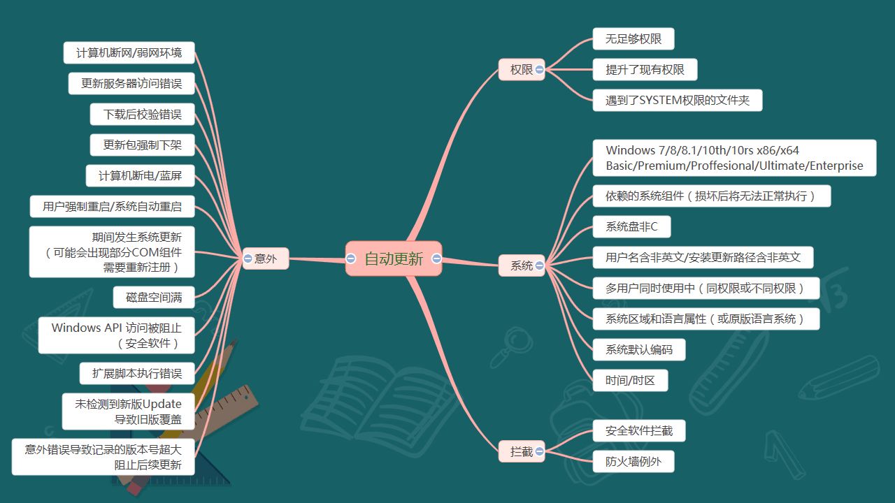

# Windows 客户端软件自动更新服务的开发有哪些需求

我在团队里面也接手了 Windows 客户端软件的自动更新模块，其实这个模块是一个非常庞大的模块，我隔壁有团队在做这个事情。而我需要做的只是去接入而已，在接入的过程中，我也了解到整个自动更新机制需要涉及到的功能

<!--more-->

<!-- CreateTime:2020/11/16 9:29:18 -->

<!-- 草稿 -->

咱先从自动更新服务的地位开始聊起

## 意义

我所在的团队是做产品的，对于产品来说，整个自动更新机制就是命脉级的模块

上面这句话其实是总工大大说的。只要自动更新机制不出问题，软件部分就没有什么大不了的问题，大不了就来一个 HotFix 解决

在我加入团队这几年里面，就有很多次的事故，全部靠着软件自动更新快速发布版本解决问题。客户端软件部分，在发布到用户端上之后，如果发现存在问题，通过自动更新，可以快速在用户端屏蔽问题

## 组成

整个自动更新服务，可以分为两大块，一部分是客户端部分，另一部分是后台部分。这里的后台指的不是后台服务器，而是整个除了客户端之外的部分。包括自动构建服务器，开发流程，测试流程，软件报备，发布控制平台，流量管控，升级监控，以及 CDN 平台等的这部分后台部分

## 稳定性

如果在团队里面定义了自动更新模块是命脉级的，意味着对自动更新模块的在客户端的最核心要求就是稳定性了

假定稳定性没有做好，例如更新效果就和微软的应用商店一样。试试想如下情况

- A: 软件出现大漏洞了，所有用户一打开软件，就会提示 林德熙是逗比 界面
- B: 没关系，赶紧开下一个版本，解决这个问题
- A: 已经开了，但是咱只有千分之一的用户能升级成功

稳定性的需求指的是在开启自动更新的时候，成功更新到新版本的成功率需要很高

此时稳定性有一些前置的要求

- 稳定的 IPC 进程间通讯机制
- 稳定的进程本身
- 可被监控

这些前置的要求的原因分别如下：

要求稳定的 IPC 进程间通讯机制是在于当更新模块和业务应用是拆分为多个进程的时候，如何让业务应用通知更新模块所在的进程进行更新，如果这个机制不够稳定，意味着由业务应用发起的更新请求这个需求在技术实现上是不稳定的

稳定的进程本身是关键，不能说更新模块所在的进程本身不断的挂掉，技术角度基于这一项考虑就有部分语言不推荐使用了

因为更新模块将会放在用户的环境上运行，而用户的环境有十分诡异的环境，也许在测试设备上完全无法了解到的环境将会有很多，因此就需要可被监控的要求，可以将运行情况以及用户环境等上报

在做稳定性的需求的时候，追求的一定不是一次性自动更新成功率，而是总体的。也就是说即使我的自动更新模块有点坑，在用户端需要进行多次的更新，最终才能成功。这个没问题，因为最终结果就是更新成功了，这就可以了。当然，如果给微软应用商店无限长的时间，也许微软的应用商店也能提升不少的成功率

在稳定性上的要求，成功更新到新版本的成功率是需要加上时间限制的，在某个时间内成功更新到新版本的成功率是多少。这个时间的定下和后台部分有所相关，这里还请忽略

成功更新到某个版本的一个前置需求就是更新不会不会进行损坏的更新，例如更新之后缺文件或文件损坏等

## 静默安装

现在大部分的软件，都默认走静默更新。是否有静默更新的需求，其实也取决与产品。但是从技术角度来说，静默更新依然是有必要的，即使产品端没这个需求。毕竟产品上如果没有未经用户同意擅自更新的需求，其实指的是大版本的软件更新而已，大多时候进行小版本的更新是有必要开静默的

什么是静默安装呢？也就是在不经用户同意的情况下，没有感知，升级到某个版本的功能

在软件自动更新的时候，最佳的方法就是不需要经过用户的交互，帮助用户升级软件。在用户下次打开的时候，就能享受到更新的版本

如上面的稳定性的追求上，如果软件支持静默安装，那么稳定性上就不需要过多追求一次性更新的成功率。一次失败了，下一次再来，毕竟对用户来说没有感知

静默安装存在的技术难度是在于文件权限问题，以及由哪个进程进行更新的问题。假定软件是安装到 Program File 文件夹里面，默认这个文件需要管理员权限才能进行写入。因此需要有一个提升权限的进程来进行自动更新的时候的写入，而假定在软件需要更新的时候这个具备权限的进程还没启动，由软件启动这个进程的时候在一些用户设备上，如开启了 UAC 限制的设备上，将会打断用户，需要用户授权才能启动

我所看到的大部分软件的自动更新的安装进程的做法，都是在新建一个服务来实现。启动系统服务的优势在于稳定性比较高，服务挂了会由系统自动启动，大部分情况下都不需要理会服务挂了的情况。同时服务具备权限，可以用来解决权限问题，在后台静默写入

而且服务是属于另一个进程，因此可以在软件还没启动，由自动更新服务进程进行文件的更改

## 下发更新

在进行软件的自动更新，有一个问题是更新的请求由谁发起的问题。假定现在有应用软件，和自动更新服务进程，那么自动更新服务进程如何知道当前需要进行软件的更新？有两个方法，第一个就是应用软件告诉自动更新服务，当前需要更新

第二个方法就是自动更新服务和后台进行通讯，了解当前是否需要更新，以及如何更新

选用第一个方法的优势在于自由和高定制性。当前我所在的集团有大量的软件，这些软件都共用相同的一个自动更新服务进程，毕竟一个软件自己带一个会让用户的设备上开启太多自动更新服务进程。此时自动更新服务的通用性就带来了功能单一的缺点了，有一些特殊的软件需要有自己的特殊规则。如果能让软件告诉自动更新服务进行更新，那么意味着自动更新的部分逻辑可以被带在应用软件中

但是第一个方法存在一个神坑就是当某个版本的软件更新完成之后，出现重大神坑，软件无法启动或执行到应用软件的自动更新逻辑时，那么自动更新服务将收不到来自应用软件的通知更新，因此应用软件将再也不能更新成功

同时第一个方法存在另一个问题就是用户端如果长时间没有打开软件，那么应用软件将会维持旧版本。这对于产品来说是不利的，在用户很久没有使用软件之后的首次使用，是属于用户召回，此时就应该给用户一个良好的体验，否则用户将可能因此而丢失。当然，更新到新版本不一定会给用户一个更好的体验哈，但是大多数的软件都会是期望给召回的用户一个新版本。例如用旧版本有一些兼容性问题，如我从 2013 之后就再也没有打开 QQ 了，而 QQ 如果也不会自动更新到新版本，那在我下次想不开打开 QQ 时用了 2013 版本的 QQ 软件…… 请问此时我对 QQ 的感觉还剩下多少？反过来呢，我打开了新版本的 QQ 一切功能就正常

第二个方法的另一个优势是可以支持紧急的软件更新，这个核心就是紧急修复问题时提供的支持。产品上，有时候会遇到一些可能被行业封杀的问题，这时候就需要有机制可以快速下架或回滚等的功能

例如产品的某个功能带了一副地图出去，然而这个地图不清真，这就玩完了。如果没有提供紧急快速下架等功能，就不好玩了哦，说不定团队明天就可以散了

这两个方法其实可以合在一起，允许后台配置下发以及软件主动请求。后台配置与软件主动请求与下文的灰发机制不冲突，详细还请看下文的灰发机制

假定团队维护的软件数量不多，那么第一个方法也可以不要

另外下发更新的后台配置下发还需要添加判断是否在当前设备上支持下发的功能，例如只给指定的某些设备下发更新某个版本等，这部分可以配合灰发使用

## 代理安装

尽管有后台可以配置下发更新，但是有时候需要做一个特殊的业务，就需要自动更新模块有代理安装的功能了。这个代理安装的工具是必须在有独立的自动更新服务的前提下才有意义的

自动更新服务是一个独立的进程，可以作为服务的形式运行，也可以作为用户进程运行。但有一点确定的，这个自动更新服务进程一定是具备高权限的进程，而且可以认为这个自动更新服务进程一定都在后台运行着

代理安装就是本地的软件通过 IPC 远程进程调用方式让自动更新服务进程协助安装某个软件。实际做法就是如本地需要去某个地方下载某个其他的软件同时安装上，但是软件本身没有具备高权限用来安装，又不期望打断用户（大部分用户都是小白，弹出 UAC 会让用户很迷）此时就需要有一个高权限的进程来协助安装。或者本地已经从其他途径获取到了安装包，但是本地软件没有权限，需要通过代理安装的方法使用自动更新服务进程协助安装

这一个功能相对来说有一些争议，这是从产品角度来说的。意味着我可以愉快通过这个功能给用户安装全家桶。咱在这里不讨论产品上以及道德上，就看自己团队的产品大佬的想法了。但是这个代理安装功能正经的使用是可以用来提升稳定性的，和优化用户体验的

这个需求更多的是技术需求而不是产品端的，意义就为了提升稳定性

用实际的例子来聊这个功能点的作用

### 切换下载源

我遇到一些用户，这些用户的网络被切到了小运营商，这些用户无法从我的 CDN 拉下任何的数据。此时我可以识别到这一点，让应用软件自动带入一个备份（当然了，这个更改是通过客服的方式给到这些用户的）可以从我的另一个备份的 CDN 进行拉取更新包

假定没有代理安装功能，那么我就需要全量更新自动更新服务，这样的做法很伤。而在有代理安装功能的辅助下，我只需要针对这部分特定的用户，在我的受影响的一个软件上（这些用户就只用我一个软件）加入备份 CDN 拉取逻辑，然后依赖代理安装的功能，从而达到不更改自动更新模块的代码，实现这部分用户的平滑修复

### 特殊网络下载配置

我遇到的另一些用户是一些有趣的学校，这部分学校有自己搭建的网络（表示我现在还无法理解具体是什么意思）而无法连接我的服务器上，在这些学校上的大流量访问需要配置一个代理到学校的一台专门的服务器才能访问，否则分分钟就将用户的电脑断网了

而我如果让我的自动更新服务模块加上配置网络代理的功能，那将会是一个神坑，将会极大降低自动更新服务模块的稳定性

但是有了代理安装的功能，就有了更好的方法。我给了这些学校的软件上加了另一个特别的进程，这个进程是专门通过配置代理去拉取更新包，将更新包下载到本地，然后调用自动更新服务的代理安装功能，安装本地的更新包，来实现自动更新的

从软件工程上，我做的是对已有的扩展，而不是更改已有的。意味着整体稳定性不会因此而下降

这个例子不是很好哈，因为我写着删除了一大部分的信息，单纯靠上面的这些信息其实有点难了解为什么选择这个方法会更好

### 内网加速下载

同样的，还是学校的网络环境，只是当前说的是大部分的学校。我是做教育应用的，会遇到有大量的在校的用户设备，在学校里面大部分的学校都有校园网，换句话说就是一个大局域网

局域网的一个大优势就是局域网快传，不用占用我服务器带宽和流量，速度有超级快

我所在的团队有另一个服务是 P2P 下载服务，这个服务刚好在有局域网的情况下能发挥出超级强力的作用。我通过在局域网内利用 P2P 服务下载到了更新包，此时使用代理安装就可以愉快的实现了利用内网进行软件的自动更新功能。而一切内网自动更新的细节，包括 P2P 本身以及安全性等，都将和自动更新服务无关，这部分逻辑拆分为两个服务和一个应用上，保持了自动更新服务的逻辑简单，从而也就让自动更新服务能做到稳定

上面说的利用内网进行自动更新是由两个服务和一个应用组成的，这里的两个服务就是 自动更新服务和 P2P 下载服务，这两个服务都是追求简单加稳定的。而一个应用就是通过调用 P2P 下载服务下载更新包，调用自动更新服务的代理安装的实际执行逻辑的应用，这个应用将会管更新包下载的版本以及安全性等问题

这里还需要回答另一个问题是如上面这样的拆分方法是否会因为服务比较多而降低总体稳定性？其实不会。因为如自动更新服务等服务的要求都是追求稳定性的，只要功能简单，逻辑简单，经过一段时间的磨合，是能将服务做的特别稳定的。而新加的特别的业务端的功能本身自己是不稳定的，如利用内网进行自动更新的功能。但这个功能调用自动更新等服务本文，调用部分以及服务都是稳定的，因此整体的不稳定仅仅只是新加的业务端功能而已，而不会因为将业务端的功能做到了服务本身而降低服务的稳定性。优先考虑扩展而不是更改逻辑

## 配置环境

自动更新时需要提供配置环境的功能，设置注册表，开启防火墙等

这部分的需求不一而足，从技术角度有两个实现方法，第一个就是更新的时候提供配置清单，由更新服务读取清单来实现功能

第二个方法就是交给应用自身，在自动更新完成之后，调用应用里面特殊的逻辑进行配置环境

在我当前的团队里面选用的上第二个方法，毕竟啥诡异的需求都有，依赖自动更新服务程序的配置是很难满足需求的。而选用第一个方法可以减少软件重复逻辑的编写，但是会带来让自动更新模块的复杂度。这和第一个需求稳定性是冲突的，可以认为想要稳定性就一定需要有足够简单的功能

从开发者的角度来说，选用配置会添加一些私有知识的学习成本，特别是存在一些不正交的配置的时候，以及存在相对路径的配置的时候，这部分配置的难度将会是比较高的，而且使用配置也不利于自动更新服务的兼容性。如依然有古老的项目使用了古老的配置方式，而自动更新服务就需要一直兼容这些古老的配置方法

## 增量更新

其实对于大土豪来说，流量是不用考虑的，带宽也是不用考虑的。因此增量更新的意义也就不大了

因此对于大土豪或者很小的用户量场景就不用考虑增量更新了

这里的增量更新也称差量更新，通过尽可能利用本地已有的信息，下载尽可能少的信息，构建出更新的版本

### 优点

因为通过差量更新的方式，可以减少下载的大小，因此有以下优点

- 减少服务器端流量或带宽的使用量
- 提升下载的速度

这里需要说明的是服务器端流量或带宽是服务器端的不同策略，假定是通过 CDN 服务的话，使用流量计费方式，意味着下载多少流量就需要给多少钱。而通过带宽计费方式意味着无论下载多少流量，计费只是算使用的值

如果用户量比较大，而且有灰发机制，同时又不是大土豪，此时选择带宽计费方式会比较省钱。哈哈，自己算一下就知道了

进行增量更新有两个方式，这两个方式不冲突，可以一起配合使用

### 文件差量更新

这是比较推荐第一步先做的，通过文件差量更新就可以减少大量的下载量了。多个版本之间，如果版本相差比较小，那么多个版本之间的差异文件一般不会很多。特别是在 dotnet core 下的独立发布的 WPF 应用，框架部分的文件在多个软件版本之间基本都是相同的

文件差量更新的做法就是仅从后台下载最新版本的差量文件，也就说从后台下载只有新版本有的问题，而新版本中如包含了当前版本已存在的文件，则不需要重复的下载

从后台下载最新版本的差量文件之后，再根据本地当前版本的文件，拼装出新版本的文件

### 二进制差量更新

而更进一步的，其实有很多的 dll 等文件，这些文件在不同版本之间的文件二进制差异很小。如果只是使用文件的差量更新，相当于对一个 dll 更改一行代码就需要整个 dll 都进行更新

采用二进制差量更新的意义就在于只从后台下载当前版本和最新版本的差量文件中，这些差量文件的二进制差异部分。采用此方法可以让发布补丁无忧，在发布补丁的时候，也许有更改几个 dll 文件，但是更改内容一定不多，此时采用二进制差异就可以极大减少下载量，提升更新速度和减少流量和带宽的使用

现在大部分的大软件，如 QQ 等，都会在自动更新的时候都会使用文件差量更新和二进制差量更新一起使用的策略。当然了，这些大厂不是为了省钱，只是为了提升用户端的下载速度而已。可以想象在更新了一个版本的时候，其实用户端更新的数据量其实就和这两个版本之前添加的代码量和资源差不多，这个速度是十分快的，特别是带足了依赖的时候

### 确定性构建

想要进行增量更新，需要构建模块支持，确定性构建就是在代码没有变更的时候，构建输出的 DLL 或 Exe 一定是不变的。对应的，还应确定性混淆，有一些代码接入了混淆过程，要求在代码没有变更的时候，最后混淆输出的文件也没有变更

## 热更新

不同于冷更新方式，热更新可以软件不重启的情况下进行更新

## 异常情况

如下图

<!--  -->

## 后台

默认最简单的后台，其实靠一个静态资源文件就能实现，或者说一个简单的 API 接口即可。但一个复杂的后台还是有很多需要实现的功能的，例如支持灰度发布，例如支持区分自动升级和手动升级。除了发布控制的功能之外，还需要承接起与各个平台的对接功能等，包括跑起来整个 DevOps 等

## 发布控制

发布控制是整个后台的核心，最简单的后台也仅仅只是需要发布控制这一个功能。当然最简单的后台的控制指的是控制新版本发布，只是告诉客户端有新版本。而稍微成熟一点的后台就需要有以下的功能

### 灰度发布

大部分的成熟的产品软件都需要加上灰度发布的功能，灰度发布的功能又称灰发，也就是发布的时候满脸灰哈。灰度发布这个功能可以理解为在有新版本发布的时候，不是一下就给全量的用户推送，而是先给定一定的范围的用户进行推送，然后逐步修改推送的量。这样就能实现在新版本发布的时候，有一部分用户开始用上了新版本，相当于这部分用户参与了最后的测试。这样做的优势是可以让新版本有足够的测试，在用户端能发现更多的问题，用来解决全量发布版本的时候发现有大坑而出现的更大的坑的问题

灰度发布的功能相对复杂，因为灰度发布一般都有如下的需求

**自动灰度**

可以设置为如果没有问题的话，先根据用户数量发布，然后根据比例，自动逐步提升比例

这部分是业务相关的，可以减少太多的人工控制。甚至可以利用上数据上报模块，通过某些数据设置警报，达到报警时自动停止灰度发布

**根据 Ip 或地区灰度发布**

有一些产品是和用户所在的地方相关的，这部分功能是推荐在灰度发布的时候，优先让某个地方的用户先使用起来。因此就需要有根据的进行灰度发布

而另一些产品上的考虑是需要测试不同的地方的用户的使用方法，此时就期望是全国均匀进行灰度发布的

**根据版本进行灰度发布**

有一些软件有这样的要求，如果用户端已经是足够新的版本了，那么就给他更多尝新的功能。优先给某些版本进行灰度发布

**禁用某些用户的更新**

因为进行灰度发布，其实就是对新功能的稳定性的信心不足。当然信心不足是好事哈。此时不能对一些金主进行灰度测试，不然就是一脸灰（发布失败了，被投诉）哈

需要后台支持设置某些用户不加入灰度发布状态

**静默灰度和主动灰度比例**

有一部分是用户主动点击请求更新的，这部分用户可以尝试给一定的比例采用不同的版本。甚至是如果有用户多次主动请求更新，但前面几次因为不在更新策略范围内而告诉用户当前没有更新，或者被限制流量而没有更新，在判断到用户又再次多次点击，念在用户如此诚心，咱也就需要给用户最新的版本啦。值得一说的是，有用户多次主动请求更新就给最新版本这个策略在我当前的团队里面是被毙掉的功能，原因只有一个是就是不可控，谁知道德熙这个逗比将静默更新报告成为用户主动更新了

静默的更新的时候，也就是软件后台默默请求更新的时候，可以逐量推送更新信息，这是为了保持流量的稳定

但最简单的做法是在进行灰发的时候，不区分是否静默还是主动的请求，都按照如上策略进行灰度发布

**根据设备进行灰度发布**

在请求后台更新的时候，客户端软件需要带上一些硬件设备信息，在后台可以根据这部分硬件设备信息进行灰度发布。一个例子是，我开发了一个吃性能的功能，例如在软件中添加了一个叫星系的功能，这是一个在 WPF 中开大 3D 模型的功能，但我又没有瓜哥的能力。我不知道这个功能发布出去的时候，有多少用户是能用上的。此时可以先灰度发布一批用户，要求这一批的用户的设备足够好，然后看看用户的反馈。再逐步灰度一些设备性能更差的，再看看用户的反馈。如果性能最好的那一批都还在喷我，那我就需要重新优化性能了

值得一提的是，这个功能对我现在的业务来说是特别有用的，原因是因为我所在团队的用户群里面的，有一些用户使用的是团队里面自己特别供应的设备。好吧，这句话太过魔幻，不如理解成为 OEM 厂商算了，如果用户是使用自家供应的设备，那么可以灰发一些特别的功能到这些设备上等

**灰度发布功能**

其实这个并非是自动更新的逻辑，灰度发布功能的意思就是所有的用户其实都有这个功能，但是功能需要通过后台控制的开关才能打开。灰度发布功能是控制只有某些用户才能打开这个功能进行尝试

这个和自动更新沾边的是用在节日活动里面，节日活动是需要预埋的，不可能节日当天才做自动更新。而此时期望试水，让部分用户在节日的时候使用特殊的功能，此时就需要用上灰度发布功能了。当然了，这个也可以算是 AB 测试了

本质上这个不算是自动更新的逻辑，但是我还是写到了自动更新模块里面了

**建立灰度发布圈**

第一个圈是开发者圈，核心是用来发现一些逗比问题，以及测试灰度发布机制和自动更新机制

第二个圈是园区，公司所在的园区可以优先灰度发布，有些问题内部就可以找到。当然，需要记得有一些大佬是不能给他上灰度发布的，不然明天团队就gg了

第三个圈是选择了测试版的用户，这部分用户喜欢尝鲜，可以优先推送。而且这部分用户一般都会建立联系，有问题能快速收到反馈

第四个圈是优先发布所在的城市，因为如果出现了问题，道歉比较简单

第五个圈是国内优先，原因是时区是相同的，至少不用当前半夜被叫醒

### 流量控制

对于很多大厂来说流量都不是钱。但是对于小厂商来说，流量费还是很贵的哈。假定进行自动升级使用的流量计费是按照使用量，也就是下载几个 G 就收多少钱的，那么可以忽略此功能。此功能仅仅是按照带宽收费的才有用，在根据每月最大带宽进行收费时，理论上是期望进行自动更新能做到比较平均，这样就能降低最大带宽

当然，对于更小的工作室团队，利用自己搭建的服务器来做自动更新的，也适合这一条规则。因此自己的服务器带宽有限，与其让一堆用户都用很慢的速度拉下来更新版本，不如优先让一部分用户以比较快的速度拉下来。因为有一个定律是用户在进行自动更新的时间耗时越长，失败率也就越高，例如一个更新是一分钟，另一个更新是一小时，那么一小时内也许就关机了，更新失败

对于流量的控制，推荐是分开自动更新和手动更新。自动更新的意思就是软件自己发起的更新，此时相当于静默的软件申请更新。如果此时发现带宽占用比较多，那么拒绝更新也是可以的，此时对于用户来说感知很少。但如果是用户手动发起的更新，此时应该排入更高的优先级，因为此时的用户就是有预想进行更新，应该优先给用户更新

满足以上的做法是可以通过区分流量桶的实现方式，让自动更新放在一个流量桶里面，而手动更新放在另一个流量桶里面，通过桶的算法来实现。当然了本文只是提需求，不会涉及特别具体的技术细节，以上只是参考

另外，对于自动更新限制流量的坑，需要小心一点的是，即使在发现带宽占用比较多的时候，而且是软件主动发起的自动更新，依然推荐先判断一下版本号。如果软件的版本号落后了当前版本足够多了，那么需要给此客户端排入更高的优先级。一个推荐的策略是客户端版本号足够新的以及版本号足够旧的，都排入自动更新的优先级更高

在流量控制上，其实和灰度发布不是冲突的，先进入灰度发布策略之后，再进入流量控制

### 版本控制

有时候产品需要做一些定制，此时将会发出一些定制的版本，这些版本有着特殊的升级需求。因此就需要后台支持配置策略，例如当前的版本更新是支持哪些版本更新上来的

例如有 1 2 两个版本，可以配置到版本 3 的只有当前是 1 版本的才可以升级，原本是 2 版本的不要升级

版本控制的意义在于，可以进行一些定制化的需求，例如给某某厂商进行定制某个功能，这个功能对应的版本将很长时间都不升级到最新版本。而到了某个合同时间，就将版本升级过来

或者说在进行某些激进的产品功能，可以一条线让某些用户体验上。例如开发了激进的功能，让小 A 的设备上安装上了这个激进版本的版本号是 10 的软件。在经过了一段时间的开发，在此激进的功能上进行迭代，此时用过了激进版本的小 A 无疑是更好的测试选手，于是就期望只是给 10 版本的软件更新到最新的 11 版本。而对于其他的版本来说，暂时不给更新

这就是需要版本控制的意义

### 测试设备的推送

在测试中，还需要让测试的小姐姐用到一些内部测试专用的版本。这就要求后台可以支持提供测试设备的推送功能，最简单的做法就是配置客户端 mac 地址白名单，满足一定条件的客户端请求就可以推送某些版本，例如测试专用版本

在发布之前，一般需要先让测试小姐姐用上预发布的版本，此时的环境应该切换到正式的环境。但是这部分的发布功能也仅仅限制给测试部分，因此需要后台支持识别测试设备，在预发布的时候可以仅推送给测试设备，而不会推送给到用户

## 平台对接

整个软件更新后台，可以认为是软件开发阶段的终点，因为进入了自动更新后台，就意味着软件即将进入到用户端。作为软件开发阶段的终点，将需要和很多平台进行对接，对接可以分为两个部分，一个是前部分，另一个是后部分。前部分指的是开发阶段的前面部分，例如测试人员的测试平台，在测试完成之后进行发布时，需要从测试通过的测试报告里面获取通过的版本。而后部分指的是对接其他外部的平台，例如各大应用商店以及 CDN 分发等

### 测试平台对接

对于大部分团队，其实测试平台的对接只是后台和人的对接，大部分都是手工的。在测试小姐姐测试通过之后，手动将更新版本的包扔到后台就完成了。这个做法在我的团队里面玩了好多年了。随着自动化的浪潮，团队里面也退出了测试平台，测试平台就是另一个话题了，核心功能就是让测试的过程的流程化部分放在某个平台上进行管理。而这个平台的输出终点就是自动更新的后台了

有测试平台的辅助下，能够解决测试小姐姐不小心手动上传错包的问题。可以通过测试平台保证发送到更新后台的软件包是测试小姐姐所通过的包

### 监控平台对接

理论上成熟的产品软件都有接入监控，包括异常监控，软件性能监控等。这里的软件监控是另一个很大的话题，咱先假定有这样一个平台即可

在自动更新后台拿到更新包之后，就需要去推送给监控平台消息，告诉监控平台即将发布的版本。理论上对于新发布的版本，都有更为严苛监控策略

例如说在新版本发布之后，如果发现异常率上升，或者发现有很多新的异常，那么这个版本说不定灰发就需要停下了。而这些都离不开平台之间的打通。也许不是真的由自动更新后台去通知，但是整个后台是需要有这样的功能

那为什么不让客户端上报版本号时，监控平台根据版本号了解这是新版本呢？理论上监控平台可以根据新收到的更新版本的版本号来了解这是新发布版本，但是这样做的坑有两个：第一个是监控平台理论上不止一个服务，多个服务之间应该是不会同步的。第二个就是客户端上报的信息是不可信的

因为在没有详细说明监控平台的功能的情况下，其实我无法描述出这部分功能的重要性

### 软件报备

上面部分其实都是对内的部分的对接，这软件报备其实就是对外的。对于客户端软件来说，特别是 Windows 下的 PC 端软件，有一个大坑就是杀毒软件。如何让杀毒软件不干掉自己可不是一个技术问题，最好的做法请销售哥哥和各个安全软件大厂的大佬们喝喝酒，例如 360 家的和腾讯家的，给这些大佬们上交保护费

在上交了保护费之后，大佬们会给一个令牌，而咱发布的软件，在发布之前就需要派出新版本的小弟去拿着令牌告诉大佬们，有新版本的小弟准备发布了，大佬们行行好，放过小弟吧

在国内需要经过的报备核心有 360 和金山两个，国外的话，可以尝试加入微软的报备。但是国外的报备远远不如购买证书进行软件签名好用

### 支持差分包

后台部分，需要对接构建打包平台，在准备发布之间，根据上文的增量更新需求，制作当前版本与旧版本多个版本之间的差分。需要后台支持应用定制差分逻辑，例如部分文件是文件级差分，部分文件是二进制差分，甚至应用端业务需求变更文件路径差分等等

让后台支持应用定制的另一个优势在于可以比较方便，让比较旧的版本，不参与差分逻辑。因为比较旧的版本，文件变动太多，此时做差分与不做，差别不大，那不如不做差分

## 参考

[PC客户端软件升级方式简史_danxuezx的专栏-CSDN博客](https://blog.csdn.net/danxuezx/article/details/83784318 )

[windows下关于程序的自动更新方案-CSDN博客_windows程序自动升级方案](https://blog.csdn.net/qq_37059136/article/details/82377786 )

https://github.com/google/omaha

 本作品采用<a rel="license" href="http://creativecommons.org/licenses/by-nc-sa/4.0/">知识共享署名-非商业性使用-相同方式共享 4.0 国际许可协议</a>进行许可。欢迎转载、使用、重新发布，但务必保留文章署名[林德熙](http://blog.csdn.net/lindexi_gd)(包含链接:http://blog.csdn.net/lindexi_gd )，不得用于商业目的，基于本文修改后的作品务必以相同的许可发布。如有任何疑问，请与我[联系](mailto:lindexi_gd@163.com)。