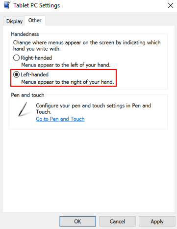

# Windows 通过编辑注册表设置左右手使用习惯更改 Popup 弹出位置

本文告诉大家如何在通过更改注册表的设置，从而更改平板电脑设置 Tablet PC Settings 的左右手使用习惯 Handedness 的惯用左手和惯用右手选项

<!--more-->

<!-- 发布 -->

在用户端，可以通过在运行里面，输入 `shell:::{80F3F1D5-FECA-45F3-BC32-752C152E456E}` 按下回车，进入平板电脑设置界面，中文版和英文版界面分别如下

<!--  -->

<!--  -->

这个选项将会影响 WPF 的 Popup 弹出的默认方向位置，以及所有的菜单的弹出方向位置

通过注册表修改设置的方式是在运行里输入 `regedit` 打开注册表编辑，进入 `HKEY_CURRENT_USER\SOFTWARE\Microsoft\Windows NT\CurrentVersion\Windows` 路径，修改 `MenuDropAlignment` 选项

默认的 `MenuDropAlignment` 选项是 0 的值，不同的值对应如下

- 0 ： 默认值，惯用左手
- 1 ： 惯用右手

可通过更改 `HKEY_CURRENT_USER\SOFTWARE\Microsoft\Windows NT\CurrentVersion\Windows\MenuDropAlignment` 项从而修改用户设置，修改之后，需要重启才能生效

更多请看 [Popup element are reversed left and right in Windows 11 · Issue #5944 · dotnet/wpf](https://github.com/dotnet/wpf/issues/5944 )

 本作品采用<a rel="license" href="http://creativecommons.org/licenses/by-nc-sa/4.0/">知识共享署名-非商业性使用-相同方式共享 4.0 国际许可协议</a>进行许可。欢迎转载、使用、重新发布，但务必保留文章署名[林德熙](http://blog.csdn.net/lindexi_gd)(包含链接:http://blog.csdn.net/lindexi_gd )，不得用于商业目的，基于本文修改后的作品务必以相同的许可发布。如有任何疑问，请与我[联系](mailto:lindexi_gd@163.com)。