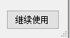
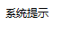
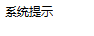

# Winforms 可能遇到的 1000 个问题

<!--more-->
<!-- CreateTime:2018/10/15 9:35:15 -->

<!-- csdn -->
<!-- 标签：C# -->

## 去掉最大化和最小化按钮

如果需要去掉最大化和最小化按钮，只需要设置 MinimizeBox 或 MaximizeBox 为 false 请看下面代码

```csharp
            MinimizeBox = false; // 不显示最小化按钮
            MaximizeBox = false; // 不显示最大化按钮
```

下面的代码需要写在 Form 内

```csharp
        public Form1()
        {
        	MinimizeBox = false;
            MaximizeBox = false;
        }
```

下面的图片是原来的值

<!--  -->


下面的图片是修改之后

<!--  -->


具体请看 https://stackoverflow.com/a/3025944/6116637

## 使用系统的图标

通过 SystemIcons 可以使用系统的图标，首先需要在界面放一个 PictureBox 控件，我修改这个控件的命名 `_image` 通过下面代码可以让这个控件显示系统提示错误的图标

```csharp
            _image.Image = SystemIcons.Error.ToBitmap();
```

<!--  -->


参见 https://stackoverflow.com/a/4868459/6116637

## 禁止用户修改窗口大小

只需要设置 FormBorderStyle 为 FixedSingle 就可以让用户无法拖动窗口大小，通过 SizeGripStyle 可以防止用户拖动右下角按钮修改窗口

```csharp
            SizeGripStyle = SizeGripStyle.Hide;
            FormBorderStyle = FormBorderStyle.FixedSingle;
```

同样需要写在 Form 类内

通过 `SizeGripStyle = SizeGripStyle.Show;` 可以从下面图片看到软件的右下角有一个可以拖动的按钮，用户可以拖动按钮让窗体变大。修改这个值 `SizeGripStyle.Hide` 让用户无法修改窗体大小 

<!--  -->


具体请看 https://stackoverflow.com/a/5416394/6116637

## 隐藏标题栏的图标

在 Form 类内修改 ShowIcon 可以修改图标

```csharp
        public Form1()
        {
        	this.ShowIcon = false;
        }
```

默认软件的左上角是有图标，请看下图

<!--  -->


设置为 false 就看不到

<!--  -->


<a rel="license" href="http://creativecommons.org/licenses/by-nc-sa/4.0/"></a><br />本作品采用<a rel="license" href="http://creativecommons.org/licenses/by-nc-sa/4.0/">知识共享署名-非商业性使用-相同方式共享 4.0 国际许可协议</a>进行许可。欢迎转载、使用、重新发布，但务必保留文章署名[林德熙](http://blog.csdn.net/lindexi_gd)(包含链接:http://blog.csdn.net/lindexi_gd )，不得用于商业目的，基于本文修改后的作品务必以相同的许可发布。如有任何疑问，请与我[联系](mailto:lindexi_gd@163.com)。
