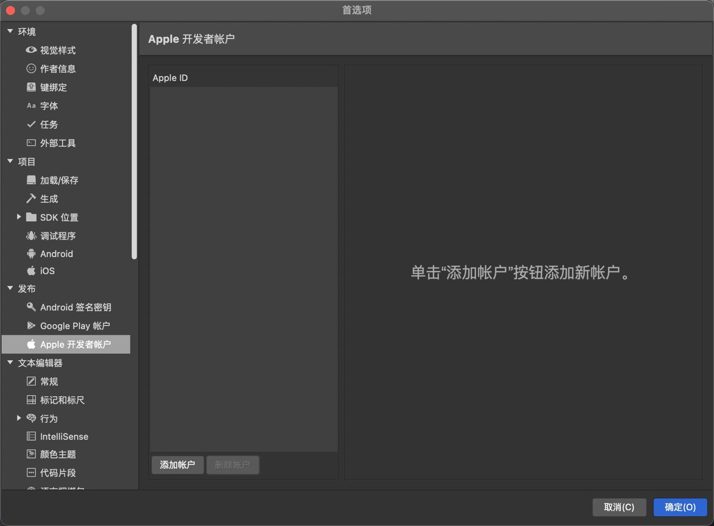
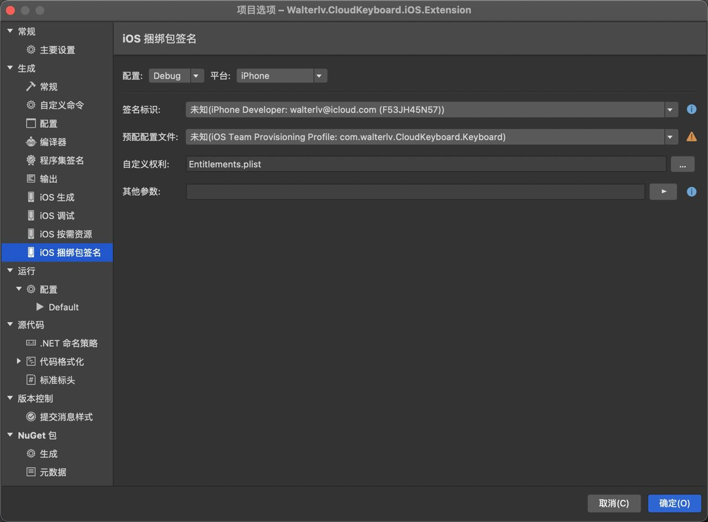

# Xamarin iOS 部署应用提示 iOS code signing key 失败

在部署 iOS 应用的时候，如果是拉别人的代码，因为被使用了别人的签名，就会提示 Error: iOS code signing key 'iPhone Developer: lindexi@icloud.com (F56JH45N57)' not found in keychain. 部署失败。解决方法是替换为自己的账号

<!--more-->

<!-- 标签：Xamarin -->
<!-- 发布 -->

原因就是在 csproj 上的 CodesignProvision 属性设置的是别人的签名，可以通过替换为自己的账号解决

在 [Xamarin 从零开始部署 iOS 上的 Walterlv.CloudKeyboard 应用](https://blog.lindexi.com/post/Xamarin-%E4%BB%8E%E9%9B%B6%E5%BC%80%E5%A7%8B%E9%83%A8%E7%BD%B2-iOS-%E4%B8%8A%E7%9A%84-Walterlv.CloudKeyboard-%E5%BA%94%E7%94%A8.html ) 博客里面有提到这个问题，只是这篇博客的内容很多，因此就再写一篇

先进入 Mac 版本的 VisualStudio 的首选项的账号里面，添加自己的苹果开发者账户

<!--  -->

添加之后选择自己的账号，然后点击确定

<!--  -->

接着进入项目中，编辑选项，进入 iOS 捆绑包签名这里，选择好签名标识和预配配置文件

<!--  -->

如果不知道如何设置预配配置文件，请看 [Xamarin iOS 切换开发者账号之后的签名标识和预配配置文件更新方法](https://blog.lindexi.com/post/Xamarin-iOS-%E5%88%87%E6%8D%A2%E5%BC%80%E5%8F%91%E8%80%85%E8%B4%A6%E5%8F%B7%E4%B9%8B%E5%90%8E%E7%9A%84%E7%AD%BE%E5%90%8D%E6%A0%87%E8%AF%86%E5%92%8C%E9%A2%84%E9%85%8D%E9%85%8D%E7%BD%AE%E6%96%87%E4%BB%B6%E6%9B%B4%E6%96%B0%E6%96%B9%E6%B3%95.html )

 本作品采用<a rel="license" href="http://creativecommons.org/licenses/by-nc-sa/4.0/">知识共享署名-非商业性使用-相同方式共享 4.0 国际许可协议</a>进行许可。欢迎转载、使用、重新发布，但务必保留文章署名[林德熙](http://blog.csdn.net/lindexi_gd)(包含链接:http://blog.csdn.net/lindexi_gd )，不得用于商业目的，基于本文修改后的作品务必以相同的许可发布。如有任何疑问，请与我[联系](mailto:lindexi_gd@163.com)。