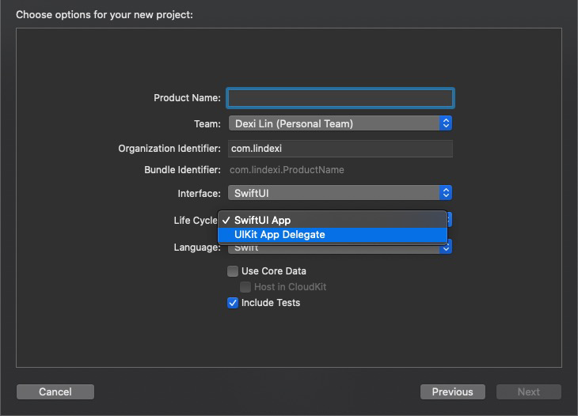

# Xamarin iOS 部署版本大于手机的系统版本

我觉得苹果肯定会坑我，如果我敢更新我的手机系统的话。苹果觉得像我这样的开发者就应该拖出去打靶，整个手机没几个应用是从应用商店下载的。但是作为开发者，我在使用 Xamarin 部署我的云输入法，在第一步创建的时候需要我使用 XCode 新建一个项目，而新建的项目默认都是需要使用更新版本的系统，此时部署将会失败。本文告诉大家一个简单的方法解决这个问题

<!--more-->


<!-- CreateTime:2020/10/26 10:18:44 -->

<!-- 发布 -->

如我师傅在 [使用 Xamarin 在 iOS 真机上部署应用进行调试](https://blog.walterlv.com/post/deploy-and-debug-ios-app-using-xamarin.html) 博客上讲的，苹果为了提升开发者门槛，限制了 VS 创建应用的权限。苹果：这不是我说的，你不要瞎说

在使用 VS 部署应用之前，需要先在 XCode 中新建一个空白 iOS 项目，细节还请看  [使用 Xamarin 在 iOS 真机上部署应用进行调试](https://blog.walterlv.com/post/deploy-and-debug-ios-app-using-xamarin.html) 

而新建的项目在 2020.10 时，将使用 14.0 的系统。但我的手机是 13.1.2 版本，我不想升级系统，强行选择手机然后部署将会提示下面代码

```
lindexi’s iOS 13.1.2 doesn’t match cloudkeyboard.app’s iOS 14.0 deployment target. Upgrade lindexi’s iOS version or lower cloudkeyboard.app’s deployment target.
```

<!--  -->


一个简单的解决方法就是使用文本编辑工具将 iOS 项目代码里面所有的 14.0 替换为 13.1 就可以了

如果替换之后，发现跑不过，如提示 `@main` 是新版本才创建的功能，那一定是你的项目创建的模版选错了

<!--  -->


要求选择 UIKit App Delegate 才可以


<a rel="license" href="http://creativecommons.org/licenses/by-nc-sa/4.0/"></a><br />本作品采用<a rel="license" href="http://creativecommons.org/licenses/by-nc-sa/4.0/">知识共享署名-非商业性使用-相同方式共享 4.0 国际许可协议</a>进行许可。欢迎转载、使用、重新发布，但务必保留文章署名[林德熙](http://blog.csdn.net/lindexi_gd)(包含链接:http://blog.csdn.net/lindexi_gd )，不得用于商业目的，基于本文修改后的作品务必以相同的许可发布。如有任何疑问，请与我[联系](mailto:lindexi_gd@163.com)。