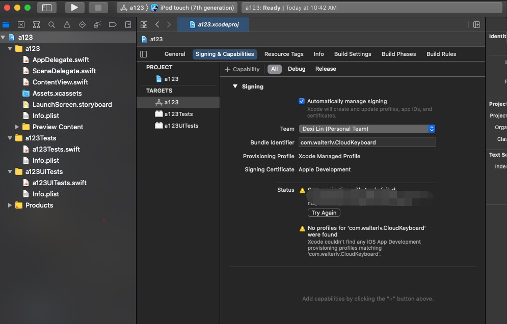
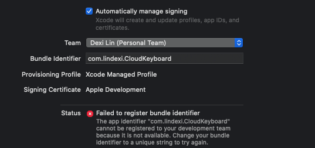

# Xamarin iOS 部署项目提示 Failed to register bundle identifier 失败

这是我在开始部署其他小伙伴的 Xamarin 项目时，在 VS 上提示的失败如下： Failed to register bundle identifier: The app identifier "com.walterlv.CloudKeyboard" cannot be registered to your development team because it is not available. Change your bundle identifier to a unique string to try again 。 这个提示的提示就是 Bundle Identifier 不对，原因有很多个，本文将一一告诉你

<!--more-->


<!-- CreateTime:2020/10/26 10:43:52 -->
<!-- 标签：Xamarin -->


在 iOS 上有 Bundle Identifier 的概念，细节请看 [苹果官网](https://developer.apple.com/documentation/appstoreconnectapi/bundle_ids) 以及申请方式请看 [iOS项目的Bundle identifier的申请](https://www.jianshu.com/p/979f58f2b9e3) 这部分的知识苹果更新很快，本文写在 2020.10 如果你阅读本文时的时间距离本文写的时间太远了，还请小心，本文有些知识也许被苹果改了

在 VS 上部署其他小伙伴的 Xamarin 项目的时候，我推荐是更改对方的 Bundle Identifier 用来解决 `Failed to register bundle identifier: The app identifier "com.walterlv.CloudKeyboard" cannot be registered to your development team because it is not available. Change your bundle identifier to a unique string to try again ` 这样的问题，或者你加入到他的 Team 里面

在 [使用 Xamarin 在 iOS 真机上部署应用进行调试](https://blog.walterlv.com/post/deploy-and-debug-ios-app-using-xamarin.html) 博客里面告诉大家，在部署 Xamarin 之前需要使用 XCode 新建一个空白项目

在新建的空白项目的项目名依然可以比较随意写入，但是在设置里面的 Bundle Identifier 的更改就有一定的要求了，这一段是对应在 [使用 Xamarin 在 iOS 真机上部署应用进行调试](https://blog.walterlv.com/post/deploy-and-debug-ios-app-using-xamarin.html) 博客的 `*[重要] 修改 Bundle Identifier` 这一节中

这里的 `com.walterlv.CloudKeyboard` 是要求在 walterlv 组织下的哦，如果我没有在他的 Team 下，我的组织是 `lindexi-gd` 组织，那么在 `*[重要] 修改 Bundle Identifier` 这一节中的 Bundle Identifier 写  `com.walterlv.CloudKeyboard` 时将会因为组织名不对而失败

```
No profiles for 'com.walterlv.CloudKeyboard' were found
Xcode couldn't find any iOS App Development provisioning profiles matching 'com.walterlv.CloudKeyboard'
```

<!--  -->


快速的解决方法是修改 Bundle Identifier 的值，将 `com.walterlv` 修改为 `com.lindexi-gd` 的值，同时回到 Xamarin 项目里面，做同样的更改

另外这个 Bundle Identifier 谨慎修改，如果没有给苹果交保护费，那在一周内可使用的不同的  Bundle Identifier 只有10个，如果超过了会提示 `Your maximum App ID limit has been reached. You may create up to 10 App IDs every 7 days.` 的代码

<!--  -->


<a rel="license" href="http://creativecommons.org/licenses/by-nc-sa/4.0/"></a><br />本作品采用<a rel="license" href="http://creativecommons.org/licenses/by-nc-sa/4.0/">知识共享署名-非商业性使用-相同方式共享 4.0 国际许可协议</a>进行许可。欢迎转载、使用、重新发布，但务必保留文章署名[林德熙](http://blog.csdn.net/lindexi_gd)(包含链接:http://blog.csdn.net/lindexi_gd )，不得用于商业目的，基于本文修改后的作品务必以相同的许可发布。如有任何疑问，请与我[联系](mailto:lindexi_gd@163.com)。