# Xamarin 从零开始部署 iOS 上的 Walterlv.CloudKeyboard 应用

本文将告诉大家如何从零开始在 iOS 上部署 Walterlv.CloudKeyboard 应用。这个 Walterlv.CloudKeyboard 应用是一个云输入法应用，在 GitHub 完全开源，采用 Xamarin 开发，用途是让手机接收电脑端的打字输入的输入法。因为我没有在 iOS 上找到任何一款稍微能用的输入法，因此只能拜托太子帮我开发一款应用了。太子很给力，帮我开发完成了，但现在的问题就是我如何在我的手机上部署。本文将记录我的部署步骤

<!--more-->


<!-- CreateTime:2020/11/3 20:05:54 -->
<!-- 标签：Xamarin -->


太子说：才不是从零开始，第一步就可以放弃，因为第一步是需要去买一台 mac 设备。然后第二步申请开发者，受限于网络，又能让一波开发者放弃了

这部分内容会被苹果不断改改改，因此在阅读本文的时候，请注意你的右下角时间。我写本文的时候是在 2020.11.03 如果你的当前时间距离我写的时间太远了，那么还请小心

假定现在有一台 mac 设备，嗯，我是没有的，于是我就去偷了太子的设备，毕竟他帮我开发了 Walterlv.CloudKeyboard 应用，免费开发应用送设备，听起来逻辑是对的

然后假定现在有一个开发者账号，此时才是真的开始步骤

先通过苹果的应用商店，花费3天的时候下载和安装完成 XCode 开发工具…… 是不是3天，取决于网速

打开 XCode 点击新建应用


<!-- 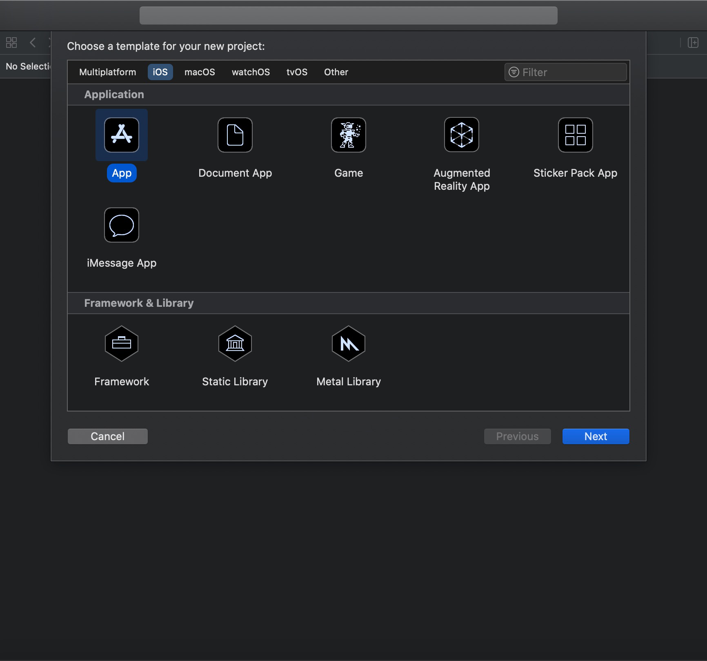 -->


在新建应用界面选择好 Team 和输入随意应用名，这个应用名不关键。接着选择 UIKit App Delegate 用于支持 iOS 13 版本，如下图

<!-- 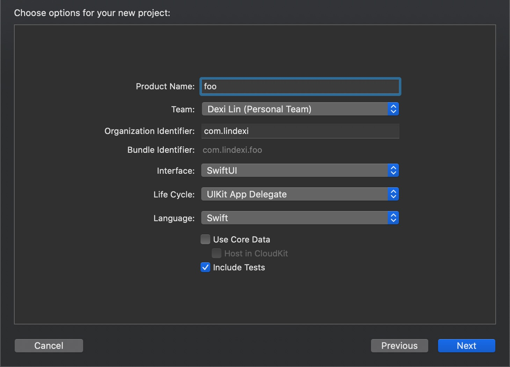 -->


随意选择一个文件夹保存项目

<!-- 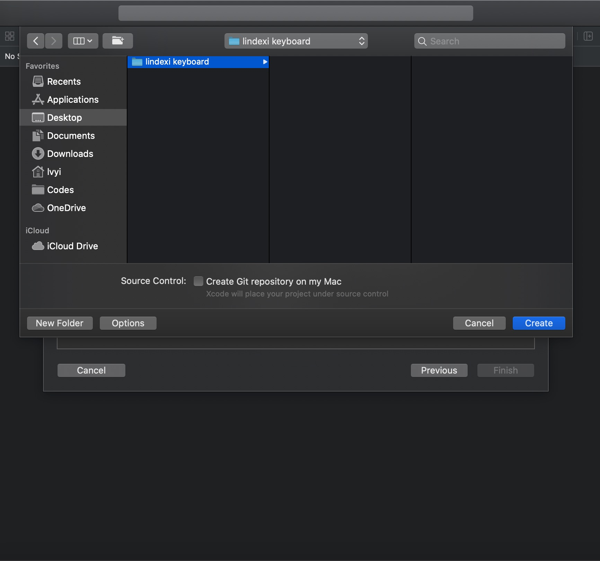 -->


新建完成之后，大概可以看到的界面如下

<!-- 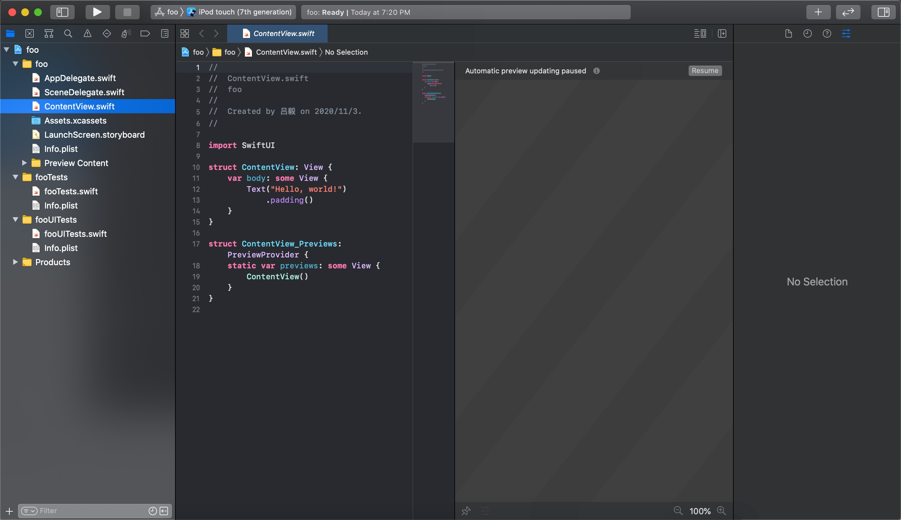 -->


进入项目的选项页面，双击或右击项目点选项都可以进入此页面

<!-- 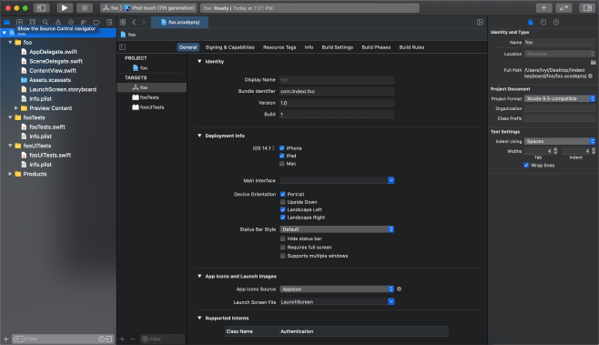 -->


先放开 XCode 应用，再花三天时间安装上 VisualStudio 以及 Xamarin 功能，从 [https://github.com/walterlv/Walterlv.CloudKeyboard](https://github.com/walterlv/Walterlv.CloudKeyboard) 下载好代码然后打开

以下界面是在 VisualStudio 上，咱需要在 VisualStudio 上修改捆绑包标识符，修改方法就是双击 Info.plist 文件

<!-- 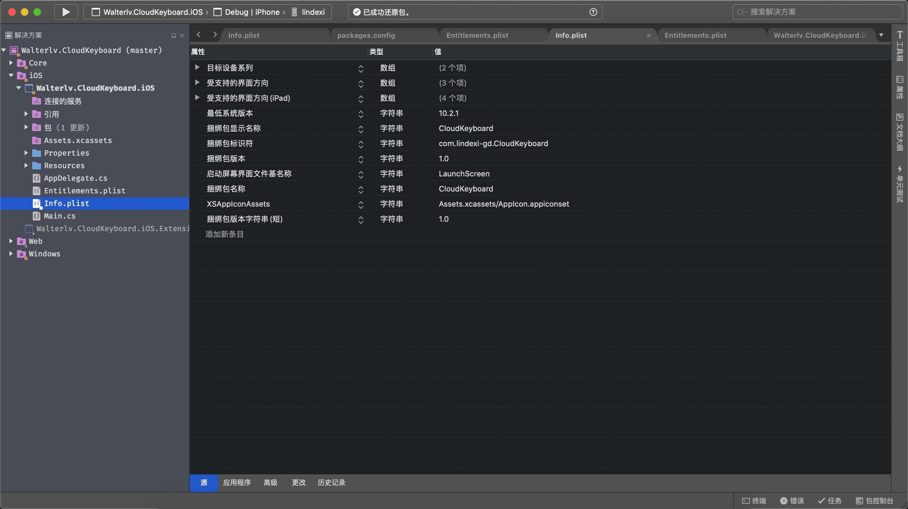 -->


以上关键的就是捆绑包标识符的内容

<!-- 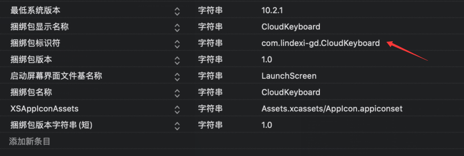 -->


这里的捆绑包标识符的命名规则是 `com.开发者团队名或组织名.随意的应用` 格式，而我的开发者团队名实际是 `lindexi-gd` 而不是 `lindexi_gd` 或 `lindexi` 哈，这部分需要在申请开发者账号的时候记录哦

这一步的难度最大的地方在于了解自己的开发者团队名或组织名是什么

在 [Walterlv.CloudKeyboard](https://github.com/walterlv/Walterlv.CloudKeyboard) 项目上包含了两个项目，一个是 iOS 键盘应用，另一个是键盘扩展。这两个项目都需要做相同的更改，刚才修改好了 Walterlv.CloudKeyboard.iOS 项目。现在需要修改 Walterlv.CloudKeyboard.iOS.Extension 项目

双击 Walterlv.CloudKeyboard.iOS.Extension 项目的 Info.plist 文件，可以看到如下界面

<!-- 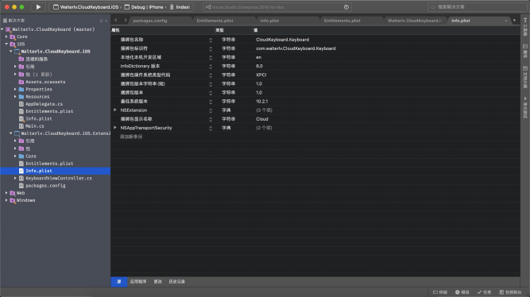 -->


编辑捆绑包标识符，内容就是在原先的 Walterlv.CloudKeyboard.iOS 项目的捆绑包标识符基础上的后面加上 `.Keyboard` 如下图


<!-- 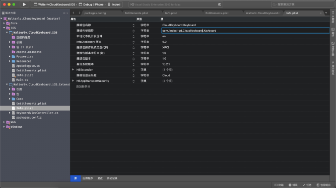 -->


修改完成之后，记得点保存

下一步再回到 XCode 里面，点击签名选项卡，在 Bundle Identifier 输入框里面输入刚才在 Walterlv.CloudKeyboard.iOS.Extension 项目的 Info.plist 文件写的捆绑包标识符，点击 Tab 键失焦，用于生成开发者签名

<!-- 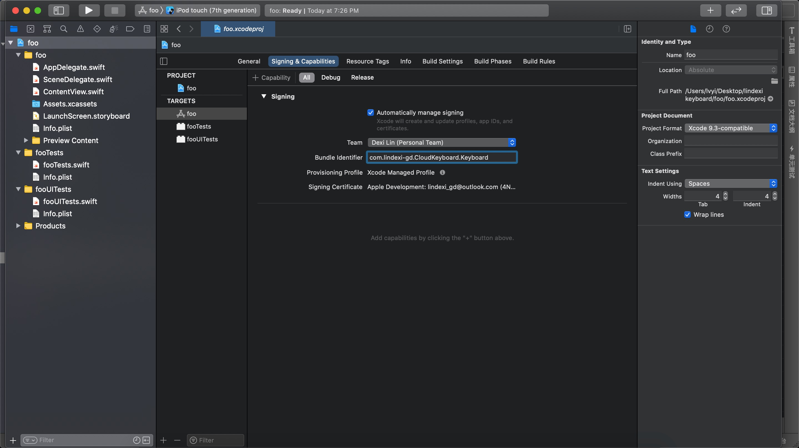 -->


生成之后大概可以看到如下界面

<!-- 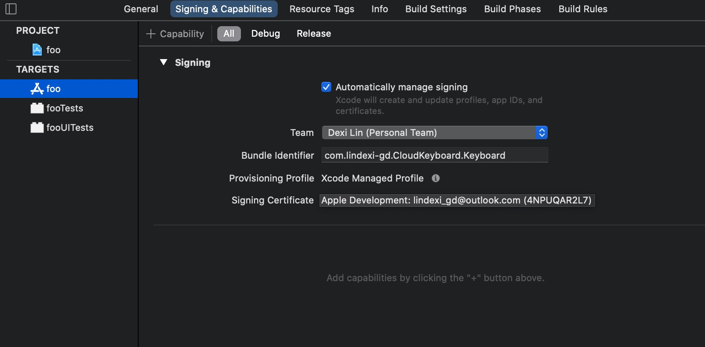 -->


接着需要在 XCode 先部署一下，在 XCode 部署的作用就是生成一个占坑的应用，用于解锁信任证书

部署之前需要点击选择自己的 iOS 应用，当前就需要让自己的 iOS 应用和 mac 相连了

<!-- 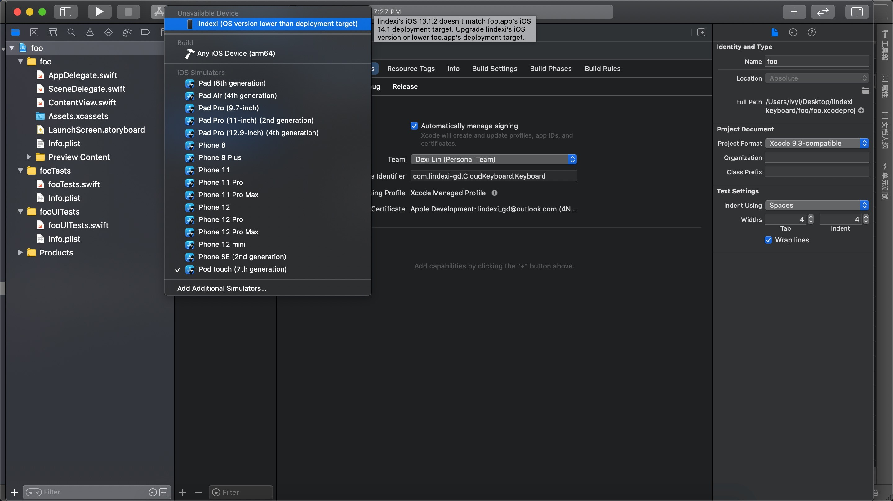 -->


可以看到我的手机的版本比较低，而我也不想升级，因为一升级了，我的一堆应用就用不了。而刚才为了让应用在我手机能部署，也就选择了 UIKit App Delegate 框架

但此时依然部署将会失败，原因是在 `.xcodeproj` 文件里面记录的版本号会更高，使用 VisualStudio Code 打开 `.xcodeproj` 文件，替换掉版本

<!-- 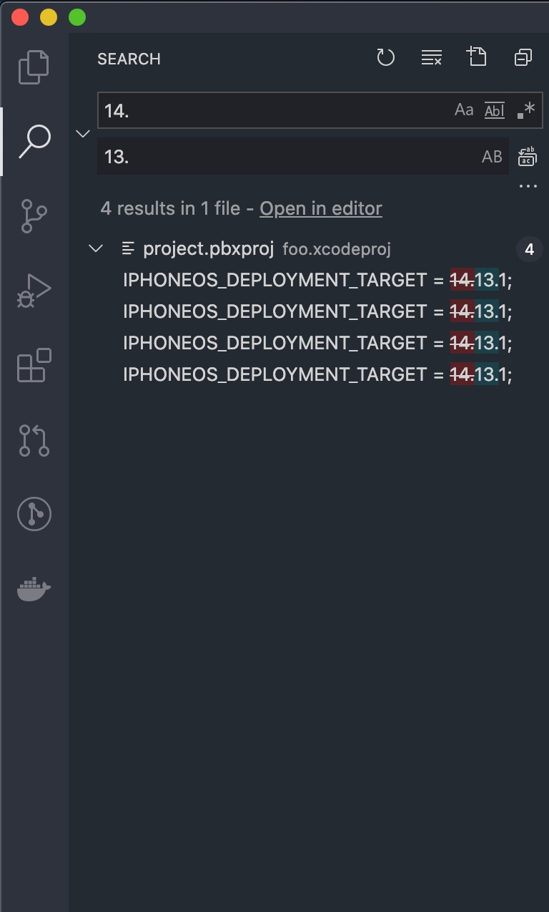 -->


点击部署按钮，可以看到 XCode 执行安装

<!--  -->


但是在安装完成之后，会提示启动失败

<!-- 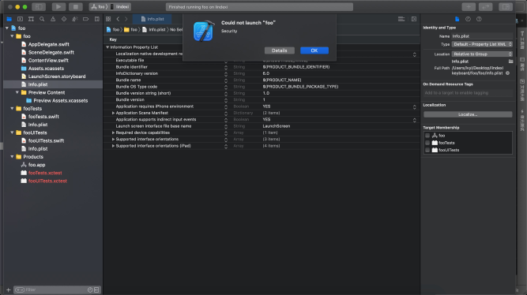 -->


在 XCode 上提示 Could not launch "foo" Security 的原因就是发者没有被信任

回到手机上，可以看到 XCode 安装的应用

<!--  -->


点击打开这个应用将会失败，因为无法验证 App 需要信任开发者

<!-- 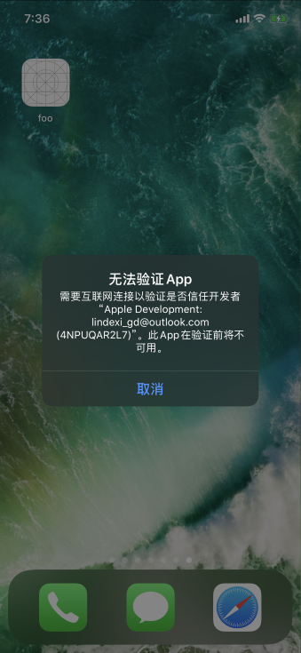 -->


添加信任的步骤如下

打开设置，进入通用

<!-- 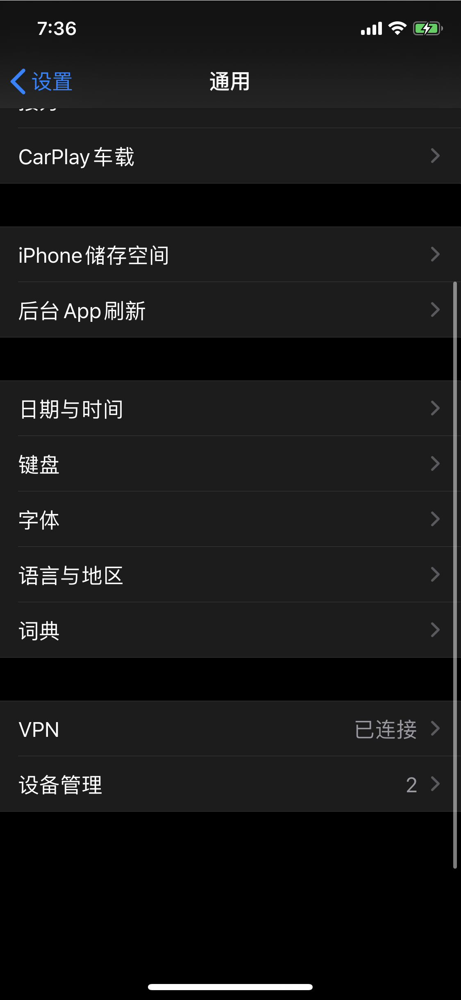 -->


进入设备管理界面

<!-- 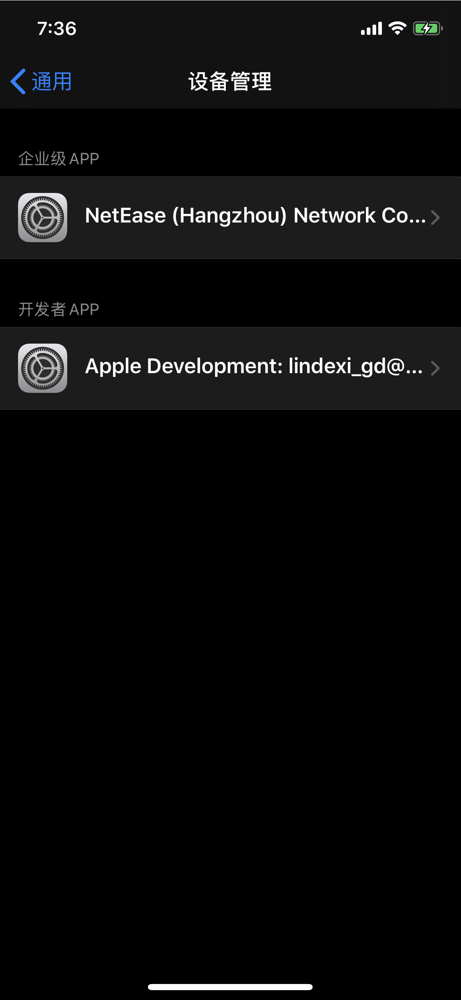 -->


可以在设备管理界面里面看到自己的证书，点击自己的证书

<!-- 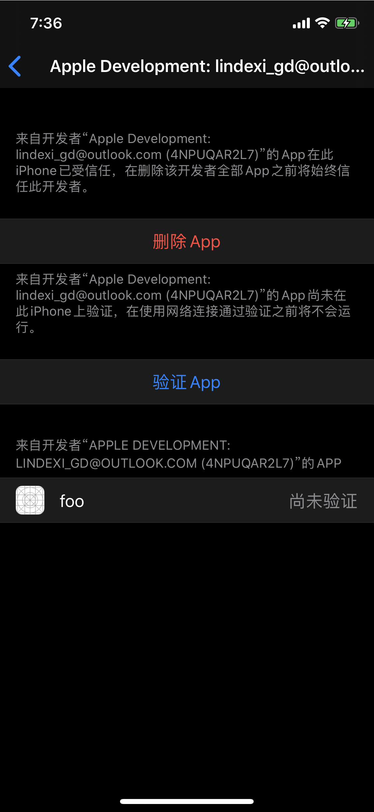 -->


点击验证

<!-- 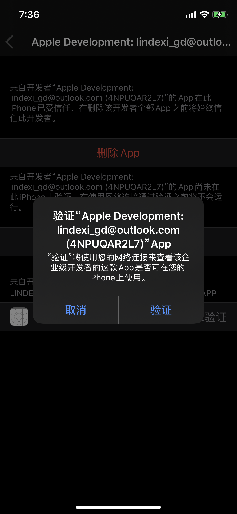 -->


等待一下网络，可以看到应用状态是已验证

<!-- 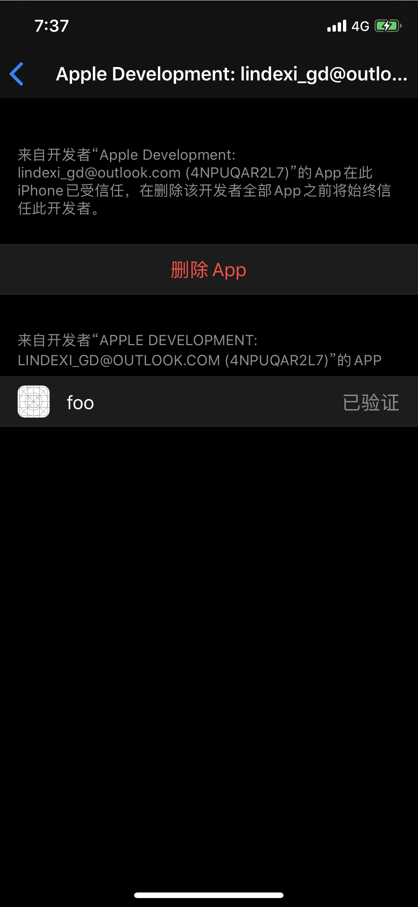 -->


此时再次打开 foo 应用，可以看到应用打开

<!--  -->


以上的这一步关键就是为了在通用的设备管理里面同意加入自己的证书，这个在 XCode 安装的应用也就被称为占坑的应用

下一步就是尝试在 VisualStudio 开始部署自己的键盘应用，因为我的 mac 设备其实是太子的设备，只是被我偷过来而已，账号啥的信息还没切过来，在 VisualStudio 部署的时候将会提示 iOS code signing key 'iPhone Developer walterxx@iCloud.com(F53jxxxxxx) not found in keychain.' 如下图

<!-- 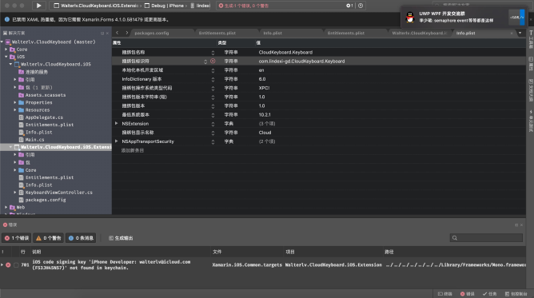 -->


解决方法就是右击项目，点击选项，修改捆绑包签名

<!-- 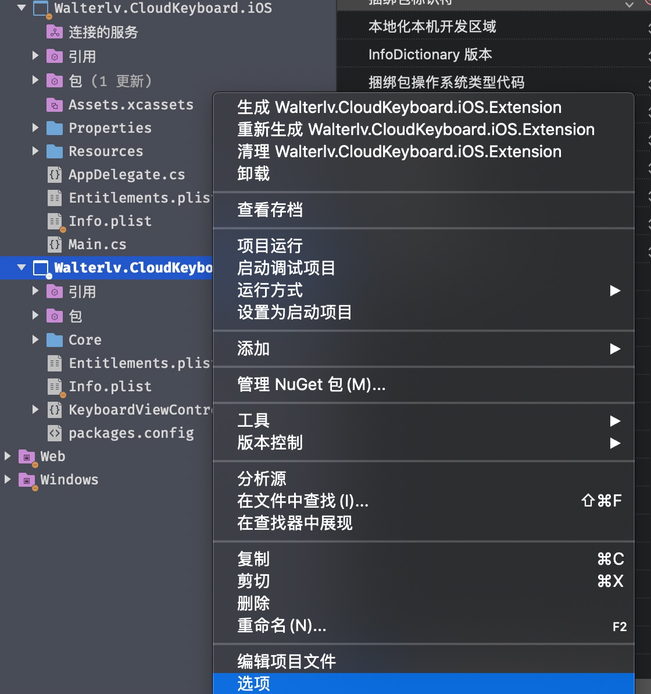 -->


进入捆绑包里面，修改预配配置文件

<!-- 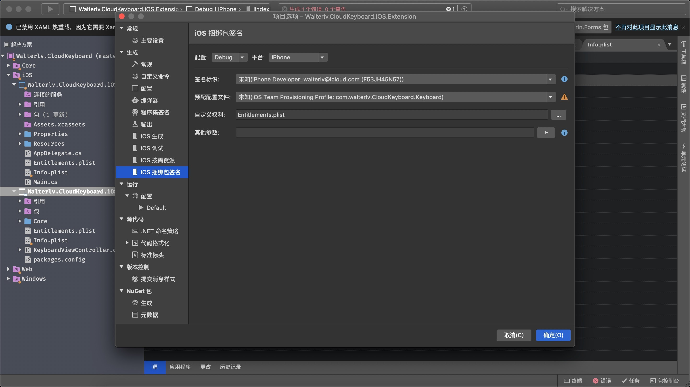 -->


选择自己的预配配置文件和签名标识，注意不要选自动

<!-- 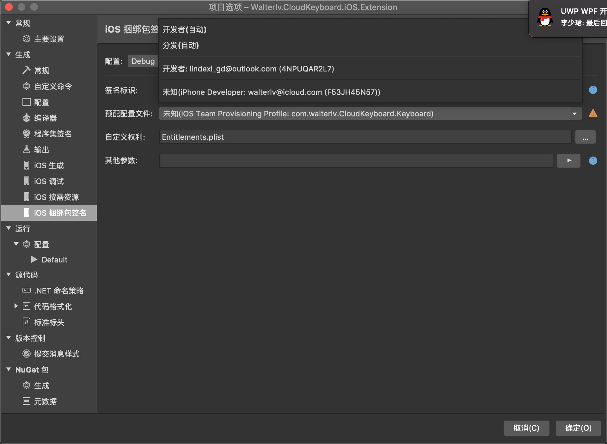 -->


选择之后的效果大概如下

<!-- 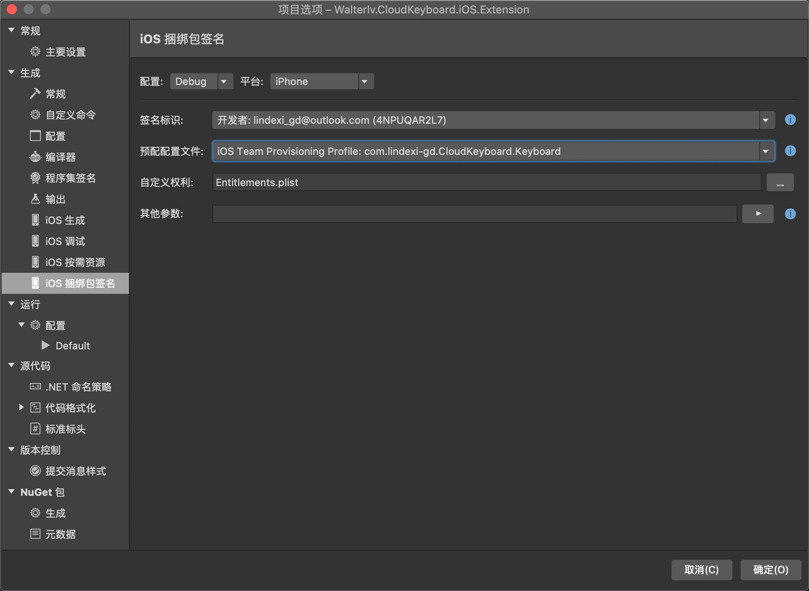 -->


上面这一步详细请看 [Xamarin iOS 切换开发者账号之后的签名标识和预配配置文件更新方法](https://blog.lindexi.com/post/Xamarin-iOS-%E5%88%87%E6%8D%A2%E5%BC%80%E5%8F%91%E8%80%85%E8%B4%A6%E5%8F%B7%E4%B9%8B%E5%90%8E%E7%9A%84%E7%AD%BE%E5%90%8D%E6%A0%87%E8%AF%86%E5%92%8C%E9%A2%84%E9%85%8D%E9%85%8D%E7%BD%AE%E6%96%87%E4%BB%B6%E6%9B%B4%E6%96%B0%E6%96%B9%E6%B3%95.html)

也就是说在发现这一步没有任何可以选择的时候，问题的原因就是没有在 XCode 的签名里面进行生成，需要确定在 XCode 里面生成，如下图

<!-- 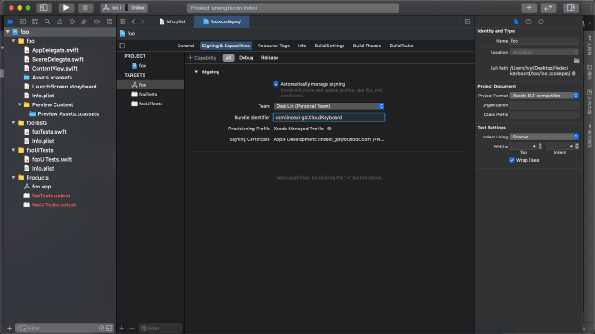 -->


在 Bundle Identifier 输入之后，按下 Tab 键失焦，此时将会提示创建，如下图

<!--  -->


此时再次在 VisualStudio 进行部署，如果提示因为存在同名的签名的应用，原因就是开始的时候在 XCode 创建的占坑应用用了当前在 VisualStudio 部署使用的捆绑包签名

```
 BundleIDConflictWithOtherIdentifier: App with identifier com.lindexi-gd.CloudKeyboard.Keyboard is already installed, so we can't install App Extension with that same identifier.
error MT1006: Could not install the application '/Users/lvyi/Documents/Codes/walterlv/Walterlv.CloudKeyboard/CloudKeyboard.iOS/bin/iPhone/Debug/device-builds/iphone10.3-13.1.2/Walterlv.CloudKeyboard.app' on the device 'lindexi': AMDeviceSecureInstallApplicationBundle returned: 0xe80000cc (kAMDBundleIDConflictWithOtherIdentifierError).
```

此时不能回到手机上删除刚才的占坑应用，因为这是一个占坑应用。如果被删除了，那么将会让刚才在设备管理的签名失效

因此解决方法就是再次回到 XCode 创建另一个应用，修改 Bundle Identifier 重新部署

<!-- 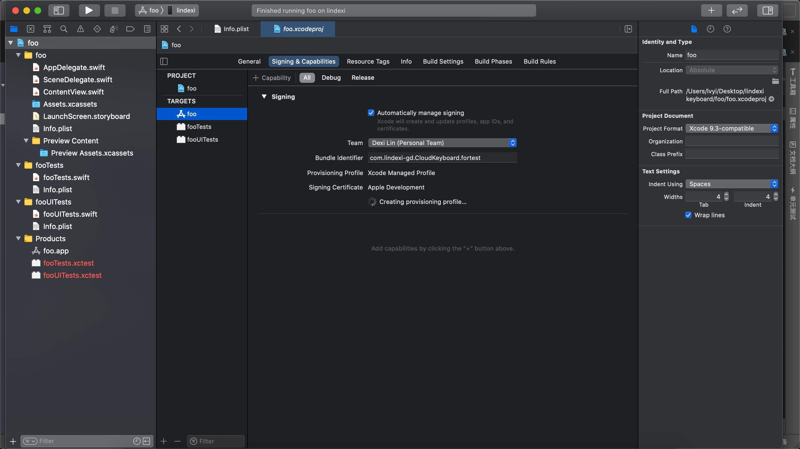 -->


重新部署之后，可以在手机上看到两个应用

<!-- 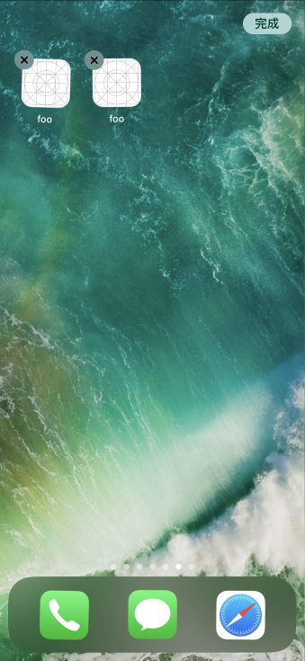 -->


删除掉一开始部署的占坑应用

<!-- 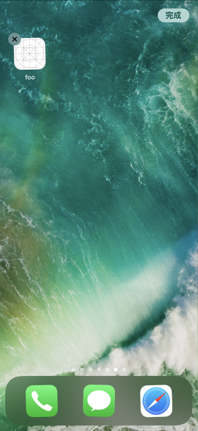 -->


重新回到 VisualStudio 点击构建部署，此时在手机上可以看到 Xamarin 的图标和部署上的应用

<!-- 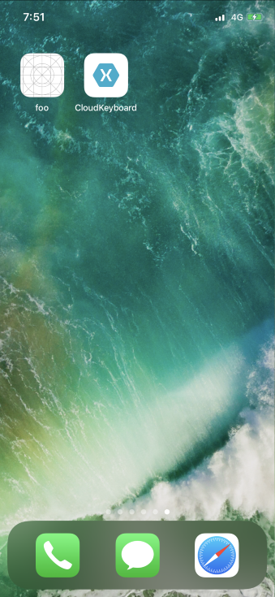 -->


在 VisualStudio 启动调试的时候，可以看到 Xamarin 的界面

<!--  -->


这是一个键盘应用，需要经过如下配置才能使用上

进入设置，进入通用，进入键盘

<!-- 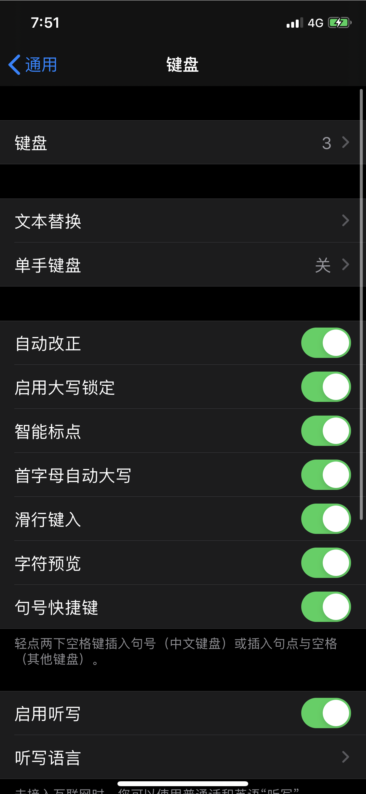 -->


点击键盘

<!--  -->


点击添加键盘

<!-- 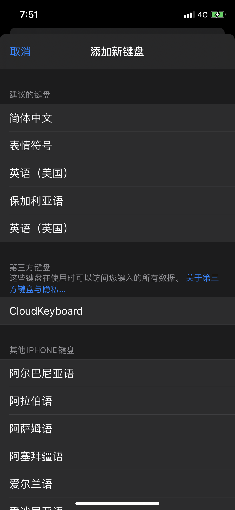 -->


选择 CloudKeyBoard 点击之后可以看到如下界面

<!--  -->


点击进入云键盘 Cloud 点击允许完全访问

<!-- 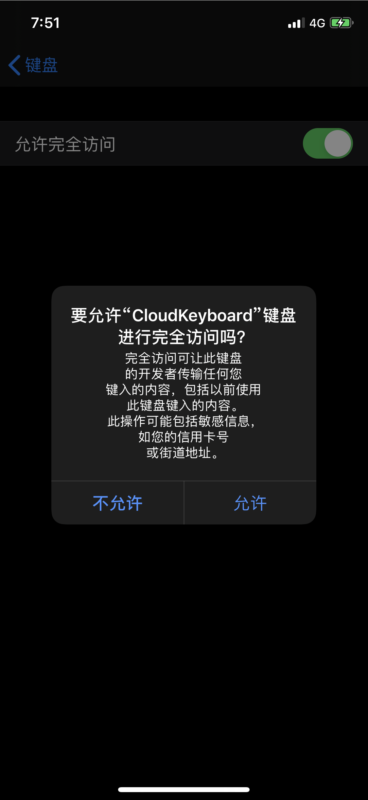 -->


此时就可以使用上 Walterlv 的云键盘了，这个项目在 GitHub 完全开源


开源地址请看 [https://github.com/walterlv/Walterlv.CloudKeyboard](https://github.com/walterlv/Walterlv.CloudKeyboard)


这就是整个部署的过程，步骤还不到 50 步，相信你被苹果坑几次就会部署了


<a rel="license" href="http://creativecommons.org/licenses/by-nc-sa/4.0/"></a><br />本作品采用<a rel="license" href="http://creativecommons.org/licenses/by-nc-sa/4.0/">知识共享署名-非商业性使用-相同方式共享 4.0 国际许可协议</a>进行许可。欢迎转载、使用、重新发布，但务必保留文章署名[林德熙](http://blog.csdn.net/lindexi_gd)(包含链接:http://blog.csdn.net/lindexi_gd )，不得用于商业目的，基于本文修改后的作品务必以相同的许可发布。如有任何疑问，请与我[联系](mailto:lindexi_gd@163.com)。