# asp dotnet core 从零开始创建一个 WebApi 服务

本文将从最简单开始，新从全控制台开始创建一个 WebApi 服务，然后再使用 VisualStudio 创建服务

<!--more-->
<!-- CreateTime:2020/2/25 22:20:16 -->

<!-- 发布 -->

从 [官网 https://dotnet.microsoft.com/](https://dotnet.microsoft.com/) 下载和安装最新版本的 dotnet 工具，这个 dotnet 工具还请安装 SDK 版本

<!-- 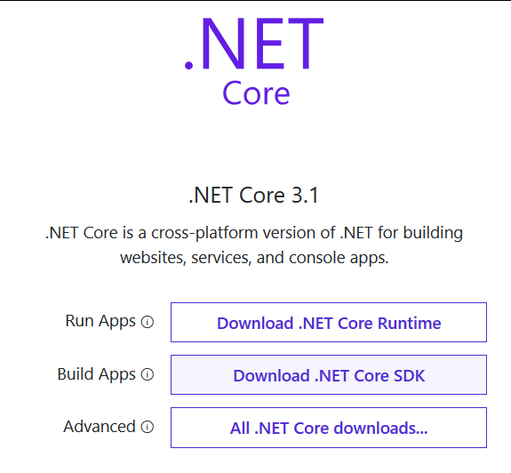 -->


安装完成之后，打开一个 cmd 控制台，输入 `dotnet --info` 确定安装成功

如看到有输出信息说版本是多少，那么就是安装成功了

接下来输入下面命令创建一个 WebApi 项目。此时如果 VisualStudio 还没有安装或更新到 VisualStudio 最新版本，那么请此时点击安装，大概控制台玩过之后差不多 VisualStudio 也安装差不多了

```
dotnet new webapi -o FarbenergarWacerabe
```

这里的 FarbenergarWacerabe 就是要创建的项目名，可以随意命名，但是推荐不要太诡异，如果发现创建失败了，自然就知道哪些命名不能作为项目名

通过 cd 命令进入到刚才创建的项目里面

```
cd FarbenergarWacerabe
```

然后将创建出来的项目先开跑

```csharp
dotnet run
```

恭喜，现在一个 WebApi 服务就创建完成了。安装 ctrl+c 就可以结束这个 WebApi 服务了，首次运行需要还原下载 NuGet 库可能会需要一点时间。现在空白的 WebApi 服务还没有什么好玩的，让咱添加一个 Api 用于返回有趣的内容

默认创建的项目会添加一个 Controllers 文件夹，里面存放着控制器，控制器里面有方法，在方法上面标记特性就可以用来开启 WebApi 的服务啦，这里专业的说法是路由哦

我这里默认有一个叫 `Controllers\WeatherForecastController.cs` 的例子文件，如果叫其他名字也没关系，尝试打开他

在里面添加一个方法

```csharp
        [HttpGet]
        [Route("/api/lindexi")]
        public string Lindexi()
        {
            return "林德熙是逗比";
        }
```

这个代码包含了三个部分内容，第一个部分就是 `[HttpGet]` 用来表示这个方法提供了 Http 的 Get 请求。而通过 Url 链接是 `[Route("/api/lindexi")]` 里面标记的 `/api/lindexi` 链接进行访问，也就是可以通过浏览器的 Get 请求也就是从地址栏输入网址访问到

第三部分就是方法本身，方法本身返回的值将会返回给请求方，如浏览器访问将会返回给浏览器，而客户端访问将会返回给客户端。如何开发一个客户端应用请看 [win10 uwp 手把手教你使用 asp dotnet core 做 cs 程序](https://blog.lindexi.com/post/win10-uwp-%E6%89%8B%E6%8A%8A%E6%89%8B%E6%95%99%E4%BD%A0%E4%BD%BF%E7%94%A8-asp-dotnet-core-%E5%81%9A-cs-%E7%A8%8B%E5%BA%8F.html)

继续尝试运行代码

```csharp
dotnet run
```

此时尝试从浏览器访问 [https://localhost:5001/api/lindexi](https://localhost:5001/api/lindexi) 注意这个端口需要根据控制台输出的值确定，一般都是 5001 表示 Https 的端口

```csharp
info: Microsoft.Hosting.Lifetime[0]
      Now listening on: https://localhost:5001
```

首次从浏览器访问如果提示证书缺失如下面界面，只需要点击同意继续访问就可以了

<!-- 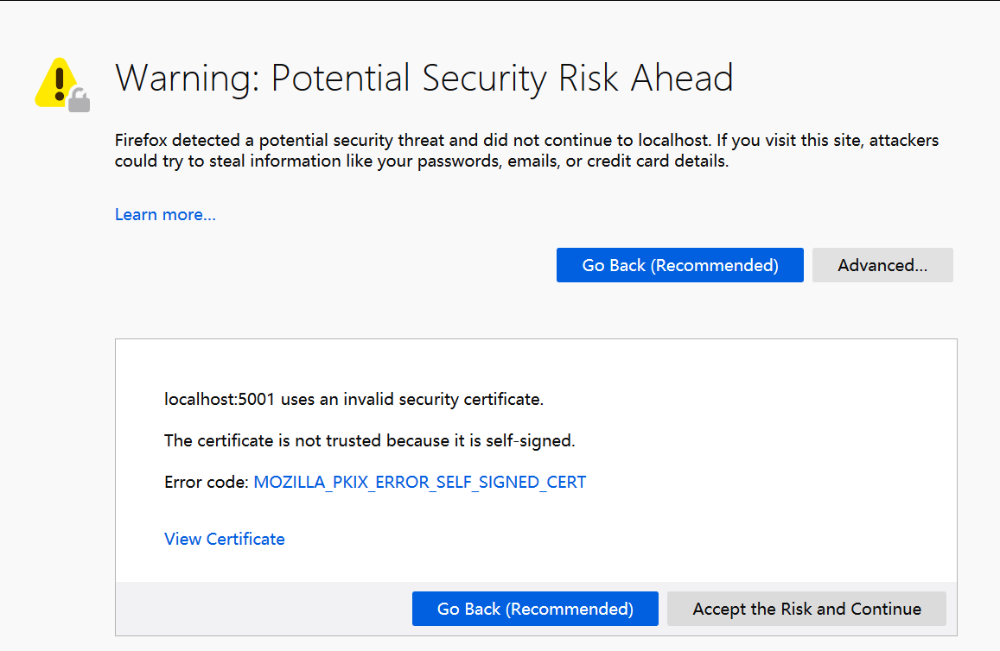 -->


此时应该可以通过浏览器看到了 林德熙是逗比 的输出了

## VisualStudio

如果用 VisualStudio 进行创建需要如何做？ 首先需要让 VisualStudio 保持最新同时安装负载，我推荐需要勾选的如下图

<!--  -->


<!--  -->


打开 VisualStudio 点击新建项目，选择 ASP.NET Core Web 应用程序

<!-- 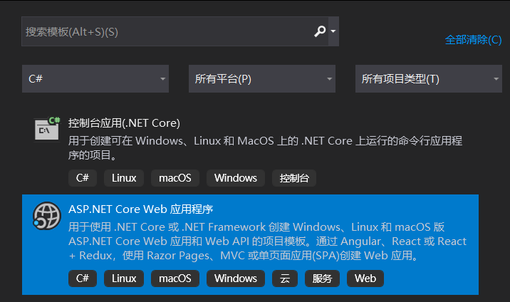 -->


输入项目名点击下一步

<!-- 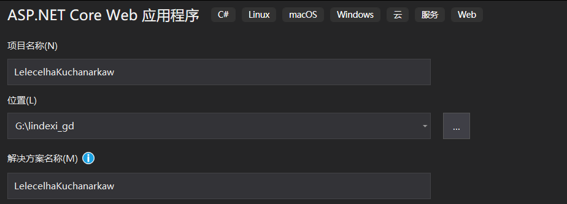 -->


此时可以选择 API 应用等，本文主要告诉大家如何创建一个 WebApi 服务，所以请小伙伴选择 API 应用。在右侧可以选择是否开启 HTTPS 支持，如果是内部的应用，可以考虑不开启 HTTPS 支持。另外如果电脑上不部署 docker 还可以勾选 docker 的容器，勾选之后可以选择 Linux 容器或 Windows 容器

<!-- 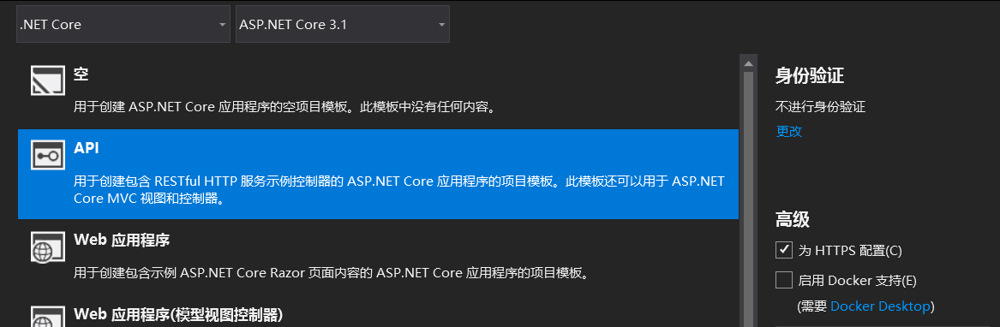 -->


最简单的项目是两个都不要勾选

现在可以看到有以下文件，作用如下图

<!-- 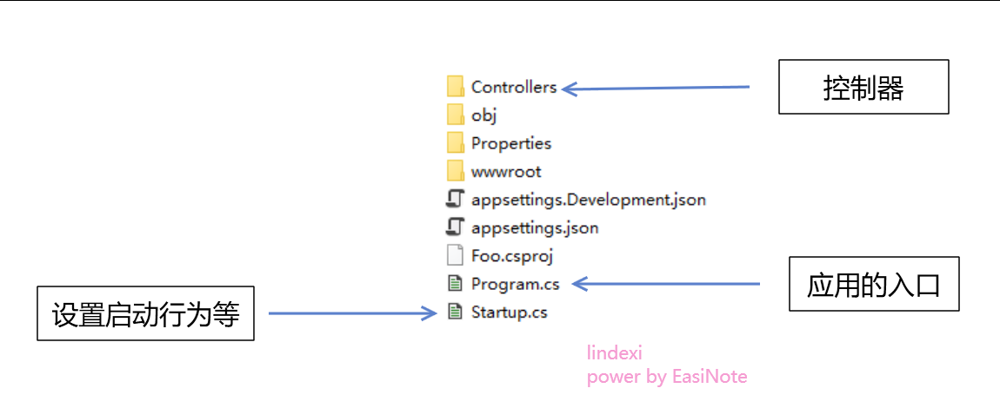 -->


依然在控制器里面就包含了对外服务的相关方法，和上面用控制台创建的相同

控制器本身可以有多个，如下图创建一个简单的控制器

<!-- 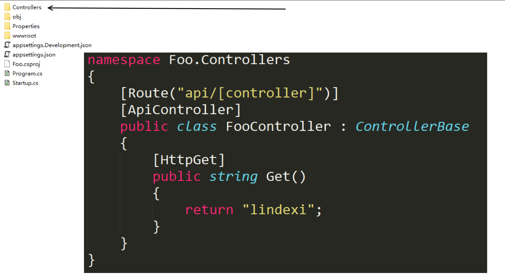 -->


创建完成之后按下 F5 在 VisualStudio 中运行调试

在浏览器访问 [https://127.0.0.1:5001/api/foo](https://127.0.0.1:5001/api/foo) 就可以看到输出了 lindexi 的值。那么访问这个链接和我的代码是什么对应关系，请看下图

<!-- 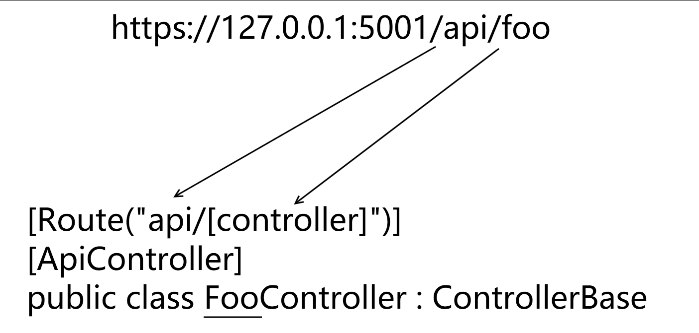 -->


其实都是通过 Route 这个特性进行识别的，这个特性的功能大概可以水几篇博客哦，本文这里就不多说了，大概通过上面两个例子大家也能知道是如何使用的

大概这样就完成了一个 WebApi 服务的创建了。而除了创建应用之外，可能还需要进行打包发布什么的，这部分在 VisualStudio 的帮助下将会非常简单

## 设置访问端口

一般的应用在发布的时候都需要设置一个开启的端口，如果是作为非浏览器访问的 WebApi 或者非浏览器首页访问的 WebApi 很多都不会选择使用 80 等常用端口，以提高几乎可以忽略不计的安全性。在 ASP.NET Core 可以在 Program.cs 里面启动主机时设置监听的端口

通过添加 `webBuilder.UseUrls("http://0.0.0.0:12307");` 就可以监听 12307 端口，前面的 0.0.0.0 表示本机的所有 ip 地址

```csharp
        public static IHostBuilder CreateHostBuilder(string[] args) =>
            Host.CreateDefaultBuilder(args)
                .ConfigureWebHostDefaults(webBuilder =>
                {
                    webBuilder.UseStartup<Startup>();
                    webBuilder.UseUrls("http://0.0.0.0:12307");
                });
```

这样就能将默认的 5000 端口替换为 12307 端口了，这个端口可以请小伙伴自己指定

此时上面的链接需要修改为 [http://localhost:12307/api/lindexi](http://localhost:12307/api/lindexi) 才能访问到

## 发布应用

发布应用只需要右击项目点击发布就可以了

我推荐如果是测试的话，可以直接选择文件夹输出，这样就不需要配置 Azure 虚拟机等，虽然这部分配置也十分简单

<!-- 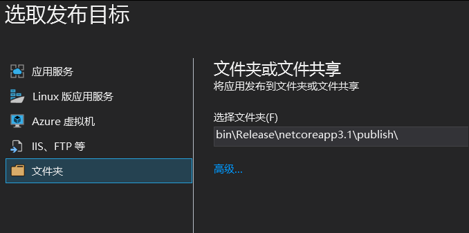 -->


此时点击编辑可以进行设置是否使用框架依赖发布或独立发布

<!-- 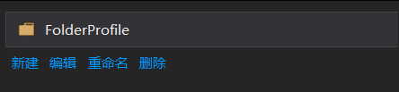 -->


什么是框架发布？框架发布就是依赖对应的框架，我需要在服务器上面先安装 dotnet 工具然后我才可以运行这个应用。而独立发布就是我将所有的依赖全部放在一起，相比框架依赖的优点就是到服务器不需要部署安装环境，只需要运行我的程序就可以了。而缺点就是发布的文件会比较大，虽然这点大小可以忽略，大概就100M左右

<!-- 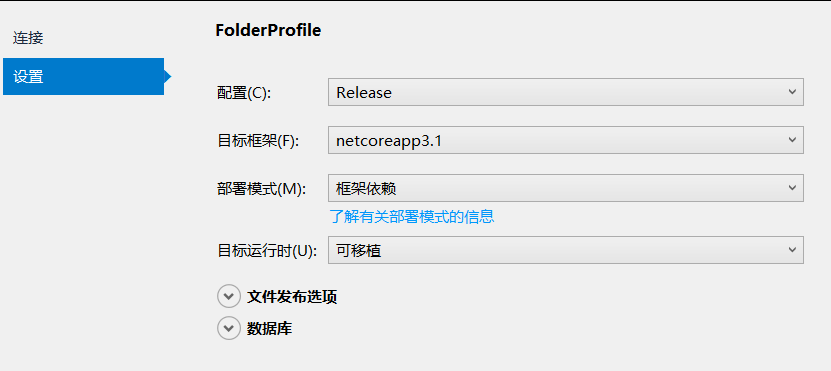 -->


完成配置之后，可以点击发布按钮，发布完成之后就可以将发布文件发送给服务器进行运行了。如果服务器上配置了 FTP 等，那么还可以省略上传的步骤。如果设置的是 Azure 虚拟机，部署上去之后还能帮忙跑起来

## docker 发布

如果是想要其他小伙伴通过 Docker 运行我的服务也可以在 VisualStudio 上方便进行生成 Docker 文件，作为 docker 发布，在使用之前请安装 docker desktop 应用，可以从他的官网下载，虽然下载速度也是超级慢

如果在创建项目开始的时候有选择开启 docker 支持，那么默认就会创建 dockerfile 文件，而如果没有的话，请右击项目，选择 docker 支持

<!-- 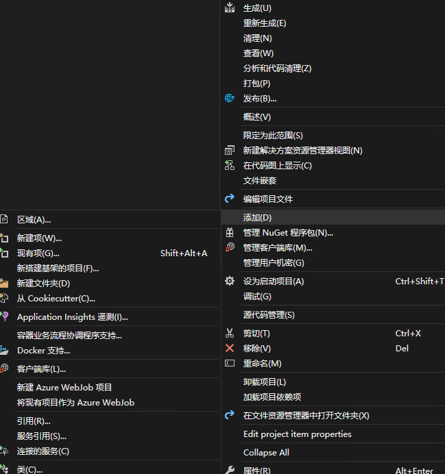 -->


接着右击 dockerfile 点击生成 docker image 按钮

<!-- 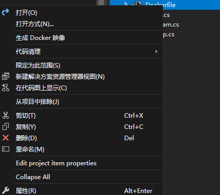 -->


接着就可以通过命令行输入 docker image list 找到刚才创建的 image 了，此时如何推送 docker 和如何发布本文就不多说了，小伙伴自己百度去

我的网站写完成了之后，此时我想要让外网访问可以如何做？可以试试 [dotnet core 通过 frp 发布自己的网站](https://blog.lindexi.com/post/dotnet-core-%E9%80%9A%E8%BF%87-frp-%E5%8F%91%E5%B8%83%E8%87%AA%E5%B7%B1%E7%9A%84%E7%BD%91%E7%AB%99.html)

而更详细的入门我推荐阅读官方文档，微软的官方文档是咱社区的一堆大神协助翻译的，质量非常好

[ASP.NET Core 入门 官方文档](https://docs.microsoft.com/zh-cn/aspnet/core/getting-started/?view=aspnetcore-3.1&tabs=windows)

官方的 Learn 平台还提供了实战例子，请看 [使用 ASP.NET Core 创建 Web API - Learn](https://docs.microsoft.com/zh-cn/learn/modules/build-web-api-net-core/?view=aspnetcore-3.1)

更多阅读：

- [win10 uwp 手把手教你使用 asp dotnet core 做 cs 程序](https://blog.lindexi.com/post/win10-uwp-%E6%89%8B%E6%8A%8A%E6%89%8B%E6%95%99%E4%BD%A0%E4%BD%BF%E7%94%A8-asp-dotnet-core-%E5%81%9A-cs-%E7%A8%8B%E5%BA%8F.html)
- [win10 uwp 客户端如何发送类到 asp dotnet core 作为参数](https://blog.lindexi.com/post/win10-uwp-%E5%AE%A2%E6%88%B7%E7%AB%AF%E5%A6%82%E4%BD%95%E5%8F%91%E9%80%81%E7%B1%BB%E5%88%B0-asp-dotnet-core-%E4%BD%9C%E4%B8%BA%E5%8F%82%E6%95%B0.html)
- [win10 uwp 使用 asp dotnet core 做图床服务器客户端](https://blog.lindexi.com/post/win10-uwp-%E4%BD%BF%E7%94%A8-asp-dotnet-core-%E5%81%9A%E5%9B%BE%E5%BA%8A%E6%9C%8D%E5%8A%A1%E5%99%A8%E5%AE%A2%E6%88%B7%E7%AB%AF.html)
- [asp dotnet core 通过图片统计 csdn 用户访问](https://blog.lindexi.com/post/asp-dotnet-core-%E9%80%9A%E8%BF%87%E5%9B%BE%E7%89%87%E7%BB%9F%E8%AE%A1-csdn-%E7%94%A8%E6%88%B7%E8%AE%BF%E9%97%AE.html)
- [asp dotnet core 3.0 接口返回 json 使用 PascalCase 格式](https://blog.lindexi.com/post/asp-dotnet-core-3.0-%E6%8E%A5%E5%8F%A3%E8%BF%94%E5%9B%9E-json-%E4%BD%BF%E7%94%A8-PascalCase-%E6%A0%BC%E5%BC%8F.html)
- [asp dotnet core 支持客户端上传文件](https://blog.lindexi.com/post/asp-dotnet-core-%E6%94%AF%E6%8C%81%E5%AE%A2%E6%88%B7%E7%AB%AF%E4%B8%8A%E4%BC%A0%E6%96%87%E4%BB%B6.html)
- [ASP.NET Core 开启后台任务](https://blog.lindexi.com/post/ASP.NET-Core-%E5%BC%80%E5%90%AF%E5%90%8E%E5%8F%B0%E4%BB%BB%E5%8A%A1.html)
- [dotnet core 通过 frp 发布自己的网站](https://blog.lindexi.com/post/dotnet-core-%E9%80%9A%E8%BF%87-frp-%E5%8F%91%E5%B8%83%E8%87%AA%E5%B7%B1%E7%9A%84%E7%BD%91%E7%AB%99.html)
- [asp dotnet core 从 Frp 获取用户真实 IP 地址](https://blog.lindexi.com/post/asp-dotnet-core-%E4%BB%8E-Frp-%E8%8E%B7%E5%8F%96%E7%94%A8%E6%88%B7%E7%9C%9F%E5%AE%9E-IP-%E5%9C%B0%E5%9D%80.html)
- [ASP.NET Core 连接 GitLab 与 MatterMost 打造 devops 工具](https://blog.lindexi.com/post/ASP.NET-Core-%E8%BF%9E%E6%8E%A5-GitLab-%E4%B8%8E-MatterMost-%E6%89%93%E9%80%A0-devops-%E5%B7%A5%E5%85%B7.html)

本文代码放在 [github](https://github.com/lindexi/lindexi_gd/tree/4e864fd6600e0a26ac61355d4e80a5cad4d10fff/FarbenergarWacerabe) 里面也没有什么内容

<a rel="license" href="http://creativecommons.org/licenses/by-nc-sa/4.0/"></a><br />本作品采用<a rel="license" href="http://creativecommons.org/licenses/by-nc-sa/4.0/">知识共享署名-非商业性使用-相同方式共享 4.0 国际许可协议</a>进行许可。欢迎转载、使用、重新发布，但务必保留文章署名[林德熙](http://blog.csdn.net/lindexi_gd)(包含链接:http://blog.csdn.net/lindexi_gd )，不得用于商业目的，基于本文修改后的作品务必以相同的许可发布。如有任何疑问，请与我[联系](mailto:lindexi_gd@163.com)。
