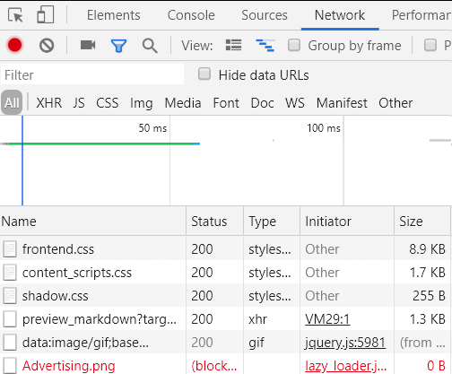

# asp dotnet core 图片在浏览器没访问可能原因

我写了一个项目用来广告就用到广告的图片，但是广告的图片放在博客的链接无法访问，连我的方法都没有调用，而我尝试网页直接访问图片链接是可以访问的，最后找到原因是广告插件禁用了图片访问

<!--more-->
<!-- CreateTime:2019/5/21 11:24:43 -->

<!-- 标签：asp,aspdotnetcore,dotnetcore -->

我在一个方法创建了广告的图片，我尝试在很多工具里面都可以访问到这张图片，但是我放在 CSDN 等都无法访问，我在下面代码加上断点都没有进来，但是我在其他的本地应用都可以正常使用

```csharp
        [Route("Advertising.png")]
        [HttpGet]
        public FileResult GetAdvertising()
        {
            var file = CreateImage();

            return File(file, "image/png");
        }
```

我在浏览器的流量看到了下图，我的图片没有被访问

<!--  -->


我从控制台看到下面输出

```csharp
GET http://api2.service.walterlv.com/api/Image/Advertising.png net::ERR_BLOCKED_BY_CLIENT
```

我通过这个字符串找到了原来是 Ad Block 等广告插件屏蔽了任何名字带广告的图片，于是广告的图片没有加载

解决的方法是我使用了另一个名字，我修改了下面代码

```csharp
        [Route("Image.png")]
        [HttpGet]
        public FileResult GetImage()
        {
            var file = CreateImage();

            return File(file, "image/png");
        }
```

这样修改访问链接为下面代码

```csharp

```

就可以在 CSDN 等访问到图片

如果你发现自己的图片没有被访问，同时在流量看到图片的 status 是 `(blocked:other)` 然后在控制台看到 `net::ERR_BLOCKED_BY_CLIENT` 那么就是广告插件屏蔽了图片访问

[](http://api2.service.walterlv.com/api/Image/UrlMove)

<a rel="license" href="http://creativecommons.org/licenses/by-nc-sa/4.0/"></a><br />本作品采用<a rel="license" href="http://creativecommons.org/licenses/by-nc-sa/4.0/">知识共享署名-非商业性使用-相同方式共享 4.0 国际许可协议</a>进行许可。欢迎转载、使用、重新发布，但务必保留文章署名[林德熙](http://blog.csdn.net/lindexi_gd)(包含链接:http://blog.csdn.net/lindexi_gd )，不得用于商业目的，基于本文修改后的作品务必以相同的许可发布。如有任何疑问，请与我[联系](mailto:lindexi_gd@163.com)。
