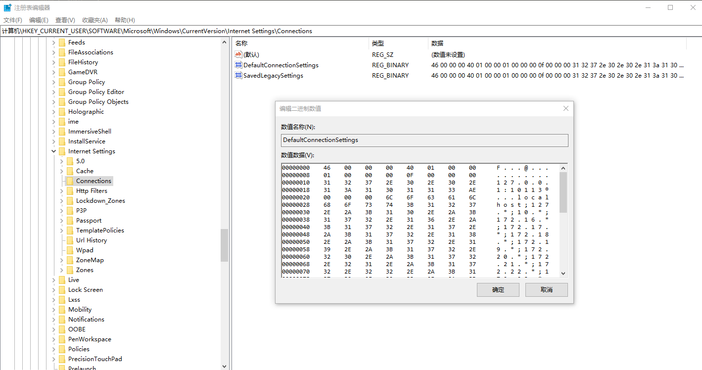

# dotnet 6 为什么网络请求不跟随系统网络代理变化而动态切换代理

本文记录在 dotnet 6 的网络和在 .NET Framework 的行为的变更。在 dotnet 6 下，默认的网络请求在系统网络代理变更的时候，是不会动态切换代理的。例如在应用运行进行网络通讯之后，打开 Fiddler 抓包，此时将会发现 Fiddler 抓不到包，只有在应用重启之后才能抓到。或者是开着 Fiddler 抓包，然后退出 Fiddler 之后应用就断网了

<!--more-->
<!-- CreateTime:2022/7/19 8:43:16 -->

<!-- 发布 -->
<!-- 标签： 网络 -->

如此行为是因为 Fiddler 抓包其中的一个原理就是设置系统的本机网络代理，而由于 dotnet 6 下，应用不会动态切换代理，如果在应用启动进行网络通讯之后，再打开 Fiddler 抓包，在 Fiddler 打开之后，将会修改系统的本机网络代理，但是 dotnet 6 的应用由于默认不会动态切换代理从而不走 Fiddler 的代理，因此 Fiddler 抓不到包。同理，在开着 Fiddler 抓包之后，退出了 Fiddler 将会修改本机的网络代理，但是由于 dotnet 6 的应用默认不会动态切换代理，在 Fiddler 修改了本机网络代理之后，依然 dotnet 6 的应用还在使用着被关闭的 Fiddler 的网络代理从而断网

核心原因是在 dotnet 6 下变更了网络代理动态切换的行为。其实考古找到这个行为在 .NET Core 2.0 就是默认不支持自动跟随系统代理切换而修改代理

在 .NET Framework 的 4.0 开始，通过监听注册表的 `HKEY_CURRENT_USER\Software\Microsoft\Windows\CurrentVersion\Internet Settings\Connections` 的变更，在变更之后进行刷新网络请求的代理。详细请看 [https://referencesource.microsoft.com/#System/net/System/Net/_AutoWebProxyScriptEngine.cs,395](https://referencesource.microsoft.com/#System/net/System/Net/_AutoWebProxyScriptEngine.cs,395)

<!--  -->


在 .NET Core 下，网络代理的获取只有一次，获取到的代理没有再去监听注册表的变更，也就没有再次刷新。此问题已反馈给官方，详细请看 [https://github.com/dotnet/runtime/issues/46910](https://github.com/dotnet/runtime/issues/46910)

在 .NET Core 将会在首次获取 HttpClient.DefaultProxy 时进行初始化，值得一提的是在 .NET Core 调用的 WebRequest.GetSystemWebProxy 方法底层也是调用 HttpClient.DefaultProxy 属性

```csharp
 public static IWebProxy GetSystemWebProxy() => HttpClient.DefaultProxy;
```

以上的 GetSystemWebProxy 实现请看 [Make WebRequest.GetSystemWebProxy() return a working proxy by stephentoub · Pull Request #41692 · dotnet/corefx](https://github.com/dotnet/corefx/pull/41692 )

在 HttpClient.DefaultProxy 里面，将会调用到 SystemProxyInfo.cs 的 ConstructSystemProxy 方法获取对应平台的代理。这个 ConstructSystemProxy 在 OSX 和 Unix 和 Windows 有各自的实现

在 Windows 实现如下

```csharp
        public static IWebProxy ConstructSystemProxy()
        {
            if (!HttpEnvironmentProxy.TryCreate(out IWebProxy? proxy))
            {
                HttpWindowsProxy.TryCreate(out proxy);
            }

            return proxy ?? new HttpNoProxy();
        }
```

在 HttpEnvironmentProxy 里面，将尝试通过环境变量获取代理的配置，也就是说 dotnet 6 应用是支持通过环境变量设置代理，如此更加方便调试。获取的环境变量分别是 `ALL_PROXY` 和 `HTTP_PROXY` 和 `HTTPS_PROXY` 这几个惯例变量

如上面代码，如果获取不到环境变量，那么就进入 HttpWindowsProxy 的代码。在 WinInetProxyHelper 将会读取系统的代理

如上面代码，可以看到，实际上在 HttpClient.DefaultProxy 里面只会获取一次，没有通过注册表的变更再次刷新

这就是网络请求不跟随本机网络代理变化的原因

一个解决方法就是拷贝 dotnet runtime 的读取系统的配置方法，再加上监听注册表变更进行刷新配置，从而实现动态跟随系统代理变化而变化。我拷贝了代码，写了一个版本，使用方法是

```csharp
var dynamicHttpWindowsProxy = new DynamicHttpWindowsProxy();

HttpClient.DefaultProxy = dynamicHttpWindowsProxy; 
```

代码的实现放在[github](https://github.com/lindexi/lindexi_gd/tree/8c64e9676c4205e55fad227a86d5d8d95a5ebe91/NilerlanaihikaWhurreeberhalur) 和 [gitee](https://gitee.com/lindexi/lindexi_gd/tree/8c64e9676c4205e55fad227a86d5d8d95a5ebe91/NilerlanaihikaWhurreeberhalur) 欢迎访问

可以通过如下方式获取源代码，先创建一个空文件夹，接着使用命令行 cd 命令进入此空文件夹，在命令行里面输入以下代码，即可获取到代码

```
git init
git remote add origin https://gitee.com/lindexi/lindexi_gd.git
git pull origin 8c64e9676c4205e55fad227a86d5d8d95a5ebe91
```

以上使用的是 gitee 的源，如果 gitee 不能访问，请替换为 github 的源。请在命令行继续输入以下代码

```
git remote remove origin
git remote add origin https://github.com/lindexi/lindexi_gd.git
git pull origin 8c64e9676c4205e55fad227a86d5d8d95a5ebe91
```

获取代码之后，进入 NilerlanaihikaWhurreeberhalur 文件夹，具体实现放在 `Proxy` 文件里面，在 Program.cs 包含了测试逻辑，可以不断尝试访问百度。可以测试在使用 `HttpClient.DefaultProxy = dynamicHttpWindowsProxy; ` 时，切换 Fiddler 代理配置，和不使用 DynamicHttpWindowsProxy 切换配置的行为

以上代码基本都是从 dotnet runtime 里面抄的，可以放心用在正式的项目。监听注册表变更是从 [https://www.codeproject.com/Articles/4502/RegistryMonitor-a-NET-wrapper-class-for-RegNotifyC](https://www.codeproject.com/Articles/4502/RegistryMonitor-a-NET-wrapper-class-for-RegNotifyC) 抄的，这是一段比较古老稳定的代码，只不过需要多开启一个线程用来监听注册表。这就是为什么在例子代码里面，会延迟去启动监听注册表

参考文档：

- [c# - Default proxy in .net core 2.0 - Stack Overflow](https://stackoverflow.com/questions/50205990/default-proxy-in-net-core-2-0/52701989#52701989 )
- [AutoWebProxyScriptEngine.cs](https://referencesource.microsoft.com/#System/net/System/Net/_AutoWebProxyScriptEngine.cs,395 )
- [Make WebRequest.GetSystemWebProxy() return a working proxy by stephentoub · Pull Request #41692 · dotnet/corefx](https://github.com/dotnet/corefx/pull/41692 )
- [WinHttpWebProxyDataBuilder.cs](https://referencesource.microsoft.com/#System/net/System/Net/_WinHttpWebProxyDataBuilder.cs,22 )
- [runtime/HttpConnectionPoolManager.cs at 1d9e50cb4735df46d3de0cee5791e97295eaf588 · dotnet/runtime](https://github.com/dotnet/runtime/blob/1d9e50cb4735df46d3de0cee5791e97295eaf588/src/libraries/System.Net.Http/src/System/Net/Http/SocketsHttpHandler/HttpConnectionPoolManager.cs#L147 )
- [HttpClient.DefaultProxy should respect IE proxy changes · Issue #46910 · dotnet/runtime](https://github.com/dotnet/runtime/issues/46910 )
- [how to set default proxy with .NET core 3.1 for HTTP client for any request? - Stack Overflow](https://stackoverflow.com/questions/64931470/how-to-set-default-proxy-with-net-core-3-1-for-http-client-for-any-request )
- [How to change Global Windows Proxy using C# .NET with `Immediate Effect` - Stack Overflow](https://stackoverflow.com/questions/2020363/how-to-change-global-windows-proxy-using-c-sharp-net-with-immediate-effect )
- [How to auto reset Fiddler when 'system proxy was changed' in Fiddler | Telerik Forums](https://www.telerik.com/forums/how-to-auto-reset-fiddler-when-%27system-proxy-was-changed%27 )

更新：

有些用户环境的代理是带毒的，而且在 .NET 里面的默认代理的逻辑是走同步的，如果刚好在主线程发起，可能出现被代理卡的情况。设置代理超时是一个很有用的用来解决卡代理的方式

默认情况下可以设置一些代码让获取网络代理超时的时候，还能让代码不走代理执行。而且在获取代理超时次数达到一定次数时，认为当前用户环境的代理有毒，自动禁止走代理

更新的代码放在[github](https://github.com/lindexi/lindexi_gd/tree/1cedefac050e18f6eb1e953e57f737a8e41d0521/NilerlanaihikaWhurreeberhalur) 和 [gitee](https://gitee.com/lindexi/lindexi_gd/tree/1cedefac050e18f6eb1e953e57f737a8e41d0521/NilerlanaihikaWhurreeberhalur) 欢迎访问

可以通过如下方式获取源代码，先创建一个空文件夹，接着使用命令行 cd 命令进入此空文件夹，在命令行里面输入以下代码，即可获取到代码

```
git init
git remote add origin https://gitee.com/lindexi/lindexi_gd.git
git pull origin 1cedefac050e18f6eb1e953e57f737a8e41d0521
```

以上使用的是 gitee 的源，如果 gitee 不能访问，请替换为 github 的源。请在命令行继续输入以下代码

```
git remote remove origin
git remote add origin https://github.com/lindexi/lindexi_gd.git
git pull origin 1cedefac050e18f6eb1e953e57f737a8e41d0521
```

获取代码之后，进入 NilerlanaihikaWhurreeberhalur 文件夹

