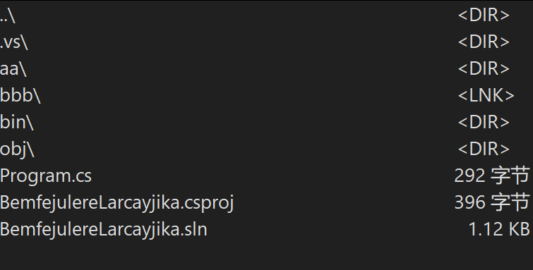
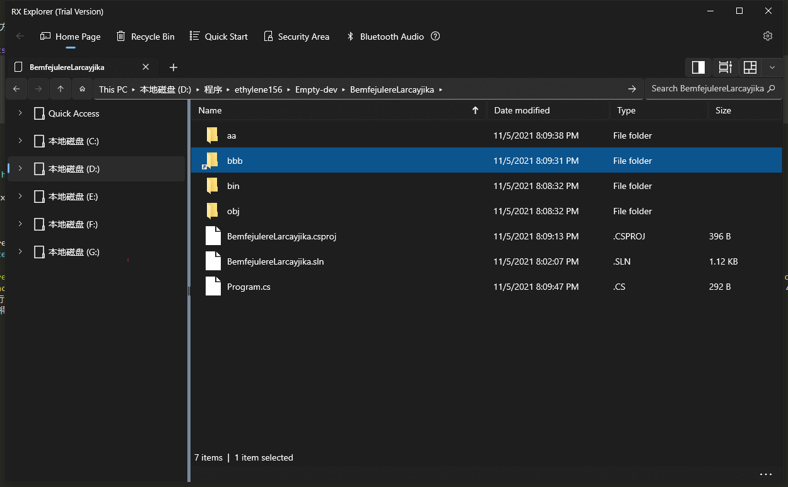
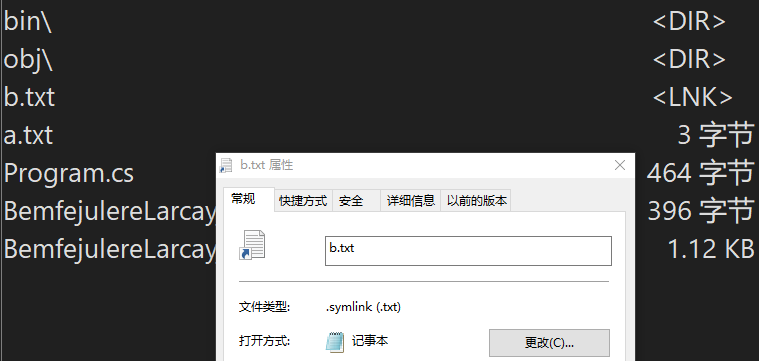

# dotnet 6 使用 CreateSymbolicLink 创建文件夹符号链接

本文告诉大家如何使用 dotnet 6 提供的 Directory.CreateSymbolicLink 和 File.CreateSymbolicLink 方法创建文件夹和文件的符号链接

<!--more-->
<!-- CreateTime:2021/11/5 20:10:55 -->


<!-- 发布 -->

## Directory.CreateSymbolicLink

### 例子

使用方法十分简单，如下面例子，给 aa 文件夹创建一个叫 bb 文件夹的符号链接

```csharp
        public static void Main(string[] args)
        {
            var a = Directory.CreateDirectory("aa");

            Directory.CreateSymbolicLink("bbb", a.FullName);
        }
```

### 效果

执行上述代码的效果如下

<!--  -->


在 [Rx-Explorer](https://www.microsoft.com/store/productId/9N88QBQKF2RS) 里的效果如下

<!--  -->


### 更多细节

这个 CreateSymbolicLink 方法是有返回值的，创建成功文件夹链接，将会返回文件夹对应的 DirectoryInfo 值

```csharp
            var result = Directory.CreateSymbolicLink("bbb", a.FullName) as DirectoryInfo;

            // 输出 bbb 文件夹
            Console.WriteLine(result.FullName);
```

### 行为特例

- 如果传入的 `pathToTarget` 参数，也就是上面代码的 `a.FullName` 参数，如果是文件，那么以上函数将继续成功执行，创建出一个不可用的文件夹链接

- 在当 `path` 参数，也就是上面代码的 `"bbb"` 参数，存在文件夹的时候，将会失败，抛出 `System.IO.IOException: Cannot create 'bbb' because a file or directory with the same name already exists.` 错误

### 代码

以上所有代码放在 [github](https://github.com/lindexi/lindexi_gd/tree/0d632e7c1b7e9245744c9816d2c91b3ba94e1838/BemfejulereLarcayjika) 和 [gitee](https://gitee.com/lindexi/lindexi_gd/tree/0d632e7c1b7e9245744c9816d2c91b3ba94e1838/BemfejulereLarcayjika) 欢迎访问

可以通过如下方式获取本文代码

先创建一个空文件夹，接着使用命令行 cd 命令进入此空文件夹，在命令行里面输入以下代码，即可获取到本文的代码

```
git init
git remote add origin https://gitee.com/lindexi/lindexi_gd.git
git pull origin 0d632e7c1b7e9245744c9816d2c91b3ba94e1838
```

以上使用的是 gitee 的源，如果 gitee 不能访问，请替换为 github 的源

```
git remote remove origin
git remote add origin https://github.com/lindexi/lindexi_gd.git
```

获取代码之后，进入 BemfejulereLarcayjika 文件夹

## File.CreateSymbolicLink

### 例子

使用 File.CreateSymbolicLink 的方法和使用 Directory.CreateSymbolicLink 的差不多，不同的在于类型不相同和传入的参数要求是文件而已，如下面代码

```csharp
            File.WriteAllText("a.txt", "123");

            var result = File.CreateSymbolicLink("b.txt", "a.txt") as FileInfo;

            // 输出 b 文件
            Console.WriteLine(result.FullName);

            Console.WriteLine(File.ReadAllText("b.txt"));
```

可以看到符号链接的文件对于上层应用来说和其他文件是相同的用法，如上面代码，读取 `b.txt` 文件就和读取 `a.txt` 一样

### 效果

执行上面的代码可以看到如下的效果

<!--  -->


尝试双击 b.txt 用记事本打开，记事本里面看到的是 `a.txt` 的内容，编辑也是对 a.txt 生效，如何 Windows API 的定义

### 行为特例

假定使用 File.CreateSymbolicLink 方法，传入的作为符号链接的是文件夹，那么将会抛出 `System.UnauthorizedAccessException` 异常，当前是 2021.11.06 使用 .NET 6-rc2 也许后续版本会更改行为

如果传入的文件是不存在的，也就是上面代码的 `a.txt` 假定是不存在的，将会抛出 `System.IO.FileNotFoundException` 错误

### 代码

在上面的代码仓库基础上，切换到 `a423c63cb7bbd2a92a7e2daf59a8eb336b5e22c2` 的 commit 即可拿到代码，可以使用如下命令进行切换

```csharp
git pull origin a423c63cb7bbd2a92a7e2daf59a8eb336b5e22c2
```

## 参考

参考文档： 

- [Directory.CreateSymbolicLink(String, String) Method (System.IO)](https://docs.microsoft.com/en-us/dotnet/api/system.io.directory.createsymboliclink?view=net-6.0&WT.mc_id=WD-MVP-5003260 )
- [File.CreateSymbolicLink(String, String) Method (System.IO)](https://docs.microsoft.com/en-us/dotnet/api/system.io.file.createsymboliclink?view=net-6.0&WT.mc_id=WD-MVP-5003260 )

## 更多文档

更多链接相关请看：

- [.NET 实现 NTFS 文件系统的硬链接 mklink /J（Junction） - walterlv](https://blog.walterlv.com/post/mklink-junction-in-dotnet.html )
- [解决 mklink 使用中的各种坑（硬链接，软链接/符号链接，目录链接） - walterlv](https://blog.walterlv.com/post/problems-of-mklink.html )

<a rel="license" href="http://creativecommons.org/licenses/by-nc-sa/4.0/"></a><br />本作品采用<a rel="license" href="http://creativecommons.org/licenses/by-nc-sa/4.0/">知识共享署名-非商业性使用-相同方式共享 4.0 国际许可协议</a>进行许可。欢迎转载、使用、重新发布，但务必保留文章署名[林德熙](http://blog.csdn.net/lindexi_gd)(包含链接:http://blog.csdn.net/lindexi_gd )，不得用于商业目的，基于本文修改后的作品务必以相同的许可发布。如有任何疑问，请与我[联系](mailto:lindexi_gd@163.com)。
