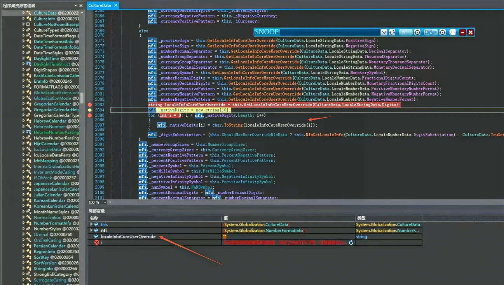

# dotnet 6 已知问题 获取 CultureInfo.NumberFormat 可能抛出 IndexOutOfRangeException 异常

本文记录一个 dotnet 6 已知问题，准确来说这是一个在 dotnet 5 引入的问题，到 dotnet 6.0.12 还没修。在获取 CultureInfo.NumberFormat 属性时，在一些奇怪的 Windows 设备上可能抛出 IndexOutOfRangeException 异常。本文将来告诉大家问题的原因和解决方法

<!--more-->
<!-- 博客 -->
<!-- 发布 -->

最简复现代码

```csharp
_ = new CultureInfo("en-US").NumberFormat;
```

在一些语言文化奇怪的系统上运行，以上代码将会抛出 IndexOutOfRangeException 异常。这个问题其中的一个影响就是会让 WPF 应用程序的 TextBlock 在布局时抛出 IndexOutOfRangeException 而失败。如果刚好全局捕获异常，且无视，那将会无限抛出

## 解决方法

可以先切换回 NLS 方案，切换方法是设置环境变量 `DOTNET_SYSTEM_GLOBALIZATION_USENLS` 为 true 即可，详细请看 [Globalization and ICU - .NET Microsoft Learn](https://learn.microsoft.com/en-us/dotnet/core/extensions/globalization-icu )

此问题在 .NET 运行时已修复，详细请看 [https://github.com/dotnet/runtime/pull/58598](https://github.com/dotnet/runtime/pull/58598) 

也可以升级到 .NET 7 解决此问题

## 问题原因

此问题已报告给 .NET 官方，请看 [https://github.com/dotnet/runtime/issues/83764](https://github.com/dotnet/runtime/issues/83764)

这个异常是在 .NET 5 引入的，根据[官方文档](https://learn.microsoft.com/en-us/dotnet/core/extensions/globalization-icu)可以了解到，在 .NET 5 之前，语言文化是调用平台相关的，也就是在 Windows 下调用的是  National Language Support (NLS) 进行语言文化格式化。在 .NET 5 才使用 International Components for Unicode (ICU) 进行格式化

而此问题就是设备的 ICU 存在问题导致的，更底层系统是什么问题，我没有了解到

在获取数字的语言文化时，将会进入 `CultureData.GetNFIValues` 方法，这个方法是采用如下代码来获取的

```csharp
 // LOCALE_SNATIVEDIGITS (array of 10 single character strings). 
 string digits = GetLocaleInfoCoreUserOverride(LocaleStringData.Digits); 
 nfi._nativeDigits = new string[10]; 
 for (int i = 0; i < nfi._nativeDigits.Length; i++) 
 { 
     nfi._nativeDigits[i] = char.ToString(digits[i]); 
 } 
```

以上代码存在一个问题，那就是 GetLocaleInfoCoreUserOverride 函数可能返回一个空字符串，这就导致了 `nfi._nativeDigits[i] = char.ToString(digits[i]);` 获取 10 个字符时抛出异常

什么时候 GetLocaleInfoCoreUserOverride 函数返回空字符串？这个函数底层将调用到 `CultureData.IcuGetLocaleInfo` 函数，代码如下

```csharp
        private string GetLocaleInfoCoreUserOverride(LocaleStringData type)
        {
            return ShouldUseUserOverrideNlsData ? NlsGetLocaleInfo(type) : IcuGetLocaleInfo(type);
        }
```

以上的 `ShouldUseUserOverrideNlsData` 默认值就是 false 值，只有设置环境变量 `DOTNET_SYSTEM_GLOBALIZATION_USENLS` 为 true 等方法才会是 true 的值，详细请看 [Globalization and ICU - .NET Microsoft Learn](https://learn.microsoft.com/en-us/dotnet/core/extensions/globalization-icu )

在 IcuGetLocaleInfo 函数里面是如此实现的，调用 GetLocaleInfoString 获取，如果获取失败，那就返回空字符串

```csharp
 bool result = Interop.Globalization.GetLocaleInfoString(localeName, (uint)type, buffer, ICU_ULOC_KEYWORD_AND_VALUES_CAPACITY, uiCultureName); 
 if (!result) 
 { 
     // Failed, just use empty string 
     Debug.Fail("[CultureData.IcuGetLocaleInfo(LocaleStringData)] Failed"); 
     return string.Empty; 
 } 
 return new string(buffer); 
```

因此 GetLocaleInfoCoreUserOverride 是可能在此情况下返回空字符串的。由于这是 ICU 引入的问题，通过以上代码也可以知道，只需要让 ShouldUseUserOverrideNlsData 为 true 即可不调用 IcuGetLocaleInfo 方法，换成 NlsGetLocaleInfo 方法，走 NLS 从而修复此问题

<!--  -->


在 .NET 7 将判断返回值是空字符串，准确来说是对于 10 个字符，将返回的格式化字符串数组而不是强行读取。因此这个问题就在 .NET 7 修复