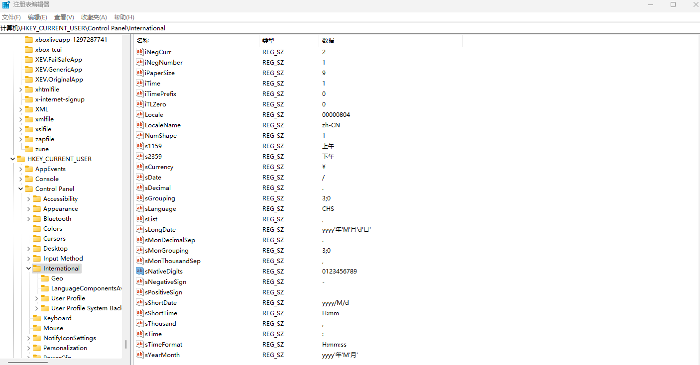

# dotnet 6 已知问题 获取 CultureInfo.NumberFormat 可能抛出 IndexOutOfRangeException 异常

本文记录一个 dotnet 6 已知问题，准确来说这是一个在 dotnet 5 引入的问题，到 dotnet 6.0.12 还没修。在获取 CultureInfo.NumberFormat 属性时，在一些奇怪的 Windows 设备上可能抛出 IndexOutOfRangeException 异常。本文将来告诉大家问题的原因和解决方法

<!--more-->
<!-- CreateTime:2023/3/22 16:18:29 -->

<!-- 博客 -->
<!-- 发布 -->

最简复现代码

```csharp
_ = new CultureInfo("en-US").NumberFormat;
```

在一些语言文化奇怪的系统上运行，以上代码将会抛出 IndexOutOfRangeException 异常。这个问题其中的一个影响就是会让 WPF 应用程序的 TextBlock 在布局时抛出 IndexOutOfRangeException 而失败。如果刚好全局捕获异常，且无视，那将会无限抛出

异常堆栈如下

```
>  PresentationCore.dll!MS.Internal.TextFormatting.DigitState.HasLatinDigits(System.Globalization.CultureInfo culture)
   PresentationCore.dll!MS.Internal.TextFormatting.DigitState.GetDigitCulture(System.Globalization.CultureInfo numberCulture, System.Windows.Media.NumberSubstitutionMethod method, out bool contextual)
   PresentationCore.dll!MS.Internal.TextFormatting.DigitState.SetTextRunProperties(System.Windows.Media.TextFormatting.TextRunProperties properties)
   PresentationCore.dll!MS.Internal.TextFormatting.SimpleRun.Create(MS.Internal.TextFormatting.FormatSettings settings, System.Windows.Media.TextFormatting.CharacterBufferRange charString, System.Windows.Media.TextFormatting.TextRun textRun, int cp, int cpFirst, int runLength, int widthLeft, int idealRunOffsetUnRounded, double pixelsPerDip)
   PresentationCore.dll!MS.Internal.TextFormatting.SimpleTextLine.Create(MS.Internal.TextFormatting.FormatSettings settings, int cpFirst, int paragraphWidth, double pixelsPerDip)
   PresentationCore.dll!MS.Internal.TextFormatting.TextFormatterImp.FormatLineInternal(System.Windows.Media.TextFormatting.TextSource textSource, int firstCharIndex, int lineLength, double paragraphWidth, System.Windows.Media.TextFormatting.TextParagraphProperties paragraphProperties, System.Windows.Media.TextFormatting.TextLineBreak previousLineBreak, System.Windows.Media.TextFormatting.TextRunCache textRunCache)
   PresentationCore.dll!MS.Internal.TextFormatting.TextFormatterImp.FormatLine(System.Windows.Media.TextFormatting.TextSource textSource, int firstCharIndex, double paragraphWidth, System.Windows.Media.TextFormatting.TextParagraphProperties paragraphProperties, System.Windows.Media.TextFormatting.TextLineBreak previousLineBreak, System.Windows.Media.TextFormatting.TextRunCache textRunCache)
   PresentationFramework.dll!System.Windows.Controls.TextBlock.MeasureOverride(System.Windows.Size constraint)
   PresentationFramework.dll!System.Windows.FrameworkElement.MeasureCore(System.Windows.Size availableSize)
   PresentationCore.dll!System.Windows.UIElement.Measure(System.Windows.Size availableSize)
   PresentationFramework.dll!System.Windows.Controls.Grid.MeasureOverride(System.Windows.Size constraint)
   PresentationFramework.dll!System.Windows.FrameworkElement.MeasureCore(System.Windows.Size availableSize)
   PresentationCore.dll!System.Windows.UIElement.Measure(System.Windows.Size availableSize)
   PresentationFramework.dll!MS.Internal.Helper.MeasureElementWithSingleChild(System.Windows.UIElement element, System.Windows.Size constraint)
   PresentationFramework.dll!System.Windows.FrameworkElement.MeasureCore(System.Windows.Size availableSize)
   PresentationCore.dll!System.Windows.UIElement.Measure(System.Windows.Size availableSize)
   PresentationFramework.dll!System.Windows.Controls.Decorator.MeasureOverride(System.Windows.Size constraint)
   PresentationFramework.dll!System.Windows.Documents.AdornerDecorator.MeasureOverride(System.Windows.Size constraint)
   PresentationFramework.dll!System.Windows.FrameworkElement.MeasureCore(System.Windows.Size availableSize)
   PresentationCore.dll!System.Windows.UIElement.Measure(System.Windows.Size availableSize)
   PresentationFramework.dll!System.Windows.Controls.Border.MeasureOverride(System.Windows.Size constraint)
   PresentationFramework.dll!System.Windows.FrameworkElement.MeasureCore(System.Windows.Size availableSize)
   PresentationCore.dll!System.Windows.UIElement.Measure(System.Windows.Size availableSize)
   PresentationFramework.dll!System.Windows.Window.MeasureOverrideHelper(System.Windows.Size constraint)
   PresentationFramework.dll!System.Windows.Window.MeasureOverride(System.Windows.Size availableSize)
   PresentationFramework.dll!System.Windows.FrameworkElement.MeasureCore(System.Windows.Size availableSize)
   PresentationCore.dll!System.Windows.UIElement.Measure(System.Windows.Size availableSize)
   PresentationCore.dll!System.Windows.Interop.HwndSource.SetLayoutSize()
   PresentationCore.dll!System.Windows.Interop.HwndSource.RootVisualInternal.set(System.Windows.Media.Visual value)
   PresentationFramework.dll!System.Windows.Window.SetRootVisualAndUpdateSTC()
   PresentationFramework.dll!System.Windows.Window.SetupInitialState(double requestedTop, double requestedLeft, double requestedWidth, double requestedHeight)
   PresentationFramework.dll!System.Windows.Window.CreateSourceWindow(bool duringShow)
   PresentationFramework.dll!System.Windows.Window.ShowHelper(object booleanBox)
   WindowsBase.dll!System.Windows.Threading.ExceptionWrapper.InternalRealCall(System.Delegate callback, object args, int numArgs)
   WindowsBase.dll!System.Windows.Threading.ExceptionWrapper.TryCatchWhen(object source, System.Delegate callback, object args, int numArgs, System.Delegate catchHandler)
   WindowsBase.dll!System.Windows.Threading.DispatcherOperation.InvokeImpl()
   WindowsBase.dll!MS.Internal.CulturePreservingExecutionContext.CallbackWrapper(object obj)
   System.Private.CoreLib.dll!System.Threading.ExecutionContext.RunInternal(System.Threading.ExecutionContext executionContext, System.Threading.ContextCallback callback, object state)
   WindowsBase.dll!MS.Internal.CulturePreservingExecutionContext.Run(MS.Internal.CulturePreservingExecutionContext executionContext, System.Threading.ContextCallback callback, object state)
   WindowsBase.dll!System.Windows.Threading.DispatcherOperation.Invoke()
   WindowsBase.dll!System.Windows.Threading.Dispatcher.ProcessQueue()
   WindowsBase.dll!System.Windows.Threading.Dispatcher.WndProcHook(nint hwnd, int msg, nint wParam, nint lParam, ref bool handled)
   WindowsBase.dll!MS.Win32.HwndWrapper.WndProc(nint hwnd, int msg, nint wParam, nint lParam, ref bool handled)
   WindowsBase.dll!MS.Win32.HwndSubclass.DispatcherCallbackOperation(object o)
   WindowsBase.dll!System.Windows.Threading.ExceptionWrapper.InternalRealCall(System.Delegate callback, object args, int numArgs)
   WindowsBase.dll!System.Windows.Threading.ExceptionWrapper.TryCatchWhen(object source, System.Delegate callback, object args, int numArgs, System.Delegate catchHandler)
   WindowsBase.dll!System.Windows.Threading.Dispatcher.LegacyInvokeImpl(System.Windows.Threading.DispatcherPriority priority, System.TimeSpan timeout, System.Delegate method, object args, int numArgs)
   WindowsBase.dll!MS.Win32.HwndSubclass.SubclassWndProc(nint hwnd, int msg, nint wParam, nint lParam)
```

## 解决方法

可选以下任意方式解决

1. 尝试修复用户错误的设置，因为这个设置不仅影响 .NET 系应用，同时也影响任何做好国际化多语言的应用。前往注册表的 `HKEY_CURRENT_USER\Control Panel\International` 看一下 `sNativeDigits` 的内容，大部分情况下应该是 `0123456789` 才对。 另外，可以去控制面板的区域设置，更改日期、时间或数字格式，进入其他设置里面，点击重置
2. 切换回 NLS 方案，切换方法是设置环境变量 `DOTNET_SYSTEM_GLOBALIZATION_USENLS` 为 true 即可，详细请看 [Globalization and ICU - .NET Microsoft Learn](https://learn.microsoft.com/en-us/dotnet/core/extensions/globalization-icu )
3. 由于此问题在 .NET 7 运行时已修复，且官方无计划合入到 .NET 6 里。因此可以尝试更新自己的运行时到 .NET 7 版本，或者是挑拣 [https://github.com/dotnet/runtime/pull/58598](https://github.com/dotnet/runtime/pull/58598) 的更改到自己的 .NET 6 运行时，进行私有发布

下图是注册表的配置：

<!--  -->


如果是 .NET 系的非 WPF 应用，这个异常是在自己应用程序代码抛出的，可选采用忽略用户配置的方式，在创建 CultureInfo 对象时，可以传入参数，表示是否使用用户配置，如以下代码

```csharp
var numberFormat = new CultureInfo("en-US", false).NumberFormat;
```

## 问题原因

此问题已报告给 .NET 官方，请看 [https://github.com/dotnet/runtime/issues/83764](https://github.com/dotnet/runtime/issues/83764)

同步也报告给 WPF 官方，请看 [https://github.com/dotnet/wpf/issues/7658](https://github.com/dotnet/wpf/issues/7658)

这个异常是在 .NET 5 引入的，根据[官方文档](https://learn.microsoft.com/en-us/dotnet/core/extensions/globalization-icu)可以了解到，在 .NET 5 之前，语言文化是调用平台相关的，也就是在 Windows 下调用的是  National Language Support (NLS) 进行语言文化格式化。在 .NET 5 才使用 International Components for Unicode (ICU) 进行格式化

而此问题就是设备的 ICU 存在问题导致的，更底层系统是什么问题，我没有了解到

在获取数字的语言文化时，将会进入 `CultureData.GetNFIValues` 方法，这个方法是采用如下代码来获取的

```csharp
 // LOCALE_SNATIVEDIGITS (array of 10 single character strings). 
 string digits = GetLocaleInfoCoreUserOverride(LocaleStringData.Digits); 
 nfi._nativeDigits = new string[10]; 
 for (int i = 0; i < nfi._nativeDigits.Length; i++) 
 { 
     nfi._nativeDigits[i] = char.ToString(digits[i]); 
 } 
```

以上代码存在一个问题，那就是 GetLocaleInfoCoreUserOverride 函数可能返回一个空字符串，这就导致了 `nfi._nativeDigits[i] = char.ToString(digits[i]);` 获取 10 个字符时抛出异常

什么时候 GetLocaleInfoCoreUserOverride 函数返回空字符串？这个函数底层将调用到 `CultureData.IcuGetLocaleInfo` 函数，代码如下

```csharp
        private string GetLocaleInfoCoreUserOverride(LocaleStringData type)
        {
            return ShouldUseUserOverrideNlsData ? NlsGetLocaleInfo(type) : IcuGetLocaleInfo(type);
        }
```

以上的 `ShouldUseUserOverrideNlsData` 默认值就是 false 值，只有设置环境变量 `DOTNET_SYSTEM_GLOBALIZATION_USENLS` 为 true 等方法才会是 true 的值，详细请看 [Globalization and ICU - .NET Microsoft Learn](https://learn.microsoft.com/en-us/dotnet/core/extensions/globalization-icu )

在 IcuGetLocaleInfo 函数里面是如此实现的，调用 GetLocaleInfoString 获取，如果获取失败，那就返回空字符串

```csharp
 bool result = Interop.Globalization.GetLocaleInfoString(localeName, (uint)type, buffer, ICU_ULOC_KEYWORD_AND_VALUES_CAPACITY, uiCultureName); 
 if (!result) 
 { 
     // Failed, just use empty string 
     Debug.Fail("[CultureData.IcuGetLocaleInfo(LocaleStringData)] Failed"); 
     return string.Empty; 
 } 
 return new string(buffer); 
```

因此 GetLocaleInfoCoreUserOverride 是可能在此情况下返回空字符串的。由于这是 ICU 引入的问题，通过以上代码也可以知道，只需要让 ShouldUseUserOverrideNlsData 为 true 即可不调用 IcuGetLocaleInfo 方法，换成 NlsGetLocaleInfo 方法，走 NLS 从而修复此问题

<!--  -->


在 .NET 7 将判断返回值是空字符串，准确来说是对于 10 个字符，将返回的格式化字符串数组而不是强行读取

此问题会影响到 WPF 的原因是在 WPF 里面，默认的 XAML 语言格式化，在没有明确设置时，将会使用 `en-US` 文化，这是在 FrameworkElement 里面定义的，请看代码

```csharp
 static public readonly DependencyProperty LanguageProperty = 
             DependencyProperty.RegisterAttached( 
                         "Language", 
                         typeof(XmlLanguage), 
                         _typeofThis, 
                         new FrameworkPropertyMetadata( 
                                 XmlLanguage.GetLanguage("en-US"), 
                                 FrameworkPropertyMetadataOptions.Inherits | FrameworkPropertyMetadataOptions.AffectsMeasure)); 
```

在 TextBlock 里面，将会使用此 XAML 语言文化获取 CultureInfo 类型，调用堆栈如下

```
>  PresentationCore.dll!System.Windows.Markup.XmlLanguage.GetSpecificCulture()
   PresentationFramework.dll!MS.Internal.Text.DynamicPropertyReader.GetCultureInfo(System.Windows.DependencyObject element)
   PresentationFramework.dll!MS.Internal.Text.TextProperties.InitCommon(System.Windows.DependencyObject target)
   PresentationFramework.dll!MS.Internal.Text.TextProperties.TextProperties(System.Windows.FrameworkElement target, bool isTypographyDefaultValue)
   PresentationFramework.dll!System.Windows.Controls.TextBlock.GetLineProperties()
   PresentationFramework.dll!System.Windows.Controls.TextBlock.EnsureTextBlockCache()
   PresentationFramework.dll!System.Windows.Controls.TextBlock.MeasureOverride(System.Windows.Size constraint)
```

在 `XmlLanguage.GetSpecificCulture` 里面将会调用 `CultureInfo.GetCultureInfoByIetfLanguageTag` 获取 CultureInfo 类型。默认情况下传入参数就是 `en-US` 且会使用用户配置

通过异常的调用堆栈可以看到是在 `DigitState.HasLatinDigits` 函数里炸掉的，此函数的 culture 参数就是以上 `XmlLanguage.GetSpecificCulture` 获取到的值

```
>  PresentationCore.dll!MS.Internal.TextFormatting.DigitState.HasLatinDigits(System.Globalization.CultureInfo culture)
   PresentationCore.dll!MS.Internal.TextFormatting.DigitState.GetDigitCulture(System.Globalization.CultureInfo numberCulture, System.Windows.Media.NumberSubstitutionMethod method, out bool contextual)
   PresentationCore.dll!MS.Internal.TextFormatting.DigitState.SetTextRunProperties(System.Windows.Media.TextFormatting.TextRunProperties properties)
   PresentationCore.dll!MS.Internal.TextFormatting.SimpleRun.Create(MS.Internal.TextFormatting.FormatSettings settings, System.Windows.Media.TextFormatting.CharacterBufferRange charString, System.Windows.Media.TextFormatting.TextRun textRun, int cp, int cpFirst, int runLength, int widthLeft, int idealRunOffsetUnRounded, double pixelsPerDip)
   PresentationCore.dll!MS.Internal.TextFormatting.SimpleTextLine.Create(MS.Internal.TextFormatting.FormatSettings settings, int cpFirst, int paragraphWidth, double pixelsPerDip)
   PresentationCore.dll!MS.Internal.TextFormatting.TextFormatterImp.FormatLineInternal(System.Windows.Media.TextFormatting.TextSource textSource, int firstCharIndex, int lineLength, double paragraphWidth, System.Windows.Media.TextFormatting.TextParagraphProperties paragraphProperties, System.Windows.Media.TextFormatting.TextLineBreak previousLineBreak, System.Windows.Media.TextFormatting.TextRunCache textRunCache)
   PresentationCore.dll!MS.Internal.TextFormatting.TextFormatterImp.FormatLine(System.Windows.Media.TextFormatting.TextSource textSource, int firstCharIndex, double paragraphWidth, System.Windows.Media.TextFormatting.TextParagraphProperties paragraphProperties, System.Windows.Media.TextFormatting.TextLineBreak previousLineBreak, System.Windows.Media.TextFormatting.TextRunCache textRunCache)
   PresentationFramework.dll!System.Windows.Controls.TextBlock.MeasureOverride(System.Windows.Size constraint)
   PresentationFramework.dll!System.Windows.FrameworkElement.MeasureCore(System.Windows.Size availableSize)
   PresentationCore.dll!System.Windows.UIElement.Measure(System.Windows.Size availableSize)
```

在 HasLatinDigits 里面用到了 CultureInfo 的 NumberFormat 属性，从而导致炸掉，请看代码

```csharp
 private static bool HasLatinDigits(CultureInfo culture) 
 { 
     string[] digits = culture.NumberFormat.NativeDigits; 
     for (int i = 0; i < 10; ++i) 
     { 
         string d = digits[i]; 
         if (d.Length != 1 || d[0] != (char)('0' + i)) 
             return false; 
     } 
     return true; 
 } 
```

这就是为什么此 .NET 运行时的问题影响 WPF 应用的原因

即使修了 TextBlock 里的这个模块，依然还有其他好多模块可能炸掉，同时 .NET 运行时底层也在 .NET 7 修复了此问题，且用户端也有规避方法，因此我就关闭了问题