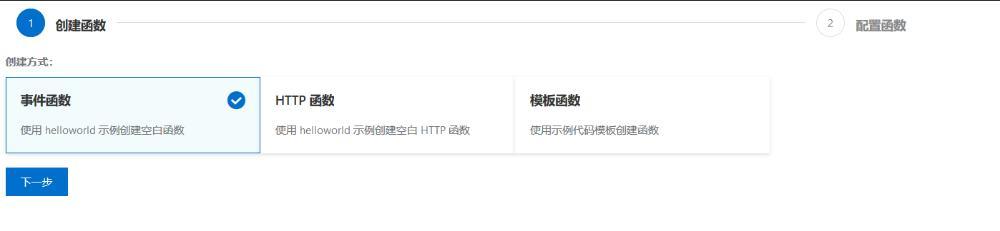
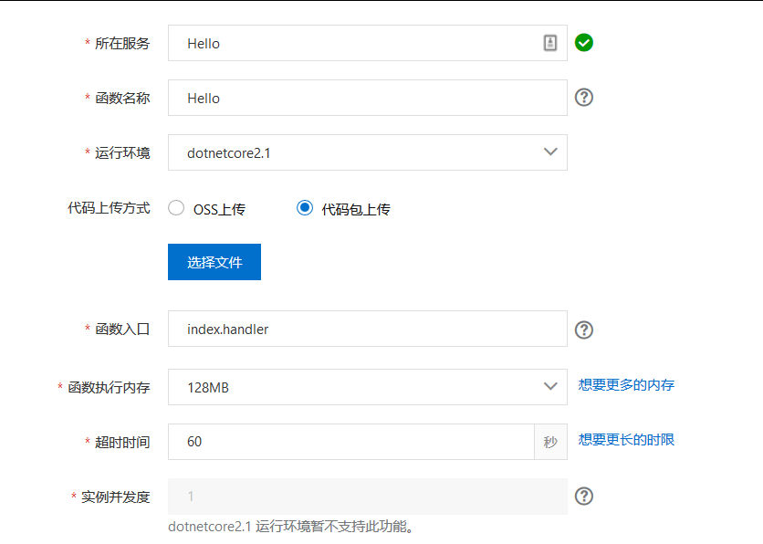

# dotnet C# 使用阿里函数计算服务

现在有很多函数计算服务，通过函数计算服务可以在服务上运行自己的代码，而不需要理会服务器的部署以及运行代码存在的并发问题。这些问题都会在云进行计算。使用阿里的函数计算服务可以使用 dotnet core 2.1 的框架，同时测试使用免费。本文告诉搭建如何在阿里的函数计算服务上运行自己的代码

<!--more-->
<!-- CreateTime:2020/1/4 8:48:02 -->

<!-- 发布 -->

首先是打开阿里云 [https://cn.aliyun.com](https://cn.aliyun.com) 进入[函数计算](https://www.aliyun.com/product/fc)服务

点击进入[函数计算控制台](https://fc.console.aliyun.com/fc/overview/cn-shanghai)在右边的快速入口点击新建函数

<!--  -->


先创建事件函数，这个函数最简单

<!--  -->


下一步需要选择使用 dotnet core 2.1 服务，然后填写所在服务和函数名称，这里的函数入口的填写将会存在一点坑，可以先使用默认的值，接下来再修改

<!--  -->


先尝试在本地创建一个 dotnet core 2.1 版本的控制台项目，注意创建的框架需要使用 dotnet core 2.1 版本，可以在 csproj 文件里面通过修改 TargetFramework 的值修改版本

```csharp
<Project Sdk="Microsoft.NET.Sdk">

  <PropertyGroup>
    <OutputType>Exe</OutputType>
    <TargetFramework>netcoreapp2.1</TargetFramework>
  </PropertyGroup>

</Project>

```

在 Program.cs 文件里面添加一个静态的公开的方法 Foo 用于在阿里服务器上执行，注意将 Program 类修改为公有

```csharp
using System;

namespace RaweayerkeJebarkewere
{
    public class Program
    {
        public static void Main()
        {
            Console.WriteLine("Hello World!");
        }

        public static void Foo(object o)
        {
            Console.WriteLine("Hello World!");
        }
    }
}
```

为什么 Foo 方法需要一个 object 的参数，这是因为在 阿里服务器将会通过反射调用 Foo 方法，要求调用的方法存在一个参数

此时写好代码，通过命令行编译一下，可以上传的代码是 debug 版的，将 `bin\Debug\netcoreapp2.1\` 文件夹压缩，此时要求压缩包里面根文件夹就包含了 `*.dll` 文件

我创建的控制台项目是 `RaweayerkeJebarkewere` 的命令，也就是在 `bin\Debug\netcoreapp2.1\` 创建了 `RaweayerkeJebarkewere.dll` 文件

返回刚才的阿里的函数计算创建页面，填写函数入口，这里的函数入口写起来有些诡异

```csharp
文件名::命名空间.类名::函数名
```

我这里的文件是`RaweayerkeJebarkewere.dll`也就是文件名是`RaweayerkeJebarkewere`而命名空间和类名就不用说了

函数名注意不需要加上括号

```csharp
RaweayerkeJebarkewere::RaweayerkeJebarkewere.Program::Foo
```

将压缩了 `RaweayerkeJebarkewere.dll` 的文件通过点击代码包上传

也就是填写所在服务和函数名称选择使用 dotnet core 2.1 加上函数入口就可以了

在跳转的代码执行页面点击执行就可以看到输出，如果可以输出那么运行就成功了

如果需要修改函数入口，请点击概览页面，然后点击配置就可以修改

<a rel="license" href="http://creativecommons.org/licenses/by-nc-sa/4.0/"></a><br />本作品采用<a rel="license" href="http://creativecommons.org/licenses/by-nc-sa/4.0/">知识共享署名-非商业性使用-相同方式共享 4.0 国际许可协议</a>进行许可。欢迎转载、使用、重新发布，但务必保留文章署名[林德熙](http://blog.csdn.net/lindexi_gd)(包含链接:http://blog.csdn.net/lindexi_gd )，不得用于商业目的，基于本文修改后的作品务必以相同的许可发布。如有任何疑问，请与我[联系](mailto:lindexi_gd@163.com)。  
