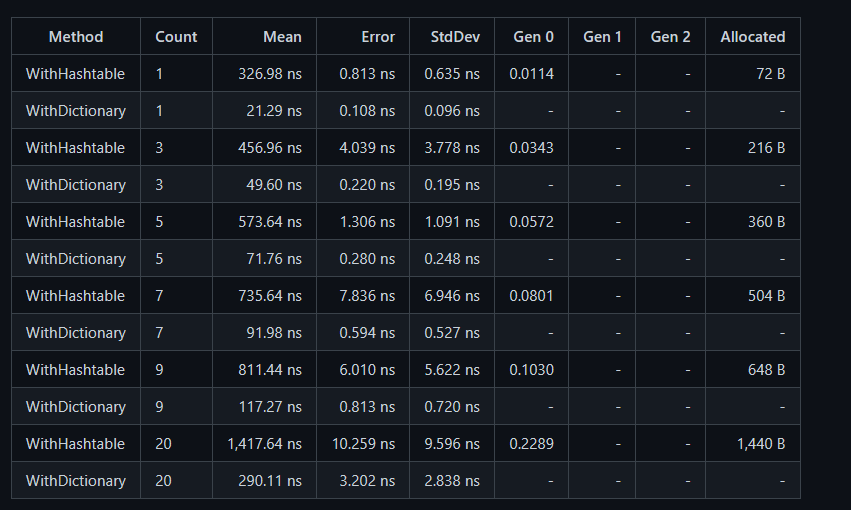

# dotnet C# 字典 Dictionary 和 Hashtable 的性能对比

如果没有特别的需求，请使用 Dictionary 而不是 Hashtable 原因是 Dictionary 的性能更好，本文将告诉大家 Stephen Toub 大佬的评测

<!--more-->
<!-- CreateTime:2021/6/24 8:42:14 -->

<!-- 发布 -->

从 2021 的 6 月 23 日，在 WPF 仓库里面，开始看到了性能优化狂魔 [Stephen Toub](https://github.com/stephentoub) 大佬给 WPF 做的性能优化

如在 [Use Dictionary instead of Hashtable in EventMap by stephentoub · Pull Request #4731 · dotnet/wpf](https://github.com/dotnet/wpf/pull/4731 ) 这里可以看到，他将使用 Dictionary 替换 Hashtable 类型用来做性能提升，同时也给出了性能评测

<!--  -->


大体来说就是 Hashtable 将会有额外的内存分配，如 Count 元素数量为 1 的时候，分配是 72B 的空间，同时在读写性能上，也不如字典来得快，性能差距大概是 10 倍左右。当哈希冲突大的时候，插入元素数量靠近分配的内存空间的时候，两者的性能差距将会从 10 倍逐步缩小为 5 倍的差距

以下是他的测试代码

```csharp
using BenchmarkDotNet.Attributes;
using BenchmarkDotNet.Running;
using System.Collections;
using System.Collections.Generic;
using System.Linq;

[MemoryDiagnoser]
public class Program
{
    static void Main(string[] args) => BenchmarkSwitcher.FromAssemblies(new[] { typeof(Program).Assembly }).Run(args);

    private readonly Hashtable _table = new Hashtable(20, .1f);
    private readonly Dictionary<int, object> _dictionary = new Dictionary<int, object>(20);
    private readonly object[] _objects = Enumerable.Range(0, 20).Select(_ => new object()).ToArray();

    [Params(1, 3, 5, 7, 9, 20)]
    public int Count { get; set; }

    [Benchmark]
    public void WithHashtable()
    {
        for (int i = 0; i < Count; i++)
        {
            _table.Add(i, _objects[i]);
        }
        for (int i = 0; i < Count; i++)
        {
            if (_table.ContainsKey(i))
            {
                object o = _table[i];
            }
        }
        _table.Clear();
    }

    [Benchmark]
    public void WithDictionary()
    {
        for (int i = 0; i < Count; i++)
        {
            _dictionary.Add(i, _objects[i]);
        }
        for (int i = 0; i < Count; i++)
        {
            if (_dictionary.TryGetValue(i, out object o))
            {
            }
        }
        _dictionary.Clear();
    }
}
```

以上代码可以从 [github](https://github.com/dotnet/wpf/pull/4731) 看到，上面用了基准（标准）性能测试的方法，关于如何在 .NET 里面做基准性能测试，请看 [C# 标准性能测试](https://blog.lindexi.com/post/C-%E6%A0%87%E5%87%86%E6%80%A7%E8%83%BD%E6%B5%8B%E8%AF%95.html )

此外在 WPF 仓库上，还有以下更改也是优化字典性能，其中还有我的更改

- [Replaced some Dictionaries and Hashtables with Hashsets by ThomasGoulet73 · Pull Request #4177 · dotnet/wpf](https://github.com/dotnet/wpf/pull/4177 )
- [Merge Dictionary.TryGetValue and Dictionary.Remove to Dictionary.Remove in NameFixupGraph by lindexi · Pull Request #4069 · dotnet/wpf](https://github.com/dotnet/wpf/pull/4069 )
- [Replace the Dictionary with HashSet in AppDomainShutdownMonitor by lindexi · Pull Request #3932 · dotnet/wpf](https://github.com/dotnet/wpf/pull/3932 )


<a rel="license" href="http://creativecommons.org/licenses/by-nc-sa/4.0/"></a><br />本作品采用<a rel="license" href="http://creativecommons.org/licenses/by-nc-sa/4.0/">知识共享署名-非商业性使用-相同方式共享 4.0 国际许可协议</a>进行许可。欢迎转载、使用、重新发布，但务必保留文章署名[林德熙](http://blog.csdn.net/lindexi_gd)(包含链接:http://blog.csdn.net/lindexi_gd )，不得用于商业目的，基于本文修改后的作品务必以相同的许可发布。如有任何疑问，请与我[联系](mailto:lindexi_gd@163.com)。  
