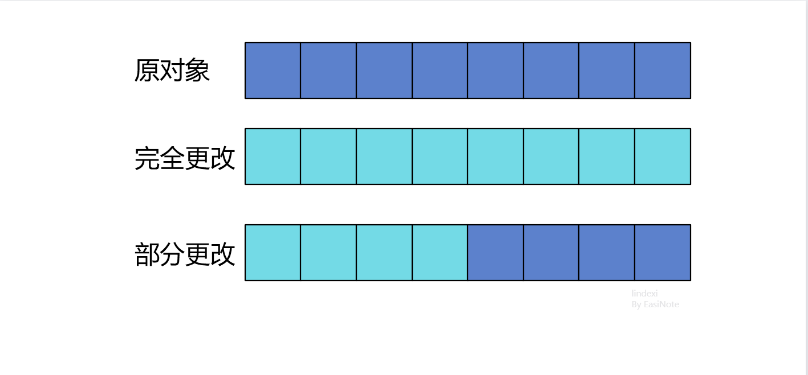
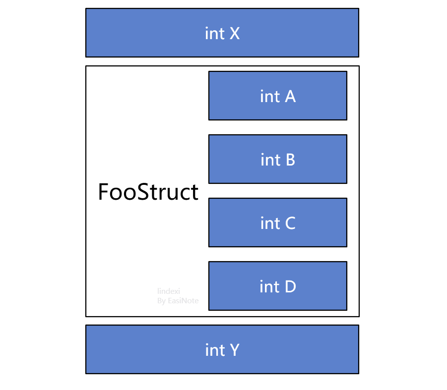

# dotnet C# 给结构体字段赋值非线程安全

在 dotnet 运行时中，给引用对象进行赋值替换的时候，是线程安全的。给结构体对象赋值，如果此结构体是某个类的成员字段，那么此赋值不一定是线程安全的。是否线程安全，取决于结构体的大小，取决于此结构体能否在一次原子赋值内完成

<!--more-->
<!-- 博客 -->
<!-- 发布 -->

大家都知道，某个执行逻辑如果是原子逻辑，那么此逻辑是线程安全的。原子逻辑就是一个非 A 即 B 的状态的变更，绝对不会存在处于 A 和 B 中间的状态。满足于此即可称为线程安全，因为线程不会读取到中间状态。在 dotnet 运行时里面，特别对了引用对象，也就是类对象的赋值过程进行了优化，可以让对象的赋值是原子的

从运行时的逻辑上，可以了解到的是引用对象的赋值本质上就是将新对象的引用地址赋值，对象引用地址可以认为是指针。在单次 CPU 运算中可以一次性完成，不会存在只写入某几位而还有某几位没有写入的情况

<!--  -->


大概可以认为在 x86 上，单次的原子赋值长度就是 32 位。这也就是为什么 dotnet 里面的对象地址设计为 32 位的原因

但是对于结构体来说，需要分为两个情况，定义在栈上的结构体，如某个方法的局部变量或参数是结构体，此时的结构体是存放在栈上的，而在 dotnet 里面，每个线程都有自己独立的栈，因此放在栈上的结构体在线程上是独立的，相互之间没有影响，也就是线程安全的

如果是放在堆上面的结构体，如作为某个类对象的字段，此时的结构体将会占用此类对象的内存空间，如对以下代码的内存示意图

```csharp
    class Foo
    {
        public int X; // 没有任何项目或理由可以公开字段，本文这里不规范的写法仅仅只是为了做演示而已 （Unity除外）
        public FooStruct FooStruct;
        public int Y;
    }

    struct FooStruct
    {
        public int A { set; get; }
        public int B { set; get; }
        public int C { set; get; }
        public int D { set; get; }
    }
```

此时的 Foo 对象在内存上的布局示意图大概如下

<!--  -->


如上面示意图，在内存布局上，将会在类内存布局上将结构体展开，占用类的一段内存空间。也就是说本质上结构体如命名，就是多个基础类型的组合，实际上是运行的概念。也就是说在给类对象的字段是结构体进行赋值的时候，每次赋值的内容仅仅是取决于原子长度，如 x86 下使用 32 位进行赋值，相当于先给 FooStruct 的 A 进行赋值，再给 FooStruct 的 B 进行赋值等等。此时如果有某个线程在进行赋值，某个线程在进行读取 Foo 对象的 FooStruct 字段，那么也许读取的线程会读取到正在赋值到一半的 FooStruct 结构体

如以下的测试代码

```csharp
    class Program
    {
        static void Main(string[] args)
        {
            var taskList = new List<Task>();

            for (int i = 0; i < 100; i++)
            {
                var n = i;
                taskList.Add(Task.Run(() =>
                {
                    while (Foo != null)
                    {
                        var fooStruct = new FooStruct()
                        {
                            A = n,
                            B = n,
                            C = n,
                            D = n
                        };

                        Foo.FooStruct = fooStruct;

                        fooStruct = Foo.FooStruct;
                        var value = fooStruct.A;
                        if (fooStruct.B != value)
                        {
                            throw new Exception();
                        }

                        if (fooStruct.C != value)
                        {
                            throw new Exception();
                        }

                        if (fooStruct.D != value)
                        {
                            throw new Exception();
                        }
                    }
                }));
            }

            Task.WaitAll(taskList.ToArray());
        }

        private static Foo Foo { get; } = new Foo();
    }
```

以上代码开启了很多线程，每个线程都在尝试读写此结构体。每次写入的赋值都是在 A B C D 给定相同的一个数值，在读取的时候判断是否读取到的每一个属性是否都是相同的数值，如果存在不同的，那么证明给结构体赋值是线程不安全的

运行以上代码，可以看到，在结构体中，存在属性的数值是不相同的。通过以上代码可以看到，放在类对象的字段的结构体，进行赋值是线程不安全的

本文所有代码放在[github](https://github.com/lindexi/lindexi_gd/tree/01a988dd6efdd0550ce0302ecbb93755f1720e85/YanibeyeNelahallfaihair) 和 [gitee](https://gitee.com/lindexi/lindexi_gd/tree/01a988dd6efdd0550ce0302ecbb93755f1720e85/YanibeyeNelahallfaihair) 欢迎访问

可以通过如下方式获取本文的源代码，先创建一个空文件夹，接着使用命令行 cd 命令进入此空文件夹，在命令行里面输入以下代码，即可获取到本文的代码

```
git init
git remote add origin https://gitee.com/lindexi/lindexi_gd.git
git pull origin 01a988dd6efdd0550ce0302ecbb93755f1720e85
```

以上使用的是 gitee 的源，如果 gitee 不能访问，请替换为 github 的源

```
git remote remove origin
git remote add origin https://github.com/lindexi/lindexi_gd.git
```

获取代码之后，进入 YanibeyeNelahallfaihair 文件夹

<a rel="license" href="http://creativecommons.org/licenses/by-nc-sa/4.0/"></a><br />本作品采用<a rel="license" href="http://creativecommons.org/licenses/by-nc-sa/4.0/">知识共享署名-非商业性使用-相同方式共享 4.0 国际许可协议</a>进行许可。欢迎转载、使用、重新发布，但务必保留文章署名[林德熙](http://blog.csdn.net/lindexi_gd)(包含链接:http://blog.csdn.net/lindexi_gd )，不得用于商业目的，基于本文修改后的作品务必以相同的许可发布。如有任何疑问，请与我[联系](mailto:lindexi_gd@163.com)。
