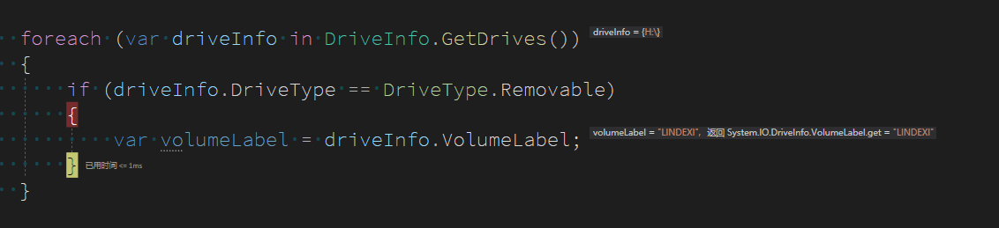
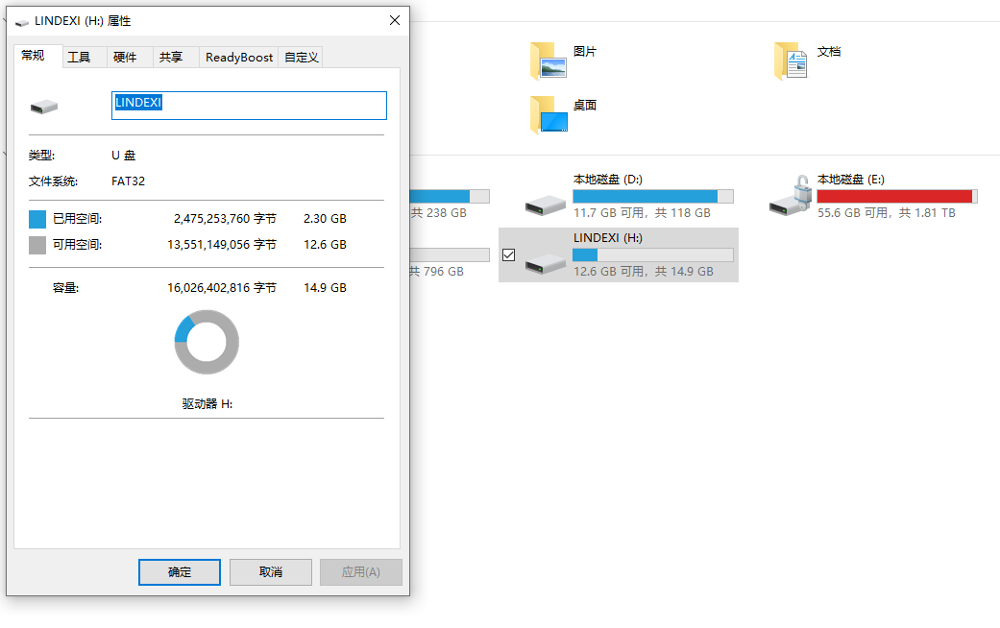

# dotnet C# 获取当前设备可移动磁盘

本文告诉大家如何获取当前设备的可移动磁盘

<!--more-->
<!-- 发布 -->

在我的 WPF 应用里面，期望获取到 U 盘的所在盘进行一些有趣的逻辑。可以通过 DriveInfo 类的 GetDrives 获取当前所有的驱动器磁盘

再通过 DriveType 枚举即可了解当前是否是可移动磁盘，如面代码

```csharp
            foreach (var driveInfo in DriveInfo.GetDrives())
            {
                if (driveInfo.DriveType == DriveType.Removable)
                {
                    
                }
            }
```

可以被删除的 Removable 就是可移动磁盘

<!--  -->


获取到的就是我插入的 U 盘

<!--  -->


<a rel="license" href="http://creativecommons.org/licenses/by-nc-sa/4.0/"></a><br />本作品采用<a rel="license" href="http://creativecommons.org/licenses/by-nc-sa/4.0/">知识共享署名-非商业性使用-相同方式共享 4.0 国际许可协议</a>进行许可。欢迎转载、使用、重新发布，但务必保留文章署名[林德熙](http://blog.csdn.net/lindexi_gd)(包含链接:http://blog.csdn.net/lindexi_gd )，不得用于商业目的，基于本文修改后的作品务必以相同的许可发布。如有任何疑问，请与我[联系](mailto:lindexi_gd@163.com)。
