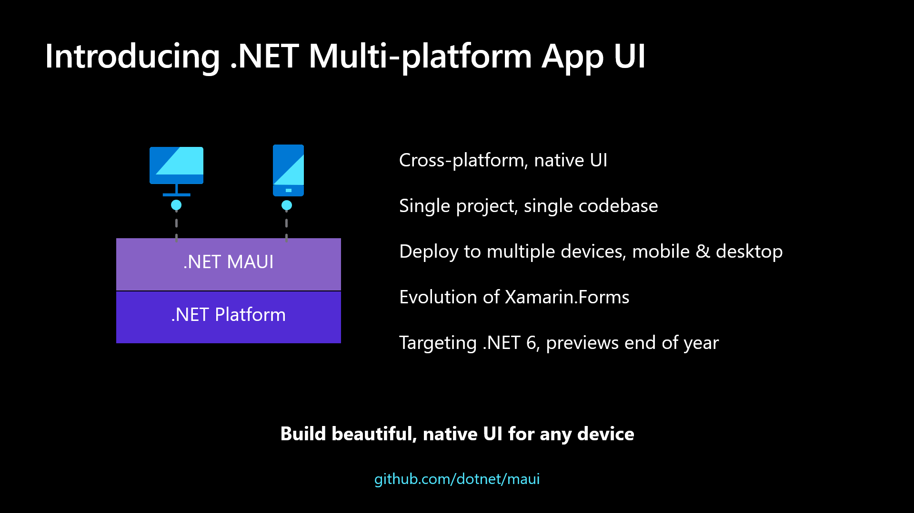
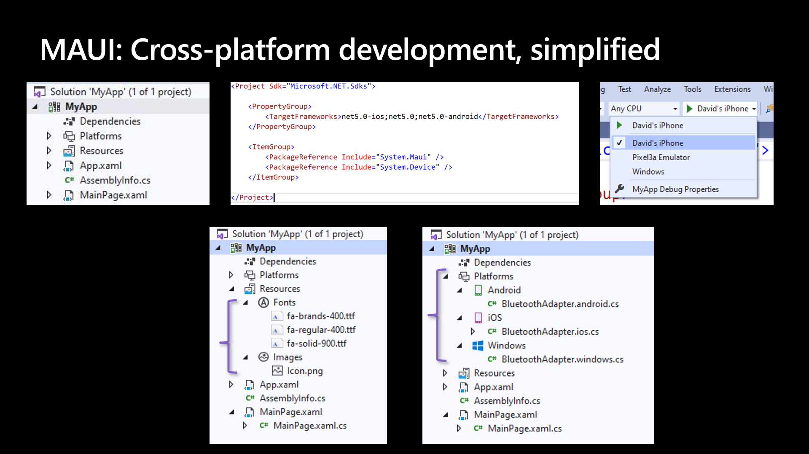

# dotnet Multi-platform App UI 多平台应用 UI 框架简介

现在可以使用 .NET 构建一切应用。富有生产力的 .NET 是当前数百万的开发者选择这个平台的理由。在 .NET 5 微软统一了整个 .NET 平台，将 .NET Core 和 Mono 以及基于 Mono 的 Xamarin 放在一起，于是就可以使用相同的一个 BCL 基础库和 SDK 工具链

<!--more-->
<!-- CreateTime:5/20/2020 8:38:04 AM -->

<!-- 发布 -->

当咱在考虑如何在 .NET 上构建一个跨平台应用的时候，需要关注的设备和系统包括 Windows 系统和设备和 Android 和 iOS 和 macOS 等。为了满足多平台开发的需求，微软改名部推出了一个新的 UI 框架叫 .NET Multi-platform App UI 简称 .NET MAUI 框架

让我们向您介绍 .NET MAUI 是什么，如何做到延续单个技术栈的经验，使用现代的开发模式，以及这项技术未来的发展趋势

<!--  -->


## 什么是 .NET MAUI 框架

其实 .NET MAUI 是延续具有 6 年历史的 Xamarin.Forms 工具包的框架，可以理解为这个动作是改名部大法的行为。很多年以来，都有很多商业公司，如这个链接 [https://dotnet.microsoft.com/apps/xamarin/customers](https://dotnet.microsoft.com/apps/xamarin/customers) 列举出来的公司，都在使用 Xamarin 用 .NET 来构建自己的业务，这对于 .NET MAUI 来说是一个特别好的开始。它在帮助小型企业最大化其 95％ 以上代码共享的开发资源并击败竞争对手进入市场方面也非常成功。 .NET MAUI 将这一成功扩展到了移动设备上，从而囊括了桌面设备，这是在两者之间构建多平台应用程序的最佳方法，尤其是我们的新设备，例如新的Surface Duo 设备

使用 .NET MAUI 简化了 .NET 开发人员的技术选择，提供了一个技术栈来支持所有现代工作开发如：Android，iOS，macOS和Windows平台的开发。 每个平台和UI控件的本机功能都可以通过一个简单的跨平台API触手可及，您可以在提供不妥协的用户体验的同时共享比以前更多的代码

## 单一技术栈的开发经验

.NET MAUI 的构建考虑了开发人员的生产力，包括开发人员需要的项目系统和跨平台工具。 .NET MAUI 框架将项目结构简化为一个针对多个平台的项目。 这意味着您只需单击一下鼠标，便可以轻松地将其部署到所需的任何目标，包括台式机，仿真器，模拟器或物理设备。 使用内置的跨平台资源，您可以将任何图像，字体或翻译文件添加到单个项目中，并且 .NET MAUI 将自动设置本机挂钩，以便您可以进行编码。 最后，您将始终可以访问本机底层操作系统API，在通过特定于新平台的集成可以让开发比以往更加轻松。在特定平台下，可以添加针对特定平台的代码用来访问平台相关的本地 API 接口。使用 .NET MAUI 可以让所有开发精力保持在一个地方，统一的技术栈的开发经验可以不断深耕提升生产力

<!--  -->


如上图所示，这提供了：

- 一个针对多个平台和设备的项目
- 一个位置来管理字体和图像等资源
- 多目标组织您特定于平台的代码

在 2020.05.19 这一天，微软的 Scott Hanselman 将在 Build 线上大会上的 《通往一个.NET的旅程》 这一节进行演示，来告诉大家如何使用 MAUI 让所有平台都在您的控制范围之内

## 现代的应用程序开发模式

.NET的愿景的一部分是在开发人员的个人喜好方面为开发人员提供选择，以便使用.NET可以提高工作效率。无论是使用哪个版本的 IDE 如 Visual Studio 2019，Visual Studio for Mac甚至是 Visual Studio Code 工具，.NET MAUI 将在所有这些版本中可用，并支持现有的MVVM和XAML模式以及将来的功能，例如使用C＃构建Blazor的Model-View-Update（MVU）模式

### MVVM

Model-View-ViewModel （MVVM） 和 XAML 是几十年来 .NET 客户端开发人员的主要的开发模式，这也是 .NET MAUI 中的一大特性，将在 .NET MAUI 中继续延续，以帮助您高效地构建和维护生产应用程序。

```xml
<StackLayout>
    <Label Text="Welcome to .NET MAUI!" />
    <Button Text="{Binding Text}" 
            Command="{Binding ClickCommand}" />
</StackLayout>
```

```csharp
public Command ClickCommand { get; }

public string Text { get; set; } = "Click me";

int count = 0;

void ExecuteClickCommand ()
{
    count++;
    Text = $"You clicked {count} times.";
}
```

## MVU

此外，微软支持开发人员使用 Model-View-Update (MVU) 模式开发，以及编写流畅的 C# UI 应用。MVU 是一个新的开发模式，特点是促进数据和状态管理的单向流程，以及通过仅应用必要的更改来快速更新UI的代码优先开发模式。更多关于 MVU 开发模式，请看 Elm 大佬的编程指南  [https://elmprogramming.com/model-view-update-part-1.html](https://elmprogramming.com/model-view-update-part-1.html) 以及 Thomas Bandt 的 [https://thomasbandt.com/model-view-update](https://thomasbandt.com/model-view-update) 博客

下面是用.NET MAUI编写的MVU模式的基础计数器示例。

```csharp
readonly State<int> _count = 0;

[Body]
View body() => new StackLayout
{
    new Label("Welcome to .NET MAUI!"),
    new Button
    (
        () => $"You clicked {_count} times.",
        () => _count.Value ++
    )
};
```

上面代码和官方的有些不同，不过德熙认为官方的代码也许不对

这种模式非常适合热重载，如下面所示，它具有从 C# 即时热重载新增样式，渐变和字体等功能


无论是 MVVM 还是 MVU 模式都提供相同的本机应用程序，性能和平台保真度。开发人员可以依据以及的喜好选择适合的方式

## 从 Xamarin.Forms 过渡到 .NET MAUI 框架

毕竟这是微软改名部大法的行动，现在 Xamarin.Forms 开发人员可以使用使用他们已经了解和喜爱的所有相同控件和API在 .NET MAUI新项目中运行。随着我们越来越接近 .NET MAUI 的发布，为了帮助开发人员将现有应用平稳地过渡到 .NET MAUI，微软打算提供类似于我们今天迁移到 .NET Core 的尝试转换支持和迁移指南

## .NET MAUI 时间线

微软将在今年晚些时候开始发布 .NET MAUI 预览版，并于2021年11月开始提供 .NET 6 的总体可用性。而 .NET MAUI 将以 Xamarin.Forms 所采用的相同的6周一次的节奏进行发布。微软已经在GitHub上发布了MAUI路线图，并邀请您今天就加入咱 .NET 大阵营！ 

在 GitHub 上的路线图请看 [https://github.com/dotnet/maui/wiki/Roadmap](https://github.com/dotnet/maui/wiki/Roadmap)

## Xamarin和Xamarin.Forms的未来是什么

作为咱.NET统一的一部分，Xamarin.iOS和 Xamarin.Android 将作为.NET for iOS和.NET for Android成为.NET 6的一部分。由于这些绑定是Apple和Google发行的SDK的映射，因此此处没有任何更改，但是将更新的构建工具，目标框架别名和运行时框架别名，以匹配所有其他.NET 6工作负载。微软致力于为.NET开发人员提供最新的移动SDK的最新版的支持，这是.NET MAUI的基础，并且始终如一。 当.NET 6发行时，微软期望以其当前形式发行 Xamarin SDK 的最终版本，并将提供一年的支持服务。此后的所有工作都将转移到.NET 6中

Xamarin.Forms将于今年晚些时候发布新的主版本，并继续在2021年11月通过.NET 6 GA每6周发布次要版本和服务版本。Xamarin.Forms的最终版本将在交付后的一年内提供服务，并且所有现代产品都将转移到.NET MAUI。

## 立即参与

通过全新的开源代码仓库 [https://github.com/dotnet/maui](https://github.com/dotnet/maui)，与全世界的 .NET 开发者一起踏上.NET MAUI的旅程。欢迎小伙伴给这个项目点星星以关注这个项目的更新和通知，也欢迎小伙伴在 [Issus](https://github.com/dotnet/maui/issues) 上讨论。这将是合并 Xamarin 和 Xamarin.Forms 到 .NET 核心中的漫长旅程的开始，微软很高兴与您一起开放的进行开发

官方文章请看 [Introducing .NET Multi-platform App UI](https://devblogs.microsoft.com/dotnet/introducing-net-multi-platform-app-ui/ )

<a rel="license" href="http://creativecommons.org/licenses/by-nc-sa/4.0/"></a><br />本作品采用<a rel="license" href="http://creativecommons.org/licenses/by-nc-sa/4.0/">知识共享署名-非商业性使用-相同方式共享 4.0 国际许可协议</a>进行许可。欢迎转载、使用、重新发布，但务必保留文章署名[林德熙](http://blog.csdn.net/lindexi_gd)(包含链接:http://blog.csdn.net/lindexi_gd )，不得用于商业目的，基于本文修改后的作品务必以相同的许可发布。如有任何疑问，请与我[联系](mailto:lindexi_gd@163.com)。
