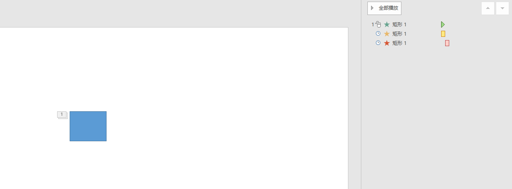
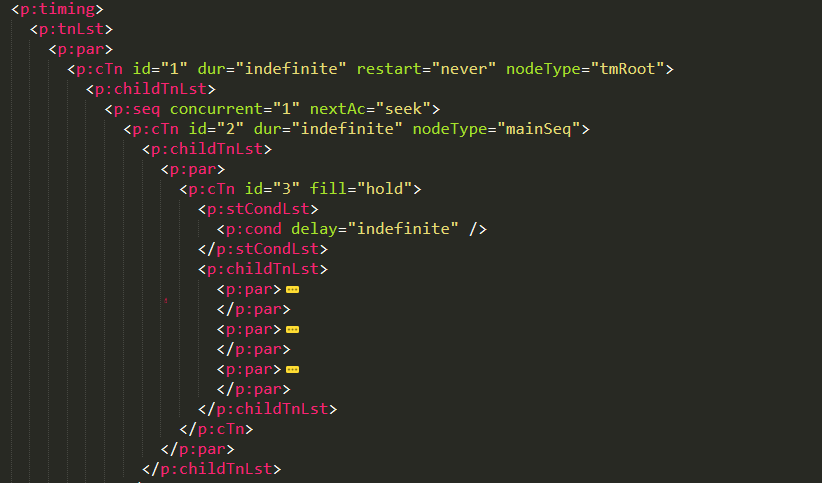

# dotnet OpenXML PPT 动画框架入门

本文将从 OpenXML 方面聊 PPT 的动画框架，本文是属于编程方面而不是 PPT 动画制作教程

<!--more-->
<!-- CreateTime:2021/7/2 16:03:31 -->
<!-- 草稿 -->

开始之前，还请掌握一些基础知识，如阅读以下博客

- [C# dotnet 使用 OpenXml 解析 PPT 文件](https://blog.lindexi.com/post/C-dotnet-%E4%BD%BF%E7%94%A8-OpenXml-%E8%A7%A3%E6%9E%90-PPT-%E6%96%87%E4%BB%B6.html)
- [Office 文档解析 文档格式和协议](https://blog.lindexi.com/post/Office-%E6%96%87%E6%A1%A3%E8%A7%A3%E6%9E%90-%E6%96%87%E6%A1%A3%E6%A0%BC%E5%BC%8F%E5%92%8C%E5%8D%8F%E8%AE%AE.html )
- [dotnet OpenXML 解析 PPT 页面元素文档格式](https://blog.lindexi.com/post/dotnet-OpenXML-%E8%A7%A3%E6%9E%90-PPT-%E9%A1%B5%E9%9D%A2%E5%85%83%E7%B4%A0%E6%96%87%E6%A1%A3%E6%A0%BC%E5%BC%8F.html )

本文不讨论 Slide Master 和 Slide Layout 的动画，关于这两个请参阅 [dotnet OpenXML 的 Slide Master 和 Slide Layout 是什么](https://blog.lindexi.com/post/dotnet-OpenXML-%E7%9A%84-Slide-Master-%E5%92%8C-Slide-Layout-%E6%98%AF%E4%BB%80%E4%B9%88.html )

本文只讨论 Slide 页面里面的动画

## 元素主序列动画

在 OpenXML 中，如果一个动画是依靠翻页或点击页面进行触发的，那么这些动画有顺序的触发，这部分就是主序列动画，也叫 主动画序列 在 OpenXML 的 PPTX 文件里面的存放大概如下

```xml
  <p:timing>
    <p:tnLst>
      <p:par>
        <p:cTn id="1" dur="indefinite" restart="never" nodeType="tmRoot">
          <p:childTnLst>
            <p:seq concurrent="1" nextAc="seek">
              <p:cTn id="2" dur="indefinite" nodeType="mainSeq">
              </p:cTn>
            </p:seq>
          </p:childTnLst>
        </p:cTn>
      </p:par>
    </p:tnLst>
</p:timing>
```

动画是存放在 Slide 页面里面的 Timing 属性里面，通过 OpenXML SDK 获取方法如下

```csharp
            using var presentationDocument =
                DocumentFormat.OpenXml.Packaging.PresentationDocument.Open("Test.pptx", false);
            var presentationPart = presentationDocument.PresentationPart;
            var slidePart = presentationPart!.SlideParts.First();
            var slide = slidePart.Slide;
            var timing = slide.Timing;
```

默认的动画将会放在 NodeType 为 TmingRoot 的 cTn 也就是 CommonTimeNode 里面，获取代码如下

```csharp
            var slide = slidePart.Slide;
            var timing = slide.Timing;
            // 第一级里面默认只有一项
            var commonTimeNode = timing?.TimeNodeList?.ParallelTimeNode?.CommonTimeNode;

            if (commonTimeNode?.NodeType?.Value == TimeNodeValues.TmingRoot)
            {
                // 这是符合约定
                // nodeType="tmRoot"
            }
```

按照约定，页面里面的动画将放在 TmingRoot 的里层，而元素的主序列动画也属于页面里面的动画，因此也就放在 TmingRoot 的里层

如上面代码就是 `nodeType="mainSeq"` 主序列动画的定义，获取主序列动画的代码如下

```csharp
            // <p:timing>
            //    <p:tnLst>
            //      <p:par>
            //        <p:cTn id="1" dur="indefinite" restart="never" nodeType="tmRoot">
            // 第一级里面默认只有一项
            var commonTimeNode = timing?.TimeNodeList?.ParallelTimeNode?.CommonTimeNode;

            if (commonTimeNode?.NodeType?.Value == TimeNodeValues.TmingRoot)
            {
                // 这是符合约定
                // nodeType="tmRoot"
            }

            if (commonTimeNode?.ChildTimeNodeList == null) return;
            // <p:childTnLst>
            //   <p:seq concurrent="1" nextAc="seek">
            // 理论上只有一项，而且一定是 SequenceTimeNode 类型
            var sequenceTimeNode = commonTimeNode.ChildTimeNodeList.GetFirstChild<SequenceTimeNode>();

            // <p:cTn id="2" dur="indefinite" nodeType="mainSeq">
            var mainSequenceTimeNode = sequenceTimeNode.CommonTimeNode;
            if (mainSequenceTimeNode?.NodeType?.Value == TimeNodeValues.MainSequence)
```

接下来讨论的就是放在主序列动画里面的动画的存储方式，以上代码放在 [github](https://github.com/lindexi/lindexi_gd/tree/2c06ddf74e45c31ad7842dd06dc09bcc67b6142e/PptxDemo) 和 [gitee](https://gitee.com/lindexi/lindexi_gd/tree/2c06ddf74e45c31ad7842dd06dc09bcc67b6142e/PptxDemo) 欢迎访问

可以通过如下方式获取本文的源代码，先创建一个空文件夹，接着使用命令行 cd 命令进入此空文件夹，在命令行里面输入以下代码，即可获取到本文的代码

```
git init
git remote add origin https://gitee.com/lindexi/lindexi_gd.git
git pull origin 2c06ddf74e45c31ad7842dd06dc09bcc67b6142e
```

以上使用的是 gitee 的源，如果 gitee 不能访问，请替换为 github 的源

```
git remote remove origin
git remote add origin https://github.com/lindexi/lindexi_gd.git
```

获取代码之后，进入 PptxDemo 文件夹

## 单个主序列动画

放在主序列动画里面的单个动画，创建方式如新建一个 PPT 文件，然后拖入一个形状，点击一下飞入动画。此时的飞入动画就是属于放在主动画序列的一个动画，当然飞入动画在类型上属于进入动画。在 PPT 里面，有 进入动画、强调动画、退出动画等类型

以下是单个飞入动画的主序列动画的 OpenXML 文档的例子

```xml
  <p:timing>
    <p:tnLst>
      <p:par>
        <p:cTn id="1" dur="indefinite" restart="never" nodeType="tmRoot">
          <p:childTnLst>
            <p:seq concurrent="1" nextAc="seek">
              <p:cTn id="2" dur="indefinite" nodeType="mainSeq">
                <p:childTnLst>
                  <p:par>
                    <p:cTn id="3" fill="hold">
                      <p:stCondLst>
                        <p:cond delay="indefinite" />
                      </p:stCondLst>
                      <p:childTnLst>
                        <p:par>
                          <p:cTn id="4" fill="hold">
                            <p:stCondLst>
                              <p:cond delay="0" />
                            </p:stCondLst>
                            <p:childTnLst>
                              <p:par>
                                <p:cTn id="5" presetID="2" presetClass="entr" presetSubtype="4" fill="hold" grpId="0" nodeType="clickEffect">
                                   <!-- 飞入动画 -->
                                </p:cTn>
                              </p:par>
                            </p:childTnLst>
                          </p:cTn>
                        </p:par>
                      </p:childTnLst>
                    </p:cTn>
                  </p:par>
                </p:childTnLst>
              </p:cTn>
            </p:seq>
          </p:childTnLst>
        </p:cTn>
      </p:par>
    </p:tnLst>
  </p:timing>
```

可以看到单个动画放在单个主序列动画的两层 cTn 里面

如上面的内容，大概可以理解存放的方式了，只是在 PPT 里面，有多个 ParallelTimeNode 和 CommonTimeNode 的嵌套。从 mainSeq 也就是 MainSequence 主动画序列以下，获取到的实际的进入动画，是经过了如下路径才能获取

```
cTn (mainSeq) -> childTnLst -> par -> cTn (id="3") -> childTnLst -> par -> cTn (id="4") -> childTnLst -> par -> cTn (id="5" presetClass="entr" 飞入动画)
```

代码的获取方式如下

```csharp
            // <p:cTn id="2" dur="indefinite" nodeType="mainSeq">
            var mainSequenceTimeNode = sequenceTimeNode.CommonTimeNode;
            if (mainSequenceTimeNode?.NodeType?.Value == TimeNodeValues.MainSequence)
            {
                // [TimeLine 对象 (PowerPoint) | Microsoft Docs](https://docs.microsoft.com/zh-cn/office/vba/api/PowerPoint.TimeLine )
                //  MainSequence 主动画序列
                var mainParallelTimeNode = mainSequenceTimeNode.ChildTimeNodeList;

                foreach (var openXmlElement in mainParallelTimeNode)
                {
                    // 并行关系的
                    if (openXmlElement is ParallelTimeNode parallelTimeNode)
                    {
                        var timeNode = parallelTimeNode.CommonTimeNode.ChildTimeNodeList
                            .GetFirstChild<ParallelTimeNode>().CommonTimeNode.ChildTimeNodeList
                            .GetFirstChild<ParallelTimeNode>().CommonTimeNode;

                        switch (timeNode.PresetClass.Value)
                        {
                            case TimeNodePresetClassValues.Entrance:
                                // 进入动画
                                break;
                            default:
                                throw new ArgumentOutOfRangeException();
                        }
                    }
                }
            }
```

以上测试文件和测试代码 放在 [github](https://github.com/lindexi/lindexi_gd/tree/d47f1aec803bfd7adb32e82fb61916308d317fcd/PptxDemo) 和 [gitee](https://gitee.com/lindexi/lindexi_gd/tree/d47f1aec803bfd7adb32e82fb61916308d317fcd/PptxDemo) 可以通过以下命令获取

```
git init
git remote add origin https://gitee.com/lindexi/lindexi_gd.git
git pull origin d47f1aec803bfd7adb32e82fb61916308d317fcd
```

除了进入动画之外，还有强调和退出动画，详细请看 [dotnet OpenXML 读取 PPT 动画进入退出强调动画类型](https://blog.lindexi.com/post/dotnet-OpenXML-%E8%AF%BB%E5%8F%96-PPT-%E5%8A%A8%E7%94%BB%E8%BF%9B%E5%85%A5%E9%80%80%E5%87%BA%E5%BC%BA%E8%B0%83%E5%8A%A8%E7%94%BB%E7%B1%BB%E5%9E%8B.html )

## 主序列顺序动画

新建 PPT 课件，添加一个元素，然后分别设置元素的进入强调和退出动画，然后设置强调和退出动画是从上一项之后开始，如下图

<!--  -->


根据上文描述，可以了解到此时元素的进入和强调和退出类型动画都放在主序列动画里面，如下图

<!--  -->


```xml
<p:cTn id="2" dur="indefinite" nodeType="mainSeq">
  <p:childTnLst>
    <p:par>
      <p:cTn id="3" fill="hold">
        <p:stCondLst>
          <p:cond delay="indefinite" />
        </p:stCondLst>
        <p:childTnLst>
          <p:par>
            <p:cTn id="4" fill="hold">
              <p:stCondLst>
                <p:cond delay="0" />
              </p:stCondLst>
              <p:childTnLst>
                <p:par>
                  <p:cTn id="5" presetID="1" presetClass="entr" presetSubtype="0" fill="hold" grpId="0" nodeType="clickEffect">
                    <!-- 进入动画-->
                  </p:cTn>
                </p:par>
              </p:childTnLst>
            </p:cTn>
          </p:par>
          <p:par>
            <p:cTn id="7" fill="hold">
              <p:stCondLst>
                <p:cond delay="0" />
              </p:stCondLst>
              <p:childTnLst>
                <p:par>
                  <p:cTn id="8" presetID="25" presetClass="emph" presetSubtype="0" fill="hold" grpId="2" nodeType="clickEffect">
                    <!-- 强调动画-->
                  </p:cTn>
                </p:par>
              </p:childTnLst>
            </p:cTn>
          </p:par>
          <p:par>
            <p:cTn id="13" fill="hold">
              <p:stCondLst>
                <p:cond delay="500" />
              </p:stCondLst>
              <p:childTnLst>
                <p:par>
                  <p:cTn id="14" presetID="10" presetClass="exit" presetSubtype="0" fill="hold" grpId="1" nodeType="afterEffect">
                    <!-- 退出动画-->
                  </p:cTn>
                </p:par>
              </p:childTnLst>
            </p:cTn>
          </p:par>
        </p:childTnLst>
      </p:cTn>
    </p:par>
  </p:childTnLst>
</p:cTn>
```

进一步简化的代码如下

```xml
<p:cTn id="2" dur="indefinite" nodeType="mainSeq">
  <p:childTnLst>
    <p:par>
      <p:cTn id="3" fill="hold">
        <p:childTnLst>
          <p:par>
            <!-- 进入动画-->
          </p:par>
          <p:par>
            <!-- 强调动画-->
          </p:par>
          <p:par>
            <!-- 退出动画-->
          </p:par>
        </p:childTnLst>
      </p:cTn>
    </p:par>
  </p:childTnLst>
</p:cTn>
```

从以上可以看到，所有的动画都放在主序列动画的 childTnLst 也就是 ChildTimeNodeList 里面的里面，在 NodeType 为 MainSequence 的 CommonTimeNode 里面嵌套一个 `p:par` 和一个 id 为 3 的 `p:cTn` 之后，才是各个动画的内容

可以使用如下代码进行获取

```csharp
            // <p:cTn id="2" dur="indefinite" nodeType="mainSeq">
            var mainSequenceTimeNode = sequenceTimeNode.CommonTimeNode;
            if (mainSequenceTimeNode?.NodeType?.Value == TimeNodeValues.MainSequence)
            {
                // <p:childTnLst>
                // [TimeLine 对象 (PowerPoint) | Microsoft Docs](https://docs.microsoft.com/zh-cn/office/vba/api/PowerPoint.TimeLine )
                //  MainSequence 主动画序列
                ChildTimeNodeList mainChildTimeNodeList = mainSequenceTimeNode.ChildTimeNodeList!;
                // <p:par>
                var mainParallelTimeNode = mainChildTimeNodeList!.GetFirstChild<ParallelTimeNode>();
                // <p:cTn id="3" fill="hold">
                var subCommonTimeNode = mainParallelTimeNode!.CommonTimeNode;
                // <p:childTnLst>
                var subChildTimeNodeList = subCommonTimeNode!.ChildTimeNodeList;
                foreach (var openXmlElement in subChildTimeNodeList!)
                {
                    // 按照顺序获取
                    // <p:par>
                    // <!-- 进入动画-->
                    // </p:par>
                    // <p:par>
                    // <!-- 强调动画-->
                    // </p:par>
                    // <p:par>
                    // <!-- 退出动画-->
                    // </p:par>
                    if (openXmlElement is ParallelTimeNode parallelTimeNode)
                    {
                        var timeNode = parallelTimeNode!.CommonTimeNode!.ChildTimeNodeList!.GetFirstChild<ParallelTimeNode>()!.CommonTimeNode;
                        switch (timeNode!.PresetClass!.Value)
                        {
                            case TimeNodePresetClassValues.Entrance:
                                // 进入动画
                                break;
                            case TimeNodePresetClassValues.Exit:
                                // 退出动画
                                break;
                            case TimeNodePresetClassValues.Emphasis:
                                // 强调动画
                                break;
                            default:
                                throw new ArgumentOutOfRangeException();
                        }
                    }
                }
            }
```

以上测试文件和测试代码 放在 [github](https://github.com/lindexi/lindexi_gd/tree/b0ad5eade0417cebf0df1cac77292df6ef035d1d/PptxDemo) 和 [gitee](https://gitee.com/lindexi/lindexi_gd/tree/b0ad5eade0417cebf0df1cac77292df6ef035d1d/PptxDemo) 可以通过以下命令获取

```
git init
git remote add origin https://gitee.com/lindexi/lindexi_gd.git
git pull origin b0ad5eade0417cebf0df1cac77292df6ef035d1d
```

如果不是按照顺序连续播放的，而是按照每次点击进行顺序播放的，也就是每个动画的触发都是鼠标点击的，那么存储方式将会是如下

```xml
  <p:timing>
    <p:tnLst>
      <p:par>
        <p:cTn id="1" dur="indefinite" restart="never" nodeType="tmRoot">
          <p:childTnLst>
            <p:seq concurrent="1" nextAc="seek">
              <p:cTn id="2" dur="indefinite" nodeType="mainSeq">
                <p:childTnLst>
                  <p:par>
                    <!-- 进入动画-->
                  </p:par>
                  <p:par>
                    <!-- 强调动画-->
                  </p:par>
                  <p:par>
                    <!-- 退出动画-->
                  </p:par>
                </p:childTnLst>
              </p:cTn>
              <!-- 忽略代码-->
            </p:seq>
          </p:childTnLst>
        </p:cTn>
      </p:par>
    </p:tnLst>
    <!-- 忽略代码-->
  </p:timing>
```

来对比一下两个的差别吧，如果是单次点击，连续出现三个动画的，那么这三个动画将会被一个 cTn 包含出来，如下面代码，咱使用以 MainSequence 作为最顶层来看

```xml
<!-- 单次点击，连续出现三个动画 -->
<p:cTn id="2" dur="indefinite" nodeType="mainSeq">
  <p:childTnLst>
    <p:par>
      <p:cTn id="3" fill="hold">
        <p:childTnLst>
          <!-- 进入动画-->
          <!-- 强调动画-->
          <!-- 退出动画-->
        </p:childTnLst>
      </p:cTn>
    </p:par>
  </p:childTnLst>
</p:cTn>
```

对比简化的单次点击出现单个动画，顺序点击三次，分别出现三个动画的框架，如以下代码

```xml
<p:cTn id="2" dur="indefinite" nodeType="mainSeq">
  <p:childTnLst>
    <!-- 进入动画-->
    <!-- 强调动画-->
    <!-- 退出动画-->
  </p:childTnLst>
</p:cTn>
```

具体差别就在于，如上面代码，如果是单次点击，连续出现三个动画的，那么将会被放在一个 cTn 里面，如上面代码 id 为 3 的 cTn 里面。而如果是单个点击出现单个动画的，动画和动画之间不是连续播放的，那么就放在 MainSequence 的 childTnLst 里面

更多关于主序列进入退出强调动画，请看 [dotnet OpenXML 读取 PPT 主序列进入退出强调动画](https://blog.lindexi.com/post/dotnet-OpenXML-%E8%AF%BB%E5%8F%96-PPT-%E4%B8%BB%E5%BA%8F%E5%88%97%E8%BF%9B%E5%85%A5%E9%80%80%E5%87%BA%E5%BC%BA%E8%B0%83%E5%8A%A8%E7%94%BB.html )

在了解多个动画的触发顺序和依赖关系之前，咱先继续聊聊单个动画的存储框架

## 单个动画的存储框架

在本文的一开始就聊到了单个主序列动画，但上文没有给出一个动画的范围，而在经过了主序列顺序动画，似乎可以了解每个独立动画存储的边界以及存储框架方式

假定动画之前没有依赖，单次点击只进行一个动画的，如上文，大的动画存储框架如下代码

```xml
<p:cTn id="2" dur="indefinite" nodeType="mainSeq">
  <p:childTnLst>
    <!-- 进入动画-->
    <!-- 强调动画-->
    <!-- 退出动画-->
  </p:childTnLst>
</p:cTn>
```

以上被注释的 进入动画 部分的实际代码大概如下

```xml
<p:cTn id="2" dur="indefinite" nodeType="mainSeq">
  <p:childTnLst>
    <p:par>
      <p:cTn id="3" fill="hold">
        <p:stCondLst>
          <p:cond delay="indefinite" />
        </p:stCondLst>
        <p:childTnLst>
          <p:par>
            <p:cTn id="4" fill="hold">
              <p:stCondLst>
                <p:cond delay="0" />
              </p:stCondLst>
              <p:childTnLst>
                <p:par>
                  <p:cTn id="5" presetID="1" presetClass="entr" presetSubtype="0" fill="hold" grpId="0" nodeType="clickEffect">
                    <p:stCondLst>
                      <p:cond delay="0" />
                    </p:stCondLst>
                    <p:childTnLst>
                      <p:set>
                        <p:cBhvr>
                          <p:cTn id="6" dur="1" fill="hold">
                            <p:stCondLst>
                              <p:cond delay="0" />
                            </p:stCondLst>
                          </p:cTn>
                          <p:tgtEl>
                            <p:spTgt spid="2" />
                          </p:tgtEl>
                          <p:attrNameLst>
                            <p:attrName>style.visibility</p:attrName>
                          </p:attrNameLst>
                        </p:cBhvr>
                        <p:to>
                          <p:strVal val="visible" />
                        </p:to>
                      </p:set>
                    </p:childTnLst>
                  </p:cTn>
                </p:par>
              </p:childTnLst>
            </p:cTn>
          </p:par>
        </p:childTnLst>
      </p:cTn>
    </p:par>
    <!-- 强调动画-->
    <!-- 退出动画-->
  </p:childTnLst>
</p:cTn>
```

也就是单个动画部分内容大概如下

```xml
<p:par>
  <p:cTn id="3" fill="hold">
    <p:stCondLst>
      <p:cond delay="indefinite" />
    </p:stCondLst>
    <p:childTnLst>
      <p:par>
        <p:cTn id="4" fill="hold">
          <p:stCondLst>
            <p:cond delay="0" />
          </p:stCondLst>
          <p:childTnLst>
            <p:par>
              <p:cTn id="5" presetID="1" presetClass="entr" presetSubtype="0" fill="hold" grpId="0" nodeType="clickEffect">
                <p:stCondLst>
                  <p:cond delay="0" />
                </p:stCondLst>
                <p:childTnLst>
                  <p:set>
                    <p:cBhvr>
                      <p:cTn id="6" dur="1" fill="hold">
                        <p:stCondLst>
                          <p:cond delay="0" />
                        </p:stCondLst>
                      </p:cTn>
                      <p:tgtEl>
                        <p:spTgt spid="2" />
                      </p:tgtEl>
                      <p:attrNameLst>
                        <p:attrName>style.visibility</p:attrName>
                      </p:attrNameLst>
                    </p:cBhvr>
                    <p:to>
                      <p:strVal val="visible" />
                    </p:to>
                  </p:set>
                </p:childTnLst>
              </p:cTn>
            </p:par>
          </p:childTnLst>
        </p:cTn>
      </p:par>
    </p:childTnLst>
  </p:cTn>
</p:par>
```

忽略动画实际的内容的代码如下

```xml
<p:par>
  <p:cTn id="3" fill="hold">
    <p:stCondLst>
      <p:cond delay="indefinite" />
    </p:stCondLst>
    <p:childTnLst>
      <p:par>
        <p:cTn id="4" fill="hold">
          <p:stCondLst>
            <p:cond delay="0" />
          </p:stCondLst>
          <p:childTnLst>
            <p:par>
              <p:cTn id="5" presetID="1" presetClass="entr" presetSubtype="0" fill="hold" grpId="0" nodeType="clickEffect">
                <!-- 忽略动画实际内容 -->
              </p:cTn>
            </p:par>
          </p:childTnLst>
        </p:cTn>
      </p:par>
    </p:childTnLst>
  </p:cTn>
</p:par>
```

而通过 id 为 5 的 cTn 可以看到，这个才是实际的动画执行信息，这个 cTn 存放的层级如下

```
par -> cTn (id="3") -> childTnLst -> par -> cTn (id="4") -> childTnLst -> par -> cTn (id="5")
```

以上测试课件放在 [github](https://github.com/lindexi/lindexi_gd/tree/2c06ddf74e45c31ad7842dd06dc09bcc67b6142e/PptxDemo) 和 [gitee](https://gitee.com/lindexi/lindexi_gd/tree/2c06ddf74e45c31ad7842dd06dc09bcc67b6142e/PptxDemo) 可以通过以下命令获取

```
git init
git remote add origin https://gitee.com/lindexi/lindexi_gd.git
git pull origin 2c06ddf74e45c31ad7842dd06dc09bcc67b6142e
```

单个动画内的各个属性以及表示属于什么动画部分，将在下文告诉大家

但如果动画是有依赖的，如单次点击，然后连续出现三个动画的课件，如上文，存储的框架如下

```xml
<!-- 单次点击，连续出现三个动画 -->
<p:cTn id="2" dur="indefinite" nodeType="mainSeq">
  <p:childTnLst>
    <p:par>
      <p:cTn id="3" fill="hold">
        <p:childTnLst>
          <!-- 进入动画-->
          <!-- 强调动画-->
          <!-- 退出动画-->
        </p:childTnLst>
      </p:cTn>
    </p:par>
  </p:childTnLst>
</p:cTn>
```

展开里面的进入动画，其内容大概如下

```xml
<p:cTn id="2" dur="indefinite" nodeType="mainSeq">
  <p:childTnLst>
    <p:par>
      <p:cTn id="3" fill="hold">
        <p:stCondLst>
          <p:cond delay="indefinite" />
        </p:stCondLst>
        <p:childTnLst>
          <p:par>
            <p:cTn id="4" fill="hold">
              <p:stCondLst>
                <p:cond delay="0" />
              </p:stCondLst>
              <p:childTnLst>
                <p:par>
                  <p:cTn id="5" presetID="1" presetClass="entr" presetSubtype="0" fill="hold" grpId="0" nodeType="clickEffect">
                    <p:stCondLst>
                      <p:cond delay="0" />
                    </p:stCondLst>
                    <p:childTnLst>
                      <p:set>
                        <p:cBhvr>
                          <p:cTn id="6" dur="1" fill="hold">
                            <p:stCondLst>
                              <p:cond delay="0" />
                            </p:stCondLst>
                          </p:cTn>
                          <p:tgtEl>
                            <p:spTgt spid="2" />
                          </p:tgtEl>
                          <p:attrNameLst>
                            <p:attrName>style.visibility</p:attrName>
                          </p:attrNameLst>
                        </p:cBhvr>
                        <p:to>
                          <p:strVal val="visible" />
                        </p:to>
                      </p:set>
                    </p:childTnLst>
                  </p:cTn>
                </p:par>
              </p:childTnLst>
            </p:cTn>
          </p:par>
          <!-- 强调动画-->
          <!-- 退出动画-->
        </p:childTnLst>
      </p:cTn>
    </p:par>
  </p:childTnLst>
</p:cTn>
```

也就是说进入动画的内容大概如下

```xml
<p:par>
  <p:cTn id="4" fill="hold">
    <p:stCondLst>
      <p:cond delay="0" />
    </p:stCondLst>
    <p:childTnLst>
      <p:par>
        <p:cTn id="5" presetID="1" presetClass="entr" presetSubtype="0" fill="hold" grpId="0" nodeType="clickEffect">
          <p:stCondLst>
            <p:cond delay="0" />
          </p:stCondLst>
          <p:childTnLst>
            <p:set>
              <p:cBhvr>
                <p:cTn id="6" dur="1" fill="hold">
                  <p:stCondLst>
                    <p:cond delay="0" />
                  </p:stCondLst>
                </p:cTn>
                <p:tgtEl>
                  <p:spTgt spid="2" />
                </p:tgtEl>
                <p:attrNameLst>
                  <p:attrName>style.visibility</p:attrName>
                </p:attrNameLst>
              </p:cBhvr>
              <p:to>
                <p:strVal val="visible" />
              </p:to>
            </p:set>
          </p:childTnLst>
        </p:cTn>
      </p:par>
    </p:childTnLst>
  </p:cTn>
</p:par>
```

忽略动画实际的内容的代码如下

```xml
<p:par>
  <p:cTn id="4" fill="hold">
    <p:stCondLst>
      <p:cond delay="0" />
    </p:stCondLst>
    <p:childTnLst>
      <p:par>
        <p:cTn id="5" presetID="1" presetClass="entr" presetSubtype="0" fill="hold" grpId="0" nodeType="clickEffect">
           <!-- 忽略动画实际内容 -->
        </p:cTn>
      </p:par>
    </p:childTnLst>
  </p:cTn>
</p:par>
```

对比一下代码可以看到，如单次点击，然后连续出现三个动画的课件，单个动画的距离 MainSequence 的层级要比每次点击只有一个动画的课件少了一层 `par -> cTn -> childTnLst` 的嵌套

原因是在外层将单次点击，然后连续出现三个动画的三个动画当成了一个主序列的动画。也就是说在 PPT 的存储里面，认为的框架如下

```xml
<!-- 单次点击，连续出现三个动画 -->
<p:cTn id="2" dur="indefinite" nodeType="mainSeq">
  <p:childTnLst>
    <!-- 有一个动画。这个动画是组合动画，里面包含了三个动画，分别是进入强调和退出的动画 -->
  </p:childTnLst>
</p:cTn>
```

因此就比每次点击只有一个动画的课件少了一层。通过以上即可了解到，读取时，就应该采用判断组合的方法，将 MainSequence 里面的 childTnLst 的每一个 par 当成独立的动画。只是有一些独立的动画是组合动画，组合动画里面可以再包含多个动画


本文的属性是依靠 [dotnet OpenXML 解压缩文档为文件夹工具](https://blog.lindexi.com/post/dotnet-OpenXML-%E8%A7%A3%E5%8E%8B%E7%BC%A9%E6%96%87%E6%A1%A3%E4%B8%BA%E6%96%87%E4%BB%B6%E5%A4%B9%E5%B7%A5%E5%85%B7.html ) 工具协助测试的，这个工具是开源免费的工具，欢迎使用

更多请看 [Office 使用 OpenXML SDK 解析文档博客目录](https://blog.lindexi.com/post/Office-%E4%BD%BF%E7%94%A8-OpenXML-SDK-%E8%A7%A3%E6%9E%90%E6%96%87%E6%A1%A3%E5%8D%9A%E5%AE%A2%E7%9B%AE%E5%BD%95.html )

<a rel="license" href="http://creativecommons.org/licenses/by-nc-sa/4.0/"></a><br />本作品采用<a rel="license" href="http://creativecommons.org/licenses/by-nc-sa/4.0/">知识共享署名-非商业性使用-相同方式共享 4.0 国际许可协议</a>进行许可。欢迎转载、使用、重新发布，但务必保留文章署名[林德熙](http://blog.csdn.net/lindexi_gd)(包含链接:http://blog.csdn.net/lindexi_gd )，不得用于商业目的，基于本文修改后的作品务必以相同的许可发布。如有任何疑问，请与我[联系](mailto:lindexi_gd@163.com)。