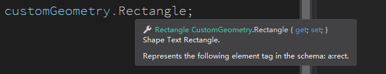

# dotnet OpenXML SDK 形状的 rect Shape Text Rectangle 属性对文本框的坐标影响

在 Office 里面，对于形状，可以通过 a:rect 指定文本框的坐标

<!--more-->

<!-- 发布 -->

在 PPT 里面，有文档里面存在自定义形状大概如下

```xml
      <p:sp>
        <p:nvSpPr> <!-- 忽略代码 --> </p:nvSpPr>
        <p:spPr>
          <a:xfrm>
            <a:off x="3333403" y="2419004" />
            <a:ext cx="3250276" cy="2385752" />
          </a:xfrm>
          <a:custGeom>
            <a:avLst />
            <a:gdLst/>
            <a:ahLst />
            <a:rect l="7200000" t="0" r="0" b="0" />
            <a:pathLst>
              <!-- 忽略代码 -->
            </a:pathLst>
          </a:custGeom>
        </p:spPr>
        <p:style>
         <!-- 忽略代码 -->
        </p:style>
        <p:txBody>
          <a:bodyPr lIns="3600000" tIns="360000"/>
          <a:p>
            <a:pPr />
            <a:r>
              <a:rPr lang="en-US" altLang="zh-CN"/>
              <a:t>123</a:t>
            </a:r>
          </a:p>
        </p:txBody>
      </p:sp>
```

请问此时的文本的左上角坐标是什么

如下图，在形状里面的文本会先通过形状的 `a:rect` 拿到文本框相对于形状的矩形范围，然后文本又相对于文本框有一定的边距

<!--  -->


在 OpenXML 里面，根据 ECMA 376 的 20.1.9.22 文档内容，形状的 `a:rect` 决定文本框的外框的矩形范围。而在文本框里面还有 `a:bodyPr` 的 lIns (Left Inset)  和 rIns (Right Inset) 和 bIns (Bottom Inset) 和 tIns (Top Inset) 决定文本在文本框里面的边距

因此文本在形状里面会受到 `a:rect` 和 `a:bodyPr` 的影响

在 OpenXML SDK 辅助读取形状的 `a:rect` 可以使用如下代码

```csharp
            using (var presentationDocument = DocumentFormat.OpenXml.Packaging.PresentationDocument.Open("自定义形状.pptx", false))
            {
                var presentationPart = presentationDocument.PresentationPart;
                var presentation = presentationPart.Presentation;

                var slideIdList = presentation.SlideIdList;

                foreach (var slideId in slideIdList.ChildElements.OfType<SlideId>())
                {
                    SlidePart slidePart = (SlidePart)presentationPart.GetPartById(slideId.RelationshipId);

                    var slide = slidePart.Slide;

                    var customGeometry = slide.Descendants<CustomGeometry>().First();
                    var sharpTextRectangle = customGeometry.Rectangle;
                }
            }
```

通过 OpenXML SDK 的 `customGeometry.Rectangle` 的属性上的注释也可以看到，这里的命名为 Rectangle 的属性其实是 SharpTextRectangle 的含义

<!--  -->


本文全部代码放在 [github](https://github.com/lindexi/lindexi_gd/tree/c796ed65/RurlejileGearhuheljale) 或 [gitee](https://gitee.com/lindexi/lindexi_gd/tree/c796ed65/RurlejileGearhuheljale) 欢迎大家访问

本文的属性是依靠 [dotnet OpenXML 解压缩文档为文件夹工具](https://blog.lindexi.com/post/dotnet-OpenXML-%E8%A7%A3%E5%8E%8B%E7%BC%A9%E6%96%87%E6%A1%A3%E4%B8%BA%E6%96%87%E4%BB%B6%E5%A4%B9%E5%B7%A5%E5%85%B7.html ) 工具协助测试的，这个工具是开源免费的工具，欢迎小伙伴使用

更多请看 [Office 使用 OpenXML SDK 解析文档博客目录](https://blog.lindexi.com/post/Office-%E4%BD%BF%E7%94%A8-OpenXML-SDK-%E8%A7%A3%E6%9E%90%E6%96%87%E6%A1%A3%E5%8D%9A%E5%AE%A2%E7%9B%AE%E5%BD%95.html )

<a rel="license" href="http://creativecommons.org/licenses/by-nc-sa/4.0/"></a><br />本作品采用<a rel="license" href="http://creativecommons.org/licenses/by-nc-sa/4.0/">知识共享署名-非商业性使用-相同方式共享 4.0 国际许可协议</a>进行许可。欢迎转载、使用、重新发布，但务必保留文章署名[林德熙](http://blog.csdn.net/lindexi_gd)(包含链接:http://blog.csdn.net/lindexi_gd )，不得用于商业目的，基于本文修改后的作品务必以相同的许可发布。如有任何疑问，请与我[联系](mailto:lindexi_gd@163.com)。
