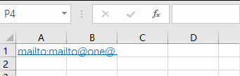

# dotnet OpenXML 修复 Office 文档里面包含格式不正确的 Uri 而无法解析

在使用 OpenXML 解析 Office 文档，无论是 PPT 还是 Word 还是 Excel 文档，都会使用标准方式解析。而此时的文档如果包含了错误的 Url 格式，例如不正确的邮件名的时候，将会在解析的时候出错。本文告诉大家如何修复这个问题

<!--more-->
<!-- 发布 -->

尽管在 Office 2016 等版本，是可以在用户端制作出格式不正确的 Url 文档，如下图所示的内容

<!--  -->


此时在执行解析的时候，将会提示如下代码

```
DocumentFormat.OpenXml.Packaging.OpenXmlPackageException:“A malformed URI was found in the document. Please provide a OpenSettings.RelationshipErrorRewriter to handle these errors while opening a package.”
```

或者在更古老的 OpenXML SDK 里面会提示下面代码

```
DocumentFormat.OpenXml.Packaging.OpenXmlPackageException: Invalid Hyperlink: Malformed URI is embedded as a hyperlink in the document.
   at DocumentFormat.OpenXml.Packaging.OpenXmlPackage.Load() in OpenXmlPackage.cs: line 490
   at DocumentFormat.OpenXml.Packaging.OpenXmlPackage.OpenCore(String path, Boolean readWriteMode) in OpenXmlPackage.cs: line 402
   at DocumentFormat.OpenXml.Packaging.WordprocessingDocument.Open(String path, Boolean isEditable, OpenSettings openSettings) in PackageDocument.cs: line 297
   at  DocumentFormat.OpenXml.Packaging.WordprocessingDocument.Open(String path, Boolean isEditable) in PackageDocument.cs: line 256
```

和以下内容代码

```
   at System.Uri.CreateThis(String uri, Boolean dontEscape, UriKind uriKind)
   at System.Uri..ctor(String uriString, UriKind uriKind)
   at MS.Internal.IO.Packaging.InternalRelationshipCollection.ProcessRelationshipAttributes(XmlCompatibilityReader reader)
   at MS.Internal.IO.Packaging.InternalRelationshipCollection.ParseRelationshipPart(PackagePart part)
   at MS.Internal.IO.Packaging.InternalRelationshipCollection..ctor(Package package, PackagePart part)
   at System.IO.Packaging.PackagePart.EnsureRelationships()
   at System.IO.Packaging.PackagePart.GetRelationshipsHelper(String filterString)
   at System.IO.Packaging.PackagePart.GetRelationships()
   at DocumentFormat.OpenXml.Packaging.PackagePartRelationshipPropertyCollection..ctor(PackagePart packagePart)
   at DocumentFormat.OpenXml.Packaging.OpenXmlPart.Load(OpenXmlPackage openXmlPackage, OpenXmlPart parent, Uri uriTarget, String id, Dictionary`2 loadedParts)
   at DocumentFormat.OpenXml.Packaging.OpenXmlPartContainer.LoadReferencedPartsAndRelationships(OpenXmlPackage openXmlPackage, OpenXmlPart sourcePart, RelationshipCollection relationshipCollection, Dictionary`2 loadedParts)
   at DocumentFormat.OpenXml.Packaging.OpenXmlPackage.Load()
```

这是一个古老的坑，在 2015 就有人在官方报告，请看 [Malformed mailto Hyperlink causes Exception on .NET 4.5+ · Issue #38 · OfficeDev/Open-XML-SDK](https://github.com/OfficeDev/Open-XML-SDK/issues/38 )

而在 OpenXML SDK 的 2.12.0 终于提供了修复方法，更改代码请看 [Add a relationship rewriter to help sanitize malformed URIs by twsouthwick · Pull Request #793 · OfficeDev/Open-XML-SDK](https://github.com/OfficeDev/Open-XML-SDK/pull/793 )

可以看到我也在这个修复中，提了一些有趣的看法

在 2.12.0 或以上的版本，可以在 OpenSettings 里面传入如何处理格式不对的 Uri 的文档，如本文使用到的测试文档，这是一个 Excel 文档，这个文档里面包含下面代码

```xml
  <si>
    <t xml:space="preserve">mailto:mailto@one@ </t>
  </si>
```

可以看到这个超链接是格式不正确的，此时如果使用 Uri 的构造函数传入，将会提示格式出错

在 2.12.0 或以上版本提供了重写的方法，判断如果格式不正确，那么让开发者返回一个正确的格式，重新写入回文档，这样就能修复此问题，如下面代码的实现

```csharp
            var openSettings = new OpenSettings()
            {
                RelationshipErrorHandlerFactory = RelationshipErrorHandler.CreateRewriterFactory(Rewriter)
            };
```

以上代码使用了 RelationshipErrorHandler.CreateRewriterFactory 方法传入了 Rewriter 方法，在 Rewriter 方法里面提供了返回正确的值的方法

```csharp
        /// <summary>
        /// 表示如何重写修复超链接格式
        /// </summary>
        /// <param name="partUri">这个 <paramref name="uri"/> 属于哪个文档 Part 内容，值如 /xl/worksheets/_rels/sheet1.xml.rels 等</param>
        /// <param name="id">这个资源的值</param>
        /// <param name="uri">格式不对的 Uri 内容</param>
        /// <returns></returns>
        static string Rewriter(Uri partUri, string id, string uri)
            => $"http://unknown?id={id}";
```

在创建文档读取的时候，传入 OpenSettings 即可，如打开 Excel 文档

```csharp
            using (FileStream fs = new FileStream(fileName, FileMode.Open, FileAccess.ReadWrite, FileShare.ReadWrite))
            {
                using (SpreadsheetDocument doc = SpreadsheetDocument.Open(fs, isEditable: true, openSettings))
                {

                }
            }
```

采用本文的方法，就需要让文档的打开方式支持可以写入，否则依然无法解析。我在 GitHub 上问了 [Taylor Southwick](https://github.com/twsouthwick ) 大佬能否在只读下，解决此问题，大佬的回复是必须开启写入权限 [https://github.com/OfficeDev/Open-XML-SDK/pull/793/files#r471867355](https://github.com/OfficeDev/Open-XML-SDK/pull/793/files#r471867355)

当前的逻辑是如果读取到文档里面有 Uri 格式不对的资源，就调用 Rewriter 方法，在业务端尝试解决，如我上面代码就返回一个不认识的格式正确的链接。然后重新写回到文档里面，这样就能修复此问题

也可以在尝试使用只读的方式读取，只有在出现格式不对的时候，再复制文档一份用来编辑写入。或者文档的内容本身不大，全部读取到内存里面，在内存里面进行读写

本文代码放在 [github](https://github.com/lindexi/lindexi_gd/tree/2b042ed0/BelehereluJewelemkiho) 欢迎小伙伴访问

当然了，这个坑还是需要 dotnet runtime 来背，详细请看 [System.IO.Packaging.Package should have a way to handle common errors with malformed packages · Issue #26084 · dotnet/runtime](https://github.com/dotnet/runtime/issues/26084 )

本文的属性是依靠 [dotnet OpenXML 解压缩文档为文件夹工具](https://blog.lindexi.com/post/dotnet-OpenXML-%E8%A7%A3%E5%8E%8B%E7%BC%A9%E6%96%87%E6%A1%A3%E4%B8%BA%E6%96%87%E4%BB%B6%E5%A4%B9%E5%B7%A5%E5%85%B7.html ) 工具协助测试的，这个工具是开源免费的工具，欢迎小伙伴使用

更多请看 [Office 使用 OpenXML SDK 解析文档博客目录](https://blog.lindexi.com/post/Office-%E4%BD%BF%E7%94%A8-OpenXML-SDK-%E8%A7%A3%E6%9E%90%E6%96%87%E6%A1%A3%E5%8D%9A%E5%AE%A2%E7%9B%AE%E5%BD%95.html )

<a rel="license" href="http://creativecommons.org/licenses/by-nc-sa/4.0/"></a><br />本作品采用<a rel="license" href="http://creativecommons.org/licenses/by-nc-sa/4.0/">知识共享署名-非商业性使用-相同方式共享 4.0 国际许可协议</a>进行许可。欢迎转载、使用、重新发布，但务必保留文章署名[林德熙](http://blog.csdn.net/lindexi_gd)(包含链接:http://blog.csdn.net/lindexi_gd )，不得用于商业目的，基于本文修改后的作品务必以相同的许可发布。如有任何疑问，请与我[联系](mailto:lindexi_gd@163.com)。
