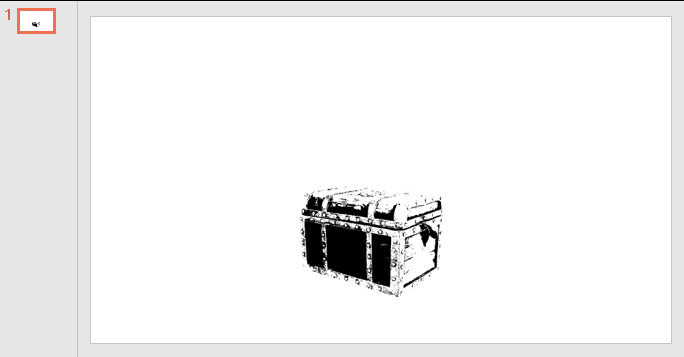

# dotnet OpenXML 图片特效的 BiLevel 黑白特效修改图片颜色

在 Office 中，如 PPT 和 Word 可以不对原图修改的前提下，通过叠加特效的方式，提供对图片的视觉输出进行修改的方法，本文将介绍 ECMA 376 里面的 第 20.1.8.11 章的 Bi-Level (Black White Effect) 的用法和功能

<!--more-->
<!-- 发布 -->

如下图是一张图片，这张图片有颜色的，这张图片是我瞎找的，如果有版权问题还请告诉我

<!--  -->


默认放入到 PPT 里面的效果如下

<!--  -->


如果按照 ECMA-376 的 biLevel (Black White Effect) 功能，给图片加上了 Bi-Level 特效，如以下代码，可以看到图片变成黑白

```xml
          <a:blip r:embed="rId2">
            <a:biLevel thresh="20000" />
          </a:blip>
```

<!--  -->


在 ECMA 376 里面的 第 20.1.8.11 章的 Bi-Level 特效有介绍使用方法。在 `a:biLevel` 里面的属性只有 thresh 一个属性，这个属性的含义是如果图片的每个像素点，如果像素点的亮度大于或等于给定的 thresh 也就是 Threshold 阈值那么将显示白色，否则将显示黑色

上文说的亮度指的是像素点的 luminance 亮度值，这是一个百分比单位，也就是如下面代码，除非是纯白透明，否则都是黑色

```xml
          <a:blip r:embed="rId2">
            <a:biLevel thresh="100000" />
          </a:blip>
```

反过来设置 `thresh="0"` 就显示白色

本文的属性是依靠 [dotnet OpenXML 解压缩文档为文件夹工具](https://blog.lindexi.com/post/dotnet-OpenXML-%E8%A7%A3%E5%8E%8B%E7%BC%A9%E6%96%87%E6%A1%A3%E4%B8%BA%E6%96%87%E4%BB%B6%E5%A4%B9%E5%B7%A5%E5%85%B7.html ) 工具协助测试的，这个工具是开源免费的工具，欢迎小伙伴使用

更多请看 [Office 使用 OpenXML SDK 解析文档博客目录](https://blog.lindexi.com/post/Office-%E4%BD%BF%E7%94%A8-OpenXML-SDK-%E8%A7%A3%E6%9E%90%E6%96%87%E6%A1%A3%E5%8D%9A%E5%AE%A2%E7%9B%AE%E5%BD%95.html )

<a rel="license" href="http://creativecommons.org/licenses/by-nc-sa/4.0/"></a><br />本作品采用<a rel="license" href="http://creativecommons.org/licenses/by-nc-sa/4.0/">知识共享署名-非商业性使用-相同方式共享 4.0 国际许可协议</a>进行许可。欢迎转载、使用、重新发布，但务必保留文章署名[林德熙](http://blog.csdn.net/lindexi_gd)(包含链接:http://blog.csdn.net/lindexi_gd )，不得用于商业目的，基于本文修改后的作品务必以相同的许可发布。如有任何疑问，请与我[联系](mailto:lindexi_gd@163.com)。
