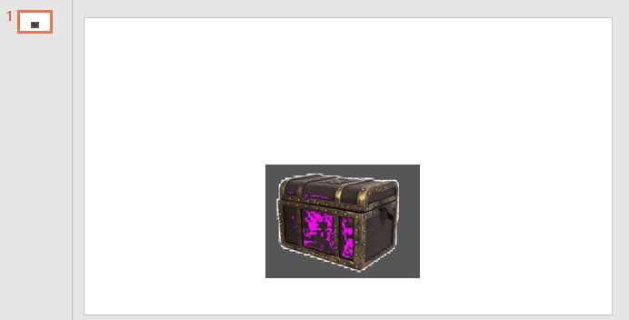

# dotnet OpenXML 图片特效的 Color Change Effect 特效修改图片颜色

在 Office 中，如 PPT 和 Word 可以不对原图修改的前提下，通过叠加特效的方式，提供对图片的视觉输出进行修改的方法，本文将介绍 ECMA 376 里面的 第 20.1.8.16 章的 ClrChange (Color Change Effect) 的用法和功能。日常这个特效用来去背景

<!--more-->
<!-- CreateTime:2021/4/1 14:56:00 -->

<!-- 发布 -->

如下图是一张图片，这张图片有背景色，这张图片是我瞎找的，如果有版权问题还请告诉我

<!--  -->


默认放入到 PPT 里面的效果如下

<!--  -->


而如果按照 ECMA-376 的 ClrChange (Color Change Effect) 功能，给图片加上了 ClrChange 特效，如以下代码，可以看到背景被去掉

```xml
          <a:blip r:embed="rId2">
            <a:clrChange>
              <a:clrFrom>
                <a:srgbClr val="F6F6F6" />
              </a:clrFrom>
              <a:clrTo>
                <a:srgbClr val="000000">
                  <a:alpha val="0" />
                </a:srgbClr>
              </a:clrTo>
            </a:clrChange>
          </a:blip>
```

<!--  -->


而 ColorChangeEffect 特效的定义如下，其实咱上面的代码没有写全，有一个叫 `useA` 的属性被忽略。这个属性的含义就是是否应该使用 Alpha 透明通道，好在默认值是 true 也就是应该采用透明通道

```xml
<xsd:complexType name="CT_ColorChangeEffect">
 <xsd:sequence>
   <xsd:element name="clrFrom" type="CT_Color" minOccurs="1" maxOccurs="1"/>
   <xsd:element name="clrTo" type="CT_Color" minOccurs="1" maxOccurs="1"/>
 </xsd:sequence>
 <xsd:attribute name="useA" type="xsd:boolean" use="optional" default="true"/>
</xsd:complexType>
```

如果咱加上了 `useA` 属性，如以下代码，那么 Alpha 如下面代码将会被忽略

```xml
          <a:blip r:embed="rId2">
            <a:clrChange useA="0">
              <a:clrFrom>
                <a:srgbClr val="F6F6F6" />
              </a:clrFrom>
              <a:clrTo>
                <a:srgbClr val="000000">
                  <a:alpha val="0" />
                </a:srgbClr>
              </a:clrTo>
            </a:clrChange>
          </a:blip>
```

此时就不是去背景的效果

<!--  -->


如果有多个颜色需要修改呢？此时可以叠加很多 Color Change 特效

```xml
          <a:blip r:embed="rId2">
            <a:clrChange>
              <a:clrFrom>
                <a:srgbClr val="F6F6F6" />
              </a:clrFrom>
              <a:clrTo>
                <a:srgbClr val="F6F6F6">
                  <a:alpha val="0" />
                </a:srgbClr>
              </a:clrTo>
            </a:clrChange>
            <a:clrChange>
              <a:clrFrom>
                <a:srgbClr val="2E2623" />
              </a:clrFrom>
              <a:clrTo>
                <a:srgbClr val="000000">
                  <a:alpha val="0" />
                </a:srgbClr>
              </a:clrTo>
            </a:clrChange>
            <a:clrChange>
              <a:clrFrom>
                <a:srgbClr val="3E3524" />
              </a:clrFrom>
              <a:clrTo>
                <a:srgbClr val="000000">
                  <a:alpha val="0" />
                </a:srgbClr>
              </a:clrTo>
            </a:clrChange>
          </a:blip>
```

可以看到效果如下

<!--  -->


以上去背景仅仅只是通过设置 Alpha 为 0 实现，其实本质的功能是替换颜色，如下面代码

```xml
          <a:blip r:embed="rId2">
            <a:clrChange>
              <a:clrFrom>
                <a:srgbClr val="F6F6F6" />
              </a:clrFrom>
              <a:clrTo>
                <a:srgbClr val="565656">
                </a:srgbClr>
              </a:clrTo>
            </a:clrChange>
            <a:clrChange>
              <a:clrFrom>
                <a:srgbClr val="2E2623" />
              </a:clrFrom>
              <a:clrTo>
                <a:srgbClr val="F606F6">
                </a:srgbClr>
              </a:clrTo>
            </a:clrChange>
            <a:clrChange>
              <a:clrFrom>
                <a:srgbClr val="3E3524" />
              </a:clrFrom>
              <a:clrTo>
                <a:srgbClr val="F606F6">
                </a:srgbClr>
              </a:clrTo>
            </a:clrChange>
          </a:blip>
```

可以看到如下图效果

<!--  -->


这个特效更多是作为去背景使用，在 PPT 里面的图片的颜色，设置透明色用上

本文的属性是依靠 [dotnet OpenXML 解压缩文档为文件夹工具](https://blog.lindexi.com/post/dotnet-OpenXML-%E8%A7%A3%E5%8E%8B%E7%BC%A9%E6%96%87%E6%A1%A3%E4%B8%BA%E6%96%87%E4%BB%B6%E5%A4%B9%E5%B7%A5%E5%85%B7.html ) 工具协助测试的，这个工具是开源免费的工具，欢迎小伙伴使用

更多请看 [Office 使用 OpenXML SDK 解析文档博客目录](https://blog.lindexi.com/post/Office-%E4%BD%BF%E7%94%A8-OpenXML-SDK-%E8%A7%A3%E6%9E%90%E6%96%87%E6%A1%A3%E5%8D%9A%E5%AE%A2%E7%9B%AE%E5%BD%95.html )

<a rel="license" href="http://creativecommons.org/licenses/by-nc-sa/4.0/"></a><br />本作品采用<a rel="license" href="http://creativecommons.org/licenses/by-nc-sa/4.0/">知识共享署名-非商业性使用-相同方式共享 4.0 国际许可协议</a>进行许可。欢迎转载、使用、重新发布，但务必保留文章署名[林德熙](http://blog.csdn.net/lindexi_gd)(包含链接:http://blog.csdn.net/lindexi_gd )，不得用于商业目的，基于本文修改后的作品务必以相同的许可发布。如有任何疑问，请与我[联系](mailto:lindexi_gd@163.com)。
