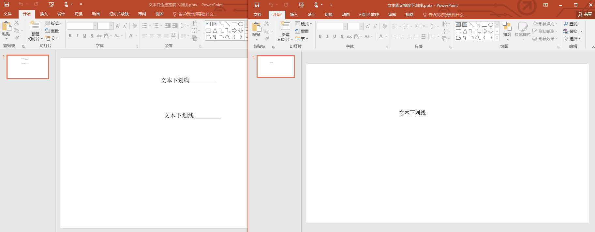
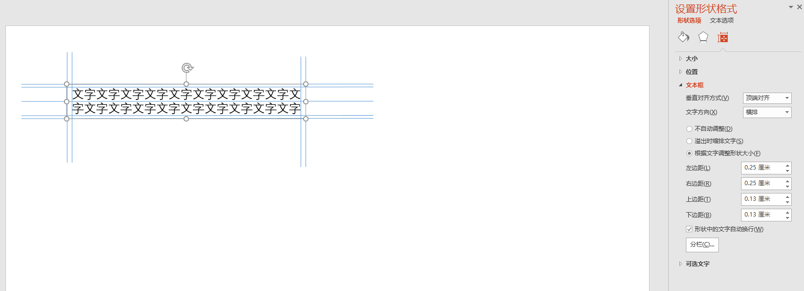
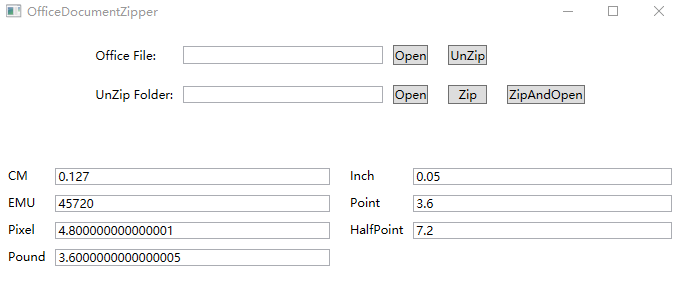
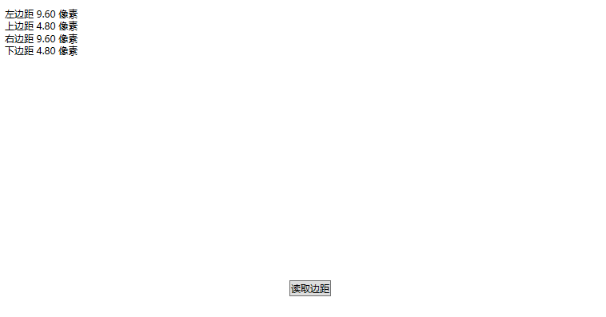
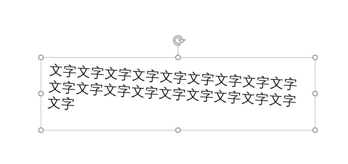
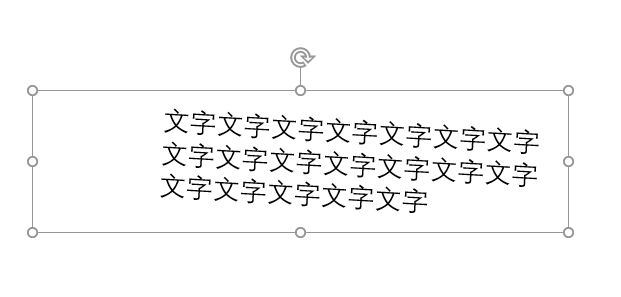
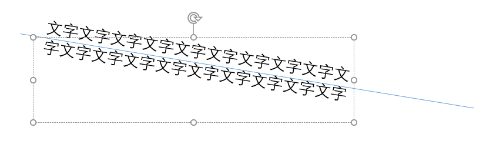
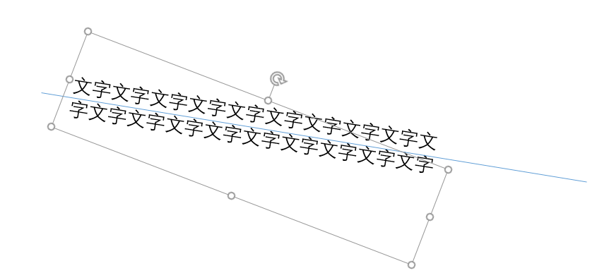

# dotnet OpenXML 文本 BodyProperties 的属性作用

本文收集 a:bodyPr 文本框属性 BodyProperties 的属性的作用

<!--more-->
<!-- CreateTime:2020/7/28 15:34:21 -->


根据 [ECMA-376](http://www.ecma-international.org/publications/standards/Ecma-376.htm ) 文档 21.1.2.1.1 bodyPr (Body Properties) 在 Office 的 OpenXML 使用这个属性定义文本框的属性

本文的 OpneXMl SDK 的获取代码前提都有以下代码

```csharp
public void Foo(BodyProperties textBodyProperties)
{
}
```

本文会不断更新，因为属性太多了

## 文本自适应宽度

文本框默认是固定宽度，使用 wrap (Text Wrapping Type) 属性，对应 OpenXML SDK 的 Wrap 属性

```csharp
TextWrappingValues textWrapping = bodyProperties?.Wrap?.Value;
```

默认值是 `TextWrappingValues.Square` 表示固定宽度，而自适应宽度是 TextWrappingValues.None 属性

那么自适应宽度和固定宽度有什么不同？原因在于如果在PPT里面新建一个文本框采用点击的方式，那么创建的就是自适应宽度文本框。如果拖动了一个矩形，那么就是固定宽度

采用自适应宽度将在文本框宽度不够的时候自动添加宽度。而固定宽度则是超过了文本框宽度的文本自动换行

另外自适应宽度的文本框会显示文本行末的下划线，而固定宽度不会显示，如下面两个课件。可以看到固定宽度的课件没有显示下划线，其实两个文档的元素都是相同的

<!--  -->


我写了一个 WPF 应用，用来告诉大家如何拿到这个属性，代码放在[github](https://github.com/lindexi/lindexi_gd/tree/4e3b373f658864bbb6a60a4ce82d695cf7c7e1fd/KiwejeejiWhalfalqenel)欢迎小伙伴访问。代码包含了上面图片两个测试的 PPT 文件

## 文本边距

文本框的文字和文本框是有边距的，这个边距使用 lIns 左边距和 tIns 上边距和 rIns 右边距和 bIns 下边距表示

```xml
  <a:bodyPr lIns="108000" tIns="180000" rIns="108000" bIns="180000">
  </a:bodyPr>
```

在 OpenXML SDK 的代码如下

```csharp
            var marginLeft = textBodyProperties.LeftInset;

            var marginTop = textBodyProperties.TopInset;

            var marginRight = textBodyProperties.RightInset;

            var marginBottom = textBodyProperties.BottomInset;
```

单位： EMU

默认值如下

```csharp
        private static MarginThickness DefaultMargin { get; } = new MarginThickness
        (
            new Inch(0.1).ToPixel(),
            new Inch(0.05).ToPixel(),
            new Inch(0.1).ToPixel(),
            new Inch(0.05).ToPixel()
        );
```

对应在 PPT 的大小和属性界面

<!--  -->


在 PPT 显示的是厘米单位，转换存在误差，例如上边距，采用 [dotnetCampus.OfficeDocumentZipper](https://github.com/dotnet-campus/dotnetCampus.OfficeDocumentZiper) 工具可以辅助计算，可以看到如上面代码的 `0.05 Inch` 上边距，对应的是 `0.127 厘米` 但是在 PPT 实际显示的是 0.13 厘米

<!--  -->


我写了一个 WPF 应用读取 PPT 文件的文本框的边距

<!--  -->


代码放在[github](https://github.com/lindexi/lindexi_gd/tree/11ee2825f2b1eee1e5a68efe172e7346f866ad41/GakagaycalhechemNerehejejairairway)欢迎小伙伴访问。代码包含了上面图片测试的 PPT 文件

## Rotation

Rotation

OpneXMl SDK: `var rotation = textBodyProperties.Rotation;`

单位： EMU 角度

```xml
<a:bodyPr wrap="square" rot="200000">
</a:bodyPr>
```

<!--  -->


用来表示整个文本框的旋转，可以使用负数。和使用 `a:xfrm` 的旋转不同的是，这里只是旋转文本框而不是旋转形状。旋转点是文本的左上角，注意是文本的左上角，会被 文本边距 影响，如修改文本边距比较大

```xml
<a:bodyPr wrap="square" lIns="1080000" tIns="180000" rIns="108000" bIns="180000" rot="200000">
</a:bodyPr>
```

执行 PPT 的效果如下

<!--  -->


文字的宽度等排版依然按照文本没有旋转排版，在排版之后再对文本进行旋转，因此文本可以超过文本框

## upright

Text Upright

OpneXMl SDK: `var upRight = textBodyProperties.UpRight;`

也许在 OpneXMl SDK 的命名是不对的，因此我给了一个 [Issues](https://github.com/OfficeDev/Open-XML-SDK/issues/784) 也许会更改命名

这个属性的英文描述博大精深，大概的意思其实是这个属性如果设置上去了，那么文本所在的形状的旋转将不会叠加在文本上，也就是无论形状如何旋转，文本的旋转都只受 textBodyProperties.Rotation 的影响

```xml
<a:bodyPr upright="1" rot="540000">
</a:bodyPr>
```

如上面代码，文本旋转了，但是此时的形状没有旋转，如下图

<!--  -->


而如果旋转了形状，可以看到文本的旋转角度没有变化

<!--  -->


这个属性默认值是 false 也就是跟随形状的旋转。这个属性除了影响跟随旋转同时也影响文本的旋转中心

一个有趣的规则是当形状旋转超过 45 度的时候，那么文本的布局的宽度和高度将会受形状的高度和宽度的影响，也就是将宽度和高度倒过来。可以认为是文本是竖着放，也就是这个属性名的含义，此时文本的排版就会按照当前水平方向的形状具体是那一边靠近决定那一边作为宽度，如下图

<!--  -->


此时的形状旋转让原本形状的作为高度的一边更靠近水平，于是就将原本高度的边作为文本宽度

这个属性 Text Upright 的命名太对了，就是让文本竖放，忽略形状的影响。同时排版布局也是相同的逻辑。只是这个文本不是垂直文本，因此可以看到英文的强大

## NormalAutoFit

- FontScale： [dotnet OpenXML 文本 BodyProperties 的 FontScale 与文本字号缩放](https://blog.lindexi.com/post/dotnet-OpenXML-%E6%96%87%E6%9C%AC-BodyProperties-%E7%9A%84-FontScale-%E4%B8%8E%E6%96%87%E6%9C%AC%E5%AD%97%E5%8F%B7%E7%BC%A9%E6%94%BE.html )

更多请看 [Office 使用 OpenXML SDK 解析文档博客目录](https://blog.lindexi.com/post/Office-%E4%BD%BF%E7%94%A8-OpenXML-SDK-%E8%A7%A3%E6%9E%90%E6%96%87%E6%A1%A3%E5%8D%9A%E5%AE%A2%E7%9B%AE%E5%BD%95.html )

<a rel="license" href="http://creativecommons.org/licenses/by-nc-sa/4.0/"></a><br />本作品采用<a rel="license" href="http://creativecommons.org/licenses/by-nc-sa/4.0/">知识共享署名-非商业性使用-相同方式共享 4.0 国际许可协议</a>进行许可。欢迎转载、使用、重新发布，但务必保留文章署名[林德熙](http://blog.csdn.net/lindexi_gd)(包含链接:http://blog.csdn.net/lindexi_gd )，不得用于商业目的，基于本文修改后的作品务必以相同的许可发布。如有任何疑问，请与我[联系](mailto:lindexi_gd@163.com)。  
