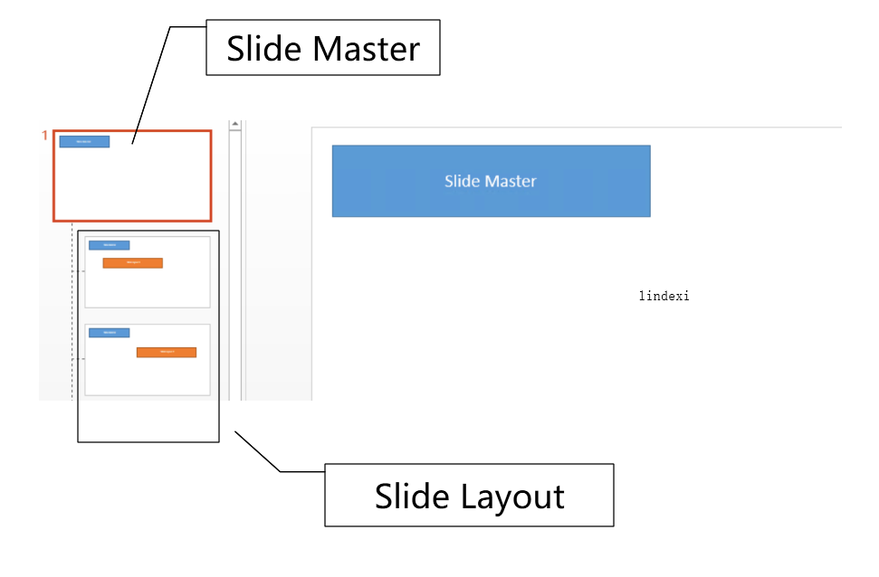
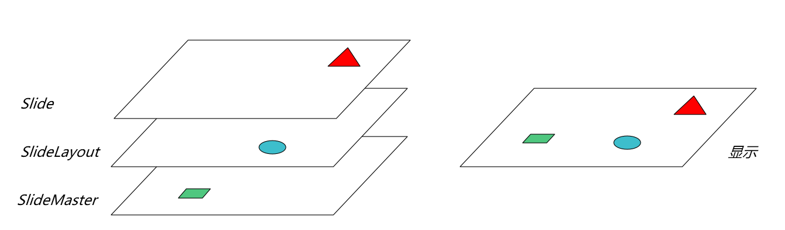

# dotnet OpenXML 的 Slide Master 和 Slide Layout 是什么

本文来告诉大家在解析 PPT 文档的时候，元素继承以及占位符需要用到的 Slide Master 和 Slide Layout 是什么

<!--more-->
<!-- CreateTime:7/4/2020 10:32:32 AM -->


在做 Office 解析的时候，小伙伴需要特别的去学习一下 Office 哦，不然有很多概念将会难以理解。而 Office 有多强？光属性定义加上注释的 C# 代码文件就有 15M 这么多

基本上所有市面上的解析 Office 的软件都只是实现很少的一部分功能…… 包括 WPS 在内

> 不愿透露姓名的小伙伴说： 其实并不是其他软件都实现了“ooxml 或 03 的二进制格式”很少的功能。实际上各家老牌办公文档厂商都有自己的办公文档协议，包括 WPS 也曾经出过自己的协议。对比其中公开的协议，微软对办公文档的定义其实对开放性是非常不友好的，对微软自家是非常友好的

回到主题，咱今天来聊聊 OpenXML 的 PPTX 文件的 Slide Master 和 Slide Layout 是什么。在开始之前期望小伙伴了解 PPT 的模版和占位符的作用，是真的需要小伙伴去学一下的哦。按照程序员的自学速度预计 10 分钟左右就能了解啦

来，先打开最新版本的 PPT 2013 新建一份空白的文档（最新版 2013 哈）实际上使用 2003 以上版本就可以

<!--  -->


点击视图的模版

<!--  -->


此时你就可以看到第一个大页面就是 Slide Master 页面，后续的每个页面就是 Slide Layout 页面。在 PPT文件中，可以创建多个母版 Slide Master 页面，每一个母版创建多个布局 Slide Layout 页面

在制作PPT时，依赖于不同的布局进行创建，不但减少了重复的工作量，也大大减少了PPT文件的体积

在渲染时，软件会依次在三个层级渲染母版，布局，页面中的元素。最终呈现的是三个层级叠加的显示

<!--  -->


这里的 Slide Layout 的顺序和页面顺序对应，也就是一个页面对应一个 Slide Layout 页面，而所有页面都对应相同的一个 Slide Master 页面

所有页面的占位符和样式都会优先从页面对应的 Slide Layout 里面获取，如果获取不到就从 Slide Master 获取

在 PPTX 文件里面的存放如下

```
│  [Content_Types].xml
│
├─DocProps
│      App.xml
│      Core.xml
│      Thumbnail.jpeg
│
├─Ppt
│  │  Presentation.xml
│  │  PresProps.xml
│  │  TableStyles.xml
│  │  ViewProps.xml
│  │
│  ├─HandoutMasters
│  │  │  HandoutMaster1.xml
│  │  │
│  │  └─_rels
│  │          HandoutMaster1.xml.rels
│  │
│  ├─SlideLayouts
│  │  │  SlideLayout1.xml
│  │  │  SlideLayout2.xml
│  │  │
│  │  └─_rels
│  │          slideLayout1.xml.rels
│  │          slideLayout2.xml.rels
│  │
│  ├─SlideMasters
│  │  │  SlideMaster1.xml
│  │  │
│  │  └─_rels
│  │          SlideMaster1.xml.rels
│  │
│  ├─Slides
│  │  │  Slide1.xml
│  │  │
│  │  └─_rels
│  │          Slide1.xml.rels
│  │
│  ├─Theme
│  │      Theme1.xml
│  │      Theme2.xml
│  │
│  └─_rels
│          Presentation.xml.rels
│
└─_rels
        .rels
```

上面代码需要关注的是 SlideLayouts 和 SlideMasters 的文件

在代码里面可以通过页面获取页面使用的 SlideLayout 和 SlideMaster 使用 OpenXML SDK 不需要自己去处理这部分复杂的逻辑

```csharp
            using (var presentationDocument =
                PresentationDocument.Open("test.pptx", false))
            {
                var presentationPart = presentationDocument.PresentationPart;
                foreach (var slidePart in presentationPart.SlideParts)
                {
                    var slide = slidePart.Slide;
                    var slideLayoutPart = slidePart.SlideLayoutPart;
                    var slideMasterPart = slideLayoutPart.SlideMasterPart;


                }
            }
```

获取元素可以使用下面方法

```csharp
                foreach (var slidePart in presentationPart.SlideParts)
                {
                    var slide = slidePart.Slide;
                    var slideLayoutPart = slidePart.SlideLayoutPart;
                    var slideMasterPart = slideLayoutPart.SlideMasterPart;

                    var textSlideLayout = slideLayoutPart.SlideLayout.Descendants<DocumentFormat.OpenXml.Drawing.Text>().First();
                    Console.WriteLine(textSlideLayout);

                    var textSlideMaster = slideMasterPart.SlideMaster.Descendants<DocumentFormat.OpenXml.Drawing.Text>().First();
                    Console.WriteLine(textSlideMaster);
                }
```

也就是通过 `presentationPart.SlideParts` 可以获取所有页面，通过页面的 `slidePart.SlideLayoutPart` 可以获取对应的 Slide Layout 是哪个，不需要自己去写判断逻辑

通过 `slideLayoutPart.SlideMasterPart` 可以获取 Slide Master 是哪个，也不需要自己去写判断逻辑

如果依然不懂的话，请下载我放在 [github](https://github.com/lindexi/lindexi_gd/tree/4f01ab6fc4f994a8eb58cf0f4593aaf8bfd6e693/ChihilaygerYadekearhu) 的代码，然后打开 test.pptx 文件，同时运行代码，看看输出的内容和对应的 PPT 界面显示的文本。另外推荐 [dotnetCampus.OfficeDocumentZipper](https://blog.lindexi.com/post/dotnet-OpenXML-%E8%A7%A3%E5%8E%8B%E7%BC%A9%E6%96%87%E6%A1%A3%E4%B8%BA%E6%96%87%E4%BB%B6%E5%A4%B9%E5%B7%A5%E5%85%B7.html ) 工具，这个工具可以更好的协助小伙伴测试文档

[2020-3-10-PPT文档解析之母版 - huangtengxiao](https://xinyuehtx.github.io/post/PPT%E6%96%87%E6%A1%A3%E7%BB%93%E6%9E%84%E4%B9%8B%E6%A8%A1%E6%9D%BF%E4%BD%8D%E7%BD%AE%E8%8E%B7%E5%8F%96.html )

<a rel="license" href="http://creativecommons.org/licenses/by-nc-sa/4.0/"></a><br />本作品采用<a rel="license" href="http://creativecommons.org/licenses/by-nc-sa/4.0/">知识共享署名-非商业性使用-相同方式共享 4.0 国际许可协议</a>进行许可。欢迎转载、使用、重新发布，但务必保留文章署名[林德熙](http://blog.csdn.net/lindexi_gd)(包含链接:http://blog.csdn.net/lindexi_gd )，不得用于商业目的，基于本文修改后的作品务必以相同的许可发布。如有任何疑问，请与我[联系](mailto:lindexi_gd@163.com)。 
