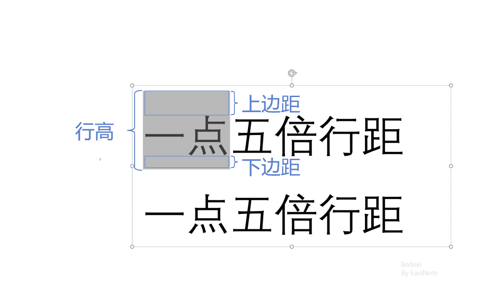

# dotnet OpenXML 聊聊 PPT 文本行距行高计算公式

在 Office 的 PPT 里面，将根据储存文档的行距以及字号，计算出渲染出来的每一行的文本行高。本文将根据 Office 2016 和 M365 两个版本，加上 QQ 截图测量，通过魔法的计算方式加上逗比的算法，从而拿到对应关系公式。也许对于 Word 来说，也是相同的规则，但本文仅仅只聊 PPT 的部分

<!--more-->
<!-- 发布 -->

在开始之前，让咱统一概念先。行距，可以分为两个不同的路线，分别是倍数行距和固定行距。倍数行距是本文的重点，指的是按照一定的倍数，如 1.5 倍行距等拉升文本框里面，每一行文本的距离。而固定行距指的是固定多少尺寸的高度的行距

行高，一行的高度值，以横排文本作为默认例子，指的是选择文本时，所看到的选择范围的高度值，如下图

<!--  -->


行距 = 上边距+下边距

修改行距时不影响文本的文字高度，只修改上边距和下边距的值。行高也因为行距的变更而变更

我根据使用 QQ 截图工具，测量不同的字体和字号，对于中文文字的行高的影响，通过逗比的算法计算出行距行高计算公式。以下公式没有找到任何权威的文档，仅仅只是我根据测量拿到的值，使用以下公式计算出来的值存在很小的误差

在 Office 的 PPT 的文本行高的计算公式是

```
PPTPixelLineSpacing = (a * PPTFL * OriginLineSpacing + b) * FontSize
```

其中 PPT 的行距计算的 a 和 b 为一次线性函数的方法，而 PPTFL 是 PPT Font Line Spacing 的意思，在 PPT 所有（也许是大部分）字体的行距都是这个值。以上的 OriginLineSpacing 就是界面上设置的行距倍数，如 1 倍行距和 1.5 倍行距等

可以将 a 和 PPTFL 合并为 PPTFL 然后使用 a 代替，此时 a 和 b 是常量，值如下

```
a = 1.2018
b = 0.0034
```

需要说明的是，尽管每个字体都有自己的 LineSpacing 值，可通过在 WPF 中如下代码获取，但是在 PPT 里面无视此过程，对大部分字体（规则不明）都采用相同的固定的常量值

```csharp
            var fontFamily = new System.Windows.Media.FontFamily("宋体");
            var fontFamilyLineSpacing = fontFamily.LineSpacing;
```

例如在 1.5 倍行距下，对应的 OriginLineSpacing 就是 1.5 的值，使用 9 号字体，代入公式计算如下

```
PPTPixelLineSpacing = (a * PPTFL * OriginLineSpacing + b) * FontSize
                    = (1.2018 * OriginLineSpacing + 0.0034) * FontSize
                    = (1.2018 * 1.5 + 0.0034) * 9 Pound
                    = (1.2018 * 1.5 + 0.0034) * 12 Pixel
                    = 21.6732 Pixel
```

通过实际测量，拿到的是 21.65 像素，约等于计算的值

如果关心计算方法，请看下文

和 WPF 的关系换算草稿如下

在 WPF 中文本行高计算公式如下

```csharp
ENPixelLineSpacing = LineSpaceHelper.CalcRenderLineSpace(maxFontSizeRunProperty, lineSpace) + FontSize * FontFamilyLineSpacing
```

而在 LineSpaceHelper.CalcRenderLineSpace 的计算方法如下

```csharp
        private static double CalcRenderLineSpace(double lineSpace, double fontSize, double fontFamilyLineSpacing)
        {
            return fontSize * fontFamilyLineSpacing * (lineSpace - 1) / 10;
        }
```

所以实际行距像素如下

```
ENPixelLineSpacing = FontSize * FontFamilyLineSpacing * (LineSpace - 1) / 10 + FontSize * FontFamilyLineSpacing
```

假定 ENPixelLineSpacing 和 PPT 的相同，那么有

```
PPTPixelLineSpacing = ENPixelLineSpacing
(a * OriginLineSpacing + b) * FontSize = FontSize * FontFamilyLineSpacing * (LineSpace - 1) / 10 + FontSize * FontFamilyLineSpacing
```

两边除以 FontSize 字体大小

```
(a * OriginLineSpacing + b) = FontFamilyLineSpacing * (LineSpace - 1) / 10 + FontFamilyLineSpacing
```

进行数学计算

```
                        (a * OriginLineSpacing + b) = FontFamilyLineSpacing * (LineSpace - 1) / 10 + FontFamilyLineSpacing
(a * OriginLineSpacing + b) - FontFamilyLineSpacing = FontFamilyLineSpacing * (LineSpace - 1) / 10
((a * OriginLineSpacing + b) - FontFamilyLineSpacing) * 10 = FontFamilyLineSpacing * (LineSpace - 1)
(((a * OriginLineSpacing + b) - FontFamilyLineSpacing) * 10) / FontFamilyLineSpacing = (LineSpace - 1)
(((a * OriginLineSpacing + b) - FontFamilyLineSpacing) * 10) / FontFamilyLineSpacing + 1 = LineSpace
```

而常量 a 和 b 的值如下

```
a = 1.2018;
b = 0.0034;
PPTFontLineSpacing = a;
```

通过 WPF 的渲染尺寸精确值可以算出 PPT 里面的公式常量。经过修改字号和行距，可以通过测量看到行高的是线性修改的。通过一次线性函数 `y = ax + b` 分别做控制字号修改行距倍数，以及控制行距倍数控制行高。分别测量渲染尺寸，建立二次线性代数，按照如上公式，计算出具体的值

以下是具体实验：

固定 1.5 倍行距下的测试，以下结果按照如下格式写

放大的渲染值 = 实际的渲染值 => 字号 => 字号像素值

173 / 4 Pixel = 43.5 Pixel => 18 Pound 字号 = 24 Pixel 字号 => 43.5 / 24 = 1.8125 字号像素值

229 / 4 Pixel = 57.2 Pixel => 24 Pound 字号 = 32 Pixel 字号 => 57.2 / 32 = 1.7875 字号像素值

289 / 4 Pixel = 72.25 Pixel => 30 Pound 字号 = 40 Pixel 字号 => 72.25 / 40 = 1.80625 字号像素值

同理计算出 `单倍行距 = 1.204166666666667` 的值

假定默认行距都是 1.2018 的倍数，按照如下测试公式进行计算

```
(1.2018 x OriginLineSpacing + 0.0034) * FontSize 
```

带入 1.5 倍行距 + 24 Pixel 字号，计算如下

```
1.5 倍行距 + 24 Pixel => (1.2018 * 1.5 + 0.0034) * 24 Pixel = 43.3464 Pixel
```

测量结果差不多

不同的字体的 LineSpacing 值如下：

- 微软雅黑 1.31982421875
- 宋体 1.140625

因为在 PPT 中不同的字体对行高没有影响，以上都是固定微软雅黑进行测试

更多请看 [Office 使用 OpenXML SDK 解析文档博客目录](https://blog.lindexi.com/post/Office-%E4%BD%BF%E7%94%A8-OpenXML-SDK-%E8%A7%A3%E6%9E%90%E6%96%87%E6%A1%A3%E5%8D%9A%E5%AE%A2%E7%9B%AE%E5%BD%95.html )

<a rel="license" href="http://creativecommons.org/licenses/by-nc-sa/4.0/"></a><br />本作品采用<a rel="license" href="http://creativecommons.org/licenses/by-nc-sa/4.0/">知识共享署名-非商业性使用-相同方式共享 4.0 国际许可协议</a>进行许可。欢迎转载、使用、重新发布，但务必保留文章署名[林德熙](http://blog.csdn.net/lindexi_gd)(包含链接:http://blog.csdn.net/lindexi_gd )，不得用于商业目的，基于本文修改后的作品务必以相同的许可发布。如有任何疑问，请与我[联系](mailto:lindexi_gd@163.com)。