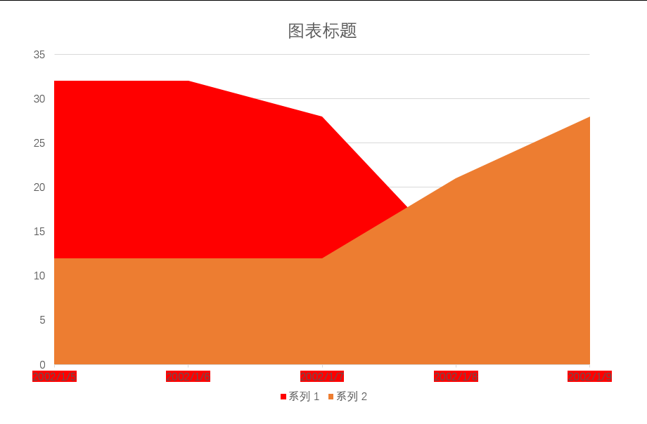

# dotnet OpenXML 解析 PPT 图表 解析日期时间表示内容

在 OpenXML 里的图表存放的日期时间很多存放的是数值，需要进行转换才能获取到用户可见的字符串

<!--more-->
<!-- CreateTime:2022/8/10 17:58:07 -->

<!-- 发布 -->

日期在 OpenXML 里可以使用数值存放，需要根据数值和格式化字符串转换为用户可见的字符串

如以下的 PPT 文件

<!--  -->


存储的代码如下

```xml
  <c:cat>
    <c:numRef>
      <c:f>Sheet1!$A$2:$A$6</c:f>
      <c:numCache>
        <c:formatCode>m/d/yyyy</c:formatCode>
        <c:ptCount val="5" />
        <c:pt idx="0">
          <c:v>37261</c:v>
        </c:pt>
        <c:pt idx="1">
          <c:v>37262</c:v>
        </c:pt>
        <c:pt idx="2">
          <c:v>37263</c:v>
        </c:pt>
        <c:pt idx="3">
          <c:v>37264</c:v>
        </c:pt>
        <c:pt idx="4">
          <c:v>37265</c:v>
        </c:pt>
      </c:numCache>
    </c:numRef>
  </c:cat>
```

本文将告诉大家如何从上面的数据转换为日期字符串

本文基于 [dotnet OpenXML 解析 PPT 图表 面积图入门](https://blog.lindexi.com/post/dotnet-OpenXML-%E8%A7%A3%E6%9E%90-PPT-%E5%9B%BE%E8%A1%A8-%E9%9D%A2%E7%A7%AF%E5%9B%BE%E5%85%A5%E9%97%A8.html ) 的内容，替换了 PPT 文档。可以从本文最后获取到测试的文件和所有代码

在以上的测试的文档，类别的内容是日期，存储代码如上。在开始解析之前，需要了解 PPT 的图表的日期存放格式。这个存放格式有两套，分别是使用 1904 作为基础和使用 1900 作为基础的时间，和 Excel 存储日期相同，请看 [Date systems in Excel](https://support.microsoft.com/en-us/office/date-systems-in-excel-e7fe7167-48a9-4b96-bb53-5612a800b487 )

为了了解当前的图表采用的基础时间，先读取 ChartSpace 的 Date1904 属性，如以下代码

```csharp
var useDate1904 = chartSpace.Date1904?.Val?.Value ?? false;
```

根据 ECMA 376 的第 21.2.2.38 章的描述，在 Date1904 属性设置为 true 时，将采用 1904 作为基础的日期。计算方法是使用 1904 或 1900 的前一天，分别是 1903.12.31 和 1899.12.31 作为计算。存放的数值表示的是加上当前的天数，计算到日期字符串，需要减去当天

在获取到 NumericValue 的值，如以下代码的 `numericValueText` 可以进行计算

```csharp
  if (numericValueText != null && double.TryParse(numericValueText, out var value))
  {
      var days = value;
      days--; // 不包括当天

      // 这里只格式化日期的
      // This element specifies that the chart uses the 1904 date system. If the 1904 date system is used, then all dates
      // and times shall be specified as a decimal number of days since Dec. 31, 1903. If the 1904 date system is not
      // used, then all dates and times shall be specified as a decimal number of days since Dec. 31, 1899.
      var useDate1904 = chartSpace.Date1904?.Val?.Value ?? false;
      if (useDate1904)
      {
          list.Add(new DateTime(1903, 12, 31).AddDays(days).ToString(format));
      }
      else
      {
          list.Add(new DateTime(1899, 12, 31).AddDays(days).ToString(format));
      }
  }
```

以上的 `format` 是格式化字符串，格式化字符串可以用来告诉软件如何格式化日期等内容

在 NumberingCache 存在格式化字符串的定义，如不写将不进行格式化。在 NumberingCache 的每个 NumericPoint 也可以存放格式化字符串，给每个数值定义格式化字符串。如果 NumericPoint 没有定义，将继承使用 NumberingCache 的格式化字符串，如以下代码，获取类别的数值定义的格式化字符串

```csharp
    // 读取缓存
    var categoryAxisDataNumberingCache = categoryAxisDataNumberReference
        .GetFirstChild<DocumentFormat.OpenXml.Drawing.Charts.NumberingCache>()!;
    // 字符串格式化方式，例如日期方式格式化，可以是空，空表示不需要格式化
    var formatCodeText = categoryAxisDataNumberingCache.FormatCode?.Text;

    foreach (var numericPoint in categoryAxisDataNumberingCache
                 .Elements<DocumentFormat.OpenXml.Drawing.Charts.NumericPoint>())
    {
        var numericPointFormatCode = numericPoint.FormatCode;
        var numericPointFormatCodeText = numericPointFormatCode?.Value ?? formatCodeText;
    }
```

以上代码的 `numericPointFormatCodeText` 就是格式化字符串的内容

在 PPT 里，对于日期，如果格式化字符串是默认的字符串，将采用所运行的设备的语言文化进行格式化。例如在使用中文的设备上运行 PPT 软件，将使用 `yyyy/M/d` 作为默认的格式化

如在使用中文的设备，需要使用以下代码进行处理

```csharp
  var format = numericPointFormatCodeText;
  if (format == null || format == "m/d/yyyy")
  {
      // 如果是空和默认的，转换为中文的。后续可以根据设备的语言，转换为对应的日期
      format = "yyyy/M/d";
  }
```

将以上的代码组合，即可解析图表类别的日期内容

```csharp
  // 类别轴上的数据 横坐标轴上的数据
  var categoryAxisData =
      areaChartSeries.GetFirstChild<DocumentFormat.OpenXml.Drawing.Charts.CategoryAxisData>()!;
  // 类别轴上的数据 横坐标轴上的数据 可能是数据，也就是 NumberReference 类型。也可能是字符串，也就是 StringReference 类型。这份课件里面，存放的是 NumberReference 类型，以下代码只演示采用 NumberReference 类型的读取方式，还请在具体项目，自行判断
  // 以下是 NumberReference 类型读取的例子
  var categoryAxisDataNumberReference = categoryAxisData
      .GetFirstChild<DocumentFormat.OpenXml.Drawing.Charts.NumberReference>();
  if (categoryAxisDataNumberReference != null)
  {
      // 这个公式表示是从 Excel 哪个数据获取的，获取的方式比较复杂。这里还是先从缓存获取
      var categoryAxisDataFormula = categoryAxisDataNumberReference
          .GetFirstChild<DocumentFormat.OpenXml.Drawing.Charts.Formula>();

      // 读取缓存
      var categoryAxisDataNumberingCache = categoryAxisDataNumberReference
          .GetFirstChild<DocumentFormat.OpenXml.Drawing.Charts.NumberingCache>()!;
      // 字符串格式化方式，例如日期方式格式化，可以是空，空表示不需要格式化
      var formatCodeText = categoryAxisDataNumberingCache.FormatCode?.Text;

      var list = new List<string>();

      foreach (var numericPoint in categoryAxisDataNumberingCache
                   .Elements<DocumentFormat.OpenXml.Drawing.Charts.NumericPoint>())
      {
          var numericPointFormatCode = numericPoint.FormatCode;
          var numericPointFormatCodeText = numericPointFormatCode?.Value ?? formatCodeText;

          var numericValueText = numericPoint.NumericValue?.Text;

          var format = numericPointFormatCodeText;
          if (format == null || format == "m/d/yyyy")
          {
              // 如果是空和默认的，转换为中文的。后续可以根据设备的语言，转换为对应的日期
              format = "yyyy/M/d";
          }

          if (numericValueText != null && double.TryParse(numericValueText, out var value))
          {
              var days = value;
              days--; // 不包括当天

              // 这里只格式化日期的
              // This element specifies that the chart uses the 1904 date system. If the 1904 date system is used, then all dates
              // and times shall be specified as a decimal number of days since Dec. 31, 1903. If the 1904 date system is not
              // used, then all dates and times shall be specified as a decimal number of days since Dec. 31, 1899.
              // [Date systems in Excel](https://support.microsoft.com/en-us/office/date-systems-in-excel-e7fe7167-48a9-4b96-bb53-5612a800b487 )
              var useDate1904 = chartSpace.Date1904?.Val?.Value ?? false;
              if (useDate1904)
              {
                  list.Add(new DateTime(1903, 12, 31).AddDays(days).ToString(format));
              }
              else
              {
                  list.Add(new DateTime(1899, 12, 31).AddDays(days).ToString(format));
              }
          }
          else
          {
              list.Add(numericValueText ?? string.Empty);
          }
      }
  }
```

以上代码的 list 集合就存放了类别的内容

运行的效果如下

<!--  -->


本文以上的测试文件和代码放在[github](https://github.com/lindexi/lindexi_gd/tree/9edb86c15c3f7c9aff9896ffc2de903464b2feb7/Pptx) 和 [gitee](https://gitee.com/lindexi/lindexi_gd/tree/9edb86c15c3f7c9aff9896ffc2de903464b2feb7/Pptx) 欢迎访问

可以通过如下方式获取本文的源代码，先创建一个空文件夹，接着使用命令行 cd 命令进入此空文件夹，在命令行里面输入以下代码，即可获取到本文的代码

```
git init
git remote add origin https://gitee.com/lindexi/lindexi_gd.git
git pull origin 9edb86c15c3f7c9aff9896ffc2de903464b2feb7
```

以上使用的是 gitee 的源，如果 gitee 不能访问，请替换为 github 的源

```
git remote remove origin
git remote add origin https://github.com/lindexi/lindexi_gd.git
```

获取代码之后，进入 MainWindow.xaml.cs 文件，在这个文件里就是本文的例子代码

更多请看 [Office 使用 OpenXML SDK 解析文档博客目录](https://blog.lindexi.com/post/Office-%E4%BD%BF%E7%94%A8-OpenXML-SDK-%E8%A7%A3%E6%9E%90%E6%96%87%E6%A1%A3%E5%8D%9A%E5%AE%A2%E7%9B%AE%E5%BD%95.html )