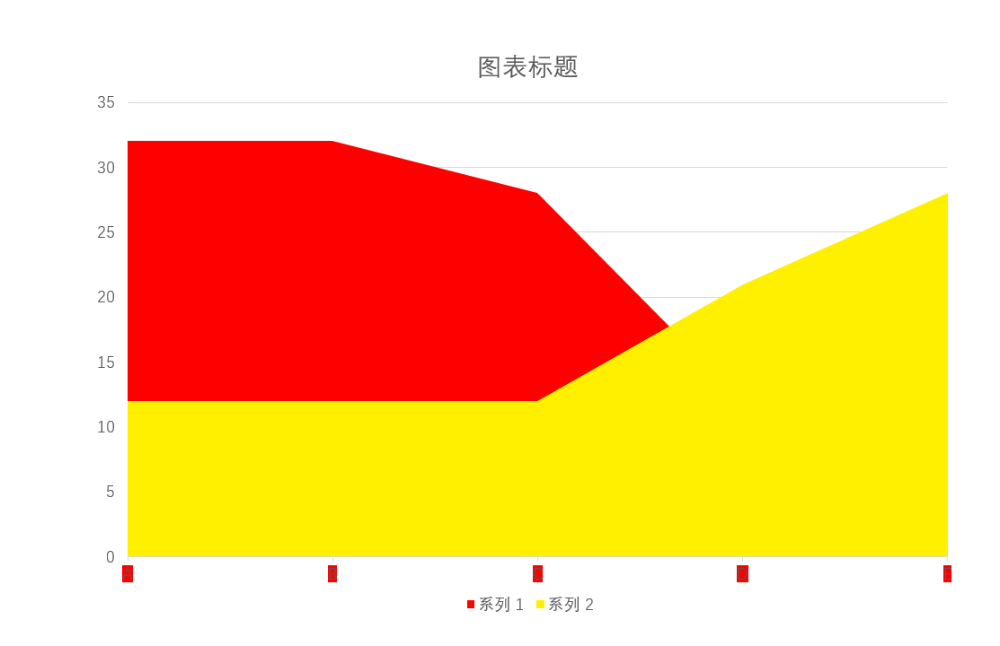
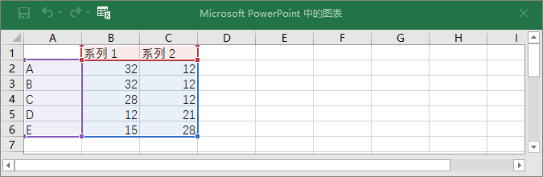
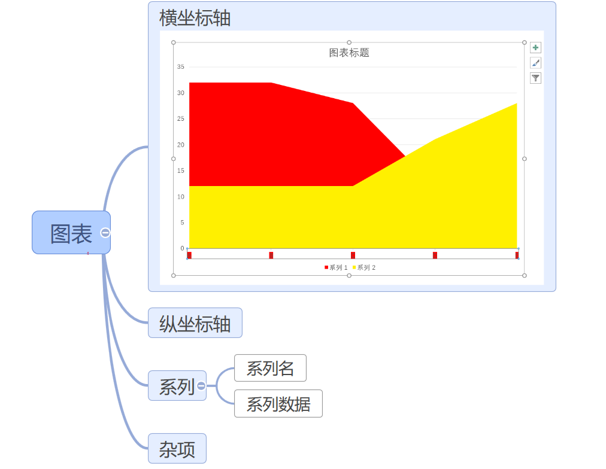
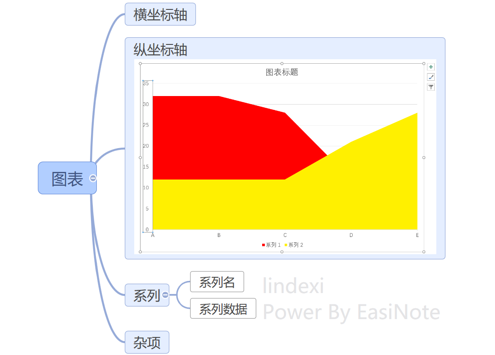
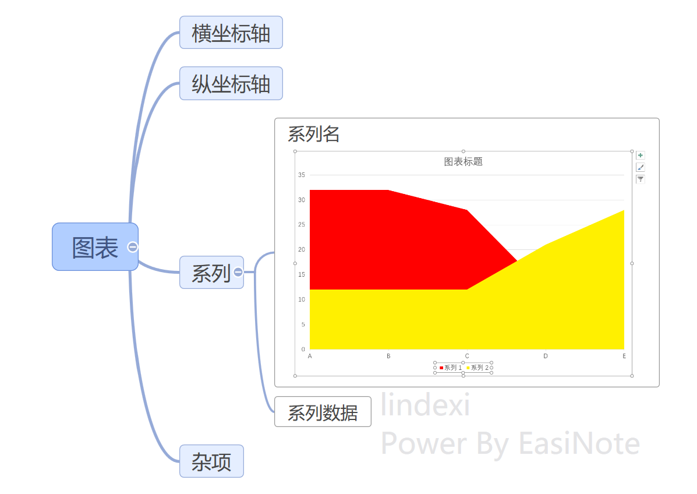
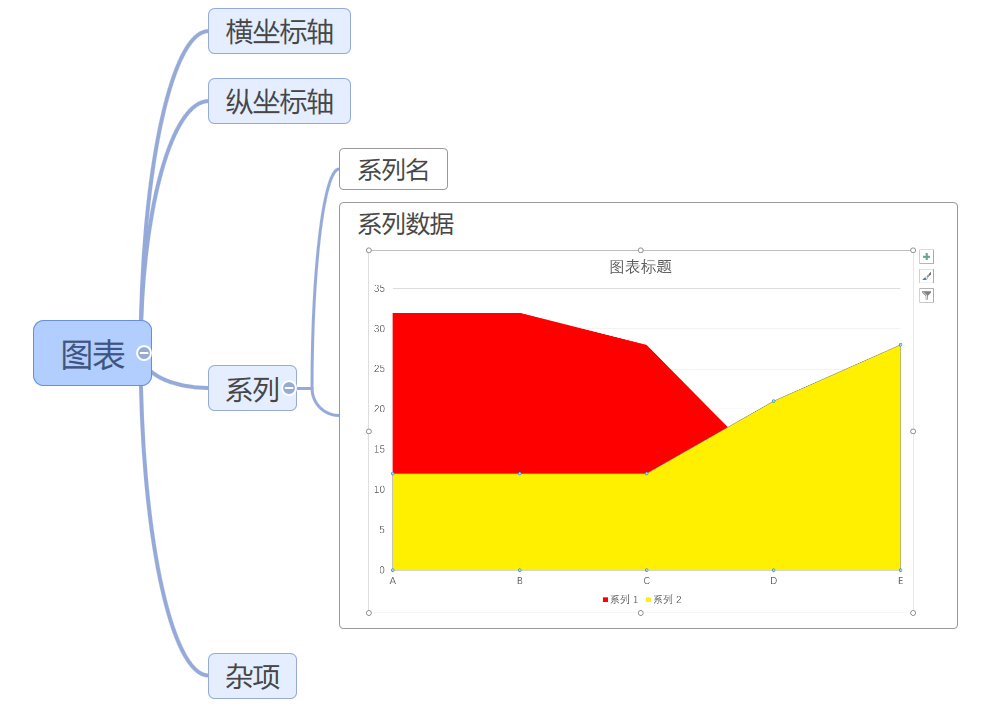
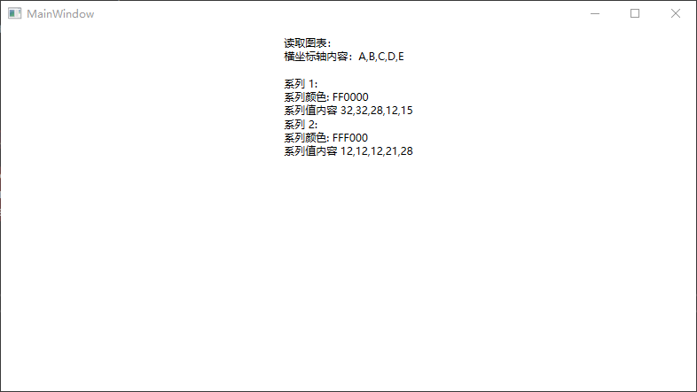

# dotnet OpenXML 解析 PPT 图表 面积图入门

本文告诉大家如何使用 OpenXML 解析 PPT 的图表，以面积图为入门例子告诉大家 OpenXML 的存储

<!--more-->
<!-- CreateTime:2022/8/4 17:07:13 -->


<!-- 发布 -->

在 PPT 里面，有强大的图表功能，可以联动 Excel 展示数据。在 PPT 里面的图表和 Excel 的图表稍微有一些差别，本文只聊 PPT 的图表

如下图是本文将作为例子的图表

<!--  -->


对应的数据如图

<!--  -->


如上图可以看到在 PPT 里面的图表是可以使用 Excel 的数据，将 Excel 文件内嵌到 PPT 里面。但这不代表要解析图表的数据就一定需要先了解 Excel 的内容，本文将绕过对 Excel 的任何读取，通过 PPT 里面的内容拿到图表的数据

## 图表的组成

开始之前，还请先让我告诉大家一个图表元素包含的基础组件部分，也就是图表元素由哪些部分组成

### 横坐标轴 类别坐标轴数据

对于面积图来说，默认的面积图的横坐标就是类别的坐标轴数据，对应的 Excel 表格的第一列的内容，也就是 A B C D E 这些数据

<!--  -->


在 OpenXML SDK 里面，采用 `DocumentFormat.OpenXml.Drawing.Charts.CategoryAxisData` 存放

本文以下将会告诉大家获取方法，这里只是写上类型，方便大家了解

### 纵坐标轴

对于默认面积图来说，纵坐标属于一个运行时属性，不会存放在 OpenXML 文档里面，需要根据每个系列的数值的最大值和最小值以及配置，计算出来纵坐标的内容，本文不会涉及具体的坐标轴计算方法

<!--  -->


### 数据系列

在图表里面有数据系列的概念，每个系列的数据组成一个个的数据系列。对于大部分图表来说，数据层都是由一个个数据系列组成的

每个数据系列可以有自己的系列名称

<!--  -->


系列名称大部分时候都放在图例里面，也就是图例里面的内容就是由系列名称提供的

在 OpenXML SDK 里面，采用 `DocumentFormat.OpenXml.Drawing.Charts.SeriesText` 存放

在图表里面，核心就是对数据的处理，系列的数据内容就是核心的

<!--  -->


如图，面积图有两个数据系列，通过上面的 Excel 内容可以了解到两个系列的数据分别如下

```
系列 1：32,32,28,12,15
系列 2：12,12,12,21,28
```

本文将重点告诉大家如何解析图表的数据

## 效果

以下是本文的解析效果，可以解析出来图表的类别坐标轴数据，和各个系列的系列名称和系列数据

<!--  -->


下面将告诉大家如何根据 OpenXML SDK 提供的方法读取到图表的内容

## 读取图表

在开始之前，还请大家先了解 OpenXml 读取 PPT 的基础。本文将在 [C# dotnet 使用 OpenXml 解析 PPT 文件](https://blog.lindexi.com/post/C-dotnet-%E4%BD%BF%E7%94%A8-OpenXml-%E8%A7%A3%E6%9E%90-PPT-%E6%96%87%E4%BB%B6.html) 的基础上进行开发

先读取 PPT 文档

```csharp
            var file = new FileInfo("Test.pptx");

            using var presentationDocument = PresentationDocument.Open(file.FullName, false);
```

本文的测试文件和所有代码都可以在本文最后获取

在这份 Test.pptx 的图表是放在第一个页面，先获取页面，通过页面的元素获取到图表

```csharp
            var slide = presentationDocument.PresentationPart!.SlideParts.First().Slide;
```

在 OpenXML 里面的页面存放的图表的代码如下

```xml
 <p:cSld>
   <p:spTree>
     <p:graphicFrame>
       ...
     </p:graphicFrame>
   </p:spTree>
 </p:cSld>
```

图表也是一个元素，放在 SharpTree (p:spTree) 里面，作为 GraphicFrame （p:graphicFrame） 存放。但不能说 GraphicFrame 就是图表元素，在 OpenXML 的 GraphicFrame 是一个很通用的元素，如 OLE 元素或公式都会用到此元素

读取 GraphicFrame 的内容，如果能读取到 ChartReference （c:chart） 那就证明这个元素是图表元素

```csharp
            // 获取图表元素，在这份课件里，有一个面积图。以下使用 First 忽略细节，获取图表
            var graphicFrame = slide.Descendants<GraphicFrame>().First();
            // 获取到对应的图表信息，图表是引用的，内容不是放在 Slide 页面里面，而是放在独立的图表 xml 文件里
            var graphic = graphicFrame.Graphic;
            var graphicData = graphic?.GraphicData;
            var chartReference = graphicData?.GetFirstChild<DocumentFormat.OpenXml.Drawing.Charts.ChartReference>();
```

在 OpenXML 里，图表是引用的，内容不是放在 Slide 页面里面，而是放在独立的图表 xml 文件里。页面的代码如下

```xml
   <p:graphicFrame>
     <a:graphic>
       <a:graphicData uri="http://schemas.openxmlformats.org/drawingml/2006/chart">
         <c:chart xmlns:c="http://schemas.openxmlformats.org/drawingml/2006/chart" xmlns:r="http://schemas.openxmlformats.org/officeDocument/2006/relationships" r:id="rId2" />
       </a:graphicData>
     </a:graphic>
   </p:graphicFrame>
```

根据 [dotnet OpenXML 为什么资源使用 Relationship 引用](https://blog.lindexi.com/post/dotnet-OpenXML-%E4%B8%BA%E4%BB%80%E4%B9%88%E8%B5%84%E6%BA%90%E4%BD%BF%E7%94%A8-Relationship-%E5%BC%95%E7%94%A8.html ) 可以了解到，这里的图表引用，需要到 rels 文件里面获取关联的内容。在 OpenXml SDK 里，封装好了获取方法，获取时需要有两个参数，一个是 id 另一个是去哪里获取的 Part 内容。获取 id 的方法如下

```csharp
            // 获取到 id 也就是 `r:id="rId2"` 根据 Relationship 的描述，可以知道去 rels 文件里面获取关联的内容。在 OpenXml SDK 里，封装好了获取方法，获取时需要有两个参数，一个是 id 另一个是去哪里获取的 Part 内容
            var id = chartReference?.Id?.Value;
```

在这份课件是图表元素放在页面上，可以通过页面去获取到图表元素的存储。在实际项目里，需要判断图表元素所在的是页面还是页面模版等，不能和以下代码写固定从页面获取

```csharp
            // 如果是放在模版里面，记得要用模版的 Part 去获取
            var currentPart = slide.SlidePart!;

            if (!currentPart.TryGetPartById(id!, out var openXmlPart))
            {
                // 在这份课件里，一定不会进入此分支
                // 一定能从页面找到对应的资源内容也就是图表
                return;
            }
```

这里拿到的 `openXmlPart` 是 ChartPart 对象，这里面就存放了图表的信息

```csharp
            if (openXmlPart is not ChartPart chartPart)
            {
                // 这里拿到的一定是 ChartPart 对象，一定不会进入此分支。但是在实际项目的代码，还是要做这个判断
                return;
            }
```

这里的 ChartPart 对应的就是 charts\chartN.xml 文件。这里的 chartN.xml 表示的是 chart1.xml 或 chart2.xml 等文件

这个文件的存储内容大概如下

```xml
 <?xml version="1.0" encoding="UTF-8" standalone="yes"?>
 <c:chartSpace>
   <c:chart>
     ...
     <c:plotArea>
       ...
     </c:plotArea>
   </c:chart>
 </c:chartSpace>
```

读取图表首先需要获取 ChartSpace 对象，再获取到 Chart 对象。在 OpenXML SDK 里面，定义了很多个 Chart 类型，放在不同的命名空间，在获取时，推荐写全命名空间

```csharp
using Chart = DocumentFormat.OpenXml.Drawing.Charts.Chart;

            // 这里的 ChartPart 对应的就是 charts\chartN.xml 文件。这里的 chartN.xml 表示的是 chart1.xml 或 chart2.xml 等文件
            var chartSpace = chartPart.ChartSpace;

            // 这里的 Chart 是 DocumentFormat.OpenXml.Drawing.Charts.Chart 类型，在 OpenXmlSDK 里面，有多个同名的 Chart 类型，还请看具体的命名空间
            /*
            <?xml version="1.0" encoding="UTF-8" standalone="yes"?>
            <c:chartSpace>
              <c:chart>
                ...
                <c:plotArea>
                  ...
                </c:plotArea>
              </c:chart>
            </c:chartSpace>
             */
            var chart = chartSpace.GetFirstChild<Chart>();
```

接着获取 PlotArea 对象，这里面就存放了图表的内容

```csharp
using PlotArea = DocumentFormat.OpenXml.Drawing.Charts.PlotArea;

            var chart = chartSpace.GetFirstChild<Chart>();
            var plotArea = chart?.GetFirstChild<PlotArea>();
```

如本文的面积图就放在 PlotArea 元素里

```xml
 <c:plotArea>
   <c:areaChart>
     ...
   </c:areaChart>
 </c:plotArea>
```

在 Chart 里，有不同的图表类型，例如 BarChart Bar3DChart LineChart PieChart Pie3DChart OfPieChart 不水字数了，就是很多不同的图表。本文这里只获取面积图

```csharp
            var areaChart = plotArea?.GetFirstChild<AreaChart>();

            if (areaChart == null)
            {
                // 在这份课件里，一定存在面积图，一定不会进入此分支
                return;
            }
```

获取到面积图，接下来就是读取面积图的数据系列

数据系列的存储代码如下

```xml
  <c:plotArea>
    <c:areaChart>
      <c:ser>
        ...
      </c:ser>
      <c:ser>
        ...
      </c:ser>
    </c:areaChart>
  </c:plotArea>
```

每个 DocumentFormat.OpenXml.Drawing.Charts.AreaChartSeries （c:ser） 就是一个系列的内容。一个图表里面可以有多个系列，每个系列包含下面数据

- 系列名
- 系列数据
- 类别轴上的数据
- 样式信息

样式信息里面包含了填充的画刷，如纯色填充。类别轴上的数据是面积图横坐标轴显示内容，每个系列都有，这是重复的数据，在 PPT 里，只取第一个系列的数据

数据系列里的横坐标轴的类别坐标轴数据，在 OpenXML 里面，是 `DocumentFormat.OpenXml.Drawing.Charts.CategoryAxisData` 类型，对应 `c:cat` 的内容

读取类别轴上的数据方法如下

```csharp
            foreach (var areaChartChildElement in areaChart.ChildElements)
            {
                // 获取系列
                /*
                    <c:plotArea>
                      <c:areaChart>
                        <c:ser>
                          ...
                        </c:ser>
                        <c:ser>
                          ...
                        </c:ser>
                      </c:areaChart>
                    </c:plotArea>
                 */
                if (areaChartChildElement is DocumentFormat.OpenXml.Drawing.Charts.AreaChartSeries areaChartSeries)
                {
                    // 类别轴上的数据 横坐标轴上的数据
                    var categoryAxisData = areaChartSeries.GetFirstChild<DocumentFormat.OpenXml.Drawing.Charts.CategoryAxisData>()!;
                }
            }
```

在 OpenXML SDK 的存储如下

```xml
 <c:plotArea>
   <c:areaChart>
     <c:ser>
       <c:cat>
       </c:cat>         
     </c:ser>
   </c:areaChart>
 </c:plotArea>
```

在类别轴上的数据存放的是数据引用，数据引用在 OpenXML 里面有多个不同的存储类型。例如 NumberReference 类型表示的是数值引用，例如 StringReference 表示字符串引用类型，在这份课件里面存放的是 StringReference 类型，以下代码只演示采用 StringReference 类型的读取方式，还请在具体项目，自行判断

```csharp
var categoryAxisData = areaChartSeries.GetFirstChild<DocumentFormat.OpenXml.Drawing.Charts.CategoryAxisData>()!;
var categoryAxisDataStringReference = categoryAxisData.GetFirstChild<StringReference>();
```

在 StringReference 里面，大部分都有两个部分，一个是公式，表示如何引用 Excel 的数据。通过公式读取 Excel 可以获取到正确的数据，但缺点是比较复杂。可以通过第二部分，也就是缓存数据部分读取，虽然读取缓存也许不对，不过优点在于简单

存储的代码如下

```xml
  <c:cat>
   <c:strRef>
     <c:f>Sheet1!$A$2:$A$6</c:f>
     <c:strCache>
       <c:ptCount val="5" />
       <c:pt idx="0">
         <c:v>A</c:v>
       </c:pt>
       <c:pt idx="1">
         <c:v>B</c:v>
       </c:pt>
       <c:pt idx="2">
         <c:v>C</c:v>
       </c:pt>
       <c:pt idx="3">
         <c:v>D</c:v>
       </c:pt>
       <c:pt idx="4">
         <c:v>E</c:v>
       </c:pt>
     </c:strCache>
   </c:strRef>
 </c:cat>
```

获取公式的代码如下

```csharp
 var categoryAxisDataStringReference = categoryAxisData.GetFirstChild<StringReference>();
 if (categoryAxisDataStringReference != null)
 {
     // 这个公式表示是从 Excel 哪个数据获取的，获取的方式比较复杂。这里还是先从缓存获取
     var categoryAxisDataFormula = categoryAxisDataStringReference.GetFirstChild<DocumentFormat.OpenXml.Drawing.Charts.Formula>();
 }
```

读取缓存的方法如下

```csharp
  // 读取缓存
  var categoryAxisDataStringCache = categoryAxisDataStringReference.GetFirstChild<DocumentFormat.OpenXml.Drawing.Charts.StringCache>()!;
```

读取类别轴上的数据

```csharp
 var list = new List<string>();
 foreach (var stringPoint in categoryAxisDataStringCache.Elements<DocumentFormat.OpenXml.Drawing.Charts.StringPoint>())
 {
     // 以下的 类别轴上的数据 横坐标轴上的数据，各个列项的名称
     // 对于面积图来说，多个系列的列项都是相同的。尽管在 OpenXml 存储里面存放了两份，但以第零个系列的为准
     var text = stringPoint.GetFirstChild<DocumentFormat.OpenXml.Drawing.Charts.NumericValue>()!.Text;

     list.Add(text);
 }
```

上面代码的 list 就存放了读取类别轴上的数据，也就是 A B C D E 字符串

继续读取第二部分内容，系列的系列名称，也就是系列标题

系列标题在 OpenXML 里，使用 `DocumentFormat.OpenXml.Drawing.Charts.SeriesText` 表示，对应 `c:tx` 类型。在图表里面的数据大部分都采用引用的方式，引用里面基本都有两个部分，如 类别轴上的数据 有引用 Excel 的公式，和缓存

这里读取系列标题也是通过缓存读取，不会去解析 Excel 内容

```csharp
  // 获取系列标题，放心，可以不读取 Excel 的内容，通过缓存内容即可。但是缓存内容也许和 Excel 内容不对应
  /*
      <c:plotArea>
        <c:areaChart>
          <c:ser>
            <c:tx>
              <c:strRef>
                <c:f>Sheet1!$B$1</c:f>
                <c:strCache>
                  <c:ptCount val="1" />
                  <c:pt idx="0">
                    <c:v>系列 1</c:v>
                  </c:pt>
                </c:strCache>
              </c:strRef>
            </c:tx>
            ...
          </c:ser>
        </c:areaChart>
      </c:plotArea>
   */
  var seriesText = areaChartSeries.GetFirstChild<DocumentFormat.OpenXml.Drawing.Charts.SeriesText>()!;
  var seriesTextStringReference = seriesText.GetFirstChild<DocumentFormat.OpenXml.Drawing.Charts.StringReference>()!;
  // 这个公式表示是从 Excel 哪个数据获取的，获取的方式比较复杂。这里还是先从缓存获取
  var seriesTextFormula = seriesTextStringReference.GetFirstChild<DocumentFormat.OpenXml.Drawing.Charts.Formula>();
```

使用缓存获取系列名称

```csharp
 // 有缓存的话，从缓存获取就可以，缓存内容也许和 Excel 内容不对应
 /*
     <c:strCache>
       <c:ptCount val="1" />
       <c:pt idx="0">
         <c:v>系列 1</c:v>
       </c:pt>
     </c:strCache>
  */
 var seriesTextStringCache = seriesTextStringReference.GetFirstChild<DocumentFormat.OpenXml.Drawing.Charts.StringCache>();
 if (seriesTextStringCache != null)
 {
     var seriesTextStringPoint = seriesTextStringCache.GetFirstChild<DocumentFormat.OpenXml.Drawing.Charts.StringPoint>();

     var numericValue = seriesTextStringPoint!.GetFirstChild<DocumentFormat.OpenXml.Drawing.Charts.NumericValue>();
     // 系列1 标题
     var title = numericValue!.Text;

 }
```

上面的 `title` 就是系列的标题，如上面图表，拿到的就是 `系列1` 或 `系列2` 字符串

完成获取系列的标题获取，下面开始获取系列的样式。系列的样式如系列的填充画刷，画刷是一个比较大的话题，本文使用的例子只用到纯色画刷

图表的系列样式存储采用的是 `DocumentFormat.OpenXml.Drawing.Charts.ChartShapeProperties` 类型，图表的形状属性的内容和 形状属性 的内容是差不多的

```xml
  <c:plotArea>
    <c:areaChart>
      <c:ser>
        <c:tx>
          ...
        </c:tx>
        <c:spPr>
          <a:solidFill>
            <a:srgbClr val="FF0000" />
          </a:solidFill>
        </c:spPr>
      </c:ser>
    </c:areaChart>
  </c:plotArea>
```

获取系列的填充颜色

```csharp
  // 图表的形状属性的内容和 形状属性 的内容是差不多的
  /*
      <c:plotArea>
        <c:areaChart>
          <c:ser>
            <c:tx>
              ...
            </c:tx>
            <c:spPr>
              <a:solidFill>
                <a:srgbClr val="FF0000" />
              </a:solidFill>
            </c:spPr>
          </c:ser>
        </c:areaChart>
      </c:plotArea>
   */
  var chartShapeProperties = areaChartSeries.GetFirstChild<DocumentFormat.OpenXml.Drawing.Charts.ChartShapeProperties>()!;
  // 获取画刷，画刷有好多不同的类型，这个课件只用了纯色
  var solidFill = chartShapeProperties.GetFirstChild<SolidFill>()!;
  // 画刷纯色颜色有很多个颜色表示方法，这个课件只用了 RGB 的纯色
  var rgbColorModelHex = solidFill.GetFirstChild<DocumentFormat.OpenXml.Drawing.RgbColorModelHex>()!;
  // 这就是这个系列的颜色
  var colorValue = rgbColorModelHex.Val!.Value;
```

以上的 `colorValue` 就是这个系列的填充。不同的系列可以有不同的填充

接下来获取图表最核心的内容，系列的数据

在 PPT 里面，是允许数据为空的，如果是空，行为就是不绘制系列内容。本文使用的例子是存在数据，就没有判断数据为空

```csharp
 // 获取系列的值
 /*
     <c:plotArea>
       <c:areaChart>
         <c:ser>
           <c:tx>
             ...
           </c:tx>
           <c:cat>
             ...
           </c:cat>
           <c:val>
             <c:numRef>
               <c:f>Sheet1!$B$2:$B$6</c:f>
               <c:numCache>
                 <c:formatCode>General</c:formatCode>
                 <c:ptCount val="5" />
                 <c:pt idx="0">
                   <c:v>32</c:v>
                 </c:pt>
                 <c:pt idx="1">
                   <c:v>32</c:v>
                 </c:pt>
                 <c:pt idx="2">
                   <c:v>28</c:v>
                 </c:pt>
                 <c:pt idx="3">
                   <c:v>12</c:v>
                 </c:pt>
                 <c:pt idx="4">
                   <c:v>15</c:v>
                 </c:pt>
               </c:numCache>
             </c:numRef>
           </c:val>
         </c:ser>
         <c:ser>
           ...
         </c:ser>
       </c:areaChart>
     </c:plotArea>
  */
 // 这就是系列里面最重要的数据。然而在 PPT 里面，是允许为空的，如果是空，行为就是不绘制系列内容
 var valueList = new List<string>();
 var values = areaChartSeries.GetFirstChild<DocumentFormat.OpenXml.Drawing.Charts.Values>();
```

在面积图，数据理论上是数值类型。对应的是 NumberReference 引用，同样可以使用公式引用 Excel 数据，也可以采用缓存获取

```csharp
  var valuesNumberReference = values?.GetFirstChild<DocumentFormat.OpenXml.Drawing.Charts.NumberReference>();
  if (valuesNumberReference != null)
  {
      /*
           <c:val>
             <c:numRef>
               <c:f>Sheet1!$B$2:$B$6</c:f>
               <c:numCache>
                 <c:formatCode>General</c:formatCode>
                 <c:ptCount val="5" />
                 <c:pt idx="0">
                   <c:v>32</c:v>
                 </c:pt>
                 <c:pt idx="1">
                   <c:v>32</c:v>
                 </c:pt>
                 <c:pt idx="2">
                   <c:v>28</c:v>
                 </c:pt>
                 <c:pt idx="3">
                   <c:v>12</c:v>
                 </c:pt>
                 <c:pt idx="4">
                   <c:v>15</c:v>
                 </c:pt>
               </c:numCache>
             </c:numRef>
           </c:val>
       */
      // 这份课件一定存在 values 内容
      // 和其他的一样，存在引用 Excel 的内容。这里同样也是采用缓存
      var valuesFormula = valuesNumberReference.GetFirstChild<DocumentFormat.OpenXml.Drawing.Charts.Formula>();
```

本文只采用读取缓存的方式。在缓存也有一个数据，表示数据如何格式化显示，例如通过格式化字符串告诉 PPT 如何格式化日期内容等。本文使用的例子写的是 General 表示不需要格式化

```csharp
  var valuesNumberingCache = valuesNumberReference.GetFirstChild<DocumentFormat.OpenXml.Drawing.Charts.NumberingCache>()!;

  // 通过 FormatCode 决定界面效果。这份课件是 General 表示不用格式化
  var formatCode = valuesNumberingCache.FormatCode;
  Debug.Assert(formatCode?.Text == "General");
```

接下来继续获取数据

```csharp
 var valueList = new List<string>();
 foreach (var numericPoint in valuesNumberingCache.Elements<DocumentFormat.OpenXml.Drawing.Charts.NumericPoint>())
 {
     var numericValue = numericPoint.GetFirstChild<DocumentFormat.OpenXml.Drawing.Charts.NumericValue>()!;
     var numericValueText = numericValue.Text;

     valueList.Add(numericValueText);
 }
```

通过上面例子，无论数据引用是数值引用还是字符串引用，具体的内容都是 `DocumentFormat.OpenXml.Drawing.Charts.NumericValue` 类型。如果不需要准确判断内容，可以采用获取此类型，简化逻辑

上面代码的 `valueList` 存放了系列数据内容

这就完成了读取图表的大部分数据内容

## 数据存储

本文期望大家了解 OpenXML 里对图表的存储方式。在 OpenXML 里面，图表是放在页面的一个元素，但是数据不放在页面上，页面上放的是引用。通过引用获取到图表的内容，对应的数据存储如下

```xml
    <c:plotArea>
      <c:areaChart>
        <c:ser>
          <!-- 系列的数据 -->
        </c:ser>
        <c:ser>
          <c:tx>
            <!-- 系列标题 -->
          </c:tx>
          <c:spPr>
            <!-- 系列样式 -->
          </c:spPr>
          <c:cat>
            <!-- 类别轴上的数据 -->
          </c:cat>
          <c:val>
            <!-- 系列数据 -->
          </c:val>
        </c:ser>
      </c:areaChart>
    </c:plotArea>
```

以上是面积图的存储，面积图里面由多个系列组成。对于图表来说，最重要的数据就是每个系列的内容。系列里面包含了系列标题，系列样式，和类别轴上的数据和系列数据。其中类别轴上的数据只有第零个系列的有用，但是在 OpenXML 里每个系列都重复存放一份

在图表里存放的数据使用的是引用，可以用公式读取 Excel 的数据，也可以使用缓存。如果想要数据正确，是需要通过公式读取 Excel 的数据，如果想要读取 Excel 的数据，前置的是读取 PPT 里面内嵌的 Excel 内容，请看 [dotnet OpenXML 读取 PPT 内嵌 xlsx 格式 Excel 表格的信息](https://blog.lindexi.com/post/dotnet-OpenXML-%E8%AF%BB%E5%8F%96-PPT-%E5%86%85%E5%B5%8C-xlsx-%E6%A0%BC%E5%BC%8F-Excel-%E8%A1%A8%E6%A0%BC%E7%9A%84%E4%BF%A1%E6%81%AF.html )

图表还有其他的内容，如图表标题和样式等。以及图表的数据格式化展示逻辑，日期计算方法等，这些都没有放在本文告诉大家。将在后续博客告诉大家这些内容和行为，请看 [Office 使用 OpenXML SDK 解析文档博客目录](https://blog.lindexi.com/post/Office-%E4%BD%BF%E7%94%A8-OpenXML-SDK-%E8%A7%A3%E6%9E%90%E6%96%87%E6%A1%A3%E5%8D%9A%E5%AE%A2%E7%9B%AE%E5%BD%95.html )

## 代码

本文以上的测试文件和代码放在[github](https://github.com/lindexi/lindexi_gd/tree/2f266d20916f784662d84a98d60b7e1bd097d11d/Pptx) 和 [gitee](https://gitee.com/lindexi/lindexi_gd/tree/2f266d20916f784662d84a98d60b7e1bd097d11d/Pptx) 欢迎访问

可以通过如下方式获取本文的源代码，先创建一个空文件夹，接着使用命令行 cd 命令进入此空文件夹，在命令行里面输入以下代码，即可获取到本文的代码

```
git init
git remote add origin https://gitee.com/lindexi/lindexi_gd.git
git pull origin 2f266d20916f784662d84a98d60b7e1bd097d11d
```

以上使用的是 gitee 的源，如果 gitee 不能访问，请替换为 github 的源

```
git remote remove origin
git remote add origin https://github.com/lindexi/lindexi_gd.git
```

获取代码之后，进入 MainWindow.xaml.cs 文件，在这个文件里就是本文的例子代码

## 更多

更多请看 [Office 使用 OpenXML SDK 解析文档博客目录](https://blog.lindexi.com/post/Office-%E4%BD%BF%E7%94%A8-OpenXML-SDK-%E8%A7%A3%E6%9E%90%E6%96%87%E6%A1%A3%E5%8D%9A%E5%AE%A2%E7%9B%AE%E5%BD%95.html )
