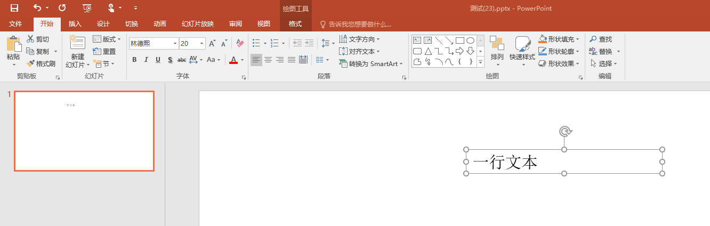
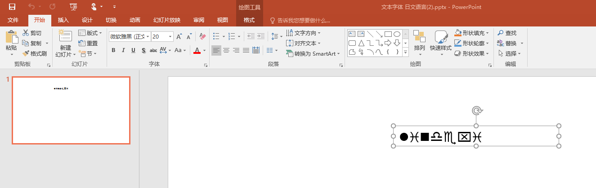

# dotnet OpenXML 解析 PPT 文本字体获取详解

在 OpenXML 的 PPT 的文本的字体是一个比较复杂的概念，即使在 OpenXML SDK 的辅助下，也需要自己写很多的逻辑。通过 ECMA 376 文档里面散落在各地的描述，和 dotnetCampus.OfficeDocumentZipper 工具的实验帮助之下，我摸到了本文将要告诉大家的规则，以及逻辑的实现

<!--more-->
<!-- CreateTime:2020/8/10 10:17:20 -->

<!-- 发布 -->

有大量的 Office 相关软件在解析 PPT 文档使用的文本段的字体都非常简单，当然，这部分处理也就不全面

先让咱看一个简单的 PPT 文档的字体定义写法

```xml
<a:r>
    <a:rPr lang="zh-CN" altLang="en-US" dirty="0" smtClean="0">
        <a:ea typeface="楷体" panose="02010609060101010101" pitchFamily="49" charset="-122"/>
    </a:rPr>
    <a:t>一行文本</a:t>
</a:r>
```

请问当前文本的字体是什么？人类简单就能回答是 `楷体` 了 

那么更进一步的，如下面的 PPT 文档呢？

```xml
<a:r>
    <a:rPr lang="zh-CN" altLang="en-US" sz="2000" dirty="0" smtClean="0">
        <a:latin typeface="Jokerman" panose="02010609060101010101" pitchFamily="49" charset="-122"/>
        <a:ea typeface="宋体" panose="02010609060101010101" pitchFamily="49" charset="-122"/>
    </a:rPr>
    <a:t>a文本</a:t>
</a:r>
```

此时的 `a:latin` 和 `a:ea` 表示的是什么意思？需要使用哪个字体才对？其实这是 PPT 的允许西文和中文使用不同字体的功能

<!--  -->


这就是需要让不同的字符选择不同的字体的功能，解析方式请看 [dotnet OpenXML 文本字体的选择规则](https://blog.lindexi.com/post/dotnet-OpenXML-%E6%96%87%E6%9C%AC%E5%AD%97%E4%BD%93%E7%9A%84%E9%80%89%E6%8B%A9%E8%A7%84%E5%88%99.html)

是不是觉得有点复杂了？其实这还不算复杂的

看看下面这份简洁的 PPT 文档

```xml
<p:txBody>
    <a:bodyPr wrap="square" rtlCol="0">
        <a:spAutoFit/>
    </a:bodyPr>
    <a:lstStyle/>
    <a:p>
        <a:r>
            <a:rPr lang="zh-CN" altLang="en-US" smtClean="0"/>
            <a:t>一行文本</a:t>
        </a:r>
        <a:endParaRPr lang="en-US" dirty="0"/>
    </a:p>
</p:txBody>
```

请问这份文档的字体是什么？其实上面的代码没有写任何的字体，那么 PPT 是如何知道的？这就需要用到上面代码一个没有写完成的功能，就是样式列表了

小伙伴可以注意到上面代码的一行内容 `<a:lstStyle/>` 这个的意思是什么？在 OpenXML SDK 里面有这个定义，请看代码

```csharp
  var textBodyListStyle = textBody.ListStyle;
```

我准备了这份简洁的文档，这份文档将需要用到本文说讲到的大部分知识才能解析出实际的字体是哪个。本文用的测试文档放在 [github](https://github.com/lindexi/lindexi_gd/tree/e1c54f474820d4fcfe91a81e8e6b3b07c8bec53a/GojolerbeeLerechelhajerefawwha) 欢迎小伙伴下载测试。另外推荐 [dotnetCampus.OfficeDocumentZipper](https://blog.lindexi.com/post/dotnet-OpenXML-%E8%A7%A3%E5%8E%8B%E7%BC%A9%E6%96%87%E6%A1%A3%E4%B8%BA%E6%96%87%E4%BB%B6%E5%A4%B9%E5%B7%A5%E5%85%B7.html ) 工具，这个工具可以更好的协助小伙伴测试文档

整个文本的定义如下

```xml
<p:sp>
    <p:nvSpPr>
        <p:cNvPr id="4" name="文本框 3"/>
        <p:cNvSpPr txBox="1"/>
        <p:nvPr/>
    </p:nvSpPr>
    <p:spPr>
        <a:xfrm>
            <a:off x="4168346" y="914401"/>
            <a:ext cx="3048000" cy="369332"/>
        </a:xfrm>
        <a:prstGeom prst="rect"></a:prstGeom>
    </p:spPr>
    <p:txBody>
        <a:bodyPr wrap="square" rtlCol="0"></a:bodyPr>
        <a:lstStyle/>
        <a:p>
            <a:r>
                <a:rPr lang="zh-CN" altLang="en-US" smtClean="0"/>
                <a:t>一行文本</a:t>
            </a:r>
            <a:endParaRPr lang="en-US" dirty="0"/>
        </a:p>
    </p:txBody>
</p:sp>
```

从上面的内容可以看到，这不是一个放在占位符的文本，那么什么是放在占位符的文本？如果 `<p:nvPr/>` 没有内容，那么就表示不是占位符的文本。而如果是占位符那么 `p:nvpr` 将会是如下格式

```xml
        <p:nvpr>
            <p:ph type="ctrTitle">
            </p:ph>
        </p:nvpr>
```

对于 占位符 需要通过继承属性添加更多内容，请看 [dotnet OpenXML SDK 文本占位符解析](https://blog.lindexi.com/post/dotnet-OpenXML-SDK-%E6%96%87%E6%9C%AC%E5%8D%A0%E4%BD%8D%E7%AC%A6%E8%A7%A3%E6%9E%90.html)

当然，本文的例子不是占位符是比较简单的元素

但是这个形状没有给一个明确的字体，那么请问这个形状用的字体是什么？此时涉及到了一个文本样式等级的概念

在文档里面有这一句代码 `<a:lstStyle/>` 表示文本本身没有重新定义样式等级，需要一层层寻找

可以在 Slide 的 Layout 和 Slide 的 Master 找到对应的 `p:txStyles` 内容，不过样式等级是另外的知识点，不在本文围内。可以告诉大家的是在这份测试课件里面，其实 SlideLayout 和 SlideMaster 的 `p:txStyles` 都不是此文本的样式。因为这个元素需要的是 `<p:defaultTextStyle>` 默认文本样式

那么在哪可以拿到 `<p:defaultTextStyle>` 默认文本样式？这是文档全局的设置，因此需要在 Presentation.xml 拿到，对应的 OpenXML 代码如下

```csharp
using (var presentationDocument =
       DocumentFormat.OpenXml.Packaging.PresentationDocument.Open("测试.pptx", false))
{
    var presentationPart = presentationDocument.PresentationPart;
    var presentation = presentationPart.Presentation;

    var defaultTextStyle = presentation.DefaultTextStyle;
}
```

这就是 DefaultTextStyle 的获取方法，从 Presentation 类的属性定义也能了解到这个规则

于是按照规则，默认如果文本存在 ListStyle 那么就使用文本自己的，否则采用文档级的。当然，如果是占位符等元素，那就更复杂了，咱先忽略

在这份课件里面文本元素没有自己的样式重写，可以通过下面代码判断

```csharp
var defaultTextStyle = presentation.DefaultTextStyle;
var textBody = shape.TextBody;

var textBodyListStyle = textBody.ListStyle;

Debug.Assert(textBodyListStyle.ChildElements.Count == 0);
```

而 TextStyle 其实准确说是一个列表，有从 Level1 到 Level9 的样式，那么如何知道使用哪一个

其实样式列表针对的是段级的，也就是一个文本里面的多个不同的段落可以使用不同的样式等级，可以使用如下代码

```csharp
var paragraph = textBody.Descendants<Paragraph>().First();
var level = paragraph.ParagraphProperties?.Level?.Value ?? 1;
Debug.Assert(level == 1);
Debug.Assert(paragraph.ParagraphProperties == null);

var paragraphProperties = defaultTextStyle.Level1ParagraphProperties;
```

这是测试代码，因此仅获取第一段，而按照测试的文档，可以了解到此时的 level 就是 1 同时文本本身没有重写样式，因此使用的就是 defaultTextStyle.Level1ParagraphProperties 作为段落样式

文本的样式段落里面包含了段落的默认属性，也就是文本的 Run 如果没有定义如字体等这些属性，将会使用段落默认属性

可以使用下面代码获取段落的文本

```csharp
foreach (var run in paragraph.Descendants<Run>())
{
    var runProperties = run.RunProperties;
    var eastAsianFont = runProperties.GetFirstChild<EastAsianFont>();
    Debug.Assert(eastAsianFont == null);
    // 忽略代码
}
```

从上面代码可以看到，测试文档是不存在 EastAsianFont 字体的，此时就需要用到 defaultTextStyle 定义的内容，在开始写代码之前，先看一下在文档里面是如何定义的

在测试文档里面的 Presentation.xml 是这样定义的，这份文档放在 [github](https://github.com/lindexi/lindexi_gd/tree/6f972af439c4daf91318fbda8d7bf6ac88a069de/GojolerbeeLerechelhajerefawwha/GojolerbeeLerechelhajerefawwha/测试.pptx) 欢迎小伙伴解压缩

```xml
<?xml version="1.0" encoding="UTF-8" standalone="yes"?>
<p:presentation xmlns:a="http://schemas.openxmlformats.org/drawingml/2006/main" xmlns:r="http://schemas.openxmlformats.org/officeDocument/2006/relationships" xmlns:p="http://schemas.openxmlformats.org/presentationml/2006/main" saveSubsetFonts="1">
    <p:sldMasterIdLst>
        <p:sldMasterId id="2147483648" r:id="rId1"/>
    </p:sldMasterIdLst>
    <p:sldIdLst>
        <p:sldId id="256" r:id="rId2"/>
    </p:sldIdLst>
    <p:sldSz cx="12192000" cy="6858000"/>
    <p:notesSz cx="6858000" cy="9144000"/>
    <p:defaultTextStyle>
        <a:defPPr>
            <a:defRPr lang="en-US"/>
        </a:defPPr>
        <a:lvl1pPr marL="0" algn="l" defTabSz="914400" rtl="0" eaLnBrk="1" latinLnBrk="0" hangingPunct="1">
            <a:defRPr sz="1800" kern="1200">
                <a:solidFill>
                    <a:schemeClr val="tx1"/>
                </a:solidFill>
                <a:latin typeface="+mn-lt"/>
                <a:ea typeface="林德熙"/>
                <a:cs typeface="+mn-cs"/>
            </a:defRPr>
        </a:lvl1pPr>
    </p:defaultTextStyle>
    <p:extLst>
        <p:ext uri="{EFAFB233-063F-42B5-8137-9DF3F51BA10A}">
            <p15:sldGuideLst xmlns:p15="http://schemas.microsoft.com/office/powerpoint/2012/main"/>
        </p:ext>
    </p:extLst>
</p:presentation>
```

也许看起来的逻辑有点复杂，但是实际需要了解的逻辑如下

```xml
<a:lvl1pPr marL="0" algn="l" defTabSz="914400" rtl="0" eaLnBrk="1" latinLnBrk="0" hangingPunct="1">
    <a:defRPr sz="1800" kern="1200">
        <a:solidFill>
            <a:schemeClr val="tx1"/>
        </a:solidFill>
        <a:latin typeface="+mn-lt"/>
        <a:ea typeface="林德熙"/>
        <a:cs typeface="+mn-cs"/>
    </a:defRPr>
</a:lvl1pPr>
```

此时的 paragraphProperties 的数据，将是上面的内容，默认使用 Level1 的属性

```csharp
var paragraphProperties = defaultTextStyle.Level1ParagraphProperties;
```

此时获取的方法如下面代码

```csharp
eastAsianFont = paragraphProperties.GetFirstChild<DefaultRunProperties>()
    .GetFirstChild<EastAsianFont>();

var typeface = eastAsianFont.Typeface.Value;

Console.WriteLine($"字体是 {typeface}"); 

// typeface == "林德熙"
```

当然，小伙伴如果没有去阅读 [dotnet OpenXML 文本字体的选择规则](https://blog.lindexi.com/post/dotnet-OpenXML-%E6%96%87%E6%9C%AC%E5%AD%97%E4%BD%93%E7%9A%84%E9%80%89%E6%8B%A9%E8%A7%84%E5%88%99.html) 也许就会好奇为什么我这里的代码只读取 EastAsianFont 字体，而忽略其他的字体

<!--  -->


从本文到当前只是在告诉大家如何拿到对的字体属性，字体属性是对于文本段 Run 来说的，而不是段落或文本的。但是如果文本段 Run 不存在字体的定义，那么此时需要尝试去获取段落的默认属性定义。但是如果段落没有任何默认属性定义，就需要获取文档的文本样式定义

这部分逻辑属于 PPT 的逻辑，我在 ECMA 376 没有找到相关的描述，也就是这部分逻辑是没有文档定义的。这也就是 OpenXML SDK 这个库没有提供获取文本最终属性的方法的原因

如果小伙伴认为这么简单就获取到字体了，那么坐等你使用了一个叫 `+mn-ea` 的字体。等等，这是一个什么字体？其实这是一个有趣的写法

在找到对应的字体属性的时候，不一定拿到最终使用的字体，如果判断是 `+mn-ea` 的格式，那么就需要再进一步的转换

首先判断的正则代码如下，如果这个代码写错了，还请小伙伴告诉我

```csharp
private static readonly Regex ThemeFontTypePattern =
            new Regex(@"(^\+(mn|mj)\-(lt|cs|ea)$)", RegexOptions.Compiled);
```

这个定义的方式是 FontScheme 的定义，需要先解析这个字符串才能了解

按照定义，需要将这个字符串分为两个部分，一个就是 `+mn` 另一个就是 `-ea` 两个部分

前面部分表示如下

- mn：MinorFont
- mj：MajorFont

后面的枚举表示如下

```csharp
    public enum FontLang
    {
        /// <summary>
        /// lt
        /// </summary>
        LatinFont,

        /// <summary>
        /// ea
        /// </summary>
        EastAsianFont,

        /// <summary>
        /// cs 
        /// </summary>
        ComplexScriptFont,

        /// <summary>
        /// sym
        /// </summary>
        SymbolFont,

        /// <summary>
        ///  不知道哪个语言
        /// </summary>
        Unknown,
    }
```

那么 MinorFont 和 MajorFont 是什么意思？其实就是正文和标题的提示，小伙伴可以在 PPT 的字体看到有括号写的标题和正文，就是对应的这两个属性的含义

<!--  -->


这个主题可以如何获取？请看代码

```csharp
 private static FontScheme GetFontScheme(SlidePart slidePart)
 {
    if (slidePart.ThemeOverridePart?.ThemeOverride?.FontScheme != null)
    {
        return slidePart.ThemeOverridePart.ThemeOverride.FontScheme;
    }

    var slideLayoutPart = slidePart.SlideLayoutPart;

    //从SlideLayout获取theme
    if (slideLayoutPart.ThemeOverridePart?.ThemeOverride?.FontScheme != null)
    {
        return slideLayoutPart.ThemeOverridePart.ThemeOverride.FontScheme;
    }

    var slideMasterPart = slideLayoutPart.SlideMasterPart;

    //从SlideMaster获取theme
    return slideMasterPart?.ThemePart?.Theme?.ThemeElements?.FontScheme;
 }
```

请小伙伴换一份测试课件用来测试逻辑，测试的课件放在 [github](https://github.com/lindexi/lindexi_gd/tree/75bc1ef8d1cff8c334015b3b184cd19ddddd5f28/GojolerbeeLerechelhajerefawwha/GojolerbeeLerechelhajerefawwha/测试.pptx) 这份课件更改了 Presentation.xml 定义为下面代码

```xml
<a:lvl1pPr marL="0" algn="l" defTabSz="914400" rtl="0" eaLnBrk="1" latinLnBrk="0" hangingPunct="1">
    <a:defRPr sz="1800" kern="1200">
        <a:solidFill>
            <a:schemeClr val="tx1"/>
        </a:solidFill>
        <a:latin typeface="+mn-lt"/>
        <a:ea typeface="+mn-ea"/>
        <a:cs typeface="+mn-cs"/>
    </a:defRPr>
</a:lvl1pPr>
```

可以看到的是原本是有具体的字体的 `a:ea` 被更改为 `a:ea typeface="+mn-ea"` 需要使用 FontScheme 找到对应的逻辑

在这份测试课件里面，其实只有 Theme1.xml 文件才有实际的定义，也就是 `slideMasterPart?.ThemePart?.Theme?.ThemeElements?.FontScheme` 才有返回值

```csharp
if (ThemeFontTypePattern.IsMatch(typeface))
{
    // 进入这个分支，字体是 +mn-ea 字体
    // 这个字体的意思里面 mn 表示 Body 字体
    // 而 mj 表示 Title 字体，也就是 Major 字体
    // 后续的 ea 和 lt 等表示采用东亚文字或拉丁文等
    // 此时需要获取字体主题
    var fontScheme = GetFontScheme(slidePart);
    FontCollectionType fontCollection;

    // mn 的 n 传入字符串是 +mn-ea 也就是第三个字符
    if (typeface[2] == 'n')
    {
        fontCollection = fontScheme.MinorFont;
    }
    else
    {
        fontCollection = fontScheme.MajorFont;
    }

    // 忽略代码
}
```

按照本文的逻辑，下一步需要解析是具体的语言

```csharp
   FontLang fontLang = FontLang.Unknown;

    if (typeface.Contains("lt"))
    {
        fontLang = FontLang.LatinFont;
    }
    else if (typeface.Contains("cs"))
    {
        fontLang = FontLang.ComplexScriptFont;
    }
    else if (typeface.Contains("ea"))
    {
        fontLang = FontLang.EastAsianFont;
    }

```

在开始读取字体之前，先看一下 Theme1.xml 文件的定义

```xml
<a:fontScheme name="Office">
    <a:majorFont>
        <a:latin typeface="Calibri Light" panose="020F0302020204030204"/>
        <a:ea typeface=""/>
        <a:cs typeface=""/>
        <a:font script="Jpan" typeface="ＭＳ Ｐゴシック"/>
        <a:font script="Hang" typeface="맑은 고딕"/>
        <a:font script="Hans" typeface="宋体"/>
        <a:font script="Hant" typeface="新細明體"/>
    </a:majorFont>
    <a:minorFont>
        <a:latin typeface="Calibri" panose="020F0502020204030204"/>
        <a:ea typeface=""/>
        <a:cs typeface=""/>
        <a:font script="Jpan" typeface="ＭＳ Ｐゴシック"/>
        <a:font script="Hang" typeface="맑은 고딕"/>
        <a:font script="Hans" typeface="逗比"/>
        <a:font script="Hant" typeface="新細明體"/>
    </a:minorFont>
</a:fontScheme>
```

当然也许你会发现此时的 typeface 不是某个字体或 "mn-lt" 等，而是一个空字符串。此时就需要用到 Theme Font Languages（ThemeFontLang ECMA-376 17.15.1.88）的功能了

请问此时的字体是什么？

<!--  -->


为什么是读取 `<a:font script="Hans" typeface="逗比"/>` 作为字体的？原因就是需要先判断语言

小伙伴是否还记得在 Run 的属性定义

```xml
<a:p>
    <a:r>
        <a:rPr lang="zh-CN" altLang="en-US" sz="2000" smtClean="0"/>
        <a:t>一行文本</a:t>
    </a:r>
    <a:endParaRPr lang="en-US" dirty="0"/>
</a:p>
```

这里有一个属性 `lang` 是什么作用？其实就是用来决定使用那个 Script 对应的字体的

而 zh-CN 和 Hans 有什么关系，这个是在 [RFC 4646](https://tools.ietf.org/html/rfc4646) 标准定义的，可以根据语言拿到。关于 zh-CN 这个语言格式的标准，请看 [BCP47](https://tools.ietf.org/html/bcp47) 标准

```csharp
        private static string GetScript(StringValue language)
        {
            if (language == "zh-CN")
            {
                return "Hans";
            }
            else if (language == "zh-Hant")
            {
                return "Hant";
            }

            // 默认值，当然，在 Office 里面的逻辑是十分多的，需要根据 [国家-地区字符串](https://docs.microsoft.com/zh-CN/cpp/c-runtime-library/country-region-strings?view=vs-2019 ) 文档写代码，只是这部分代码不是本文重点
            return "Hans";
        }
```

上面是简单的逻辑，更多代码就需要你去通过 [RFC 4646](https://tools.ietf.org/html/rfc4646) 标准去写代码了

在使用 GetScript 返回了 scriptTag 字符串之后，就可以在 FontCollectionType 遍历获取字体

```csharp
       private static string GetFontFromFontCollection(string scriptTag, FontLang themeTypefaceFontLang,
            FontCollectionType fontCollection)
        {
            if (fontCollection == null)
            {
                return string.Empty;
            }

            // 假定存在对应的语言的字体，那么获取对应的字体
            // 存放方式如
            /*
            <a:majorFont xmlns:a="http://schemas.openxmlformats.org/drawingml/2006/main">
                <a:latin typeface="Calibri Light" panose="020F0302020204030204" />
                <a:ea typeface="" />
                <a:cs typeface="" />
                <a:font script="Jpan" typeface="ＭＳ Ｐゴシック" />
                <a:font script="Hang" typeface="맑은 고딕" />
                <a:font script="Hans" typeface="宋体" />
            </a:majorFont>
            <a:minorFont xmlns:a="http://schemas.openxmlformats.org/drawingml/2006/main">
                <a:latin typeface="Calibri" panose="020F0502020204030204" />
                <a:ea typeface="" />
                <a:cs typeface="" />
                <a:font script="Jpan" typeface="ＭＳ Ｐゴシック" />
                <a:font script="Hang" typeface="맑은 고딕" />
                <a:font script="Hans" typeface="宋体" />
            </a:minorFont>
             */

            foreach (var font in fontCollection.Elements<SupplementalFont>())
            {
                // <a:font script="Hang" typeface="맑은 고딕" />
                if (string.Equals(font.Script, scriptTag, StringComparison.OrdinalIgnoreCase))
                {
                    return font.Typeface;
                }
            }

            // 忽略代码
        }
```

此时的代码放在 [github](https://github.com/lindexi/lindexi_gd/tree/a7b375da3ff6d0511ba7b064686eed4ba71aef5d/GojolerbeeLerechelhajerefawwha) 欢迎小伙伴访问，此时就能拿到字体

如果此时的 Theme1.xml 定义是如下呢

```xml
<a:minorFont>
    <a:latin typeface="Calibri" panose="020F0502020204030204"/>
    <a:ea typeface="林德熙"/>
    <a:cs typeface=""/>
    <a:font script="Jpan" typeface="ＭＳ Ｐゴシック"/>
    <a:font script="Hang" typeface="맑은 고딕"/>
    <!-- <a:font script="Hans" typeface="逗比"/>-->
</a:minorFont>
```

也就是 font 的 script 是 Hans 的定义是不存在的，那么此时的规则是什么？此时的规则就是 FontLang 对应的内容

```csharp
            // 也就是先尝试获取语言文化的，如果获取不到，就采用对应语言的
            TextFontType textFont = null;
            switch (themeTypefaceFontLang)
            {
                case FontLang.LatinFont:
                    textFont = fontCollection.LatinFont;
                    break;
                case FontLang.EastAsianFont:
                    textFont = fontCollection.EastAsianFont;
                    break;
                case FontLang.ComplexScriptFont:
                    textFont = fontCollection.ComplexScriptFont;
                    break;
                case FontLang.SymbolFont:
                    // 特别不处理，为什么？
                    // 在 fontCollection 是不存在的 SymbolFont 的
                    break;
                default:
                    throw new ArgumentOutOfRangeException(nameof(themeTypefaceFontLang), themeTypefaceFontLang, null);
            }

            var typeface = textFont?.Typeface?.Value;

            if (!string.IsNullOrEmpty(typeface))
            {
                return typeface;
            }

            Debug.Assert(false, "找不到字体");

            return null;
```

其实这个找不到字体 `Debug.Assert(false, "找不到字体")` 的输出也不全对，如果 Theme1.xml 定义是如下

```xml
<a:minorFont>
    <a:latin typeface="csdn" panose="020F0502020204030204"/>
    <a:ea typeface=""/>
    <a:cs typeface=""/>
    <a:font script="Jpan" typeface="ＭＳ Ｐゴシック"/>
    <a:font script="Hang" typeface="맑은 고딕"/>
    <!-- <a:font script="Hans" typeface="逗比"/>-->
</a:minorFont>
```

也就是 Hans 没有这个定义，而 ea 也没有值，此时将会降级使用 latin 的字体

<!--  -->


如果 latin 也没有内容呢？将使用本机的默认语言字体

但小伙伴是否觉得上面还有一个没有用到的属性，没错就是 altLang 这个属性

```xml
<a:p>
    <a:r>
        <a:rPr lang="zh-CN" altLang="en-US" sz="2000" smtClean="0"/>
        <a:t>一行文本</a:t>
    </a:r>
    <a:endParaRPr lang="en-US" dirty="0"/>
</a:p>
```

这个属性是做什么用的？这是一个备用的属性，按照 ECMA-376 的 21.1.2.3.2 defRPr (Default Text Run Properties) 这一章的描述，这是一个备用的属性，默认是不写的，不写的时候将会使用 lang 属性。这个属性可以用来显示界面控件时使用的备用语言，也就是在 lang 找不到语言的时候，需要启用 altLang 属性去获取

而实际上本文的规则主要针对 PPT 而不是 OpenXML 的 ECMA-376 的标准，因为实际上 PPT 有些行为和 ECMA-376 不相同，或者说我没有理解对 ECMA-376 的意思。而这部分也是 OpenXML SDK 没有提供接口方法的

以下是 ECMA-376 的原文

17.15.1.88 ThemeFontLang (Theme Font Languages)

These mappings are performed as follows: 

- For majorAscii/majorHAnsi, locate the font element (§20.1.4.1.16) in the majorFont element (§20.1.4.1.24) in the theme part for the language specified by the val attribute 
- For majorBidi,             locate the font element                in the majorFont element               in the theme part for the language specified by the bidi attribute 
- For majorEastAsia,         locate the font element                in the majorFont element               in the theme part for the language specified by the eastAsia attribute 
- For minorAscii/minorHAnsi, locate the font element in the minorFont element (§20.1.4.1.25) in the theme part for the language specified by the val attribute 
- For minorBidi, locate the font element in the minorFont element in the theme part for the language specified by the bidi attribute 
- For minorEastAsia,         locate the font element                in the minorFont element in the theme part for the language specified by the eastAsia attribute 

If this element is omitted, then the default fonts for each region as specified by the latin, ea, and cs elements (§21.1.2.3.7; §21.1.2.3.3; §21.1.2.3.1) should be used

不过 PPT 没有按照文档做

不信你试试 MinorAscii 的字符，也就是 Latin 字符实际上是不遵守上面的规定的。返回的是 Theme 的 latin 字体

```xml
<a:p>
    <a:r>
        <a:rPr lang="ja-JP" altLang="en-US" sz="2000" smtClean="0"/>
        <a:t>lindexi</a:t>
    </a:r>
    <a:endParaRPr lang="en-US" dirty="0"/>
</a:p>

<a:minorFont>
    <a:latin typeface="Wingdings" panose="020F0502020204030204"/>
    <a:ea typeface=""/>
    <a:cs typeface=""/>
    <a:font script="Jpan" typeface="微软雅黑"/>
    <a:font script="Hang" typeface="맑은 고딕"/>
    <a:font script="Hans" typeface="逗比"/>
</a:minorFont>
```

<!--  -->


可以看到英文字符用的是 `a:latin` 的，而不是使用语言的

更多请看 [Office 使用 OpenXML SDK 解析文档博客目录](https://blog.lindexi.com/post/Office-%E4%BD%BF%E7%94%A8-OpenXML-SDK-%E8%A7%A3%E6%9E%90%E6%96%87%E6%A1%A3%E5%8D%9A%E5%AE%A2%E7%9B%AE%E5%BD%95.html )

[OOXML Hacking: Font Themes Complete - Brandwares](http://www.brandwares.com/bestpractices/2017/02/xml-hacking-font-themes-complete/ )

<!-- 有关多语言和字体，请看 [github](https://github.com/lindexi/lindexi_gd/tree/094e0b6de5d341a68906c7dc9e6a3f662cca9020/HerjemhokiNeakunegar) -->

<a rel="license" href="http://creativecommons.org/licenses/by-nc-sa/4.0/"></a><br />本作品采用<a rel="license" href="http://creativecommons.org/licenses/by-nc-sa/4.0/">知识共享署名-非商业性使用-相同方式共享 4.0 国际许可协议</a>进行许可。欢迎转载、使用、重新发布，但务必保留文章署名[林德熙](http://blog.csdn.net/lindexi_gd)(包含链接:http://blog.csdn.net/lindexi_gd )，不得用于商业目的，基于本文修改后的作品务必以相同的许可发布。如有任何疑问，请与我[联系](mailto:lindexi_gd@163.com)。
