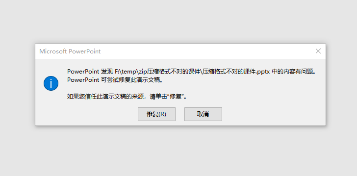

# dotnet OpenXML 解析 WPS 不符合压缩文档规范的文档

我遇到了有老师给我反馈说用我的小工具去辅助编辑课件的时候，遇到了他使用 WPS 制作的文档打开失败，原因是 WPS 制作的一些文档不符合压缩文档规范。而 Office 的基于 ECMA 376 的文档，都是使用标准的 ZIP 压缩规范的文档，因此对于这些不符合压缩文档规范的文件，将会解析失败

<!--more-->
<!-- CreateTime:2021/1/7 15:02:35 -->

<!-- 发布 -->

如果使用了不符合压缩规范的文件，那么在使用 OpenXML SDK 读取的时候，将会在解压缩的时候炸掉，如下

```
System.IO.FileFormatException:“File contains corrupted data.”
此异常最初是在此调用堆栈中引发的: 
  System.IO.Packaging.ZipPackage.ZipPackage(System.IO.Stream, System.IO.FileMode, System.IO.FileAccess)
  System.IO.Packaging.Package.Open(System.IO.Stream, System.IO.FileMode, System.IO.FileAccess)
  DocumentFormat.OpenXml.Packaging.OpenXmlPackage.OpenCore(System.IO.Stream, bool)
  DocumentFormat.OpenXml.Packaging.PresentationDocument.Open(System.IO.Stream, bool, DocumentFormat.OpenXml.Packaging.OpenSettings)
  DocumentFormat.OpenXml.Packaging.PresentationDocument.Open(System.IO.Stream, bool)  
```

或者下面提示

```
//如果是 InvalidDataException 或 FileFormatException 是 WPS 的诡异格式，此时使用此方法解决
System.IO.InvalidDataException	End of Central Directory record could not be found.	

at System.IO.Compression.ZipArchive.ReadEndOfCentralDirectory()
at System.IO.Compression.ZipArchive.Init(Stream stream, ZipArchiveMode mode, Boolean leaveOpen)
at System.IO.Compression.ZipArchive..ctor(Stream stream, ZipArchiveMode mode, Boolean leaveOpen, Encoding entryNameEncoding)
at System.IO.Packaging.ZipPackage..ctor(String path, FileMode packageFileMode, FileAccess packageFileAccess, FileShare share)
at System.IO.Packaging.Package.Open(String path, FileMode packageMode, FileAccess packageAccess, FileShare packageShare)
at DocumentFormat.OpenXml.Packaging.OpenXmlPackage.OpenCore(String path, Boolean readWriteMode)
at DocumentFormat.OpenXml.Packaging.PresentationDocument.Open(String path, Boolean isEditable, OpenSettings openSettings)
at DocumentFormat.OpenXml.Packaging.PresentationDocument.Open(String path, Boolean isEditable)
```

在读取到 System.IO.InvalidDataException End of Central Directory record could not be found. 就是因为压缩文档不符合规范，或者文件损坏

而给我反馈的老师的课件其实只是压缩文档不符合规范，我使用 Office 2016 打开，此时会提示文档损坏

<!--  -->


当然了，点击修复还是能打开课件的

但是我的工具无法通过 OpenXML SDK 读取

解决方法就是先使用其他压缩库进行解压缩和压缩，这样的文件就符合压缩规范了

如使用 DotNetZip 进行解压缩，在 csproj 上添加下面代码，用来安装 DotNetZip 这个 NuGet 库。当然了，使用 NuGet 安装也可以

```xml
    <PackageReference Include="DotNetZip" Version="1.15.0" />
```

接下来使用下面代码进行解压缩，然后压缩

```csharp
            var folder = tempFolder;

            using (var zipFile = Ionic.Zip.ZipFile.Read(file))
            {
                zipFile.ExtractAll(folder);
            }

            // 重新压缩回
            System.IO.Compression.ZipFile.CreateFromDirectory(folder, newZipFile);
```

这样文件就符合压缩规范了，以上代码特别使用运行时提供的压缩方法

本文的代码放在 [github](https://github.com/lindexi/lindexi_gd/tree/2ce10a89/NairjelbibelLuqeefufejelnoche) 欢迎小伙伴访问

更多请看 [Office 使用 OpenXML SDK 解析文档博客目录](https://blog.lindexi.com/post/Office-%E4%BD%BF%E7%94%A8-OpenXML-SDK-%E8%A7%A3%E6%9E%90%E6%96%87%E6%A1%A3%E5%8D%9A%E5%AE%A2%E7%9B%AE%E5%BD%95.html )

<a rel="license" href="http://creativecommons.org/licenses/by-nc-sa/4.0/"></a><br />本作品采用<a rel="license" href="http://creativecommons.org/licenses/by-nc-sa/4.0/">知识共享署名-非商业性使用-相同方式共享 4.0 国际许可协议</a>进行许可。欢迎转载、使用、重新发布，但务必保留文章署名[林德熙](http://blog.csdn.net/lindexi_gd)(包含链接:http://blog.csdn.net/lindexi_gd )，不得用于商业目的，基于本文修改后的作品务必以相同的许可发布。如有任何疑问，请与我[联系](mailto:lindexi_gd@163.com)。
