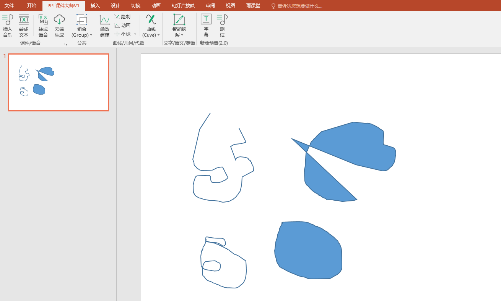
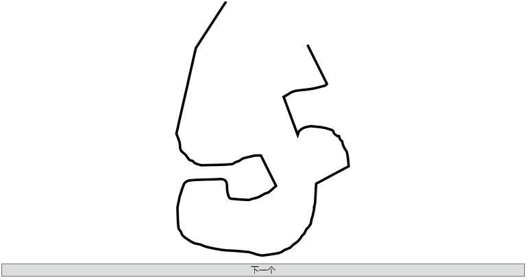

# dotnet OpenXML 让 PathLst 自定义形状转 SVG 路径格式的 Geometry 内容

在 Office 文档里面，可以使用自己定制的自绘制形状，自己绘制的内容将会存放为 pathLst 也就是 List of Shape Paths 内容到文档里面。本文将告诉大家如何将 PathLst 自定义形状转换为标准的 SVG 路径，以支持在 WPF 或 UWP 中的 Path 元素作为 Geometry 显示

<!--more-->

<!-- 发布 -->

在 ECMA 376 标准里面的 20.1.9.16 有对 PathLst 做详细的规定，本文的方法适合于符合 ECMA 376 的 Office 文档，包括 PPT 和 Word 和 Excel 等文档

开始之前请先看一下效果，下面是 PowerPoint 里面的内容

<!--  -->


下面是一个简单的 WPF 应用，读取这份文档的内容，将里面的形状显示出来

<!--  -->


以上的全部代码放在 [github](https://github.com/lindexi/lindexi_gd/tree/78e625e3/LalyearnabodaLayheryacucha) 和 [gitee](https://gitee.com/lindexi/lindexi_gd/tree/78e625e3/LalyearnabodaLayheryacucha) 欢迎下载测试

通过 ECMA 376 的 20.1.9.16 文档可以了解到在自定义形状上，使用 `a:custGeom` 表示，而具体的形状使用 `a:pathLst` 表示，一个例子的内容如下

```xml
<a:custGeom>
 <a:pathLst>
   <a:path w="2824222" h="590309">
     <a:moveTo>
       <a:pt x="0" y="428263"/>
     </a:moveTo>
     <a:lnTo>
       <a:pt x="1620455" y="590309"/>
     </a:lnTo>
   </a:path>
 </a:pathLst>
</a:custGeom>
```

在 OpenXML SDK 里面，读取页面里面所有的自定义形状，可以使用如下代码

```csharp
            using (var presentationDocument =
                DocumentFormat.OpenXml.Packaging.PresentationDocument.Open("自定义形状.pptx", false))
            {
                var presentationPart = presentationDocument.PresentationPart;
                var presentation = presentationPart.Presentation;

                // 先获取页面
                var slideIdList = presentation.SlideIdList;

                foreach (var slideId in slideIdList.ChildElements.OfType<SlideId>())
                {
                    // 获取页面内容
                    SlidePart slidePart = (SlidePart) presentationPart.GetPartById(slideId.RelationshipId);

                    var slide = slidePart.Slide;

                    foreach (var customGeometry in slide.Descendants<DocumentFormat.OpenXml.Drawing.CustomGeometry>())
                    {
                    }
                }
            }
```

在获取到 CustomGeometry 对象之后，可以尝试去读取他的 PathList 内容，如下面代码

```csharp
 var pathList = customGeometry.Descendants<PathList>().FirstOrDefault();
```

接下来还请自行百度 svg 规范，了解在 svg 中各个 Key 的作用，包括 M 表示 MoveTo 而 L 表示 LineTo 等等。在 PathList 里面可以选择的值如下

- MoveTo
- LineTo
- ArcTo
- QuadraticBezierCurveTo
- CubicBezierCurveTo
- CloseShapePath

刚刚好和 svg 的 MLAQCZ 对应上，可以使用如下方式转换

```csharp
        public static (string stringPath, bool isLine) BuildPathString(PathList pathList)
        {
            var stringPath = new StringBuilder(128);
            bool isLine = true;

            foreach (var path in pathList.Elements<DocumentFormat.OpenXml.Drawing.Path>())
            {
                foreach (var pathData in path.ChildElements)
                {
                    ConvertToPathString(pathData, stringPath, out var isPathLine);
                    if (!isPathLine)
                    {
                        isLine = false;
                    }
                }
            }

            return (stringPath.ToString(), isLine);
        }

        private static void ConvertToPathString(OpenXmlElement pathData, StringBuilder stringPath, out bool isLine)
        {
            const string comma = Comma;
            isLine = true;

            switch (pathData)
            {
                case MoveTo moveTo:
                {
                    // 关于定义的 Key 的值请百度参考 svg 规范
                    var defineKey = "M";
                    var moveToPoint = moveTo.Point;
                    if (moveToPoint?.X != null && moveToPoint?.Y != null)
                    {
                        stringPath.Append(defineKey);
                        var point = PointToPixelPoint(moveToPoint);
                        PointToString(point);
                    }

                    break;
                }
                case LineTo lineTo:
                {
                    var defineKey = "L";

                    var lineToPoint = lineTo.Point;
                    if (lineToPoint?.X != null && lineToPoint?.Y != null)
                    {
                        stringPath.Append(defineKey);
                        var point = PointToPixelPoint(lineToPoint);
                        PointToString(point);
                    }

                    break;
                }
                case ArcTo arcTo:
                {
                    var defineKey = "A";

                    Degree rotationAngle = new Degree(0);
                    var swingAngleString = arcTo.SwingAngle;
                    if (swingAngleString != null)
                    {
                        if (int.TryParse(swingAngleString, out var swingAngle))
                        {
                            rotationAngle = new Degree(swingAngle);
                        }
                    }

                    var isLargeArcFlag = rotationAngle.DoubleValue > 180;

                    var widthRadius = EmuStringToPixel(arcTo.WidthRadius);
                    var heightRadius = EmuStringToPixel(arcTo.HeightRadius);
                    var (x, y) = EllipseCoordinateHelper.GetEllipseCoordinate(widthRadius, heightRadius, rotationAngle);

                    // 格式如下
                    // A rx ry x-axis-rotation large-arc-flag sweep-flag x y
                    // 这里 large-arc-flag 是 1 和 0 表示
                    stringPath.Append(defineKey)
                        .Append(EmuToPixelString(arcTo.WidthRadius)) //rx
                        .Append(comma)
                        .Append(EmuToPixelString(arcTo.HeightRadius)) //ry
                        .Append(comma)
                        .Append(rotationAngle.DoubleValue.ToString("0.000")) // x-axis-rotation
                        .Append(comma)
                        .Append(isLargeArcFlag ? "1" : "0") //large-arc-flag
                        .Append(comma)
                        .Append("0") // sweep-flag
                        .Append(comma)
                        .Append(PixelToString(x))
                        .Append(comma)
                        .Append(PixelToString(y));
                    break;
                }
                case QuadraticBezierCurveTo quadraticBezierCurveTo:
                {
                    var defineKey = "Q";

                    ConvertPointList(quadraticBezierCurveTo, defineKey, stringPath);

                    break;
                }
                case CubicBezierCurveTo cubicBezierCurveTo:
                {
                    var defineKey = "C";

                    ConvertPointList(cubicBezierCurveTo, defineKey, stringPath);

                    break;
                }
                case CloseShapePath closeShapePath:
                {
                    var defineKey = "Z";
                    isLine = false;
                    stringPath.Append(defineKey);
                    break;
                }
            }

            void PointToString(PixelPoint point) => PixelPointToString(point, stringPath);
        }

```

这里面 OpenXML 的数值单位是 EMU 单位，和像素的转换请看 [Office Open XML 的测量单位](https://blog.lindexi.com/post/Office-Open-XML-%E7%9A%84%E6%B5%8B%E9%87%8F%E5%8D%95%E4%BD%8D.html ) 而我这里使用开源的 [dotnetCampus.OpenXMLUnitConverter 库](https://github.com/dotnet-campus/dotnetCampus.OfficeDocumentZipper) 进行单位的转换

以下是我在此项目中用到的 NuGet 库

```xml
  <ItemGroup>
    <PackageReference Include="dotnetCampus.AsyncWorkerCollection" Version="1.6.0" />
    <PackageReference Include="dotnetCampus.OpenXMLUnitConverter" Version="1.0.4" />
    <PackageReference Include="DocumentFormat.OpenXml" Version="2.12.1" />
  </ItemGroup>
```

在获取到了 Path 字符串之后，可以使用如下代码转换为 Geometry 元素

```csharp
  var geometry = Geometry.Parse(stringPath);
```

在 XAML 上添加一个 Path 元素就可以显示

```csharp
      <Path x:Name="Path" Stroke="Black" StrokeThickness="2"></Path>

      Path.Data = geometry;
```

更多的代码细节还请到 [github](https://github.com/lindexi/lindexi_gd/tree/78e625e3/LalyearnabodaLayheryacucha) 或 [gitee](https://gitee.com/lindexi/lindexi_gd/tree/78e625e3/LalyearnabodaLayheryacucha) 上阅读代码

本文的属性是依靠 [dotnet OpenXML 解压缩文档为文件夹工具](https://blog.lindexi.com/post/dotnet-OpenXML-%E8%A7%A3%E5%8E%8B%E7%BC%A9%E6%96%87%E6%A1%A3%E4%B8%BA%E6%96%87%E4%BB%B6%E5%A4%B9%E5%B7%A5%E5%85%B7.html ) 工具协助测试的，这个工具是开源免费的工具，欢迎小伙伴使用

更多请看 [Office 使用 OpenXML SDK 解析文档博客目录](https://blog.lindexi.com/post/Office-%E4%BD%BF%E7%94%A8-OpenXML-SDK-%E8%A7%A3%E6%9E%90%E6%96%87%E6%A1%A3%E5%8D%9A%E5%AE%A2%E7%9B%AE%E5%BD%95.html )

<a rel="license" href="http://creativecommons.org/licenses/by-nc-sa/4.0/"></a><br />本作品采用<a rel="license" href="http://creativecommons.org/licenses/by-nc-sa/4.0/">知识共享署名-非商业性使用-相同方式共享 4.0 国际许可协议</a>进行许可。欢迎转载、使用、重新发布，但务必保留文章署名[林德熙](http://blog.csdn.net/lindexi_gd)(包含链接:http://blog.csdn.net/lindexi_gd )，不得用于商业目的，基于本文修改后的作品务必以相同的许可发布。如有任何疑问，请与我[联系](mailto:lindexi_gd@163.com)。
