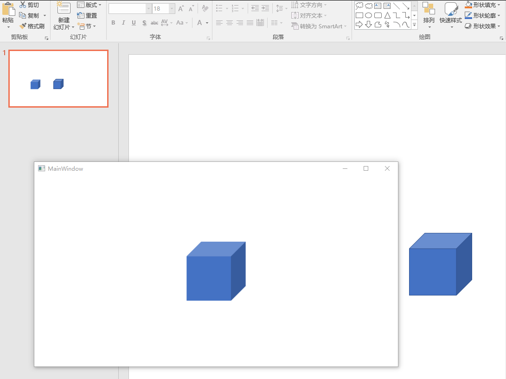

# dotnet OpenXML 转换 PathFillModeValues 为颜色特效

在 OpenXml 预设形状，有一些形状设置了 PathFillModeValues 枚举，此枚举提供了亮暗的蒙层特效。具体的特效是让形状选择一个画刷，在画刷上加上特效。如立体几何 Cube 形状，在 Cube 不同的面有不同的颜色，颜色的亮度不同

<!--more-->
<!-- CreateTime:2021/11/2 19:17:57 -->


<!-- 发布 -->

接下来通过 OpenXML SDK 实现读取 PPTX 文件，解析 Cube 预设形状，在界面绘制，让填充和 PowerPoint 的相同。如下图，下图没有绘制线条，因此看起来和 PowerPoint 显示的有一点不同

<!--  -->


通过 ECMA 376 文档可以了解到 Cube 由 4 个 Path 组成，公式代码如下

```xml
    <pathLst xmlns="http://schemas.openxmlformats.org/drawingml/2006/main">
      <path stroke="false" extrusionOk="false">
        <moveTo>
          <pt x="l" y="y1" />
        </moveTo>
        <lnTo>
          <pt x="x4" y="y1" />
        </lnTo>
        <lnTo>
          <pt x="x4" y="b" />
        </lnTo>
        <lnTo>
          <pt x="l" y="b" />
        </lnTo>
        <close />
      </path>
      <path stroke="false" fill="darkenLess" extrusionOk="false">
        <moveTo>
          <pt x="x4" y="y1" />
        </moveTo>
        <lnTo>
          <pt x="r" y="t" />
        </lnTo>
        <lnTo>
          <pt x="r" y="y4" />
        </lnTo>
        <lnTo>
          <pt x="x4" y="b" />
        </lnTo>
        <close />
      </path>
      <path stroke="false" fill="lightenLess" extrusionOk="false">
        <moveTo>
          <pt x="l" y="y1" />
        </moveTo>
        <lnTo>
          <pt x="y1" y="t" />
        </lnTo>
        <lnTo>
          <pt x="r" y="t" />
        </lnTo>
        <lnTo>
          <pt x="x4" y="y1" />
        </lnTo>
        <close />
      </path>
      <path fill="none" extrusionOk="false">
        <moveTo>
          <pt x="l" y="y1" />
        </moveTo>
        <lnTo>
          <pt x="y1" y="t" />
        </lnTo>
        <lnTo>
          <pt x="r" y="t" />
        </lnTo>
        <lnTo>
          <pt x="r" y="y4" />
        </lnTo>
        <lnTo>
          <pt x="x4" y="b" />
        </lnTo>
        <lnTo>
          <pt x="l" y="b" />
        </lnTo>
        <close />
        <moveTo>
          <pt x="l" y="y1" />
        </moveTo>
        <lnTo>
          <pt x="x4" y="y1" />
        </lnTo>
        <lnTo>
          <pt x="r" y="t" />
        </lnTo>
        <moveTo>
          <pt x="x4" y="y1" />
        </moveTo>
        <lnTo>
          <pt x="x4" y="b" />
        </lnTo>
      </path>
    </pathLst>
```

可以看到在 Path 元素上，有 Fill 属性，分别设置了 darkenLess 和 lightenLess 的值，对应到 OpenXML SDK 的 PathFillModeValues 类型

```csharp
    public enum PathFillModeValues
    {
        [EnumString("none")]
        None,

        [EnumString("norm")]
        Norm,

        [EnumString("lighten")]
        Lighten,

        [EnumString("lightenLess")]
        LightenLess,

        [EnumString("darken")]
        Darken,

        [EnumString("darkenLess")]
        DarkenLess
    }
```

在 WPF 里面绘制的逻辑是先获取所有的 Path 内容，接着将所有的 Path 绘制作为底色。底色绘制采用填充，接着按照 PathFillModeValues 的值，再次画上 Geometry 覆盖底色

通过 WPF 多媒体提供的默认的颜色混合功能，通过颜色的 Alpha 通道让覆盖底色的部分修改亮度

新建一个空的 WPF 应用，在应用里面放入一个创建了默认的 Cube 形状的 PPTX 文件，在窗口 Loaded 事件里面读取这份测试的文件

```csharp
        public MainWindow()
        {
            InitializeComponent();

            Loaded += MainWindow_Loaded;
        }

        private void MainWindow_Loaded(object sender, RoutedEventArgs e)
        {
            OpenPptxFile(new FileInfo("Test.pptx"));
        }
```

以上的 Test.pptx 可以通过本文末尾拿到下载地址

在开始之前，期望大家已了解如何在 dotnet 应用里面读取 PPT 文件，如果还不了解读取方法，请参阅 [C# dotnet 使用 OpenXml 解析 PPT 文件](https://blog.lindexi.com/post/C-dotnet-%E4%BD%BF%E7%94%A8-OpenXml-%E8%A7%A3%E6%9E%90-PPT-%E6%96%87%E4%BB%B6.html)

在 OpenPptxFile 执行具体的逻辑，读取文件，获取到页面，从页面读取出形状

```csharp
        private void OpenPptxFile(FileInfo file)
        {
            using var presentationDocument = PresentationDocument.Open(file.FullName, false);
            var slide = presentationDocument.PresentationPart!.SlideParts.First().Slide;
            // 这是对测试文件有要求的，要求一定传入的是立方体。请在具体的项目代码里面，替换为你需要的逻辑
            var shape = slide.Descendants<Shape>().First();
            var shapeProperties = shape.ShapeProperties;
            var presetGeometry = shapeProperties!.GetFirstChild<PresetGeometry>();
        }
```

上面的代码只是作为测试使用，因此要求测试文件一定传入的是立方体。如果你想在自己的项目使用本文的方法，还请自行处理细节。在我的其他博客里面包含了详细的各个细节处理的逻辑，为了让本文清晰，这里就不加上太多细节逻辑

如获取元素的尺寸的代码，这里固定默认的大小。以下代码的 EmuSize 和 Emu 都是采用 OpenXML 单位库，详细请看 [Office Open XML 的测量单位](https://blog.lindexi.com/post/Office-Open-XML-%E7%9A%84%E6%B5%8B%E9%87%8F%E5%8D%95%E4%BD%8D.html )

```csharp
            var elementSize = new EmuSize(new Emu(1216152), new Emu(1216152));
```

通过传入的预设形状和元素的大小，可以计算出几何信息。几何信息包含 Path 定义的内容，使用如下定义

```csharp
    /// <summary>
    /// 对应PPT的Shape Path
    /// </summary>
    public readonly struct ShapePath
    {
        /// <summary>
        /// 创建PPT的Geometry Path
        /// </summary>
        /// <param name="path">OpenXml Path字符串</param>
        /// <param name="fillMode">OpenXml的Path Fill Mode  </param>
        /// <param name="isStroke">是否有轮廓</param>
        /// <param name="isExtrusionOk">指定使用 3D 拉伸可能在此路径</param>
        /// <param name="eumWidth">指定的宽度或在路径坐标系统中应在使用的最大的 x 坐标</param>
        /// <param name="eumHeight">指定框架的高度或在路径坐标系统中应在使用的最大的 y 坐标</param>
        public ShapePath(string path, PathFillModeValues fillMode = PathFillModeValues.Norm, bool isStroke = true, bool isExtrusionOk = false, double eumWidth = 0, double eumHeight = 0)
        {
            Path = path;
            IsStroke = isStroke;
            FillMode = fillMode;
            IsFilled = fillMode is not PathFillModeValues.None;
            IsExtrusionOk = isExtrusionOk;
            Width = new Emu(eumWidth);
            Height = new Emu(eumHeight);
        }

        /// <summary>
        /// 创建PPT的Geometry Path
        /// </summary>
        /// <param name="path">OpenXml Path字符串</param>
        /// <param name="eumWidth">指定的宽度或在路径坐标系统中应在使用的最大的 x 坐标</param>
        /// <param name="eumHeight">指定框架的高度或在路径坐标系统中应在使用的最大的 y 坐标</param>
        public ShapePath(string path, double eumWidth, double eumHeight) : this(path, PathFillModeValues.Norm, eumWidth: eumWidth, eumHeight: eumHeight)
        {

        }

        /// <summary>
        /// 是否填充
        /// </summary>
        public bool IsFilled { get; }

        /// <summary>
        /// OpenXml 的 Path Stroke, 默认true
        /// </summary>
        public bool IsStroke { get; }

        /// <summary>
        /// OpenXml的Path Fill Mode  
        /// </summary>
        public PathFillModeValues FillMode { get; }

        /// <summary>
        ///OpenXml  Path字符串
        /// </summary>
        public string Path { get; }

        /// <summary>
        /// 指定使用 3D 拉伸可能在此路径，默认false或0
        /// </summary>
        public bool IsExtrusionOk { get; }

        /// <summary>
        /// 指定的宽度或在路径坐标系统中应在使用的最大的 x 坐标
        /// </summary>
        public Emu Width { get; }

        /// <summary>
        /// 指定框架的高度或在路径坐标系统中应在使用的最大的 y 坐标
        /// </summary>
        public Emu Height { get; }
    }
```

我写了预设形状公式引擎，可以从 PresetShapeDefinitions.xml 文件转换为 WPF 的 PathGeometry 可以使用的字符串，当前还没有开源此库。不过通过编写代码的形式也是可以的，详细请看 [dotnet OpenXML SDK 形状几何 Geometry 的计算公式含义](https://blog.lindexi.com/post/dotnet-OpenXML-SDK-%E5%BD%A2%E7%8A%B6%E5%87%A0%E4%BD%95-Geometry-%E7%9A%84%E8%AE%A1%E7%AE%97%E5%85%AC%E5%BC%8F%E5%90%AB%E4%B9%89.html )

为了简化代码，在 GetPresetGeometryPath 方法里面使用的是我用公式引擎计算的输出字符串

```csharp
        private ShapePath[] GetPresetGeometryPath(ShapeTypeValues presetValue, EmuSize elementSize)
        {
            if (presetValue != ShapeTypeValues.Cube)
            {
                throw new ArgumentException($"本代码仅支持立方体");
            }

            var shapePathList = new ShapePath[4];

            // 没有想着使用 elementSize 哈，假设都是固定的大小

            // M 0.000,31.920 L 95.760,31.920 L 95.760,127.680 L 0.000,127.680 z
            // FillMode	Norm
            shapePathList[0] = new ShapePath("M 0.000,31.920 L 95.760,31.920 L 95.760,127.680 L 0.000,127.680 z",
                isStroke: false);

            // M 95.760,31.920 L 127.680,0.000 L 127.680,95.760 L 95.760,127.680 z
            // FillMode	DarkenLess
            shapePathList[1] = new ShapePath("M 95.760,31.920 L 127.680,0.000 L 127.680,95.760 L 95.760,127.680 z", PathFillModeValues.DarkenLess, false);

            // M 0.000,31.920 L 31.920,0.000 L 127.680,0.000 L 95.760,31.920 z
            // FillMode	LightenLess
            shapePathList[2] = new ShapePath("M 0.000,31.920 L 31.920,0.000 L 127.680,0.000 L 95.760,31.920 z", PathFillModeValues.LightenLess, false);

            // M 0.000,31.920 L 31.920,0.000 L 127.680,0.000 L 127.680,95.760 L 95.760,127.680 L 0.000,127.680 z M 0.000,31.920 L 95.760,31.920 L 127.680,0.000 M 95.760,31.920 L 95.760,127.680
            // FillMode	None
            shapePathList[3] = new ShapePath("M 0.000,31.920 L 31.920,0.000 L 127.680,0.000 L 127.680,95.760 L 95.760,127.680 L 0.000,127.680 z M 0.000,31.920 L 95.760,31.920 L 127.680,0.000 M 95.760,31.920 L 95.760,127.680", PathFillModeValues.None);
            return shapePathList;
        }
```

通过以下代码获取 ShapePath 列表

```csharp
            var shapePathList = GetPresetGeometryPath(presetGeometry!.Preset!.Value, elementSize);
```

接下来是本文的核心逻辑，准备绘制不同的亮度的颜色。在开始之前，新建 DrawingGroup 用于拿到 DrawingContext 进行绘制

```csharp
            var drawingVisual = new DrawingGroup();
            var drawingContext = drawingVisual.Open();
```

默认的 Cube 填充色是 `#FF4472C4` 可以通过主题的以下代码拿到

```xml
  <!-- Slide1.xml -->
          <a:fillRef idx="1">
            <a:schemeClr val="accent1" />
          </a:fillRef>

  <!-- Theme1.xml -->
  <a:themeElements>
    <a:clrScheme name="Office">
      <a:accent1>
        <a:srgbClr val="4472C4" />
      </a:accent1>
    </a:clrScheme>
  </a:themeElements>
```

本文这里就写固定的值，如果大家想测试不同的课件的颜色效果，还请自己更改

```csharp
            var fillBrush = new SolidColorBrush((Color) ColorConverter.ConvertFromString("#4472C4"));
```

通过此画刷绘制几何底色。绘制之前需要拿到底色绘制用的 PathGeometry 对象，如下面代码

```csharp
            // 创建底色几何
            var pathGeometry = BuildShapePathGeometry(shapePathList);

        private PathGeometry BuildShapePathGeometry(ShapePath[] shapePathList)
        {
            PathGeometry? result = null;
            foreach (var shapePath in shapePathList)
            {
                if (shapePath.FillMode is PathFillModeValues.None && !shapePath.IsStroke)
                {
                    // 不是可填充的，而且不是线条的，啥都不做
                    continue;
                }

                var geometry = Geometry.Parse(shapePath.Path);
                if (result is null)
                {
                    result = PathGeometry.CreateFromGeometry(geometry);
                }
                else
                {
                    result = Geometry.Combine(result, geometry, GeometryCombineMode.Union, Transform.Identity);
                }
            }

            return result!;
        }     
```

有很多形状不是多路径的，只有如 Cube 这样有多个 Path 的多路径的才需要绘制底色，绘制底色的代码如下

```csharp
            // 只有多路径下才先绘制底色
            drawingContext.DrawGeometry(fillBrush, null, pathGeometry);
```

接下来就是将各个 Path 进行绘制，代码如下

```csharp
            foreach (var shapePath in shapePathList)
            {
                if (!shapePath.IsFilled && !shapePath.IsStroke) continue;

                var geometry = GetPathGeometry(shapePath);
                if (geometry == null)
                {
                    continue;
                }

                var brush = GetShapeFillBrush(shapePath, fillBrush);
                // 忽略线条
                Pen? pen = null;
                drawingContext.DrawGeometry(brush, pen, geometry);
            }
```

从 ShapePath 转换为 Geometry 的代码如下，需要考虑在一个 ShapePath 的字符串里面包含多个 M 起点

```csharp
        private PathGeometry? GetPathGeometry(ShapePath shapePath)
        {
            var pathGeometry = new PathGeometry();
            var pathFigureCollection = new PathFigureCollection();
            var path = shapePath.Path;
            if (!string.IsNullOrEmpty(path))
            {
                var pathFigures = PathFigureCollection.Parse(path);
                if (!pathFigures.Any())
                {
                    return null;
                }
                foreach (var pathFigure in pathFigures)
                {
                    pathFigure.IsFilled = shapePath.IsFilled;
                    pathFigureCollection.Add(pathFigure);
                }
            }
            pathGeometry.Figures = pathFigureCollection;
            return pathGeometry;
        }
```

获取各段的 Geometry 的画刷，通过 GetShapeFillBrush 方法，此方法是本文的核心逻辑，代码如下

```csharp
        private SolidColorBrush? GetShapeFillBrush(ShapePath shapePath, SolidColorBrush fillBrush, bool isMultiPath = true)
        {
            if (shapePath.IsFilled is false)
            {
                return null;
            }

            switch (shapePath.FillMode)
            {
                case PathFillModeValues.Norm:
                {
                    if (isMultiPath)
                    {
                        // 多路径下，不需要重复绘制，绘制内容和底色相同。但是底色已绘制，因此啥都不用做
                        return null;
                    }
                    else
                    {
                        return fillBrush;
                    }
                }
                case PathFillModeValues.None:
                    return null;
                case PathFillModeValues.Darken:
                    return GetOrCreate("#64000000");
                case PathFillModeValues.DarkenLess:
                    return GetOrCreate("#32000000");
                case PathFillModeValues.Lighten:
                    return GetOrCreate("#64FFFFFF");
                case PathFillModeValues.LightenLess:
                    return GetOrCreate("#32FFFFFF");
                default:
                    throw new ArgumentOutOfRangeException();
            }

            static SolidColorBrush GetOrCreate(string color)
            {
                return new SolidColorBrush((Color) ColorConverter.ConvertFromString(color));
            }
        }
```

通过覆盖几何加上半透明的画刷，可以让 WPF 自动给底色修改亮度。感谢 [晓嗔戈](https://github.com/Firito) 提供的算法

接着就是将上面画的放在界面上

```csharp
            var element = new Border()
            {
                Width = elementSize.Width.ToPixel().Value,
                Height = elementSize.Height.ToPixel().Value,

                Margin = new Thickness(10, 10, 10, 10),
                Background = new DrawingBrush(drawingVisual)
            };
            AddElement(element);

        private void AddElement(UIElement element)
        {
            Grid.Children.Clear();
            Grid.Background = null;
            Grid.Children.Add(element);
        }
```

以上就是本文的代码，运行代码可以看到上图的效果

本文所有代码和测试文件放在 [github](https://github.com/lindexi/lindexi_gd/tree/ae81fba8dca44fcdd944e75a3ff04e913d451ed3/Pptx) 和 [gitee](https://gitee.com/lindexi/lindexi_gd/tree/ae81fba8dca44fcdd944e75a3ff04e913d451ed3/Pptx) 欢迎访问

可以通过如下方式获取本文代码

先创建一个空文件夹，接着使用命令行 cd 命令进入此空文件夹，在命令行里面输入以下代码，即可获取到本文的代码

```
git init
git remote add origin https://gitee.com/lindexi/lindexi_gd.git
git pull origin ae81fba8dca44fcdd944e75a3ff04e913d451ed3
```

以上使用的是 gitee 的源，如果 gitee 不能访问，请替换为 github 的源

```
git remote remove origin
git remote add origin https://github.com/lindexi/lindexi_gd.git
```

获取代码之后，打开 Pptx.sln 文件

本文的属性是依靠 [dotnet OpenXML 解压缩文档为文件夹工具](https://blog.lindexi.com/post/dotnet-OpenXML-%E8%A7%A3%E5%8E%8B%E7%BC%A9%E6%96%87%E6%A1%A3%E4%B8%BA%E6%96%87%E4%BB%B6%E5%A4%B9%E5%B7%A5%E5%85%B7.html ) 工具协助测试的，这个工具是开源免费的工具，欢迎小伙伴使用

更多请看 [Office 使用 OpenXML SDK 解析文档博客目录](https://blog.lindexi.com/post/Office-%E4%BD%BF%E7%94%A8-OpenXML-SDK-%E8%A7%A3%E6%9E%90%E6%96%87%E6%A1%A3%E5%8D%9A%E5%AE%A2%E7%9B%AE%E5%BD%95.html )

后续解析引擎也许会开源，欢迎关注我所在团队的开源组织 [https://github.com/dotnet-campus](https://github.com/dotnet-campus) 里面有很多开源项目

<a rel="license" href="http://creativecommons.org/licenses/by-nc-sa/4.0/"></a><br />本作品采用<a rel="license" href="http://creativecommons.org/licenses/by-nc-sa/4.0/">知识共享署名-非商业性使用-相同方式共享 4.0 国际许可协议</a>进行许可。欢迎转载、使用、重新发布，但务必保留文章署名[林德熙](http://blog.csdn.net/lindexi_gd)(包含链接:http://blog.csdn.net/lindexi_gd )，不得用于商业目的，基于本文修改后的作品务必以相同的许可发布。如有任何疑问，请与我[联系](mailto:lindexi_gd@163.com)。 
