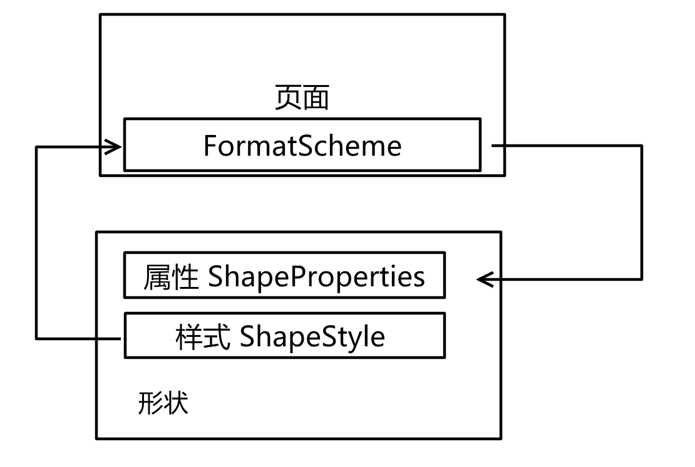
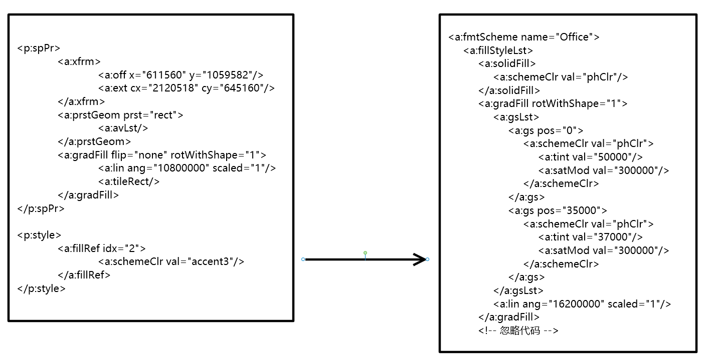

# dotnet OpenXml SDK 形状填充渐变色的主题色

在 Office 文档的一些有趣的设计，颜色和画刷是可以继承的，这个继承包括了属性的继承。在形状填充里面使用的渐变色是可以一部分属性放在主题里面，主要找到主题里面的画刷，替换掉形状自己定义的内容，才是形状的画刷

<!--more-->
<!-- CreateTime:5/20/2020 11:46:32 AM -->


我拿到一份有趣的课件，从这份课件的表现上，可以找到在一个 Shape 元素里面的 ShapeProperties 定义了 GradientFill 属性

```csharp
// OpenXmlElementList element
var gradientFill = element.First<GradientFill>();
```

而这个 gradientFill 的 GradientStopList 的值是空

```csharp
if (gradientFill.GradientStopList != null)
{

}
```

通过 [Office Open XML - DrawingML - Shapes - Gradient Fill](http://officeopenxml.com/drwSp-GradFill.php ) 可以知道，这个 GradientStopList 是用来定义渐变的颜色的，也就是这个值是空那么就是渐变将会丢失颜色，也就是形状填充丢失渐变色

从文档上看，形状属性定义里面没有 `gsLst` 的值

```csharp
<p:spPr>
	<a:xfrm>
		<a:off x="611560" y="1059582"/>
		<a:ext cx="2120518" cy="645160"/>
	</a:xfrm>
	<a:prstGeom prst="rect">
		<a:avLst/>
	</a:prstGeom>
	<a:gradFill flip="none" rotWithShape="1">
		<a:lin ang="10800000" scaled="1"/>
		<a:tileRect/>
	</a:gradFill>
</p:spPr>
```

也就是 `a:gradFill` 里面不包含 `a:gsLst` 的值，也就是没有 `a:gs` 定义颜色

这个问题是 `OpenXML a:gradFill without a:gsLst` 渐变色里面没有 GradientStopList 的值

而在这个形状一般都可以看到 ShapeStyle 的值，这个值里面有一个属性是 FillReference 表示样式里面的填充

```csharp
<p:style>
	<a:fillRef idx="2">
		<a:schemeClr val="accent3"/>
	</a:fillRef>
</p:style>
```

而这个样式要的属性是 idx 属性，表示属于主题的哪个样式

那么在 OpenXML SDK 里面如何获取主题，如果是在 Slide 页面的元素可以通过下面的代码获取主题

```csharp
// Slide slide
var slidePart = slide.SlidePart;
FormatScheme formatScheme = slidePart?.ThemeOverridePart?.ThemeOverride?.FormatScheme;
```

当前，如果 Slide 拿不到就从 SlideLayoutPart 拿，再拿不到就从 SlideMasterPart 拿

然后是通过 FillReference 的 idx 从 FormatScheme 的 FillStyleList 拿到指定的元素，注意这里的 idx 使用的是从 1 开始的下标。但是 FillStyleList 的数组是 C# 的数组，下标是从 0 开始

```csharp
// FillReference reference, FormatScheme formatScheme
    if (reference.Index != null && formatScheme != null)
    {
        var index = (int) reference.Index.Value;

        var openXmlElementList = formatScheme.FillStyleList?.ChildElements;

        if (openXmlElementList != null)
        {
            return GetThemeElement(index, openXmlElementList);
        }
    }
```

而 GetThemeElement 方法的实现如下

```csharp
        private static OpenXmlElement GetThemeElement(int index, OpenXmlElementList elements)
        {
            if (index > 0 && elements != null && elements.Count >= index)
            {
                //GetItem是0 base的数组，所以需要减去1
                var xmlElement = elements.GetItem(index - 1);

                return xmlElement;
            }

            return null;
        }
```

此时就能拿到 OpenXmlElement 返回值了，这个 OpenXmlElement 是某个填充颜色。在 OpenXML SDK 里面没有给填充颜色一个基类，这部分的设计不是很好

在 PPT 文档里面对应的是 `ppt\theme\themex.xml` 文件里面的 `a:fillStyleLst` 的值

```xml
<a:fmtScheme name="Office">
	<a:fillStyleLst>
		<a:solidFill>
			<a:schemeClr val="phClr"/>
		</a:solidFill>
		<a:gradFill rotWithShape="1">
			<a:gsLst>
				<a:gs pos="0">
					<a:schemeClr val="phClr">
						<a:tint val="50000"/>
						<a:satMod val="300000"/>
					</a:schemeClr>
				</a:gs>
				<a:gs pos="35000">
					<a:schemeClr val="phClr">
						<a:tint val="37000"/>
						<a:satMod val="300000"/>
					</a:schemeClr>
				</a:gs>
				<a:gs pos="100000">
					<a:schemeClr val="phClr">
						<a:tint val="15000"/>
						<a:satMod val="350000"/>
					</a:schemeClr>
				</a:gs>
			</a:gsLst>
			<a:lin ang="16200000" scaled="1"/>
		</a:gradFill>
		<!-- 忽略代码 -->
```

上面文档里面用的是 idx 是 2 也就是对应 `a:fillStyleLst` 的第二项，也就是 `a:gradFill` 渐变的值

此时的主题的 `a:gradFill` 的 `a:gsLst` 将会被形状的填充用到，如果形状的填充的颜色也是渐变色，如果这个渐变色没有设置 `a:gsLst` 的值，那么将会采用主题里面的 `a:gsLst` 的值。如果形状自己定义了就使用形状定义的

<!--  -->


请看下图就知道如何获取

<!--  -->


大部分的存在继承关系和联系的都在 OpenXML SDK 里面写出来关系了，只有这些比较边角的功能需要自己实现

而渐变色的各个属性的行为请看 [Office Open XML - DrawingML - Shapes - Gradient Fill](http://officeopenxml.com/drwSp-GradFill.php )

官方文档请看 [GradientFill Class (DocumentFormat.OpenXml.Drawing)](https://docs.microsoft.com/en-us/dotnet/api/documentformat.openxml.drawing.gradientfill?view=openxml-2.8.1 )

<a rel="license" href="http://creativecommons.org/licenses/by-nc-sa/4.0/"></a><br />本作品采用<a rel="license" href="http://creativecommons.org/licenses/by-nc-sa/4.0/">知识共享署名-非商业性使用-相同方式共享 4.0 国际许可协议</a>进行许可。欢迎转载、使用、重新发布，但务必保留文章署名[林德熙](http://blog.csdn.net/lindexi_gd)(包含链接:http://blog.csdn.net/lindexi_gd )，不得用于商业目的，基于本文修改后的作品务必以相同的许可发布。如有任何疑问，请与我[联系](mailto:lindexi_gd@163.com)。
