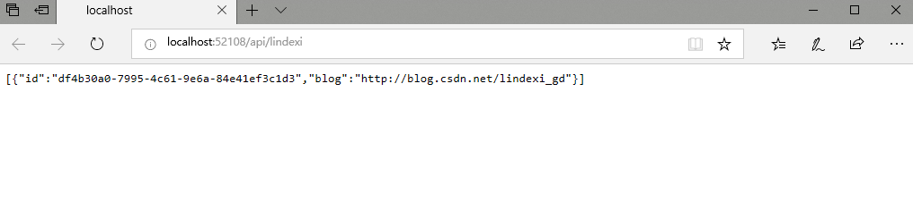

# dotnet core 使用 sqlite 部署到 Centos 服务器

本文告诉大家如何创建一个 asp dotnet core 程序，这个程序使用 sqlite 保存，部署程序到 Centos 7 服务器

<!--more-->
<!-- CreateTime:2019/8/29 19:17:48 -->


<!-- 标签： dotnetcore,aspdotnetcore,asp,数据库,sqlite -->

## 创建项目

本文是在 Windows 使用 VisualStudio 开发，通过 VisualStudio 可以快速创建一个 asp dotnet core 程序

点击文件，新建一个 ASP.NET Core 程序

<!--  -->


这里需要随意给一个项目的名，我这里给了 `CataiLerlasur` 随机的名，点击确定，选择 API 主要不要设置身份验证和启动 Docker 支持，关闭 https 这样才比较简单


<!--  -->


## 创建模型

在项目右击创建文件夹，这个文件夹建议叫 Model 在这个文件夹里面创建一个类，这个类需要有一个属性是 id 至于创建的是 int 还是字符串都随意。我就创建了一个 Lindexi 的类

```csharp
    public class Lindexi
    {
        public string Id { get; set; }

        public string Blog { get; set; }
    }
```

这样就创建完成了模型，下面需要创建对应的控制

右击添加控制器，请看下图

<!--  -->


通过这个方式可以快速创建

<!--  -->


现在可以选择模型类，也就是刚才创建的模型

<!--  -->


然后点击加号添加上下文

<!--  -->


添加上下文等待 VisualStudio 创建类

<!--  -->


## 安装 Sqlite 

通过 Nuget 的方式可以安装，在 Nuget 搜索 `dotnet add package Microsoft.EntityFrameworkCore.Sqlite` 就可以安装

<!--  -->


## 设置连接

现在默认还没有使用 Sqlite 连接，需要在 Startup 类的 ConfigureServices 函数使用 Sqlite 连接

<!--  -->


注意这里写的连接字符串是 `Filename=./xx.db` 这里的 xx.db 需要存在这个数据库，通过下面的命令行可以创建数据库

创建 Sqlite 数据库需要用到命令行，通过 cmd 命令行进入到对应的文件夹

如我刚才创建项目是在 `D:\程序\ethylene156\CataiLerlasur\CataiLerlasur\` 这个文件夹可以找到 `CataiLerlasur.csproj` 文件

<!--  -->


输入下面两句代码

```csharp
dotnet ef migrations add lindexi.github.io

dotnet ef database update
```

如使用 PowerShell 请使用下面代码

```csharp
Add-Migration InitialCreate

Update-Database
```

<!--  -->


<!--  -->


现在可以看到项目多了一个文件 `csdn.db` 和 Migrations 文件夹

上面两句代码是的意思是创建迁移版本，更新数据。更多请看[Entity Framework Core 之数据库迁移 ](https://www.cnblogs.com/GuZhenYin/p/8579420.html )

## 部署服务器

在部署服务器之前先进行本地调试

在 LindexiController 的 GetLindexi 添加一些代码，这样可以在每次访问的时候都可以看到服务器将数据放在 Sqlite 而且在下一次使用的时候持久

这里添加的代码是如果 Sqlite 的数据太少了，就自动添加

```csharp
        public IEnumerable<Lindexi> GetLindexi()
        {
            if (_context.Lindexi.Count() < 10)
            {
                _context.Lindexi.Add(new Lindexi()
                {
                    Blog = "http://blog.csdn.net/lindexi_gd"
                });

                _context.SaveChanges();
            }
            return _context.Lindexi;
        }
```

这时还需要右击项目属性，点击调试，设置为默认打开浏览器就是打开 `api/Lindexi` 这样就可以调用刚才的 GetLindexi 方法

为什么需要设置路径是  `api/Lindexi` 请看 asp dotnet core 的路由

<!--  -->


现在运行一下，可以看到出现了刚才放进去的字符

<!--  -->


在部署到 Linux 之前，需要设置端口和 ip 才可以在本地访问服务器的程序，在 ASP.NET Core 设置端口的方法很简单，通过在 Program 类添加设置 `UseUrls("http://0.0.0.0:5000")` 就可以

```csharp
        public static IWebHostBuilder CreateWebHostBuilder(string[] args) =>
            WebHost.CreateDefaultBuilder(args)
                .UseUrls("http://0.0.0.0:5000")
                .UseStartup<Startup>();
```

上面的方法是可以让运行的 asp dotnet core 程序监听 5000 端口

现在可以将所有文件上传到 Linux 服务器，如何上传文件到服务器请自己谷歌，上传的是代码，实际上我是复制 `CataiLerlasur` 文件夹到服务器

上传之后在 Linux 进入对应的文件夹，也就是 `CataiLerlasur.csproj` 所在的文件夹，运行 `dotnet run` 就可以。在运行 dotnet run 之前需要先安装完成 dotnet core 才可以，如何安装请看[Install .NET Core SDK  CentOS ](https://www.microsoft.com/net/download/linux-package-manager/centos/sdk-current )

<!--  -->


在运行 `dotnet run` 就完成了在服务器部署了，现在可以在本地访问刚才的程序

在浏览器打开服务器的 ip 和端口号，输入 url 就可以看到访问的时候和本地调试一样的数据

这时的数据保存在 sqlite 文件，尝试将本地的 sqlite 文件替换到服务器，可以看到再次访问之后两条数据，也就是备份的时候只需要备份数据库就可以，数据库就是一个文件。如果想将自己的程序放在其他的服务器运行，也只需要复制整个文件夹就可以

<!--  -->


用 Sqlite 可以简单将数据保存在服务器，只需要定期保存文件就可以，这个文件可以放在 Window 进行调试，也就是在 Window 和 Linux 可以使用相同的 Sqlite 这样开发很简单

从 Linux 服务器下载 sqlite 文件，推荐使用 sqlite expert 工具打开 sqlite 文件

<!--  -->


点击打开数据库文件，点击对应的数据就可以看到写进入的，不需要通过写 sql 语句就可以创建一个表，在表里添加列

<!--  -->


<a rel="license" href="http://creativecommons.org/licenses/by-nc-sa/4.0/"></a><br />本作品采用<a rel="license" href="http://creativecommons.org/licenses/by-nc-sa/4.0/">知识共享署名-非商业性使用-相同方式共享 4.0 国际许可协议</a>进行许可。欢迎转载、使用、重新发布，但务必保留文章署名[林德熙](http://blog.csdn.net/lindexi_gd)(包含链接:http://blog.csdn.net/lindexi_gd )，不得用于商业目的，基于本文修改后的作品务必以相同的许可发布。如有任何疑问，请与我[联系](mailto:lindexi_gd@163.com)。  
