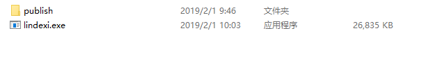

# dotnet core 发布只有一个 exe 的方法

在 dotnet core 发布的时候，会使用很多文件，这样发给小伙伴使用的时候不是很清真，本文告诉大家一个非官方的方法通过 warp 将多个文件打包为一个文件

<!--more-->
<!-- CreateTime:2020/1/21 9:11:22 -->

<!-- 标签：dotnet,dotnetcore -->

使用非常简单，先和之前相同的方式发布一个 dotnet core 程序，记得需要使用 `--self-contained` 发布

```csharp
dotnet publish -c Release --self-contained -r win-x86
```

这时可以在输出的文件夹 bin 的 `Release\netcoreapp2.1\win-x86\publish` 文件夹看到输出的文件，可以看到输出的文件很多，这时通过 Powershell 下载 warp 工具

```csharp
[Net.ServicePointManager]::SecurityProtocol = "tls12, tls11, tls" ; Invoke-WebRequest https://github.com/dgiagio/warp/releases/download/v0.3.0/windows-x64.warp-packer.exe -OutFile warp-packer.exe
```

当然这个下载方法有些诡异，同时国内的网速也不是很好，可以通过 [官网](https://github.com/dgiagio/warp/releases/download/v0.3.0/windows-x64.warp-packer.exe) 或 [csdn](https://download.csdn.net/download/lindexi_gd/10946976) 下载

下载之后将 warp-packer.exe 放在 Release\netcoreapp2.1\win-x86\publish 的上一级文件夹里面，就放在 Release\netcoreapp2.1\win-x86 文件夹

这样就可以通过下面的命令打包出一个 exe 包含里面的文件

```csharp
当前的命令行路径是 Release\netcoreapp2.1\win-x86

> .\warp-packer --arch windows-x64 --input_dir .\publish\ --exec 在publish文件夹里面运行的程序 --output 输出的.exe
```

如在 Release\netcoreapp2.1\win-x86 里面的可运行程序 exe 是 lindexi.exe 我可以通过下面的代码合并里面的文件为一个 exe 文件

```csharp
.\warp-packer --arch windows-x64 --input_dir .\publish\ --exec lindexi.exe --output lindexi.exe
```

<!--  -->


同时使用这个工具还有一个好处，就是对文件进行压缩

限制：

当前（2019年1月3日）只能发布 x64 的版本的程序，如 windows x64 和 linux x64 程序

## 命令行工具

现在可以通过 dotnet 工具使用 warp 发布，在使用之前先安装工具

```csharp
dotnet tool install --global dotnet-warp
```

安装完成可以在输出文件夹里面执行 `dotnet-warp` 就可以打包为单个exe文件

这个项目在[github](https://github.com/dgiagio/warp)欢迎小伙伴访问

## 使用 dotnet 命令行发布

在 [dotnet core 3 preview5](https://dotnet.microsoft.com/download/dotnet-core/3.0) 支持在命令行一键打包为一个文件

这个文件包含所有的依赖和资源文件，在启动的时候将所有依赖复制到临时文件夹，然后将这些依赖加载。这个解压只会在第一次运行，之后都可以快速启动

```csharp
dotnet publish -r win10-x64 /p:PublishSingleFile=true
```

新建一个控制台创建使用上面命令发布为一个 exe 文件的大小大概是 67M 左右

第一次运行需要解压文件到临时文件夹的 `.net\程序集名\xx` 文件夹里面，然后再运行

## 原理

其实 Warp 和 dotnet PublishSingleFile 都是一个自压缩包，在第一次运行会将文件解压缩到临时文件夹。如 warp 会解压缩到 `C:\Users\xxx\AppData\Local\warp\packages\app.exe` 文件夹，请将上面的 xxx 替换为你的用户名，将 app.exe 替换为实际的应用

特别感谢 [ZhuShePing](https://github.com/zhusheping ) 大佬告诉我文件解压的地方

## 隐藏控制台

用 Warp 的方法打包是做套壳，而外层程序是控制台程序，此时双击打开将会看到一个控制台。根据微软的文档，这个可执行的文件是 PE 格式，在 PE 格式的定义上用一个字段表示可执行文件属于控制台还是窗口应用，如果是控制台的就会显示控制台，如果是窗口应用就不会显示控制台。使用这个原理可以通过修改打包后的文件，让这个字段设置为窗口应用具体方法请看 [dotnet core 通过修改文件头的方式隐藏控制台窗口](https://lindexi.gitee.io/post/dotnet-core-%E9%80%9A%E8%BF%87%E4%BF%AE%E6%94%B9%E6%96%87%E4%BB%B6%E5%A4%B4%E7%9A%84%E6%96%B9%E5%BC%8F%E9%9A%90%E8%97%8F%E6%8E%A7%E5%88%B6%E5%8F%B0%E7%AA%97%E5%8F%A3.html )

[dgiagio/warp: Create self-contained single binary applications](https://github.com/dgiagio/warp#windows-1 )

[Single exe self contained console app · Issue #13329 · dotnet/corefx](https://github.com/dotnet/corefx/issues/13329 )

[Announcing .NET Core 3.0 Preview 5](https://devblogs.microsoft.com/dotnet/announcing-net-core-3-0-preview-5/ )

[dotnet-warp && NSSM 部署 .net core 项目到 windows 服务 - 易墨 - 博客园](https://www.cnblogs.com/morang/p/10792109.html )

<a rel="license" href="http://creativecommons.org/licenses/by-nc-sa/4.0/"></a><br />本作品采用<a rel="license" href="http://creativecommons.org/licenses/by-nc-sa/4.0/">知识共享署名-非商业性使用-相同方式共享 4.0 国际许可协议</a>进行许可。欢迎转载、使用、重新发布，但务必保留文章署名[林德熙](http://blog.csdn.net/lindexi_gd)(包含链接:http://blog.csdn.net/lindexi_gd )，不得用于商业目的，基于本文修改后的作品务必以相同的许可发布。如有任何疑问，请与我[联系](mailto:lindexi_gd@163.com)。
