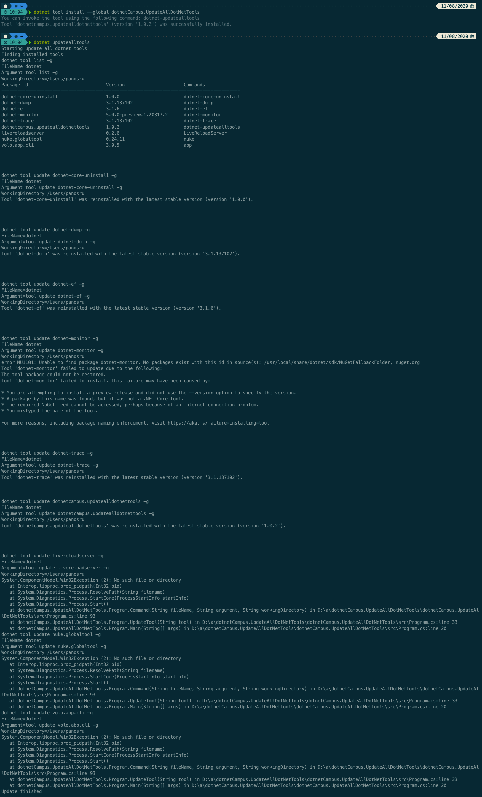

# dotnet core 在 MAC 系统下删除应用程序自己后调 Process Start 方法将会抛出 Win32 异常

在 MAC 系统下，如果在运行过程中，应用程序的文件被删除了，那么此时如果应用程序执行了 Process.Start 方法时，将会抛出 Win32Exception 异常

<!--more-->
<!-- CreateTime:2020/8/13 9:38:41 -->

<!-- 发布 -->

我写了一个工具 [dotnetCampus.UpdateAllDotNetTools](https://github.com/dotnet-campus/dotnetCampus.UpdateAllDotNetTools) 用来更新所有的 dotnet tool 工具。因为 [dotnetCampus.UpdateAllDotNetTools](https://github.com/dotnet-campus/dotnetCampus.UpdateAllDotNetTools) 也是一个 dotnet tool 工具，因此也会更新自身

但是有小伙伴告诉我，在使用 [dotnetCampus.UpdateAllDotNetTools](https://github.com/dotnet-campus/dotnetCampus.UpdateAllDotNetTools) 更新 [dotnetCampus.UpdateAllDotNetTools](https://github.com/dotnet-campus/dotnetCampus.UpdateAllDotNetTools) 到最新版本之后，其他的 dotnet tool 就都不能更新了，将会抛出 Win32Exception 异常，如下图

<!--  -->


在更新 [dotnetCampus.UpdateAllDotNetTools](https://github.com/dotnet-campus/dotnetCampus.UpdateAllDotNetTools) 将会删除当前运行的 [dotnetCampus.UpdateAllDotNetTools](https://github.com/dotnet-campus/dotnetCampus.UpdateAllDotNetTools) 进程的文件，在 MAC 下是可以删除正在运行的程序的文件，但是在 .NET Core 的 Process.Start 方法里面的逻辑是需要先获取当前进程所在的文件，获取对应的文件夹，用于找到命令

例如我输入了 `dotnet` 命令，通过 `Process.Start("dotnet")` 那么 .NET 将先尝试在程序所在的文件夹寻找是否存在 "dotnet" 这个程序，如果存在，那么执行。因此第一步就是获取当前进程所在的文件

在 .NET 开源代码里面，可以在 `src\libraries\System.Diagnostics.Process\src\System\Diagnostics\Process.Unix.cs` 找到实际的 Process Start 逻辑

```csharp
        /// <summary>
        /// Starts the process using the supplied start info.
        /// With UseShellExecute option, we'll try the shell tools to launch it(e.g. "open fileName")
        /// </summary>
        /// <param name="startInfo">The start info with which to start the process.</param>
        private bool StartCore(ProcessStartInfo startInfo)
        {
                // 忽略代码
                filename = ResolvePath(startInfo.FileName);
                argv = ParseArgv(startInfo);
                if (Directory.Exists(filename))
                {
                    throw new Win32Exception(SR.DirectoryNotValidAsInput);
                }

                ForkAndExecProcess(filename, argv, envp, cwd,
                    startInfo.RedirectStandardInput, startInfo.RedirectStandardOutput, startInfo.RedirectStandardError,
                    setCredentials, userId, groupId, groups,
                    out stdinFd, out stdoutFd, out stderrFd, usesTerminal);

                // 忽略代码
        }
```

在 ResolvePath 方法将会先尝试获取当前的文件夹，具体的实现将会在 `src\libraries\System.Diagnostics.Process\src\System\Diagnostics\Process.OSX.cs` 文件里

在 MAC 系统的代号里面，上古版本就是 OSX 也就是 OSX 就是 MAC 系统，上面这个代码文件就是特别给 MAC 系统使用的

那么获取当前文件用的是什么方法？调用一个和 Windows 的 P/Invoke 方法差不多的方法

```csharp
        /// <summary>Gets the path to the current executable, or null if it could not be retrieved.</summary>
        private static string GetExePath()
        {
            return Interop.libproc.proc_pidpath(Environment.ProcessId);
        }
```

这个 `proc_pidpath` 是什么方法？这是一个获取传入的进程号拿到对应的文件路径的方法，如果传入的进程号对应的文件被删除了，那么将会抛出 Win32Exception 异常

```
System.ComponentModel.Win32Exception (2): No such file or Directory
at Interop.libproc.proc_pidpath(Int32 pid)
at System.Diagnostics.Process.ResolvePath(string filename)
at System.Diagnostics.Process.StartCore(ProcessStartInfo startInfo)
at System.Diagnostics.Process.Start()
```

这就是在 [Unhandled exception on Mac · Issue #4 · dotnet-campus/dotnetCampus.UpdateAllDotNetTools](https://github.com/dotnet-campus/dotnetCampus.UpdateAllDotNetTools/issues/4 ) 的问题

我尝试在 dotnet runtime 修复这个坑 [Ignore the executable file be deleted in Process Start by lindexi · Pull Request #40748 · dotnet/runtime](https://github.com/dotnet/runtime/pull/40748 ) 

<a rel="license" href="http://creativecommons.org/licenses/by-nc-sa/4.0/"></a><br />本作品采用<a rel="license" href="http://creativecommons.org/licenses/by-nc-sa/4.0/">知识共享署名-非商业性使用-相同方式共享 4.0 国际许可协议</a>进行许可。欢迎转载、使用、重新发布，但务必保留文章署名[林德熙](http://blog.csdn.net/lindexi_gd)(包含链接:http://blog.csdn.net/lindexi_gd )，不得用于商业目的，基于本文修改后的作品务必以相同的许可发布。如有任何疑问，请与我[联系](mailto:lindexi_gd@163.com)。
