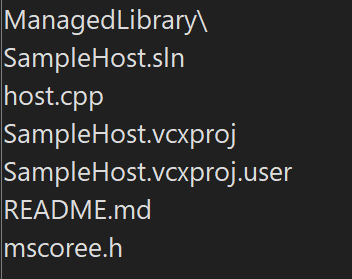
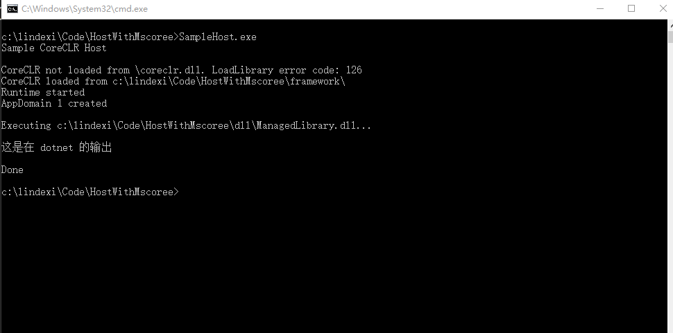

# dotnet core 应用是如何跑起来的 通过自己写一个 dotnet host 理解运行过程

在上一篇博客是使用官方提供的 AppHost 跑起来整个 dotnet 程序。本文告诉大家在 dotnet 程序运行到托管代码之前，所需要的 Native 部分的逻辑。包括如何寻找 dotnet 运行时，如何加载运行时和框架然后跑起来业务端的 dll 文件的逻辑

<!--more-->
<!-- 不发布 -->

在上一篇博客告诉大家在 dotnet 的 AppHost 是如何做的，详细请看 [dotnet core 应用是如何跑起来的 通过AppHost理解运行过程](https://blog.lindexi.com/post/dotnet-core-%E5%BA%94%E7%94%A8%E6%98%AF%E5%A6%82%E4%BD%95%E8%B7%91%E8%B5%B7%E6%9D%A5%E7%9A%84-%E9%80%9A%E8%BF%87AppHost%E7%90%86%E8%A7%A3%E8%BF%90%E8%A1%8C%E8%BF%87%E7%A8%8B.html )

那如果我想要定制运行时的寻找路径呢？在 [dotnet core 应用是如何跑起来的 通过AppHost理解运行过程](https://blog.lindexi.com/post/dotnet-core-%E5%BA%94%E7%94%A8%E6%98%AF%E5%A6%82%E4%BD%95%E8%B7%91%E8%B5%B7%E6%9D%A5%E7%9A%84-%E9%80%9A%E8%BF%87AppHost%E7%90%86%E8%A7%A3%E8%BF%90%E8%A1%8C%E8%BF%87%E7%A8%8B.html ) 只是告诉大家如何定制咱的业务端的 dll 寻找路径

阅读本文能收获

- 了解 dotnet 的执行引擎（实际没有执行引擎这个概念）是如何被启动的
- 学会一个黑科技，自定义运行时所在的文件夹
- 了解为什么 dotnet core 和 dotnet framework 不一样，不需要依赖环境安装了框架 


在开始之前，需要了解什么是 dotnet host 这个概念。在运行 dotnet 程序的时候，在 windows 下需要通过 win32 的形式运行。而大家都知道，如果不开 AOT 等黑科技，咱构建输出的 dll 是 IL 中间格式的，但是可执行程序是只认机器码汇编的。如何从咱的 IL 逻辑到机器运行呢？今天咱来写这部分的逻辑，让整个 dotnet 跑起来的启动部分

需要知道，整个 dotnet 的启动机制是特别复杂的，本文只是告诉大家如何跑起来，也就是只是调用各个方法而已，细节部分我就不敢讲了

在 dotnet 里面需要先启动动态编译模块，而动态（即时）编译模块的启动运行部分（非全部）本质上是一个被构建为本机代码的一个模块，需要被 Native 的逻辑执行。而运行时本身需要在 dotnet 的托管代码执行之前热起来，运行时的启动部分代码也是一个被构建为本机代码的模块

那在咱双击一个 dotnet 应用构建出来的 exe 时，到底发生了什么？咱双击的这个 dotnet 应用构建出来的 exe 本质上是一个从模版创建的二进制文件，这是一个原本由纯 Native 构成的模版二进制文件，在咱构建 dotnet 的过程，被复制到咱的输出路径，然后通过替换二进制文件里面的占坑部分内容，完成这个二进制文件。这部分细节请看 [dotnet core 应用是如何跑起来的 通过AppHost理解运行过程](https://blog.lindexi.com/post/dotnet-core-%E5%BA%94%E7%94%A8%E6%98%AF%E5%A6%82%E4%BD%95%E8%B7%91%E8%B5%B7%E6%9D%A5%E7%9A%84-%E9%80%9A%E8%BF%87AppHost%E7%90%86%E8%A7%A3%E8%BF%90%E8%A1%8C%E8%BF%87%E7%A8%8B.html )

而下面咱将不使用模版文件创建 dotnet 的可执行文件，而是自己写一个类似 AppHost 的应用，通过编写这个应用，可以了解在 dotnet 启动之前需要做哪些步骤

在开始之前，我推荐大家拉下我的代码到本地，通过自己更改实际修改代码可以理解整个 dotnet 的启动的 Native 部分逻辑

本文放在 [github](https://github.com/lindexi/lindexi_gd/tree/3e19bffc/HostWithMscoree ) 欢迎小伙伴访问

<!--  -->


在代码仓库里面保护了两个模块，一个就是 SampleHost.vcxproj 包含的代码，这里就是 Native 的逻辑。另一个就是 ManagedLibrary 也就是咱 C# 的托管代码。下面让我来告诉大家这个仓库可以如何玩

先进入 ManagedLibrary 文件夹，双击执行 build.bat 文件，此时将会执行 dotnet 的发布命令，可以在发布之后进入 `HostWithMscoree\ManagedLibrary\bin\Debug\net5.0\win-x86\publish\` 文件夹，看到发布之后的内容

现在咱准备自己写一个 AppHost 应用，这个应用将支持从其他的路径找到运行时，然后执行 ManagedLibrary.dll 的逻辑。换句话说就是咱接下来的做法就是在 C 盘创建两个文件夹，分别是 `c:\lindexi\Code\HostWithMscoree\dll\` 和 `c:\lindexi\Code\HostWithMscoree\framework\` 文件夹

将 ManagedLibrary.dll 文件复制到 `c:\lindexi\Code\HostWithMscoree\dll\` 文件夹

将 `HostWithMscoree\ManagedLibrary\bin\Debug\net5.0\win-x86\publish\` 文件夹里面除了 ManagedLibrary 相关的文件外的其他文件复制到 `c:\lindexi\Code\HostWithMscoree\framework\` 文件夹

也就是说 ManagedLibrary.dll 的运行时框架都在 framework 文件夹，而 ManagedLibrary.dll 自己在 dll 文件夹里面。此时就需要在 dotnet 启动逻辑里面包含了去 `c:\lindexi\Code\HostWithMscoree\framework\` 文件夹寻找运行时的过程才能让 ManagedLibrary.dll 跑起来

请打开 `HostWithMscoree\SampleHost.sln` 文件，此时我期望你的 VS 上安装完成了 C++ 的负载，如果有提示缺少的部分，还请自行安装。打开之后请切换到 x86 配置下，因为咱刚才发布的 dotnet 应用是 x86 应用

打开 `HostWithMscoree\host.cpp` 文件，这里面将是整个核心的逻辑。这部分的逻辑相对清晰，但是知识点非常多，详细请看官方的 [Native hosting](https://github.com/dotnet/runtime/blob/master/docs/design/features/native-hosting.md ) 文档

在 `HostWithMscoree\host.cpp` 文件的 wmain 方法就是这个 SampleHost 的入口方法。可以看到这里被我定制了两个常量路径

```c++
int wmain(int argc, wchar_t* argv[])
{
    printf("Sample CoreCLR Host\n\n");
    // 替换下面的代码
    wchar_t* application = L"c:\\lindexi\\Code\\HostWithMscoree\\dll\\ManagedLibrary.dll";
    const wchar_t* coreCLRDirectory = L"c:\\lindexi\\Code\\HostWithMscoree\\framework\\";

    // 忽略代码
}
```

我在上面代码分开了 application 应用所在的文件夹路径，以及应用的运行时所在的文件夹路径，作为两个不同的常量路径（当然了，第一个实际上代码上不是常量，只是逻辑上是常量）用于在后续使用。请大家根据自己的需要更改路径

在 `c:\lindexi\Code\HostWithMscoree\framework\` 文件夹里面存放的就是 ManagedLibrary 项目里面除了 ManagedLibrary.dll 和 exe 等文件外的，其他文件，也就是说 framework 文件夹里面存放的是当前 ManagedLibrary.dll 的运行时和框架所有文件

而 application 对应的文件夹里面就只有 ManagedLibrary.dll 一个文件，因为其他的文件咱也不需要用到。如 ManagedLibrary.exe 其实就是 AppHost 文件，这个文件的功能就是作为 dotnet 的启动入口，而这个功能就是咱的 SampleHost 所要完成的功能。也就是说咱将使用 SampleHost 代替 AppHost 也就是 ManagedLibrary.exe 文件来作为 dotnet 的启动入口

配置完成之后，请按下 F5 运行起来。如果看到只是一闪而过，还请在适当地方添加断点哈，因为 C++ 程序在 VS 上没有做和 C# 一样的优化，在执行完成之后不退出控制台

如果能运行成功，可以看到如下界面

<!--  -->


只有一句 这是在 dotnet 的输出 是跑在咱的 dotnet 应用里面的，其他都是 SampleHost 的

这样咱就完成了一个 dotnet 启动器，可以从指定的路径找到运行时和框架，然后运行指定路径的应用

在跑起来之后，可以先看看这个项目里面的代码和注释

咱按照代码的顺序，一步步告诉大家这是在做什么

官方的例子被我进行了一些魔改，原因是本文的这个代码是微软官方的例子，但是微软在 dotnet 5 时删除了这个例子，因此需要在 [https://github.com/dotnet/samples](https://github.com/dotnet/samples) 项目里面切换 commit 到 a8804d38692d6c2a4bf9e78d0058edaf8c9cf955 才能找到本文的例子，本文的例子放在 `core/hosting/HostWithMscoree` 文件夹

官方的例子本身是给 dotnet core 2.2 以及更低版本使用的。但是在 dotnet 5 的时候依然能用，这部分机制依然写在了官方的文档里面。但本文的逻辑依然只是一个 demo 级，如果做到产品上，还请大家先理解代码细节，根据自己的需求更改，同时也需要处理好各个非预期的情况

在代码的开始，就是我魔改的部分，这部分适用于大家的快速开始

```c++
int wmain(int argc, wchar_t* argv[])
{
    printf("Sample CoreCLR Host\n\n");
    // 替换下面的代码
    wchar_t* application = L"c:\\lindexi\\Code\\HostWithMscoree\\dll\\ManagedLibrary.dll";
    const wchar_t* coreCLRDirectory = L"c:\\lindexi\\Code\\HostWithMscoree\\framework\\";

    // 忽略代码
}
```

尽管这里的 main 函数看起来有点诡异，但这就是入口点没错了。接下来就是通过咱上面的 coreCLRDirectory 的值，去加载 CoreClr.dll 文件

加载逻辑大概如下

```c++
        const wchar_t* coreCLRDirectory = L"c:\\lindexi\\Code\\HostWithMscoree\\framework\\";

        // 下面代码相当于 string coreRoot = coreCLRDirectory; 而已
        wchar_t coreRoot[MAX_PATH];
        wcscpy_s(coreRoot, MAX_PATH, coreCLRDirectory);

        HMODULE coreCLRModule;
        coreCLRModule = LoadCoreCLR(coreRoot);

HMODULE LoadCoreCLR(const wchar_t* directoryPath)
{
    wchar_t coreDllPath[MAX_PATH];
    // 下面代码其实就是 coreDllPath = "c:\\lindexi\\Code\\HostWithMscoree\\framework\\" + "\\" + "coreclr.dll";
    wcscpy_s(coreDllPath, MAX_PATH, directoryPath);
    wcscat_s(coreDllPath, MAX_PATH, L"\\");
    wcscat_s(coreDllPath, MAX_PATH, coreCLRDll);

    // 以下是核心代码，通过 LoadLibraryExW 加载 CoreClr.dll 文件
    // <Snippet2>
    HMODULE ret = LoadLibraryExW(coreDllPath, NULL, 0);
    // </Snippet2>

    if (!ret)
    {
        // This logging is likely too verbose for many scenarios, but is useful
        // when getting started with the hosting APIs.
        DWORD errorCode = GetLastError();
        wprintf(L"CoreCLR not loaded from %s. LoadLibrary error code: %d\n", coreDllPath, errorCode);
    }

    return ret;
}

// 这是在 Windows 下的写法，在 Windows 下是加载 CoreClr.dll 文件
// Main clr library to load
// Note that on Linux and Mac platforms, this library will
// be called libcoreclr.so or libcoreclr.dylib, respectively
static const wchar_t* coreCLRDll = L"coreclr.dll";
```

也就是说通过 LoadLibraryExW 这个 win32 方法加载了 CoreClr.dll 文件。返回 HMODULE 给了 coreCLRModule 变量。这就是为什么 dotnet core 能独立框架的一个原因，也是为什么 dotnet core 可以不依赖系统安装的运行时框架的原因了。原因就是在 dotnet core 里面运行让 Host 程序去寻找启动所需要的执行引擎(这个词实际是不存在的，说的只是 CoreClr.dll 而已) 也就是说允许让开发者自己定义整个运行时和框架所在的路径

因此只需要在我的例子程序里面，更改 coreCLRDirectory 变量的路径，即可实现自定义设置共享框架的路径。本质的共享框架和独立发布的框架没有差别，只是独立发布的框架只是给一个应用使用，而共享的框架可以给多个应用使用。可以在一个团队内发布的多个软件，都使用相同的框架文件夹，这样这个框架文件夹就完全由团队控制，同时团队里面多个软件之间也不需要额外去安装框架，减少重复文件

接下来就是通过 CoreClr.dll 提供的 GetCLRRuntimeHost 方法获取 Clr 运行时 Host 对象

```c++
    // 从 CoreClr.dll 里面获取 GetCLRRuntimeHost 方法
    // 相当于拿到 HRESULT GetCLRRuntimeHost(Guid id, out ICLRRuntimeHost4 runtimeHost); 方法
    FnGetCLRRuntimeHost pfnGetCLRRuntimeHost =
        (FnGetCLRRuntimeHost)::GetProcAddress(coreCLRModule, "GetCLRRuntimeHost");

    // 通过 pfnGetCLRRuntimeHost 拿到 runtimeHost 对象
    // 以下写法的意思是 HResult hr = pfnGetCLRRuntimeHost(IID_ICLRRuntimeHost4, out var runtimeHost);
    Guid IID_ICLRRuntimeHost4 = new Guid("xxx-xxx-xx-xx-xxx"); // 当然了，实际写法是 EXTERN_GUID(IID_ICLRRuntimeHost4, 0x64F6D366, 0xD7C2, 0x4F1F, 0xB4, 0xB2, 0xE8, 0x16, 0x0C, 0xAC, 0x43, 0xAF); 只是这样写很诡异
    ICLRRuntimeHost4* runtimeHost;
    HRESULT hr = pfnGetCLRRuntimeHost(IID_ICLRRuntimeHost4, (IUnknown**)&runtimeHost);
```

在拿到 runtimeHost 对象之后，就可以调用 Start 方法启动运行时了，如下面代码

```c++
    hr = runtimeHost->SetStartupFlags(/*一些不需要关注的启动配置*/);
    if (FAILED(hr))
    {
        printf("ERROR - Failed to set startup flags.\nError code:%x\n", hr);
        return -1;
    }

    // 启动运行时将会初始化 JIT 和 GC 和加载器等模块。运行到这里可以认为 dotnet 已经热完成了
    // Starting the runtime will initialize the JIT, GC, loader, etc.
    hr = runtimeHost->Start();
```

在完成了运行时的启动之后，就可以来创建 AppDomain 来运行咱的业务端的 dotnet 托管代码了

在 dotnet 里面有一个概念是程序集，加载程序集需要加载到一个 AppDomain 上，如果大家玩过插件开发，这部分将会更好的理解。想要让咱的业务端的 dotnet 托管代码运行，就需要加载咱的程序集，需要将程序集放入一个 AppDomain 上

```c++
            // 进行创建 AppDomain 的配置
            int appDomainFlags = APPDOMAIN_ENABLE_PLATFORM_SPECIFIC_APPS | APPDOMAIN_ENABLE_PINVOKE_AND_CLASSIC_COMINTEROP | ... ;
            // 以下逻辑用 C++ 写，需要太多代码了，因此我就换 C# 系的代码来写
            // 哪些 dll 或 exe 将会被加入寻找程序集加载路径
            // 所有放在 coreRoot 路径下的 exe 和 dll 和 winmd 都会加入
            List<string> trustedPlatformAssemblies = DirectoryHelper.GetFiles(coreRoot, "*.exe|*.dll|*.winmd");

            var application = "c:\\lindexi\\Code\\HostWithMscoree\\dll\\ManagedLibrary.dll";

            string targetAppPath = Path.GetDirectoryName(application);

            // APP_PATHS
            // App paths are directories to probe in for assemblies which are not one of the well-known Framework assemblies
            // included in the TPA list.
            //
            // For this simple sample, we just include the directory the target application is in.
            // More complex hosts may want to also check the current working directory or other
            // locations known to contain application assets.
            string appPath = targetAppPath;
            List<string> appPaths = new List<string>() { appPath };

            // APP_NI_PATHS
            // App (NI) paths are the paths that will be probed for native images not found on the TPA list.
            // It will typically be similar to the app paths.
            // For this sample, we probe next to the app and in a hypothetical directory of the same name with 'NI' suffixed to the end.
            List<string> appNiPaths = new List<string>() { targetAppPath + ";" + targetAppPath + "NI" };

            // NATIVE_DLL_SEARCH_DIRECTORIES
            // Native dll search directories are paths that the runtime will probe for native DLLs called via PInvoke
            List<string> nativeDllSearchDirectories = new List<string>(){ appPath + ";" + coreRoot };
            List<string> platformResourceRoots = appPaths;

            // 这是传入的参数，参数是 Key 和 Value 对的，也就是下面的 propertyKeys 和 propertyValues 的值是一一对应的
            // Setup key/value pairs for AppDomain  properties
            string[] propertyKeys = new[]
            {
                "TRUSTED_PLATFORM_ASSEMBLIES",
                "APP_PATHS",
                "APP_NI_PATHS",
                "NATIVE_DLL_SEARCH_DIRECTORIES",
                "PLATFORM_RESOURCE_ROOTS"
            };

            // Property values which were constructed in step 5
            List<List<string>> propertyValues = new List<List<string>>()
            {
                trustedPlatformAssemblies,
                appPaths,
                appNiPaths,
                nativeDllSearchDirectories,
                platformResourceRoots
            };

            // 以上就是配置，拿到了 propertyKeys 和 propertyValues 组成了属性传入
            // 下面继续回到 C++ 代码

            hr = runtimeHost->CreateAppDomainWithManager(
                L"Sample Host AppDomain",       // Friendly AD name
            appDomainFlags,
            NULL,                           // Optional AppDomain manager assembly name
            NULL,                           // Optional AppDomain manager type (including namespace)
            sizeof(propertyKeys) / sizeof(wchar_t*),
            propertyKeys,
            propertyValues,
            &domainId);
```

上面代码为了表述方便，我将部分 C++ 的代码翻译为 C# 来写，这样瞬间代码就清洁了非常多

此时拿到的 domainId 就能代表这个 AppDomain 了。下一步是加载咱的业务端的程序集开始执行

```c++
    hr = runtimeHost->ExecuteAssembly(domainId, targetApp, argc - 1, (LPCWSTR*)(/*参数*/ NULL), &exitCode);
```

上面代码执行之后，将会调用进咱 C# 托管代码的 Main 函数里面。进入这个函数之后的逻辑就和这个启动 Host 应用没有什么关系了，当然了进入这个函数做的事情可是特别复杂的，包括 JIT 将 IL 进行翻译为机器指令，申请内存，执行托管逻辑等，这就需要农夫大大的 《.NET Core底层入门》 这本书以及伟民哥翻译的 《.NET内存管理宝典 - 提高代码质量、性能和可扩展性》 这本书

在 C++ 里面最后一步是等待 dotnet 应用完成之后，清理一下内存

```c++
    runtimeHost->UnloadAppDomain(domainId, true /* Wait until unload complete */);
    runtimeHost->Stop();
    runtimeHost->Release();
```

其实如果只是作为 Host 是可以不清理的，进程关了自动就清理了

其实可以看到核心的代码是特别少的，只有下面这几句

```C++
// 加载 CoreClr.dll 文件
coreCLRModule = LoadCoreCLR(coreRoot);

// 拿到 GetCLRRuntimeHost 方法
FnGetCLRRuntimeHost pfnGetCLRRuntimeHost =
        (FnGetCLRRuntimeHost)::GetProcAddress(coreCLRModule, "GetCLRRuntimeHost");

// 使用 GetCLRRuntimeHost 方法拿到 runtimeHost 对象
HRESULT hr = pfnGetCLRRuntimeHost(IID_ICLRRuntimeHost4, (IUnknown**)&runtimeHost);

// 创建 AppDomain 对象
runtimeHost->CreateAppDomainWithManager(/*忽略代码*/ &domainId);

// 运行程序集
runtimeHost->ExecuteAssembly(domainId, targetApp);

// 清理
runtimeHost->UnloadAppDomain(domainId, true /* Wait until unload complete */);
runtimeHost->Stop();
runtimeHost->Release();
```

使用上面代码就能实现自己做一个 dotnet 的 Host 加载自己定义的运行时框架文件夹，以及自己创建第一个 AppDomain 加载程序集

另外上面代码的另一个功能是让 Native 的其他语言编写的应用，可以加载使用 dotnet 编写的库。上面代码除了使用 ExecuteAssembly 运行程序集之外，还可以调用程序集里面的某个静态方法。只需要调用 `runtimeHost->CreateDelegate` 方法就可以，但这个逻辑在 dotnet 5 下有更改，在 dotnet 5 下提供了更方便的方式，但不在本文范围内

本文告诉了大家如何自己实现 dotnet 的启动之前的逻辑，其实就是各个方法的调用，本文也只是告诉大家如何调用而已，关于这些方法的执行逻辑以及更多可以使用的参数，还请大家去开源仓库里面找代码

<a rel="license" href="http://creativecommons.org/licenses/by-nc-sa/4.0/"></a><br />本作品采用<a rel="license" href="http://creativecommons.org/licenses/by-nc-sa/4.0/">知识共享署名-非商业性使用-相同方式共享 4.0 国际许可协议</a>进行许可。欢迎转载、使用、重新发布，但务必保留文章署名[林德熙](http://blog.csdn.net/lindexi_gd)(包含链接:http://blog.csdn.net/lindexi_gd )，不得用于商业目的，基于本文修改后的作品务必以相同的许可发布。如有任何疑问，请与我[联系](mailto:lindexi_gd@163.com)。
