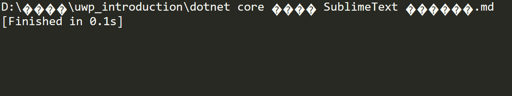

# dotnet core 添加 SublimeText 编译插件

因为 SublimeText 有很多插件都是使用 Py 写的，而我想使用 dotnet core 给 SublimeText 写一个编译插件，也就是在我使用 Markdown 的时候可以点击编译，将 Markdown 转 doc 或者做其他的。

<!--more-->
<!-- CreateTime:2018/8/29 8:53:47 -->

<!-- 标签：dotnetcore,sublimetext -->

在 SublimeText 有一个功能就是使用 Tools 的 `Build System` 添加新的 `Build` 通过点击`new Build System` 就可以新建一个用 `sublime-build` 结束的文件

将会这个文件保存到 SublimeText 所在的文件夹，在`C:\Users\用户名\AppData\Roaming\Sublime Text 3\Packages\User` 就可以添加编译


先来创建一个 dotnet core 项目，这个项目先给一个随意的名字

这个项目只是用来输出拿到的参数

```csharp
        static void Main(string[] args)
        {
            var str = new StringBuilder();
            foreach (var temp in args)
            {
                str.Append(temp + "\r\n");

                Console.WriteLine(temp);
            }

            File.WriteAllText(Path.Combine(Path.GetDirectoryName(Assembly.GetExecutingAssembly().Location), "KeameaMouhalis"), str.ToString());
        }
```

代码很简单，上面用`Path.Combine(Path.GetDirectoryName(Assembly.GetExecutingAssembly().Location)`因为想写文件到运行的文件夹


例如这个项目编译出的路径是 `D:\lindexi\github\PisairtekaDrallhairlo\PisairtekaDrallhairlo\bin\Debug\netcoreapp2.0\PisairtekaDrallhairlo.dll` 在刚才打开的  `sublime-build` 可以添加下面代码

```csharp
{
	"file_patterns":["*.md"],
	"cmd": ["dotnet" , "D:\\lindexi\\github\\PisairtekaDrallhairlo\\PisairtekaDrallhairlo\\bin\\Debug\\netcoreapp2.0\\PisairtekaDrallhairlo.dll","$file"]
}
```

这里的 `file_patterns` 就是表示在什么的文件可以使用这个编译，第二个就是调用 cmd 运行命令

可以传入的参数很多，这里的 `$file` 表示当前进行编译文件，可以选的参数请看下面


 - `$file_path`	当前文件所在路径，比如 `C:\Files`
 - `$file`	当前文件的完整路径，比如 `C:\Files\Chapter1.txt`
 - `$file_name`	当前文件的文件名，比如 `Chapter1.txt`
 - `$file_extension`	当前文件的扩展名，比如 txt
 - `$file_base_name`	当前文件仅包含文件名的部分，比如 Document
 - `$packages`	Packages 文件夹的完整路径
 - `$project`	当前项目文件的完整路径
 - `$project_path`	当前项目文件的路径
 - `$project_name`	当前项目文件的名称
 - `$project_extension`	当前项目文件的扩展部分
 - `$project_base_name`	当前项目仅包括名的部分

现在将 `sublime-build` 文件存放到 SublimeText 所在的文件夹，注意给一个名字，然后就可以在 Build 里看到，现在选择 Build System 的对应的方式进行编译，点击 Build 就可以看到输出编译

在刚才的项目写文件是因为在 SublimeText 的控制台看到的是如下界面

<!--  -->


对于所有的中文都没有显示，所以写入文件就可以从文件里看，可以看到传入的文件是不会和 SublieText 显示一样

现在有了需要编译的文件的路径，就请发挥想想开发自己的编译插件

参见：[Build Systems – Sublime Text 3 Documentation](https://www.sublimetext.com/docs/3/build_systems.html )

[如何优雅地使用Sublime Text3 - 简书](https://www.jianshu.com/p/3cb5c6f2421c )

[Build Systems — Sublime Text非官方文档（中文翻译版）](http://sublime-text.readthedocs.io/en/latest/reference/build_systems.html )

<a rel="license" href="http://creativecommons.org/licenses/by-nc-sa/4.0/"></a><br />本作品采用<a rel="license" href="http://creativecommons.org/licenses/by-nc-sa/4.0/">知识共享署名-非商业性使用-相同方式共享 4.0 国际许可协议</a>进行许可。欢迎转载、使用、重新发布，但务必保留文章署名[林德熙](http://blog.csdn.net/lindexi_gd)(包含链接:http://blog.csdn.net/lindexi_gd )，不得用于商业目的，基于本文修改后的作品务必以相同的许可发布。如有任何疑问，请与我[联系](mailto:lindexi_gd@163.com)。
