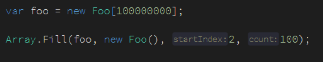

# dotnet core 用值初始化整个数组

如果想要创建一个数组，在这个数组初始化一个值，有多少不同的方法？

本文告诉大家三个不同的方法初始化

<!--more-->
<!-- CreateTime:2019/8/31 16:55:58 -->


在开发中，会不会用很多的时间在写下面的代码

```csharp
var prime = new bool[1000];
for ( int i = 0; i < prime.Length; i++ )
{
   prime[i] = true;
}
```

或者通过降低性能使用 Linq 的方法

```csharp
var prime = Enumerable.Repeat(true, 1000).ToArray();
```

现在可以使用 dotnet core 2.0 以上的功能，快速初始化

```csharp
var data = new bool[1000];
Array.Fill(data, true);
```

通过 Array.Fill 可以清真写出初始化的代码，同时性能很好

这个方法还可以定制范围

<!--  -->


那么这个方法是如何做到高性能的？

```csharp
public static void Fill<T>(T[] array, T value)
{
    if (array == null)
    {
        ThrowHelper.ThrowArgumentNullException(ExceptionArgument.array);
    }

    for (int i = 0; i < array.Length; i++)
    {
        array[i] = value;
    }
}
```

上面就是这个方法的源代码，可以看到是从一个循环和第一个方法相同

现在 dotnet core 开源了，所有代码都可以找到

[Cool new way to fill array with a value in .NET Core – Martin Zikmund](https://blog.mzikmund.com/2019/01/cool-new-way-to-fill-array-with-a-value-in-net-core/ )

https://github.com/dotnet/coreclr

<a rel="license" href="http://creativecommons.org/licenses/by-nc-sa/4.0/"></a><br />本作品采用<a rel="license" href="http://creativecommons.org/licenses/by-nc-sa/4.0/">知识共享署名-非商业性使用-相同方式共享 4.0 国际许可协议</a>进行许可。欢迎转载、使用、重新发布，但务必保留文章署名[林德熙](http://blog.csdn.net/lindexi_gd)(包含链接:http://blog.csdn.net/lindexi_gd )，不得用于商业目的，基于本文修改后的作品务必以相同的许可发布。如有任何疑问，请与我[联系](mailto:lindexi_gd@163.com)。
