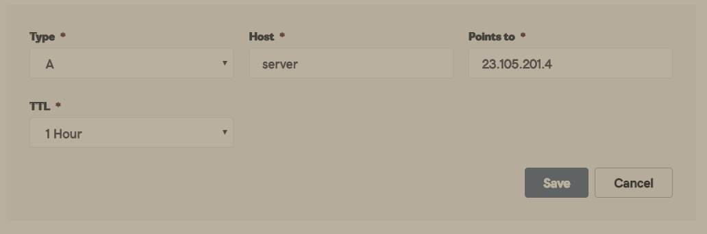
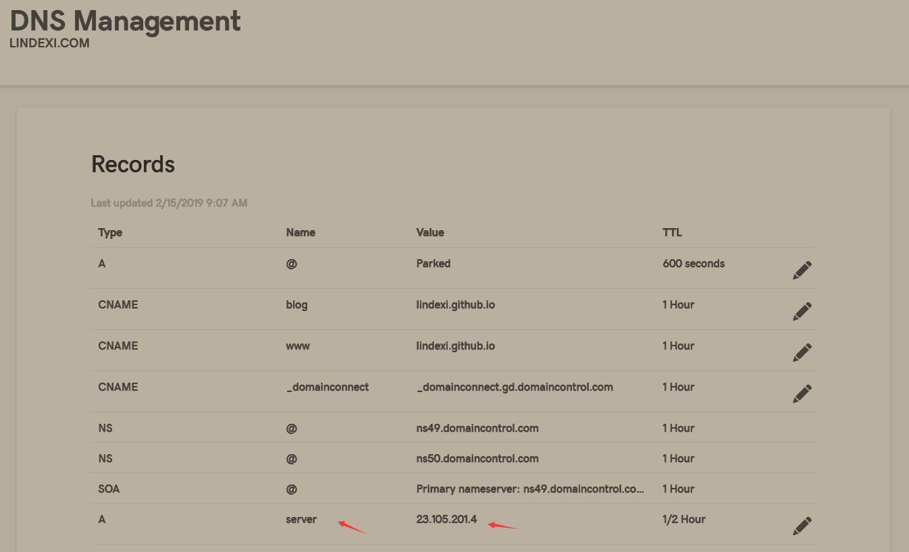

# dotnet core 通过 frp 发布自己的网站

很多时候写出来的网站只能自己内网访问，本文告诉大家如何通过 Frp 将自己的 asp dotnet core 网站发布到外网，让小伙伴访问自己的网站

通过 frp 的方式，可以解决自己的服务器性能太差的问题，通过 frp 的方式需要先存在一个外网的服务器

<!--more-->
<!-- CreateTime:2020/1/13 8:49:53 -->

<!-- 标签：dotnet,dotnetcore,frp -->

本文分为三个部分，第一个是创建一个简单的 asp dotnet core 网站，第二是配置域名，第三是配置代理

要使用本文的方法需要以下三个条件

- 本地有 asp dotnet core 环境
- 有自己的外网服务器
- 有自己的域名

## 搭建本地网站

通过 asp dotnet core 搭建网站是十分简单的，这里搭建的只是一个简单的 api 服务

通过命令行进入一个文件夹，在这个文件里面创建 asp dotnet core 网站，通过在地址栏输入 `cmd` 就可以在命令行进入当前的文件夹

在文件夹输入下面代码创建一个 asp dotnet core api 网站

```csharp
dotnet new webapi -o 网站的项目名
```

等待一下就可以使用命令行进入创建的网站的项目，我这里的项目是 lindexi 会在文件夹里面创建一个 lindexi 的程序

进入刚才创建的网站

```csharp
cd 网站的项目名
```

这时打开里面的 Program.cs 文件，在里面修改一点代码，让 asp dotnet core 绑定本地的端口

在 asp dotnet core 绑定端口的方法是通过 IWebHostBuilder 配置使用的连接

```csharp
        public static IWebHostBuilder CreateWebHostBuilder(string[] args) =>
            WebHost.CreateDefaultBuilder(args)
            .UseUrls("http://0.0.0.0:8000")
                .UseStartup<Startup>();
```

这里绑定了本地的所有的 8000 端口，可以通过本地的网站的内网 ip 本地 127.0.0.1 访问

保存关闭，然后运行下面的代码

```csharp
dotnet run
```

如果看到下面的代码就是创建成功

```csharp
Hosting environment: Development
Content root path: C:\lindexi\dotnet core 通过 frp 发布自己的网站\lindexi
Now listening on: http://0.0.0.0:8000
```

## 配置域名

这里域名不需要备案，简单的方法是从 godaddy.com 购买域名

在域名管理添加一个 a 记录

<!--  -->


在这里写入 Host 或 Name 输入 server 作为你二级域名，然后在 Value 输入你的服务器地址

这里的 Host 的名字可以随意更改，但是这个值会在下面使用到

<!--  -->


这里就让 dns 的 server.lindexi.com 指向我的服务器 ip 通过访问 [http://server.lindexi.com](http://server.lindexi.com ) 就可以访问服务器 

## 配置代理

打开自己的服务器，从服务器下载 frp 程序

在 [github](https://github.com/fatedier/frp/releases ) 下载对应的 Linux 版本的 frp 程序，然后解压

进入 frp 文件夹，可以看到 frps.ini 文件，在这个文件输入下面的代码

```csharp
[common]
bind_port = 7000
vhost_http_port = 8080

```

这里的 `bind_port` 是客户端连接服务器的端口，客户端需要知道服务器的 ip 和端口才能访问到服务器

这里 `vhost_http_port` 就是服务器发送服务的端口

然后在服务器运行 frps 这里的 frps 的 s 指的是服务器，里面的 frpc 的 c 指的是客户端

在本地的设备，从[github](https://github.com/fatedier/frp/releases )下载和服务器版本相同的 frp 程序，注意版本要相同

打开 frpc.ini 文件，在里面写入下面代码

```csharp
[common]
server_addr = 23.105.201.4
server_port = 7000

[web]
type = http
local_port = 8000
custom_domains = server.lindexi.com
```

注意，这里的 `server_addr` 填写的是你的服务器的 ip 这里的 `server_port` 对应服务器的 `bind_port` 的值

上面代码 `custom_domains` 的自定义域名需要先在自己的域名配置好

上面的代码的 `local_port` 就是通过 127.0.0.1 可以访问到的自己的网站的端口，在本文前面就使用 8000 作为 12.0.0.1:8000 网站

现在尝试在服务器运行一下 frp 服务

```csharp
./frps -c ./frps.ini
```

在本地也启动 frp 客户端

```csharp
./frpc -c ./frpc.ini
```

因为服务器对外的端口是 8080 也就是 frps.ini 的 `vhost_http_port` 的设置，需要通过域名:8080访问

我的域名设置是 server.lindexi.com 本地的 asp dotnet core api 的链接是 [http://127.0.0.1:8000/api/values](http://127.0.0.1:8000/api/values) 在浏览器就需要通过下面网址访问

```csharp
server.lindexi.com:8080/api/values
```

通过 frp 就可以将自己本地的服务通过自己的服务器让外面的小伙伴访问，这样就可以使用本地的几乎无限量的本地磁盘做文件存储，也可以使用本地的性能比服务器厉害很多的设备

[frp 文档](https://github.com/fatedier/frp/blob/master/README_zh.md#%E9%80%9A%E8%BF%87%E8%87%AA%E5%AE%9A%E4%B9%89%E5%9F%9F%E5%90%8D%E8%AE%BF%E9%97%AE%E9%83%A8%E7%BD%B2%E4%BA%8E%E5%86%85%E7%BD%91%E7%9A%84-web-%E6%9C%8D%E5%8A%A1 )

[2020-1-10-内网穿透神器frp - huangtengxiao](https://xinyuehtx.github.io/post/%E5%86%85%E7%BD%91%E7%A9%BF%E9%80%8F%E7%A5%9E%E5%99%A8frp.html )

[2020-1-11-内网穿透神器frp之进阶配置 - huangtengxiao](https://xinyuehtx.github.io/post/%E5%86%85%E7%BD%91%E7%A9%BF%E9%80%8F%E7%A5%9E%E5%99%A8frp%E4%B9%8B%E8%BF%9B%E9%98%B6%E9%85%8D%E7%BD%AE.html )

<a rel="license" href="http://creativecommons.org/licenses/by-nc-sa/4.0/"></a><br />本作品采用<a rel="license" href="http://creativecommons.org/licenses/by-nc-sa/4.0/">知识共享署名-非商业性使用-相同方式共享 4.0 国际许可协议</a>进行许可。欢迎转载、使用、重新发布，但务必保留文章署名[林德熙](http://blog.csdn.net/lindexi_gd)(包含链接:http://blog.csdn.net/lindexi_gd )，不得用于商业目的，基于本文修改后的作品务必以相同的许可发布。如有任何疑问，请与我[联系](mailto:lindexi_gd@163.com)。  
