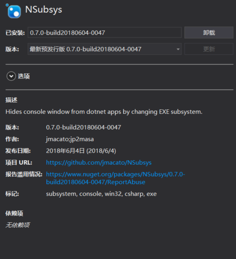

# dotnet core 通过修改文件头的方式隐藏控制台窗口

在带界面的 dotnet core 程序运行的时候就会出现一个控制台窗口，本文告诉大家使用最简单方法去隐藏控制台窗口。

<!--more-->
<!-- CreateTime:2020/1/20 21:12:07 -->

<!-- 标签：Avalonia,Roslyn，dotnetcore -->

最近在使用 Avalonia 开发，这是一个支持 dotnet framework 和 dotnet core 的框架，在开发的过程发现启动的窗口居然会出现控制台窗口。

在 VisualStudio 2017 的格式，如果是 dotnet framework 的程序，在没有设置 `OutputType` 为 `WinExe` 的是时候，启动程序会显示一个控制台窗口。

虽然在 dotnet framework 程序可以简单通过设置`OutputType` 为 `WinExe` 解决。如果这时使用跨平台多项目，就会看到 dotnet core 项目依旧会显示黑色窗口

最简单的方法是通过修改 PE 文件的方式，在 [NSubsys](https://github.com/jmacato/NSubsys/blob/master/NSubsys.csproj )就是编写了一个 Task 用来在编译完成获取 Exe 修改 PE 文件格式，隐藏黑色窗口

安装 [NSubsys](https://github.com/jmacato/NSubsys/blob/master/NSubsys.csproj ) 的方法就是从 Nuget 搜索 [NSubsys](https://github.com/jmacato/NSubsys/blob/master/NSubsys.csproj ) 然后使用 `dotnet publish `一下就可以了

<!--  -->


如果想知道为什么你安装了一个 Nuget 就可以帮你修改请看[如何创建一个基于 MSBuild Task 的跨平台的 NuGet 工具包 - walterlv](https://walterlv.github.io/post/create-a-cross-platform-msbuild-task-based-nuget-tool.html )

虽然知道了使用这个方法可以隐藏控制台，但是这里还是需要告诉大家一些原理。

在使用 C# 编译器，可以通过 csc 加上一个开关 `/t:` 告诉 csc 当前编译出来的是 控制台界面还是图形界面。通过下面不同的代码可以创建不同的软件

```csharp
/t:exe 创建控制台软件
/t:winexe 创建图形界面软件
```
创建的软件的文件如 exe 或 dll 都是 PE 文件，在 PE 文件有一个 Subsystem 的字段表示了这个 PE 文件是控制台软件还是图形界面。在 PE 文件通过 `Subsystem` 可以告诉系统，现在打开的软件是控制台软件还是图形界面软件，这个值有很多个表示，其中可以使用`IMAGE_SUBSYSTEM_WINDOWS_GUI`表示这是一个 GUI 软件，通过`IMAGE_SUBSYSTEM_WINDOWS_CUI`可以表示这是一个控制台软件。

所以只需要通过修改 PE 文件的方式去告诉系统，这个软件是图形软件，就不会显示控制台。

更多关于 PE 文件请看 [windows PE文件结构及其加载机制 - CSDN博客](https://blog.csdn.net/liuyez123/article/details/51281905 )

[PE文件结构详解 - CSDN博客](https://blog.csdn.net/huanjieshuijing/article/details/5874365 )

[Windows下Console和Win32程序差异-HelloWorld-51CTO博客](http://blog.51cto.com/vanshell/422909 )

[深入理解 Win32 PE 文件格式 - 国立秀才 - 博客园](https://www.cnblogs.com/guolixiucai/p/4809820.html )

如果我想自己写一个 C# 脚本改变任意的二进制可执行软件从控制台作为窗口程序，也就是隐藏控制台可以如何做？如果抄袭  [NSubsys](https://github.com/jmacato/NSubsys/blob/master/NSubsys.csproj ) 的代码就会非常简单，先复制[PeUtility.cs](https://github.com/jmacato/NSubsys/blob/master/PeUtility.cs )的全部代码放在 PeUtility.cs 文件，使用 `dotnet new console -o Lindexi` 创建一个脚本的项目，此时将会看到 Program 和 csproj 两个文件，只需要修改 Program 文件的代码调用 PeUtility 就可以

```csharp
using System;
using System.IO;
using System.Runtime.InteropServices;
using static NSubsys.PeUtility;

// 忽略一些代码

        static void Main(string[] args)
        {
            ProcessFile(@"c:\lindexi\lindexishidoubi\bin\release\netcoreapp3.1\lindexi.exe");
        }

        private static bool ProcessFile(string exeFilePath)
        {
            using (var peFile = new PeUtility(exeFilePath))
            {
                SubSystemType subsysVal;
                var subsysOffset = peFile.MainHeaderOffset;

                subsysVal = (SubSystemType)peFile.OptionalHeader.Subsystem;
                subsysOffset += Marshal.OffsetOf<IMAGE_OPTIONAL_HEADER>("Subsystem").ToInt32();

                switch (subsysVal)
                {
                    case PeUtility.SubSystemType.IMAGE_SUBSYSTEM_WINDOWS_GUI:
                        Console.WriteLine("Executable file is already a Win32 App!");
                        return true;
                    case PeUtility.SubSystemType.IMAGE_SUBSYSTEM_WINDOWS_CUI:
                        Console.WriteLine("Console app detected...");
                        Console.WriteLine("Converting...");

                        var subsysSetting = BitConverter.GetBytes((ushort)SubSystemType.IMAGE_SUBSYSTEM_WINDOWS_GUI);

                        if (!BitConverter.IsLittleEndian)
                            Array.Reverse(subsysSetting);

                        if (peFile.Stream.CanWrite)
                        {
                            peFile.Stream.Seek(subsysOffset, SeekOrigin.Begin);
                            peFile.Stream.Write(subsysSetting, 0, subsysSetting.Length);
                            Console.WriteLine("Conversion Complete...");
                        }
                        else
                        {
                            Console.WriteLine("Can't write changes!");
                            Console.WriteLine("Conversion Failed...");
                        }

                        return true;
                    default:
                        Console.WriteLine($"Unsupported subsystem : {Enum.GetName(typeof(SubSystemType), subsysVal)}.");
                        return false;
                }
            }
        }
```

请替换路径为实际的需要修改的exe的路径或者从命令行拿到文件

这样使用 dotnet run 就可以运行脚本，修改文件

有小伙伴不能访问 github 下面是 PeUtility.cs 代码

```csharp
using System;
using System.IO;
using System.Collections.Generic;
using System.Runtime.InteropServices;

namespace NSubsys
{
    internal class PeUtility : IDisposable
    {
        public enum SubSystemType : UInt16
        {
            IMAGE_SUBSYSTEM_WINDOWS_GUI = 2,
            IMAGE_SUBSYSTEM_WINDOWS_CUI = 3,
        }

        [StructLayout(LayoutKind.Explicit)]
        public struct IMAGE_DOS_HEADER
        {
            [FieldOffset(60)]
            public UInt32 e_lfanew;
        }

        [StructLayout(LayoutKind.Explicit)]
        public struct IMAGE_OPTIONAL_HEADER
        {
            [FieldOffset(68)]
            public UInt16 Subsystem;
        }

        private long fileHeaderOffset;
        private IMAGE_OPTIONAL_HEADER optionalHeader;
        private FileStream curFileStream;

        public PeUtility(string filePath)
        {
            curFileStream = new FileStream(filePath, System.IO.FileMode.Open, System.IO.FileAccess.ReadWrite);
            var reader = new BinaryReader(curFileStream);
            var dosHeader = FromBinaryReader<IMAGE_DOS_HEADER>(reader);

            // Seek the new PE Header and skip NtHeadersSignature (4 bytes) & IMAGE_FILE_HEADER struct (20bytes).
            curFileStream.Seek(dosHeader.e_lfanew + 4 + 20, SeekOrigin.Begin);

            fileHeaderOffset = curFileStream.Position;
            optionalHeader = FromBinaryReader<IMAGE_OPTIONAL_HEADER>(reader);
        }

        /// <summary>
        /// Reads in a block from a file and converts it to the struct
        /// type specified by the template parameter
        /// </summary>
        /// <typeparam name="T"></typeparam>
        /// <param name="reader"></param>
        /// <returns></returns>
        public static T FromBinaryReader<T>(BinaryReader reader)
        {
            // Read in a byte array
            var bytes = reader.ReadBytes(Marshal.SizeOf<T>());

            // Pin the managed memory while, copy it out the data, then unpin it
            var handle = GCHandle.Alloc(bytes, GCHandleType.Pinned);
            var theStructure = Marshal.PtrToStructure<T>(handle.AddrOfPinnedObject());
            handle.Free();

            return theStructure;
        }

        public void Dispose()
        {
            curFileStream?.Dispose();
        }

        /// <summary>
        /// Gets the optional header
        /// </summary>
        public IMAGE_OPTIONAL_HEADER OptionalHeader
        {
            get => optionalHeader;
        }

        /// <summary>
        /// Gets the PE file stream for R/W functions.
        /// </summary> 
        public FileStream Stream
        {
            get => curFileStream;
        }

        public long MainHeaderOffset
        {
            get => fileHeaderOffset;
        }
    }
}
```

更多阅读

[你应该知道的程序集版本 - WeihanLi - 博客园](https://www.cnblogs.com/weihanli/p/assembly-version.html )

<a rel="license" href="http://creativecommons.org/licenses/by-nc-sa/4.0/"></a><br />本作品采用<a rel="license" href="http://creativecommons.org/licenses/by-nc-sa/4.0/">知识共享署名-非商业性使用-相同方式共享 4.0 国际许可协议</a>进行许可。欢迎转载、使用、重新发布，但务必保留文章署名[林德熙](http://blog.csdn.net/lindexi_gd)(包含链接:http://blog.csdn.net/lindexi_gd )，不得用于商业目的，基于本文修改后的作品务必以相同的许可发布。如有任何疑问，请与我[联系](mailto:lindexi_gd@163.com)。  
