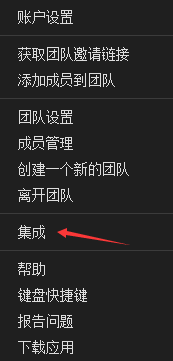
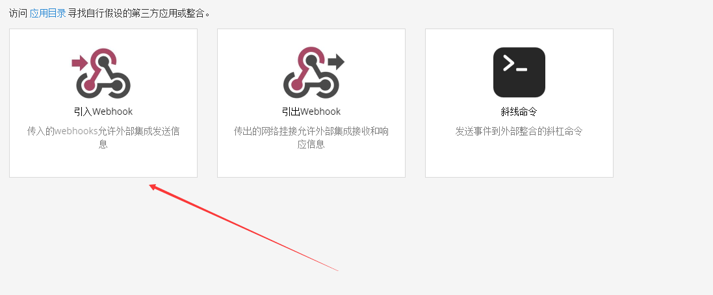
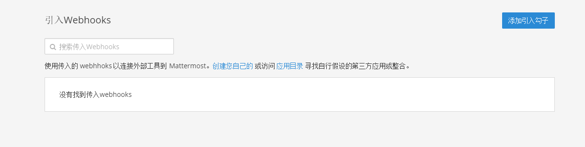
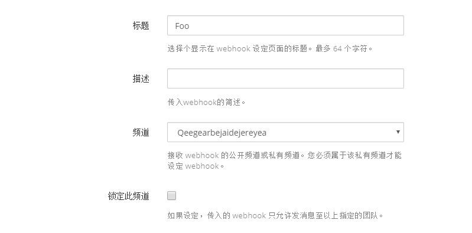
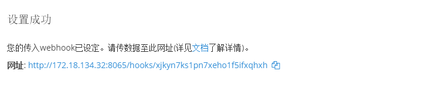
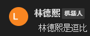

# dotnet core 集成到 Mattermost 聊天工具

在找了很久的团队交流工具，发现了 Mattermost 最好用，但是还需要做一些定制化的功能，于是就找到了 Mattermost 插件开发，还找到了如何自己写服务集成到 Mattermost 里面

本文告诉大家，通过写一个 ASP .NET Core 程序集成到 Mattermost 里面，在里面添加很多有趣的功能

<!--more-->
<!-- CreateTime:2019/8/31 16:55:58 -->


在内网通过 Docker 部署 Mattermost 十分简单，但是也许会遇到 Docker 的坑，这些本文就不告诉大家了，官方有详细的文档

在部署完成之后，在本地启动 Mattermost 连接上了服务器，可以开始开发自己的定制服务了

首先创建一个测试使用的公共频道，我创建了 qeegearbejaidejereyean 频道，当然这个命名是随意输入的

然后点击打开集成页面


<!--  -->

在这里选择引入 Webhook 的方式


<!--  -->

点击添加钩子


<!--  -->

输入一个标题和选择频道


<!--  -->

现在就可以看到一个链接了


<!--  -->

我的链接是 [http://127.0.0.1:8065/hooks/xjkyn7ks1pn7xeho1f5ifxqhxh](http://127.0.0.1:8065/hooks/xjkyn7ks1pn7xeho1f5ifxqhxh) 请将本文下面代码用到的这个链接替换为你自己的

新建一个 ASP .NET Core 程序，选择 API 程序

然后创建一个控制器，里面添加一个 Foo 方法，请看代码

```csharp
    [Route("api/[controller]")]
    [ApiController]
    public class MattermostController : ControllerBase
    {
        [HttpGet("Foo")]
        public void Foo()
        {
 
        }
    }
```

在 Foo 里面添加一些代码，发送字符串需要封装一个 json 发出去，这个json的格式非常简单

```csharp
{"text": "需要发送的内容"}
```

通过 Post 的方式发送出去，发送的链接就是刚才记下的 [http://127.0.0.1:8065/hooks/xjkyn7ks1pn7xeho1f5ifxqhxh](http://127.0.0.1:8065/hooks/xjkyn7ks1pn7xeho1f5ifxqhxh) 链接，请将这个链接替换为你自己的

```csharp
        [HttpGet("Foo")]
        public void Foo()
        {
            var httpClient = new HttpClient();
            StringContent content = new StringContent("{\"text\": \"林德熙是逗比\"}",Encoding.UTF8, "application/json");
            httpClient.PostAsync("http://127.0.0.1:8065/hooks/xjkyn7ks1pn7xeho1f5ifxqhxh", content);
        }
```

此时运行代码，在 Foo 方法可以在访问的时候发送 林德熙是逗比 到输入的链接里面，在 Mattermost 通过这个链接将信息显示

通过访问[http://localhost:51559/api/Mattermost/Foo](http://localhost:51559/api/Mattermost/Foo) 触发 Foo 方法，在 Foo 方法里面发送数据

访问之后可以看到刚才创建的频道显示了信息


<!--  -->

当然一个服务肯定不是这么简单，例如可以用来集成自己的 gogs 或自己的待办或催小伙伴吃饭

代码放在 [github](https://github.com/lindexi/lindexi_gd/tree/30bec7c4a3a4094b47ef65fe276c32b2e1128127/NecalemberexjkynGijemneada)

<a rel="license" href="http://creativecommons.org/licenses/by-nc-sa/4.0/"></a><br />本作品采用<a rel="license" href="http://creativecommons.org/licenses/by-nc-sa/4.0/">知识共享署名-非商业性使用-相同方式共享 4.0 国际许可协议</a>进行许可。欢迎转载、使用、重新发布，但务必保留文章署名[林德熙](http://blog.csdn.net/lindexi_gd)(包含链接:http://blog.csdn.net/lindexi_gd )，不得用于商业目的，基于本文修改后的作品务必以相同的许可发布。如有任何疑问，请与我[联系](mailto:lindexi_gd@163.com)。
