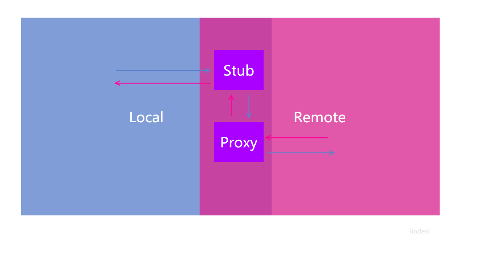
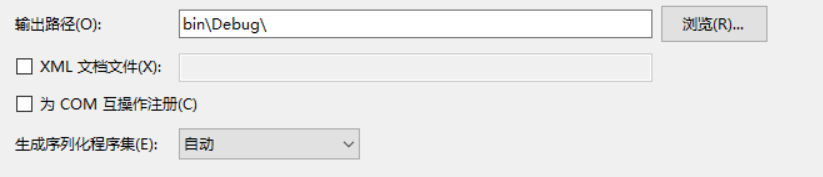
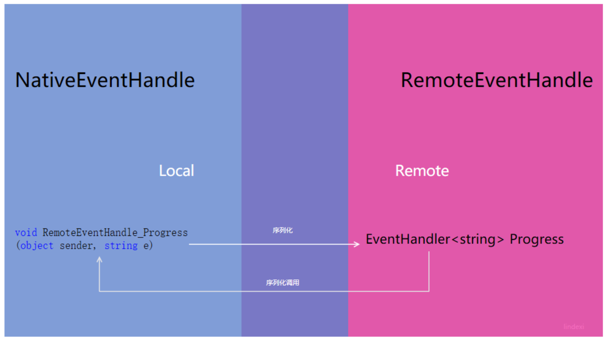

# dotnet remoting 使用事件

在RPC如果需要使用事件，相对是比较难的。本文告诉大家如何在 .net remoting 使用事件。

<!--more-->
<!-- CreateTime:2019/11/29 10:20:01 -->

<!-- 标签：.net remoting,rpc,wpf -->

<div id="toc"></div>

在我这个博客[WPF 使用RPC调用其他进程](https://blog.lindexi.com/post/WPF-%E4%BD%BF%E7%94%A8RPC%E8%B0%83%E7%94%A8%E5%85%B6%E4%BB%96%E8%BF%9B%E7%A8%8B.html )已经有告诉大家如何简单使用。

但是对于事件的使用还是没有详细告诉大家。

先来写一个简单的代码，需要创建三个项目，一个存放的是其他进程，一个是库，另一个是呆磨。

如果只是想快速使用，请看本文下面的开发建议。

在上个文章告诉大家的时候没有告诉大家使用的 Channel 的方式，下面让我来告诉大家如何使用 Channel

## 使用 Channel

实际上可以使用的 Channel 是有很多，可以自己定义，但是建议使用的有三个

- HttpChannel 功能比较强大，支持在广域网使用，可以让很多不是 .net 写的程序使用，但是需要自己写安全的代码

- TcpChannel 速度更快的方式，一般在局域网使用

- IpcChannel 就在相同的机器内使用，速度最快，使用的是微软系统系统的方法

所有的 Channel 都需要传入 port ，但是不是所有的类型都是 int ，其中 HttpChannel 和 TcpChannel使用的都是 int ，一般给的空闲的端口。而 IpcChannel 需要的是一个字符串，可以给他一个随机的字符串。

## 序列化

如果简单写一个类，使用了这个类里的事件，那么一般会出现异常

```csharp
程序集“林德熙.RemoteProcess.Demo, Version=1.0.0.0, Culture=neutral, PublicKeyToken=null”中的类型“林德熙.RemoteProcess.Demo.MainWindow”未标记为可序列化
```

为了可以使用事件，需要先修改 Channel ，下面我使用的是 IpcChannel 

写一个方法来创建连接，写在库项目，这个方法在呆磨和其他进程需要使用，原来创建相同的方法进行连接

```csharp
        public static IChannel CreatChannel(string port = "")
        {
            if (string.IsNullOrEmpty(port))
            {
                port = Guid.NewGuid().ToString("N");
            }

            var serverProvider = new SoapServerFormatterSinkProvider();
            var clientProvider = new SoapClientFormatterSinkProvider();
            serverProvider.TypeFilterLevel = TypeFilterLevel.Full;
            IDictionary props = new Hashtable();
            props["portName"] = port.ToString();

            return new IpcChannel(props, clientProvider, serverProvider);
        }
```

代码需要使用 TypeFilterLevel 设置，默认使用的是Low，所以会出现事件无法序列化。

其实传入的 serverProvider等 可以使用 BinaryServerFormatterSinkProvider 类型，一般推荐使用 SoapServerFormatterSinkProvider ，他的速度比较快。

这时呆磨使用的创建就不需要写端口

```csharp
            _channel = Terminal.CreatChannel();//客户端

            ChannelServices.RegisterChannel(_channel, false);
```

其他进程需要指定一个端口，这时呆磨传入的，因为呆磨需要知道其他进程使用的才可以

```csharp
       _channel = Terminal.CreatChannel(port);

            ChannelServices.RegisterChannel(_channel, false);
```

一般在 IpcChannel 都是说连接是不安全的，因为有很多特殊的软件都会发送一些信息让软件通信失败

因为序列化需要知道类的属性，所以需要在获得事件，重新使用一个类来获得

需要在库定一个两个类，一个是 Foo ，也就是需要获得事件的类，另一个是 F1 用于给呆磨转消息

```csharp
    //库
    public class Foo : MarshalByRefObject
    {
        public event EventHandler F1;
    }
```

```csharp
  //其他进程

              _channel = Terminal.CreatChannel(port);

            ChannelServices.RegisterChannel(_channel, false);

            var obj = new Foo();
                      ObjRef objRef = RemotingServices.Marshal(obj, temp.Name);

```

```csharp
 //呆磨
        public void Connect()
        {
            //启动远程进程
            ProcessId = Process.Start("林德熙.RemoteProcess.exe", "-p " + Port)?.Id ?? -1;

            _channel = Terminal.CreatChannel();//客户端

            ChannelServices.RegisterChannel(_channel, false);
        }

        public T GetObject<T>()
        {
            CheckProcess();
            return (T) Activator.GetObject(typeof(T),
                   "Ipc://" + Port + "/" + typeof(T).Name);
        }

                    GetObject<Foo>().F1 += MainWindow_F1; //出现异常

```

因为没有把呆磨序列，只能再新建一个类 F1

```csharp
  // 库
     public delegate void F2(object obj, string str);

    [Remote]
    public class Foo : MarshalByRefObject
    {
        public event F2 F1;

        public virtual void OnF1()
        {
            F1?.Invoke(this, "cnblogs");
        }
    }

    public class F1 : MarshalByRefObject
    {
        public event EventHandler<string> Foo;

        public void OnF1(object sender, string e)
        {
            Foo?.Invoke(sender, e);
        }
    }
```

运行的时候，两个类所在的是 Foo 在其他进程，而 F1 在呆磨程序


使用的时候需要这样写

```csharp
            var f = GetObject<Foo>();
            F1 f1 = new F1(); //创建一个类来直接获得事件，不能直接添加呆磨程序中的函数，必须创建另一个类
            f.F1 += f1.OnF1; 
            f1.Foo += Foo; //这个类的事件给呆磨

           private void Foo(object sender, string s2)
        {

        }
```

可以看到运行`f.OnF1();`就可以让呆磨Foo获得值


从上面代码看到，为什么不使用 `EventHandler<string>` ，自己定义委托，一般都是不建议自己定义，但是这里需要自己定义的，因为如果使用 `EventHandler<string>`会出现异常

Soap 序列化程序不支持序列化一般类型: System.EventHandler\`1[System.String]。

这就是用事件的方法，需要记得

在库创建两个类，一个类用于从其他进程发送事件给呆磨，另一个类用于接收这个事件，把事件转发给呆磨

原因是在使用 `+=` 需要序列化右边的这个类，而如何直接对 Foo 类进行添加事件，那么需要序列化呆磨。然而呆磨没有放在库，而且其他进程没有引用呆磨，所以其他进程无法序列呆磨的类型。但是在库写另一个类F1，其他进程可以序列化F1，所以可以获得在呆磨创建的F1。把事件给在呆磨创建的F1，让F1转发事件给呆磨。

实际上使用的时候就比直接使用需要加一个新的类，而且不能直接使用`EventHandler<string>` 

为什么不能使用 `EventHandler<string>`  原因是 SoapServerFormatterSinkProvider 不支持泛型，可以使用 BinaryServerFormatterSinkProvider 的方法

下面是总结的使用事件需要注意的点

 - 最好不要使用辣么大做委托

 - 如果需要使用泛型的委托，请设置 `BinaryServerFormatterSinkProvider` 序列方法

 - 最好使用一个本地类让远程进程可见的方法，将远程进程的事件转换为本地的事件

虽然给了一些需要注意的点，但是如果可以按照下面方式进行开发，会少很多坑。

## 开发建议

如果已经在封装好的框架进行开发，在很多的时候，就和使用本地的代码一样。但是对于事件和委托就需要做一层处理。

所以这时就建议开发时写一对类，抽出功能接口的方法。

写一对类的意思就是原来例如是 Xx 类，现在就需要抽出 IXx 接口，使用这个接口来代替原有的类。

例如最简单的功能，我需要通过一个方法触发一个事件，请看下面

```csharp
    public class XxEventHandle
    {
        public void CallHandle()
        {
            Progress?.Invoke(null,"123");
        }

        public event EventHandler<string> Progress;
    }
```

现在觉着的方法不清真，想要将这个方法放在另一个进程运行，就需要先将这个类抽出接口

```csharp
    public interface IRemoteEventHandle
    {
        void CallHandle();
        event EventHandler<string> Progress;
    }
```

然后将这个类拆为两个类，一个是 Remote 的运行在远程进程，另一个是 Native 运行在本机。但是对于远程进程是完全知道 Remote 和 Native 的。

<!--  -->


这时需要先将这几个类都移动到一个新项目，然后右击这个项目属性生成，让生成序列化程序集为开

<!--  -->


如果打开了序列化程序集之后还出现下面异常

```csharp
System.Runtime.Remoting.RemotingException:“权限被拒绝: 无法远程调用非公共或静态方法。”
```

出现这个异常有几个原因，如果只是为了解决这个异常来看本文，请看下方。

建议新建的两个类是写在一个文件，而且需要让两个类继承 `MarshalByRefObject` 和接口 `IRemoteEventHandle` ，并且只允许本地的`NativeEventHandle`在构造传入远程的类。

在`RemoteEventHandle`需要添加特性`Serializable`，而另一个特性`Remote`是我自己写的，用来判断这个类是在另一个进程运行，在另一个进程运行就会加载这些类

在用户使用的都是 `IRemoteEventHandle` 而这个接口实例是 `NativeEventHandle` 类，在拿到的事件需要先使用 `NativeEventHandle` 的公开方法去监听 `RemoteEventHandle` 的事件。

```csharp
    [Remote]
    [Serializable]
    public class RemoteEventHandle : MarshalByRefObject, IRemoteEventHandle
    {
        public void CallHandle()
        {
            Console.WriteLine("调用事件");
            Progress?.Invoke(null, "欢迎访问我博客 http://blog.csdn.net/lindexi_gd");
        }

        public event EventHandler<string> Progress;

        // 如果不重写，可能这个对象发送到远程时，在远程被回收，于是事件就无法调用
        // 如果刚好写了 OneWay 特性，那么连异常都没有。远程调用了事件，发现调用成功，但是本地没有收到任何的事件
        public override object InitializeLifetimeService()
        {
            // 返回null值表明这个远程对象的生命周期为无限大
            return null;
        }

    }

    public class NativeEventHandle : MarshalByRefObject, IRemoteEventHandle
    {
        /// <inheritdoc />
        public NativeEventHandle(RemoteEventHandle remoteJesteRinoowi)
        {
            RemoteEventHandle = remoteJesteRinoowi;
        }

        public void CallHandle()
        {
            // 使用 NativeEventHandle 的公开方法去拿到 RemoteEventHandle 的事件
            // 原因 事件需要将代码发送到另一个进程，这就需要让远程支持这个方法的序列化
            // 如果直接让上层的代码 += 方法就会因为另一个进程不知道上层的代码的序列化出现异常
            // 为了解决这个问题，就需要先使用这个类定义的方法，这样就可以序列化这个类，让远程知道调用的事件是哪个函数
            // 然后在这个类的方法再次调用这个类的事件，这时在上层的代码使用了这个类的事件也是没问题，因为这时代码已经是在本地运行，就和原来的事件一样
            // 原理是使用序列化方法调用，所以需要让方法为公开
            RemoteEventHandle.Progress += RemoteEventHandle_Progress;
            RemoteEventHandle.CallHandle();
        }

        public void RemoteEventHandle_Progress(object sender, string e)
        {
            // 如果这个方法是 private 的，就会出现 System.Runtime.Remoting.RemotingException:“权限被拒绝: 无法远程调用非公共或静态方法。”
            Progress?.Invoke(sender, e);
        }

        public event EventHandler<string> Progress;

        private RemoteEventHandle RemoteEventHandle { get; }

        // 如果不重写，可能这个对象发送到远程时，在远程被回收，于是事件就无法调用
        // 如果刚好写了 OneWay 特性，那么连异常都没有。远程调用了事件，发现调用成功，但是本地没有收到任何的事件
        public override object InitializeLifetimeService()
        {
            // 返回null值表明这个远程对象的生命周期为无限大
            return null;
        }

    }
```

对于刚才的`Remote`特性请看下面，建议使用[WPF 封装 dotnet remoting 调用其他进程](https://blog.lindexi.com/post/WPF-%E5%B0%81%E8%A3%85-dotnet-remoting-%E8%B0%83%E7%94%A8%E5%85%B6%E4%BB%96%E8%BF%9B%E7%A8%8B.html )

```csharp
    /// <summary>
    ///     共享使用的类，这个类会在远程进程创建
    /// </summary>
    [AttributeUsage(AttributeTargets.Class)]
    public class RemoteAttribute : Attribute
    {
    }
```

那么如何在 remoting 使用回调？

原来的开发可能有一些委托回调，如果在 remoting 是不支持使用委托回调的方法，只能通过事件的方法。如果要作为委托，需要写很多代码，这里我就不说了。所有的回调都可以使用事件的方法转换。

如原来的类是有函数回调

```csharp
        public void SetCallBack(EventHandler callback)
```

那么如何使用这个回调，实际上在 Remote 将回调转事件就可以

## 修复异常

如果发现 `System.Runtime.Remoting.RemotingException` 就需要找是否出现下面的问题

第一个问题是调用了非公共的方法，包括静态或非静态的方法。这个过程是发生在序列化的过程。序列化无法调用非公共的方法。

出现的异常请看下面

```csharp
System.Runtime.Remoting.RemotingException:“权限被拒绝: 无法远程调用非公共或静态方法。”
```

很多时候在触发事件时会出现这个异常，原因是如果出现了事件的回调，那么就可能因为回调使用的是本地私有的方法让回调无法使用。

如下面的代码

```csharp
    [Serializable]
    public class RemoteEventHandle : MarshalByRefObject, IRemoteEventHandle
    {
        public void CallHandle()
        {
            Console.WriteLine("调用事件");
            Progress?.Invoke(null, "欢迎访问我博客 http://blog.csdn.net/lindexi_gd");
        }

        public event EventHandler<string> Progress;

        public override object InitializeLifetimeService()
        {
            return null;
        }
    }

    public interface IRemoteEventHandle
    {
        void CallHandle();
        event EventHandler<string> Progress;
    }

    public class NativeEventHandle : MarshalByRefObject, IRemoteEventHandle
    {
        /// <inheritdoc />
        public NativeEventHandle(RemoteEventHandle remoteJesteRinoowi)
        {
            RemoteEventHandle = remoteJesteRinoowi;
            RemoteEventHandle.Progress += RemoteEventHandle_Progress;
        }

        public void CallHandle()
        {
            // 使用 NativeEventHandle 的公开方法去拿到 RemoteEventHandle 的事件
            // 原因 事件需要将代码发送到另一个进程，这就需要让远程支持这个方法的序列化
            // 如果直接让上层的代码 += 方法就会因为另一个进程不知道上层的代码的序列化出现异常
            // 为了解决这个问题，就需要先使用这个类定义的方法，这样就可以序列化这个类，让远程知道调用的事件是哪个函数
            // 然后在这个类的方法再次调用这个类的事件，这时在上层的代码使用了这个类的事件也是没问题，因为这时代码已经是在本地运行，就和原来的事件一样
            // 原理是使用序列化方法调用，所以需要让方法为公开
            RemoteEventHandle.CallHandle();
        }

        public void RemoteEventHandle_Progress(object sender, string e)
        {
            // 如果这个方法是 private 的，就会出现 System.Runtime.Remoting.RemotingException:“权限被拒绝: 无法远程调用非公共或静态方法。”
            Progress?.Invoke(sender, e);
        }

        public event EventHandler<string> Progress;

        private RemoteEventHandle RemoteEventHandle { get; }

        public override object InitializeLifetimeService()
        {
            return null;
        }
    }
```

在本地的事件监听，使用了本地的代码 `RemoteEventHandle_Progress` 很多时候写事件的监听都使用私有的方法，如下面代码

```csharp
        private void RemoteEventHandle_Progress(object sender, string e)

```
 
如果将 public 修改为 private 就会出现 `System.Runtime.Remoting.RemotingException:“权限被拒绝: 无法远程调用非公共或静态方法。”` 原因是事件需要序列化方法。

<!--  -->


因为在 NativeEventHandle 是将 `RemoteEventHandle_Progress` 序列化传到 `RemoteEventHandle` 使用事件，在事件触发时通过序列化动态代理调用 `RemoteEventHandle_Progress` 方法。如果这个方法不是公开的，那么动态代理调用就会因为没有访问权限无法调用，这时就出现了 `权限被拒绝: 无法远程调用非公共或静态方法` 所以解决方法就是所有事件的函数都需要设置为 public 才可以。

### 修复事件断开

有时候会发现一个程序放着过很久，远程和本地的事件就断开，也就是远程的事件触发正常，但是本地没有收到。

在上面代码的基础，添加 CallHandle 调用事件前后的输出

```csharp
    [Serializable]
    public class RemoteEventHandle : MarshalByRefObject, IRemoteEventHandle
    {
        public void CallHandle()
        {
            Console.WriteLine("调用事件");
            Progress?.Invoke(null, "欢迎访问我博客 http://blog.csdn.net/lindexi_gd");
            Console.WriteLine("调用事件完成");
        }

        // 忽略代码
    }
```

这时可以看到远程输出了

```csharp
调用事件
调用事件完成
```

但是本地没有收到任何的事件，原因就是本地监听的代码是将 NativeEventHandle 序列化发送到远程，但是序列化的 NativeEventHandle和本地的连接可能被回收，于是调用 Progress 虽然能成功，而且可以看到里面有对象，但是里面的对象是不存在和本地的连接。

所以这时本地就没有收到任何的事件。解决这个问题的方法就是重写 InitializeLifetimeService 方法，返回 null ，这样就可以设置远程对象不回收。

这个问题有最简单的例子，请看下面代码，保持远程的代码不变

```csharp
   public class NativeEventHandle : MarshalByRefObject, IRemoteEventHandle
    {
        /// <inheritdoc />
        public NativeEventHandle(RemoteEventHandle remoteJesteRinoowi)
        {
            RemoteEventHandle = remoteJesteRinoowi;
            RemoteEventHandle.Progress += RemoteEventHandle_Progress;
        }

        public void CallHandle()
        {
            RemoteEventHandle.CallHandle();
        }

        public void RemoteEventHandle_Progress(object sender, string e)
        {
            Progress?.Invoke(sender, e);
        }

        public event EventHandler<string> Progress;

        private RemoteEventHandle RemoteEventHandle { get; }

        public override object InitializeLifetimeService()
        {
            ILease currentLease = (ILease) base.InitializeLifetimeService();
            if (currentLease.CurrentState == LeaseState.Initial)
            {
                currentLease.InitialLeaseTime = TimeSpan.FromSeconds(5);
                currentLease.RenewOnCallTime = TimeSpan.FromSeconds(1);
            }

            return currentLease;
        }
```

上面的代码就是通过重写 InitializeLifetimeService 设置回收时间是 1 秒，这个方法不要在远程对象重写，否则调用回调方法就会出现下面异常

```csharp
System.Runtime.Remoting.RemotingException:“对象“RemoteEventHandle”已经断开连接或不在服务器上。”

        HResult -2146233077 

```

关于 dotnet remoting 的对象回收请看[Microsoft .Net Remoting系列专题之二：Marshal、Disconnect与生命周期以及跟踪服务 - 张逸 - 博客园](http://www.cnblogs.com/wayfarer/archive/2004/08/05/30437.html ) 里面详细解释了这个问题。


参见：[Microsoft .Net Remoting系列专题之三：Remoting事件处理全接触 - 张逸 - 博客园](https://www.cnblogs.com/wayfarer/articles/75213.html )

[Microsoft .Net Remoting系列专题之二：Marshal、Disconnect与生命周期以及跟踪服务 - 张逸 - 博客园](http://www.cnblogs.com/wayfarer/archive/2004/08/05/30437.html )

[In Depth .NET Remoting](http://www.diranieh.com/NETRemoting/InDepthRemoting.htm )

 Ingo Rammer，《Advanced .NET Remoting》

[.net remoting 抛出异常](https://lindexi.oschina.io/lindexi/post/.net-remoting-%E6%8A%9B%E5%87%BA%E5%BC%82%E5%B8%B8.html )

[.NET Remoting程序开发入门篇-博客-云栖社区-阿里云](https://yq.aliyun.com/articles/365762 )

[.NET Remoting中的事件处理(.NET Framework 2.0)（一） - 大坏蛋 - 博客园](http://www.cnblogs.com/dahuaidan410/articles/31656.html )

[WPF 使用RPC调用其他进程](./WPF-%E4%BD%BF%E7%94%A8RPC%E8%B0%83%E7%94%A8%E5%85%B6%E4%BB%96%E8%BF%9B%E7%A8%8B.html )
	
<a rel="license" href="http://creativecommons.org/licenses/by-nc-sa/4.0/"></a><br />本作品采用<a rel="license" href="http://creativecommons.org/licenses/by-nc-sa/4.0/">知识共享署名-非商业性使用-相同方式共享 4.0 国际许可协议</a>进行许可。欢迎转载、使用、重新发布，但务必保留文章署名[林德熙](http://blog.csdn.net/lindexi_gd)(包含链接:http://blog.csdn.net/lindexi_gd )，不得用于商业目的，基于本文修改后的作品务必以相同的许可发布。如有任何疑问，请与我[联系](mailto:lindexi_gd@163.com)。
